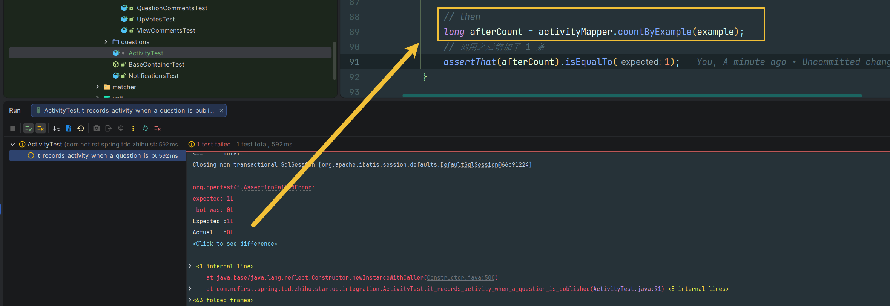
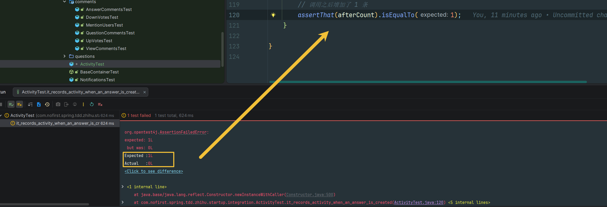

# 用户动态

本节我们来记录用户的发布问题和发表答案的动态，用来显示在用户的个人页面上。

---

## 一、功能说明

### 1.1 用户动态功能

记录用户在平台上的活动，包括发布问题和创建回答等行为，用于展示在用户个人页面。

### 1.2 开发目标

| 目标 | 说明 |
|------|------|
| 记录发布问题 | 发布问题时创建动态记录 |
| 记录创建回答 | 创建回答时创建动态记录 |
| 使用事件机制 | 使用 Spring 事件解耦业务 |

---

## 二、创建测试

### 2.1 添加测试用例

首先添加测试：

*src/test/java/com/nofirst/spring/tdd/zhihu/startup/integration/ActivityTest.java*

```java
@TestInstance(TestInstance.Lifecycle.PER_CLASS)
class ActivityTest extends BaseContainerTest {

    private MockMvc mockMvc;

    @Autowired
    private WebApplicationContext context;

    @Autowired
    private QuestionMapper questionMapper;

    @Autowired
    private ActivityMapper activityMapper;

    @Autowired
    private ObjectMapper objectMapper;


    @BeforeAll
    public void setupMockMvc() {
        mockMvc = MockMvcBuilders
                .webAppContextSetup(context)
                .apply(springSecurity())
                .build();
    }

    @BeforeEach
    public void setupTestData() {
        ActivityExample example = new ActivityExample();
        example.createCriteria();
        activityMapper.deleteByExample(example);
    }

    @Test
    @WithUserDetails(value = "John", userDetailsServiceBeanName = "customUserDetailsService")
    void it_records_activity_when_a_question_is_published() throws Exception {
        // given
        Question question = QuestionFactory.createUnpublishedQuestion();
        question.setUserId(2);
        questionMapper.insert(question);
        ActivityExample example = new ActivityExample();
        ActivityExample.Criteria criteria = example.createCriteria();
        criteria.andSubjectIdEqualTo(question.getId());
        criteria.andSubjectTypeEqualTo(Question.class.getSimpleName());
        criteria.andTypeEqualTo("published_question");
        long beforeCount = activityMapper.countByExample(example);
        assertThat(beforeCount).isEqualTo(0);

        // when
        this.mockMvc.perform(post("/questions/{questionId}/published-questions", question.getId())
                        .contentType(MediaType.APPLICATION_JSON)
                        .content(objectMapper.writeValueAsString(question)))
                .andDo(print())
                .andExpect(status().isOk())
                .andExpect(jsonPath("$.code").value(ResultCode.SUCCESS.getCode()));

        // then
        long afterCount = activityMapper.countByExample(example);
        // 调用之后增加了 1 条
        assertThat(afterCount).isEqualTo(1);
    }
}
```

### 2.2 测试说明

| 步骤 | 说明 |
|------|------|
| `given` | 创建未发布问题，验证活动记录为 0 |
| `when` | 发布问题 |
| `then` | 验证活动记录增加到 1 |

### 2.3 运行测试

运行测试肯定会失败：



---

## 三、使用事件机制

### 3.1 添加事件监听

我们在发布问题的时候，触发了 `PublishQuestionEvent` 事件，并且监听了该事件。现在我们只需要新增一个监听动作即可：

*src/main/java/com/nofirst/zhihu/listener/PublishQuestionEventListener.java*

```java
@EventListener
public void recordActivity(PublishQuestionEvent event) {
    Question question = event.getQuestion();
    Activity activity = new Activity();
    activity.setUserId(question.getUserId());
    activity.setType("published_question");
    activity.setSubjectId(question.getId());
    activity.setSubjectType(question.getClass().getSimpleName());
    Date now = new Date();
    activity.setCreatedAt(now);
    activity.setUpdatedAt(now);

    activityMapper.insert(activity);
}
```

### 3.2 运行测试

再次运行测试，测试通过。

---

## 四、记录回答活动

### 4.1 添加测试用例

接下来在发布回答的时候我们也记录下用户的行为：

```java
@Test
@WithUserDetails(value = "John", userDetailsServiceBeanName = "customUserDetailsService")
void it_records_activity_when_an_answer_is_created() throws Exception {
    // given
    // 创建一个 question
    Question question = QuestionFactory.createPublishedQuestion();
    questionMapper.insert(question);

    ActivityExample example = new ActivityExample();
    ActivityExample.Criteria criteria = example.createCriteria();
    criteria.andTypeEqualTo("created_answer");
    long beforeCount = activityMapper.countByExample(example);
    assertThat(beforeCount).isEqualTo(0);

    AnswerDto answer = AnswerFactory.createAnswerDto();
    this.mockMvc.perform(post("/questions/{id}/answers", question.getId())
                    .contentType(MediaType.APPLICATION_JSON)
                    .content(objectMapper.writeValueAsString(answer))
            )
            .andDo(print())
            .andExpect(status().isOk())
            .andExpect(jsonPath("$.code").value(ResultCode.SUCCESS.getCode()));

    // then
    long afterCount = activityMapper.countByExample(example);
    // 调用之后增加了 1 条
    assertThat(afterCount).isEqualTo(1);
}
```

### 4.2 运行测试

运行测试，自然是不会通过：



### 4.3 添加事件监听

同样地，我们给 `PostAnswerEvent` 增加一个新的监听：

*src/main/java/com/nofirst/zhihu/listener/PostAnswerEventListener.java*

```java
@EventListener
public void recordActivity(PostAnswerEvent event) {
    Answer answer = event.getAnswer();
    Activity activity = new Activity();
    activity.setUserId(answer.getUserId());
    activity.setType("created_answer");
    activity.setSubjectId(answer.getId());
    activity.setSubjectType(answer.getClass().getSimpleName());
    Date now = new Date();
    activity.setCreatedAt(now);
    activity.setUpdatedAt(now);

    activityMapper.insert(activity);
}
```

### 4.4 运行测试

再次运行测试，测试通过。

---

## 五、运行全部测试

再次运行全部测试，全部的测试应该都是通过的。

---

## 六、提交代码

最后，我们提交一下代码：

```bash
$ git add .
$ git commit -m 'record activity'
```

---

## 七、总结

### 7.1 本节学习要点

| 要点 | 说明 |
|------|------|
| 事件机制 | 使用 Spring ApplicationEvent 记录活动 |
| 事件监听 | 使用 `@EventListener` 监听多个事件 |
| 活动记录 | 记录用户行为和关联对象 |

### 7.2 activity 表结构

```
┌─────────────────────────────────────────────────────────┐
│                    activity 表                           │
├──────────┬──────────┬────────────┬──────────┬───────────┤
│ user_id  │ type     │ subject_id │ subject  │ 说明      │
│          │          │            │ _type    │           │
├──────────┼──────────┼────────────┼──────────┼───────────┤
│ 2        │ published│ 1          │ Question │ 发布问题  │
│          │ _question│            │          │           │
├──────────┼──────────┼────────────┼──────────┼───────────┤
│ 2        │ created  │ 1          │ Answer   │ 创建回答  │
│          │ _answer  │            │          │           │
└──────────┴──────────┴────────────┴──────────┴───────────┘
```

---

## 八、下一步

用户动态功能已完成，请继续阅读：

1. [活跃用户](./2.活跃用户.md) - 计算活跃用户
2. [未读消息](./3.未读消息.md) - 显示未读消息

---

## 附录：Activity 模型

```java
// Activity 表结构
public class Activity {
    private Integer id;
    private Integer userId;        // 用户 ID
    private String type;           // 活动类型
    private Integer subjectId;     // 关联对象 ID
    private String subjectType;    // 关联对象类型
    private Date createdAt;
    private Date updatedAt;
}
```
