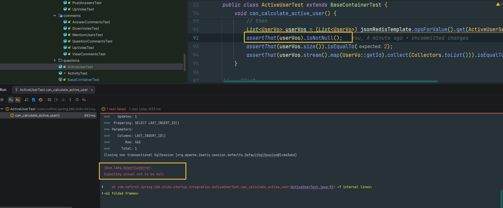
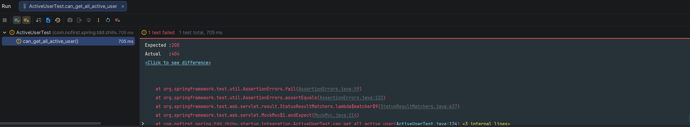

# 活跃用户

本节我们来计算活跃用户。

---

## 一、功能说明

### 1.1 活跃用户功能

我们会统计最近 7 天所有用户提问数量和答案数量，用户每提一个问题得 4 分，每发布一个答案得 1 分，计算出所有人的得分后再倒序，排名前六的用户将会显示在「活跃用户」列表里。

### 1.2 开发目标

| 目标 | 说明 |
|------|------|
| 计算活跃用户 | 统计最近 7 天的活动 |
| 积分规则 | 问题 4 分，回答 1 分 |
| 缓存结果 | 使用 Redis 缓存结果 |
| 定时任务 | 每天凌晨 1 点计算 |

---

## 二、添加依赖

### 2.1 引入 Redis 组件

我们先引入 Redis 组件：

*pom.xml*

```xml
<!-- 以下为新增依赖 -->
<dependency>
    <groupId>org.springframework.boot</groupId>
    <artifactId>spring-boot-starter-data-redis</artifactId>
</dependency>

<!-- 测试依赖 -->
<dependency>
    <groupId>com.redis</groupId>
    <artifactId>testcontainers-redis</artifactId>
    <version>2.2.2</version>
    <scope>test</scope>
</dependency>
```

### 2.2 配置 RedisTemplate

配置一个 RedisTemplate：

*src/main/java/com/nofirst/spring/tdd/zhihu/startup/redis/JsonRedisTemplate.java*

```java
@Component
public class JsonRedisTemplate extends RedisTemplate<String, Object> {

    public JsonRedisTemplate(RedisConnectionFactory redisConnectionFactory) {
        // 构造函数注入 RedisConnectionFactory，设置到父类
        super.setConnectionFactory(redisConnectionFactory);

        // 使用 Jackson 提供的通用 Serializer
        GenericJackson2JsonRedisSerializer serializer = new GenericJackson2JsonRedisSerializer();

        // String 类型的 key/value 序列化
        super.setKeySerializer(StringRedisSerializer.UTF_8);
        super.setValueSerializer(serializer);

        // Hash 类型的 key/value 序列化
        super.setHashKeySerializer(StringRedisSerializer.UTF_8);
        super.setHashValueSerializer(serializer);
    }
}
```

---

## 三、配置测试容器

### 3.1 修改测试基类

首先在测试基类中引入 RedisContainer：

*src/test/java/com/nofirst/spring/tdd/zhihu/startup/integration/BaseContainerTest.java*

```java
@SpringBootTest(classes = SpringTddZhihuStartupApplication.class)
public abstract class BaseContainerTest {

    public static final MySQLContainer<?> mysqlContainer = new MySQLContainer<>("mysql:8.0")
            .withDatabaseName("zhihu")
            .withUsername("root")
            .withPassword("root")
            .withReuse(true);

    public static final KafkaContainer kafkaContainer = new KafkaContainer(
            DockerImageName.parse("confluentinc/cp-kafka:7.6.1")
    ).withReuse(true);

    public static final RedisContainer redisContainer =
            new RedisContainer(DockerImageName.parse("redis:7.2.3"))
                    .withExposedPorts(6379)
                    .withReuse(true);

    static {
        TestcontainersConfiguration.getInstance().updateUserConfig("testcontainers.reuse.enable", "true");
        mysqlContainer.start();
        kafkaContainer.start();
        redisContainer.start();
    }

    @DynamicPropertySource
    static void properties(DynamicPropertyRegistry registry) {
        registry.add("spring.datasource.url", mysqlContainer::getJdbcUrl);
        registry.add("spring.datasource.password", mysqlContainer::getPassword);
        registry.add("spring.datasource.username", mysqlContainer::getUsername);
        registry.add("spring.kafka.bootstrap-servers", kafkaContainer::getBootstrapServers);

        registry.add("spring.data.redis.host", redisContainer::getHost);
        registry.add("spring.data.redis.port", redisContainer::getFirstMappedPort);
    }
}
```

---

## 四、创建测试

### 4.1 新建测试文件

接着新建测试用例：

*src/test/java/com/nofirst/spring/tdd/zhihu/startup/integration/ActiveUserTest.java*

```java
@TestInstance(TestInstance.Lifecycle.PER_CLASS)
public class ActiveUserTest extends BaseContainerTest {

    private MockMvc mockMvc;

    @Autowired
    private WebApplicationContext context;

    @Autowired
    private ActiveUserService activeUserService;

    @Autowired
    private JsonRedisTemplate jsonRedisTemplate;

    @Autowired
    private QuestionMapper questionMapper;

    @Autowired
    private AnswerMapper answerMapper;

    @Autowired
    private ObjectMapper objectMapper;

    @BeforeAll
    public void setupMockMvc() {
        mockMvc = MockMvcBuilders
                .webAppContextSetup(context)
                .apply(springSecurity())
                .build();
    }

    @BeforeEach
    public void setupTestData() {
        QuestionExample questionExample = new QuestionExample();
        questionExample.createCriteria();
        questionMapper.deleteByExample(questionExample);
        AnswerExample answerExample = new AnswerExample();
        answerExample.createCriteria();
        answerMapper.deleteByExample(answerExample);
    }

    @Test
    void can_calculate_active_user() {
        jsonRedisTemplate.delete(ActiveUserService.CACHE_KEY);
        // given
        // John 创建了 1 个 Question，得 4 分
        Question question = QuestionFactory.createPublishedQuestion();
        question.setUserId(2);
        questionMapper.insert(question);
        // Jane 创建了 1 个 Answer，得 1 分
        Answer answer = AnswerFactory.createAnswer(question.getId());
        answer.setUserId(1);
        answerMapper.insert(answer);
        // 还有一个用户 Foo，不得分

        // when
        activeUserService.calculateAndCacheActiveUsers();

        // then
        List<UserVo> userVos = (List<UserVo>) jsonRedisTemplate.opsForValue().get(ActiveUserService.CACHE_KEY);
        assertThat(userVos).isNotNull();
        assertThat(userVos.size()).isEqualTo(2);
        assertThat(userVos.stream().map(UserVo::getId).collect(Collectors.toList()))
            .isEqualTo(Arrays.asList(2, 1));
    }
}
```

### 4.2 测试说明

| 步骤 | 说明 |
|------|------|
| `given` | John 创建问题得 4 分，Jane 创建回答得 1 分 |
| `when` | 调用计算活跃用户方法 |
| `then` | 验证缓存中 John 排第一，Jane 排第二 |

### 4.3 创建 Service

*src/main/java/com/nofirst/spring/tdd/zhihu/startup/task/ActiveUserService.java*

```java
@Component
@AllArgsConstructor
public class ActiveUserService {

    public static String CACHE_KEY = "zhihu_active_users";

    public void calculateAndCacheActiveUsers() {
        // 待实现
    }
}
```

### 4.4 运行测试

现在我们的逻辑是缺失的，所以运行测试肯定会失败：



---

## 五、实现业务逻辑

### 5.1 完善 Service

补充完善逻辑：

```java
@Component
@AllArgsConstructor
public class ActiveUserService {

    private QuestionMapperExt questionMapperExt;
    private AnswerMapperExt answerMapperExt;
    private UserMapper userMapper;
    private JsonRedisTemplate jsonRedisTemplate;

    /** 发布问题的得分权重 */
    public static Integer QUESTION_WEIGHT = 4;
    /** 回答问题的得分权重 */
    public static Integer ANSWER_WEIGHT = 1;
    /** 多少天内发表过内容 */
    public static Integer PASS_DAYS = 7;
    /** 取出来多少用户 */
    public static Integer USER_NUMBER = 6;

    public static String CACHE_KEY = "zhihu_active_users";
    public static Integer CACHE_EXPIRE_IN_SECONDS = 60 * 60;

    /**
     * Calculate and cache active users.
     */
    public void calculateAndCacheActiveUsers() {
        // 取得活跃用户列表
        List<UserVo> users = calculateActiveUsers();
        // 加以缓存
        cacheActiveUsers(users);
    }

    private List<UserVo> calculateActiveUsers() {
        LinkedHashMap<Integer, Integer> scoreMap = calculateQuestionScore();
        LinkedHashMap<Integer, Integer> finalScoreMap = calculateAnswerScore(scoreMap);

        List<Integer> userIds = finalScoreMap.entrySet()
                .stream()
                // 按照得分进行倒序
                .sorted(Map.Entry.<Integer, Integer>comparingByValue().reversed())
                .map(Map.Entry::getKey)
                .toList();

        int sizeToTake = Math.min(USER_NUMBER, userIds.size());

        List<Integer> activeUserIds = userIds.subList(0, sizeToTake);
        List<UserVo> activeUsers = new ArrayList<>(activeUserIds.size());
        for (Integer activeUserId : activeUserIds) {
            User user = userMapper.selectByPrimaryKey(activeUserId);
            if (Objects.nonNull(user)) {
                UserVo userVo = new UserVo();
                userVo.setId(user.getId());
                userVo.setName(user.getName());
                userVo.setPhone(user.getPhone());
                userVo.setEmail(user.getEmail());
                activeUsers.add(userVo);
            }
        }

        return activeUsers;
    }

    private LinkedHashMap<Integer, Integer> calculateQuestionScore() {
        LinkedHashMap<Integer, Integer> map = new LinkedHashMap<>();
        Date beginTime = DateUtils.addDays(new Date(), -PASS_DAYS);
        List<UserCountVo> userCountList = questionMapperExt.countActiveUser(beginTime);
        for (UserCountVo userCountDto : userCountList) {
            if (userCountDto.getCount() > 0) {
                map.put(userCountDto.getUserId(), userCountDto.getCount() * QUESTION_WEIGHT);
            }
        }

        return map;
    }

    private LinkedHashMap<Integer, Integer> calculateAnswerScore(LinkedHashMap<Integer, Integer> scoreMap) {
        Date beginTime = DateUtils.addDays(new Date(), -PASS_DAYS);
        List<UserCountVo> userCountList = answerMapperExt.countActiveUser(beginTime);
        for (UserCountVo userCountDto : userCountList) {
            if (userCountDto.getCount() > 0) {
                Integer baseScore = scoreMap.getOrDefault(userCountDto.getUserId(), 0);
                scoreMap.put(userCountDto.getUserId(), baseScore + userCountDto.getCount() * ANSWER_WEIGHT);
            }
        }

        return scoreMap;
    }

    private void cacheActiveUsers(List<UserVo> users) {
        // 将数据放入缓存中
        this.jsonRedisTemplate.opsForValue().set(CACHE_KEY, users, Duration.ofSeconds(CACHE_EXPIRE_IN_SECONDS));
    }
}
```

### 5.2 添加 Mapper 方法

*src/main/java/com/nofirst/spring/tdd/zhihu/startup/mbg/mapper/QuestionMapperExt.java*

```java
List<UserCountVo> countActiveUser(Date beginTime);
```

*src/main/resources/mapper/QuestionMapperExt.xml*

```xml
<select id="countActiveUser" resultType="com.nofirst.spring.tdd.zhihu.startup.model.vo.UserCountVo">
    select user_id as userId, count(*) as count
    from question
    where created_at >= #{beginTime}
    group by user_id
</select>
```

*src/main/java/com/nofirst/spring/tdd/zhihu/startup/mbg/mapper/AnswerMapperExt.java*

```java
public interface AnswerMapperExt {

    List<Answer> selectByQuestionId(Integer questionId);

    List<UserCountVo> countActiveUser(Date beginTime);
}
```

*src/main/resources/mapper/AnswerMapperExt.xml*

```xml
<select id="countActiveUser" resultType="com.nofirst.spring.tdd.zhihu.startup.model.vo.UserCountVo">
    select user_id as userId, count(*) as count
    from answer
    where created_at >= #{beginTime}
    group by user_id
</select>
```

### 5.3 运行测试

再次运行测试，测试通过。

---

## 六、获取活跃用户

### 6.1 添加测试用例

接下来我们新增测试，取出活跃用户列表：

```java
@Test
@WithUserDetails(value = "John", userDetailsServiceBeanName = "customUserDetailsService")
void can_get_all_active_user() throws Exception {
    // 先清除数据，避免脏数据干扰
    jsonRedisTemplate.delete(ActiveUserService.CACHE_KEY);
    // given
    // John 创建了 1 个 Question，得 4 分
    Question question = QuestionFactory.createPublishedQuestion();
    question.setUserId(2);
    questionMapper.insert(question);
    // Jane 创建了 1 个 Answer，得 1 分
    Answer answer = AnswerFactory.createAnswer(question.getId());
    answer.setUserId(1);
    answerMapper.insert(answer);
    // 还有一个用户 Foo，不得分

    // when
    String jsonResponse = this.mockMvc.perform(get("/active-users"))
            .andDo(print())
            .andExpect(status().isOk())
            .andReturn()
            .getResponse()
            .getContentAsString(StandardCharsets.UTF_8);

    // then
    TypeReference<CommonResult<List<UserVo>>> typeRef = new TypeReference<>() {
    };
    CommonResult<List<UserVo>> commonResult = objectMapper.readValue(jsonResponse, typeRef);
    long code = commonResult.getCode();
    assertThat(code).isEqualTo(ResultCode.SUCCESS.getCode());
    assertThat(commonResult.getData().size()).isEqualTo(2);
    assertThat(commonResult.getData().stream().map(UserVo::getId).collect(Collectors.toList()))
        .isEqualTo(Arrays.asList(2, 1));
}
```

### 6.2 运行测试

运行测试，显示 404 路由不存在：



### 6.3 添加 Controller

那我们就添加相应的 Controller：

*src/main/java/com/nofirst/spring/tdd/zhihu/startup/controller/ActiveUserController.java*

```java
@RestController
@AllArgsConstructor
public class ActiveUserController {

    private final ActiveUserService activeUserService;


    @GetMapping("/active-users")
    public CommonResult<List<UserVo>> index() {
        List<UserVo> activeUsers = activeUserService.getActiveUsers();
        return CommonResult.success(activeUsers);
    }
}
```

### 6.4 添加 getActiveUsers 方法

*src/main/java/com/nofirst/spring/tdd/zhihu/startup/task/ActiveUserService.java*

```java
public static String CACHE_KEY = "zhihu_active_users";
public static Integer CACHE_EXPIRE_IN_SECONDS = 60 * 60;

public List<UserVo> getActiveUsers() {
    // 先尝试获取缓存，获取不到则重新获取活跃用户，并存入缓存
    List<UserVo> userIds = (List<UserVo>) jsonRedisTemplate.opsForValue().get(CACHE_KEY);
    if (CollectionUtils.isEmpty(userIds)) {
        return calculateActiveUsers();
    }

    return userIds;
}
```

### 6.5 运行测试

再次运行测试，测试通过。

---

## 七、定时任务

### 7.1 创建定时任务

最后，要运行全部测试确保一切正常。

*src/main/java/com/nofirst/spring/tdd/zhihu/startup/task/CalculateActiveUserTask.java*

```java
@Component
@EnableScheduling
@AllArgsConstructor
public class CalculateActiveUserTask {

    private ActiveUserService activeUserService;

    @Scheduled(cron = "0 0 1 * * *")
    public void run() {
        activeUserService.calculateAndCacheActiveUsers();
    }

}
```

### 7.2 Cron 表达式说明

```
0 0 1 * * *
│ │ │ │ │ │
│ │ │ │ │ └─ 星期几 (0-7, 0 和 7 都代表周日)
│ │ │ │ └─── 月份 (1-12)
│ │ │ └───── 日期 (1-31)
│ │ └─────── 小时 (0-23)
│ └───────── 分钟 (0-59)
└─────────── 秒 (0-59)

含义：每天凌晨 1 点 0 分 0 秒执行
```

---

## 八、提交代码

最后，我们来提交一下代码：

```bash
$ git add .
$ git commit -m 'active users'
```

---

## 九、总结

### 9.1 本节学习要点

| 要点 | 说明 |
|------|------|
| Redis 缓存 | 使用 Redis 缓存活跃用户列表 |
| 积分计算 | 问题 4 分，回答 1 分 |
| 定时任务 | 使用 `@Scheduled` 每天计算 |
| Testcontainers | 使用 RedisContainer 进行测试 |

### 9.2 活跃用户算法

```
┌─────────────────────────────────────────────────────────┐
│                  活跃用户计算流程                        │
│                                                         │
│  1. 查询最近 7 天的问题 → 用户 ID + 数量 × 4 分          │
│                              ↓                          │
│  2. 查询最近 7 天的回答 → 用户 ID + 数量 × 1 分          │
│                              ↓                          │
│  3. 合并分数 → 按总分倒序排列                           │
│                              ↓                          │
│  4. 取前 6 名 → 缓存到 Redis（1 小时过期）              │
│                                                         │
└─────────────────────────────────────────────────────────┘
```

---

## 十、下一步

活跃用户功能已完成，请继续阅读：

1. [未读消息](./3.未读消息.md) - 显示未读消息功能
2. [小结](./4.小结.md) - 本章总结

---

## 附录：UserCountVo

```java
@Data
public class UserCountVo {
    private Integer userId;    // 用户 ID
    private Integer count;     // 数量
}
```
