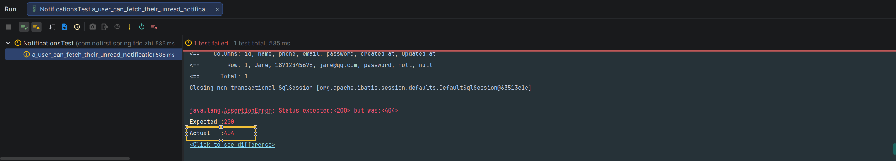
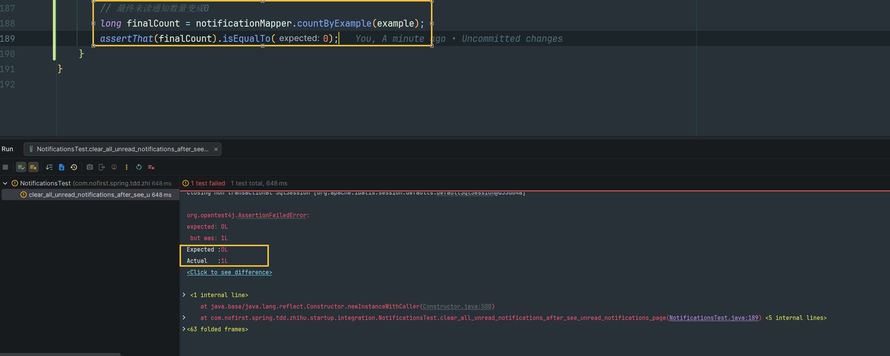

# 未读消息

本节我们来显示用户的未读消息。

---

## 一、功能说明

### 1.1 未读消息功能

用户可以查看自己的未读消息列表，查看后消息标记为已读。

### 1.2 开发目标

| 目标 | 说明 |
|------|------|
| 查看未读消息 | 分页查询用户的未读消息 |
| 登录可见 | 未登录用户不能查看 |
| 自动标记已读 | 查看后自动标记为已读 |

---

## 二、创建测试

### 2.1 添加测试用例

依旧是从测试开始：

*src/test/java/com/nofirst/spring/tdd/zhihu/startup/integration/NotificationsTest.java*

```java
@Test
@WithUserDetails(value = "John", userDetailsServiceBeanName = "customUserDetailsService")
void a_user_can_fetch_their_unread_notifications() throws Exception {
    // given
    Question question = QuestionFactory.createPublishedQuestion();
    question.setUserId(1);
    questionMapper.insert(question);
    // 1 号用户（Jane）订阅了一个问题，如果有人发表了答案，Jane 会收到一条通知
    Subscription subscription = SubscriptionFactory.createSubscription(1, question.getId());
    subscriptionMapper.insert(subscription);
    AnswerDto answer = AnswerFactory.createAnswerDto();
    this.mockMvc.perform(post("/questions/{id}/answers", question.getId())
            .contentType(MediaType.APPLICATION_JSON)
            .content(objectMapper.writeValueAsString(answer))
    );


    // when：模拟 Jane 用户登录之后的行为
    String jsonResponse = this.mockMvc.perform(get("/notifications?pageIndex=1&pageSize=10")
                    .with(user(customUserDetailsService.loadUserByUsername("Jane")))
            ).andExpect(status().isOk()).andReturn().getResponse()
            .getContentAsString(StandardCharsets.UTF_8);

    // then
    TypeReference<CommonResult<PageInfo<NotificationVo>>> typeRef = new TypeReference<>() {
    };
    CommonResult<PageInfo<NotificationVo>> commonResult = objectMapper.readValue(jsonResponse, typeRef);
    long code = commonResult.getCode();
    Assertions.assertThat(code).isEqualTo(ResultCode.SUCCESS.getCode());

    PageInfo<NotificationVo> data = commonResult.getData();
    assertThat(data.getTotal()).isEqualTo(1);
    assertThat(data.getList().size()).isEqualTo(1);
}
```

### 2.2 测试说明

| 步骤 | 说明 |
|------|------|
| `given` | Jane 订阅问题，有人回答，Jane 收到通知 |
| `when` | Jane 用户登录后查看未读消息 |
| `then` | 验证返回 1 条未读消息 |

### 2.3 运行测试

运行测试：



显示 404 路由不存在。

---

## 三、创建 Controller

### 3.1 添加路由

那我们就来添加 Controller：

*src/main/java/com/nofirst/spring/tdd/zhihu/startup/controller/UserNotificationsController.java*

```java
@RestController
@Validated
@AllArgsConstructor
public class UserNotificationsController {

    private final UserNotificationService notificationService;

    @GetMapping("/notifications")
    public CommonResult<PageInfo<NotificationVo>> index(@RequestParam @NotNull Integer pageIndex,
                                                        @RequestParam @NotNull Integer pageSize,
                                                        @AuthenticationPrincipal AccountUser accountUser) {
        PageInfo<NotificationVo> activeUsers = notificationService.index(accountUser.getUserId(), pageIndex, pageSize);
        return CommonResult.success(activeUsers);
    }
}
```

### 3.2 创建 Service 接口

*src/main/java/com/nofirst/spring/tdd/zhihu/startup/service/UserNotificationService.java*

```java
public interface UserNotificationService {

    PageInfo<NotificationVo> index(Integer userId, Integer pageIndex, Integer pageSize);
}
```

### 3.3 实现 Service

*src/main/java/com/nofirst/spring/tdd/zhihu/startup/service/impl/UserNotificationServiceImpl.java*

```java
@Service
@AllArgsConstructor
public class UserNotificationServiceImpl implements UserNotificationService {

    private final NotificationMapper notificationMapper;

    @Override
    public PageInfo<NotificationVo> index(Integer userId, Integer pageIndex, Integer pageSize) {

        PageHelper.startPage(pageIndex, pageSize);
        NotificationExample example = new NotificationExample();
        NotificationExample.Criteria criteria = example.createCriteria();
        criteria.andNotifiableIdEqualTo(userId);
        example.setOrderByClause("created_at desc");
        List<Notification> notifications = notificationMapper.selectByExample(example);
        // 如果不使用 mapper 返回的对象直接构造分页对象，total 会被错误赋值成当前页的数据的数量
        PageInfo<Notification> notificationPageInfo = new PageInfo<>(notifications);
        List<NotificationVo> result = new ArrayList<>();
        for (Notification notification : notifications) {
            NotificationVo notificationVo = new NotificationVo();
            notificationVo.setId(notification.getId());
            notificationVo.setType(notification.getType());
            notificationVo.setNotifiableId(notification.getNotifiableId());
            notificationVo.setNotifiableType(notification.getNotifiableType());
            notificationVo.setReadAt(notification.getReadAt());
            notificationVo.setCreatedAt(notification.getCreatedAt());
            notificationVo.setUpdatedAt(notification.getUpdatedAt());

            result.add(notificationVo);
        }
        PageInfo<NotificationVo> pageResult = new PageInfo<>();
        pageResult.setTotal(notificationPageInfo.getTotal());
        pageResult.setPageNum(notificationPageInfo.getPageNum());
        pageResult.setPageSize(notificationPageInfo.getPageSize());
        pageResult.setList(result);
        return pageResult;
    }
}
```

### 3.4 运行测试

再次测试，测试通过。

---

## 四、权限控制

### 4.1 添加测试用例

消息通知未登录用户不能看见，接下来新增测试：

```java
@Test
void guests_can_not_see_unread_notifications() throws Exception {
    this.mockMvc.perform(get("/notifications"))
            .andDo(print())
            .andExpect(status().is(401));
}
```

### 4.2 运行测试

运行测试，由于 Spring Security 的保护，直接通过了。

---

## 五、标记已读

### 5.1 添加测试用例

我们还有一个逻辑需要添加：当我们进入获取了未读消息列表之后，要清除掉所有未读消息。

添加测试：

```java
@Test
@WithUserDetails(value = "John", userDetailsServiceBeanName = "customUserDetailsService")
void clear_all_unread_notifications_after_see_unread_notifications_page() throws Exception {
    // given
    Question question = QuestionFactory.createPublishedQuestion();
    question.setUserId(1);
    questionMapper.insert(question);
    // 1 号用户订阅了一个问题，如果有人发表了答案，他会收到一条通知
    Subscription subscription = SubscriptionFactory.createSubscription(1, question.getId());
    subscriptionMapper.insert(subscription);

    // 初始的未读通知数量是 0
    NotificationExample example = new NotificationExample();
    example.createCriteria().andNotifiableIdEqualTo(1).andReadAtIsNull();
    long beforeCount = notificationMapper.countByExample(example);
    assertThat(beforeCount).isEqualTo(0);

    AnswerDto answer = AnswerFactory.createAnswerDto();
    this.mockMvc.perform(post("/questions/{id}/answers", question.getId())
            .contentType(MediaType.APPLICATION_JSON)
            .content(objectMapper.writeValueAsString(answer))
    );
    // 未读通知数量变成 1
    long afterCount = notificationMapper.countByExample(example);
    assertThat(afterCount).isEqualTo(1);

    // when
    // 切换到 1 号用户进行访问
    this.mockMvc.perform(get("/notifications?pageIndex=1&pageSize=10")
            .with(user(customUserDetailsService.loadUserByUsername("Jane")))
    ).andExpect(status().isOk()).andReturn();

    // then
    // 最终未读通知数量变成 0
    long finalCount = notificationMapper.countByExample(example);
    assertThat(finalCount).isEqualTo(0);
}
```

### 5.2 运行测试

运行测试：



### 5.3 添加清除逻辑

添加清除逻辑：

*src/main/java/com/nofirst/spring/tdd/zhihu/startup/service/impl/UserNotificationServiceImpl.java*

```java
public class UserNotificationServiceImpl implements UserNotificationService {

    private final NotificationMapper notificationMapper;

    @Override
    public PageInfo<NotificationVo> index(Integer userId, Integer pageIndex, Integer pageSize) {
        markUnreadNotificationsAsRead();
        .
        .
        .
    }

    private void markUnreadNotificationsAsRead() {
        Notification row = new Notification();
        row.setReadAt(new Date());

        NotificationExample example = new NotificationExample();
        example.createCriteria().andReadAtIsNull();
        notificationMapper.updateByExampleSelective(row, example);
    }
}
```

### 5.4 运行测试

再次测试，测试通过。

---

## 六、定时任务

### 6.1 创建定时任务

最后，我们来定义一个定时任务：

*src/main/java/com/nofirst/spring/tdd/zhihu/startup/task/CalculateActiveUserTask.java*

```java
@Component
@EnableScheduling
@AllArgsConstructor
public class CalculateActiveUserTask {

    private ActiveUserService activeUserService;

    @Scheduled(cron = "0 0 1 * * *")
    public void run() {
        activeUserService.calculateAndCacheActiveUsers();
    }

}
```

### 6.2 运行全部测试

运行全部测试，保证一切正常。

---

## 七、提交代码

最后，我们来提交下代码：

```bash
$ git add .
$ git commit -m 'notifications page'
```

---

## 八、总结

### 8.1 本节学习要点

| 要点 | 说明 |
|------|------|
| 分页查询 | 使用 PageHelper 实现消息分页 |
| 权限控制 | 未登录用户返回 401 |
| 标记已读 | 查看后自动标记为已读 |
| 定时任务 | 使用 `@Scheduled` 定时计算活跃用户 |

### 8.2 通知功能接口

| 功能 | 接口 | 说明 |
|------|------|------|
| 查看未读消息 | `GET /notifications` | 分页查询未读消息 |
| 权限控制 | Spring Security | 未登录返回 401 |

---

## 九、下一步

未读消息功能已完成，请继续阅读：

1. [小结](./4.小结.md) - 本章总结

---

## 附录：NotificationVo

```java
@Data
public class NotificationVo {

    private Integer id;
    private String type;              // 通知类型
    private Integer notifiableId;     // 接收者 ID
    private String notifiableType;    // 接收者类型
    private Date readAt;              // 已读时间
    private Date createdAt;           // 创建时间
    private Date updatedAt;           // 更新时间
}
```
