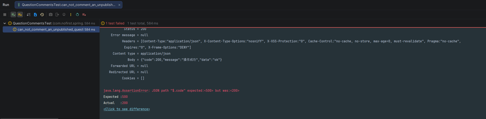
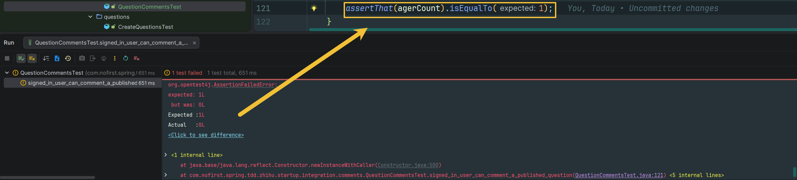

## 本节说明

本节我们来开始开发「评论」功能。

## 评论功能

「评论」功能是一个常见的功能，在我们的项目中，评论的对象可以是某个问题或者某个回答。评论相关的数据我们存储在`comment`表中，我们先准备建表语句：

*src/main/resources/db/migration/V2026030701__create_table_comment.sql*

```sql
CREATE TABLE `comment` (
                          `id` int unsigned NOT NULL AUTO_INCREMENT,
                          `user_id` int NOT NULL,
                          `content` text  NOT NULL,
                          `commented_id` int NOT NULL,
                          `commented_type` VARCHAR(10) NOT NULL,
                          `created_at` timestamp NULL DEFAULT NULL,
                          `updated_at` timestamp NULL DEFAULT NULL,
                          PRIMARY KEY (`id`)
) ENGINE=InnoDB AUTO_INCREMENT=1 ;
```

接下来运行Maven的`flyway`插件的`flyway:migrate`命令生成表，并修改`generatorConfig.xml`的配置，改为生成`comment`表，运行`Generator#main()`方法生成对应的数据库映射文件。

我们依然是从测试开始：

*src/test/java/com/nofirst/spring/tdd/zhihu/startup/integration/comments/QuestionCommentsTest.java*

```java
@TestInstance(TestInstance.Lifecycle.PER_CLASS)
public class QuestionCommentsTest extends BaseContainerTest {

    private MockMvc mockMvc;

    @Autowired
    private WebApplicationContext context;

    @Autowired
    private QuestionMapper questionMapper;

    @Autowired
    private CommentMapper commentMapper;

    @Autowired
    private ObjectMapper objectMapper;


    @BeforeAll
    public void setupMockMvc() {
        mockMvc = MockMvcBuilders
                .webAppContextSetup(context)
                .apply(springSecurity())
                .build();
    }

    @BeforeEach
    public void setupTestData() {
        QuestionExample questionExample = new QuestionExample();
        // 空条件，匹配所有数据，等价于delete * from question
        questionExample.createCriteria();
        questionMapper.deleteByExample(questionExample);
        CommentExample commentExample = new CommentExample();
        // 空条件，匹配所有数据，等价于delete * from comment
        commentExample.createCriteria();
        commentMapper.deleteByExample(commentExample);
    }


    @Test
    void guests_may_not_comment_a_question() throws Exception {
        this.mockMvc.perform(post("/comments/questions/1"))
                .andDo(print())
                .andExpect(status().is(401));
    }
}
```

运行测试，测试通过。

## 不可评论未发布的问题

接下来添加测试：

```java
    .
    .
    .
    @Test
    @WithUserDetails(value = "John", userDetailsServiceBeanName = "customUserDetailsService")
    void can_not_comment_an_unpublished_question() throws Exception {
        // given
        Question question = QuestionFactory.createUnpublishedQuestion();
        questionMapper.insert(question);

        // when
        CommentDto commentDto = new CommentDto();
        commentDto.setContent("this is a comment");
        this.mockMvc.perform(post("/comments/questions/{questionId}", question.getId())
                        .contentType(MediaType.APPLICATION_JSON)
                        .content(objectMapper.writeValueAsString(commentDto))
                ).andDo(print())
                .andExpect(status().isOk())
                .andExpect(jsonPath("$.code").value(ResultCode.FAILED.getCode()))
                .andExpect(jsonPath("$.message").value("question not publish"));
    }
}
```

运行测试，显示404路由不存在。接下来我们添加 Controller：

*src/main/java/com/nofirst/spring/tdd/zhihu/startup/controller/QuestionCommentsController.java*

```java
@RestController
@Validated
@AllArgsConstructor
public class QuestionCommentsController {


    @PostMapping("/comments/questions/{questionId}")
    public CommonResult<String> store(@PathVariable Integer questionId,
                                      @RequestBody CommentDto commentDto,
                                      @AuthenticationPrincipal AccountUser accountUser) {
        return CommonResult.success("ok");
    }
}
```

*src/main/java/com/nofirst/spring/tdd/zhihu/startup/model/dto/CommentDto.java*

```java

@Data
public class CommentDto {

    private String content;
}
```

再次运行测试，返回了 200，测试仍旧未通过：



我们在`QuestionPolicy`里面添加一个新的方法：

*src/main/java/com/nofirst/spring/tdd/zhihu/startup/policy/QuestionPolicy.java*

```java
.
    .
    .
    public boolean canComment(Integer questionId) {
        Question question = questionMapper.selectByPrimaryKey(questionId);
        if (Objects.isNull(question)) {
            throw new QuestionNotExistedException();
        }
        if (Objects.isNull(question.getPublishedAt())) {
            throw new QuestionNotPublishedException();
        }
        return true;
    }
}
```

在 Controller 上应用：

```java
public class QuestionCommentsController {


    @PostMapping("/comments/questions/{questionId}")
    @PreAuthorize("@questionPolicy.canComment(#questionId)")
    public CommonResult<String> store(@PathVariable Integer questionId,
                                      @RequestBody CommentDto commentDto,
                                      @AuthenticationPrincipal AccountUser accountUser) {
        return CommonResult.success("ok");
    }
}
```

再次运行测试，测试通过。

## 登录用户可评论

接下来继续添加测试：

```java
    .
    .
    .
    @Test
    @WithUserDetails(value = "John", userDetailsServiceBeanName = "customUserDetailsService")
    void signed_in_user_can_comment_a_published_question() throws Exception {
        // given
        Question question = QuestionFactory.createPublishedQuestion();
        questionMapper.insert(question);

        long beforeCount = commentMapper.countByExample(null);
        assertThat(beforeCount).isEqualTo(0);

        // when
        CommentDto commentDto = new CommentDto();
        commentDto.setContent("this is a comment");
        this.mockMvc.perform(post("/comments/questions/{questionId}", question.getId())
                        .contentType(MediaType.APPLICATION_JSON)
                        .content(objectMapper.writeValueAsString(commentDto))
                ).andDo(print())
                .andExpect(status().isOk());

        CommentExample example = new CommentExample();
        CommentExample.Criteria criteria = example.createCriteria();
        criteria.andCommentedIdEqualTo(question.getId());
        criteria.andCommentedTypeEqualTo(Question.class.getSimpleName());
        long agerCount = commentMapper.countByExample(example);
        assertThat(agerCount).isEqualTo(1);
    }
}
```

运行测试：




添加逻辑：

*src/main/java/com/nofirst/spring/tdd/zhihu/startup/service/QuestionCommentService.java*

```java
public interface QuestionCommentService {

    void comment(Integer questionId, CommentDto commentDto, AccountUser accountUser);
}
```

*src/main/java/com/nofirst/spring/tdd/zhihu/startup/service/impl/QuestionCommentServiceImpl.java*

```java
@Service
@AllArgsConstructor
public class QuestionCommentServiceImpl implements QuestionCommentService {

    private final QuestionMapper questionMapper;
    private final CommentMapper commentMapper;


    @Override
    public void comment(Integer questionId, CommentDto commentDto, AccountUser accountUser) {
        Comment comment = new Comment();
        comment.setUserId(accountUser.getUserId());
        comment.setContent(commentDto.getContent());
        comment.setCommentedId(questionId);
        comment.setCommentedType(Question.class.getSimpleName());
        Date date = new Date();
        comment.setCreatedAt(date);
        comment.setUpdatedAt(date);
        commentMapper.insert(comment);
    }
}
```

*src/main/java/com/nofirst/spring/tdd/zhihu/startup/controller/QuestionCommentsController.java*

```java
@RestController
@Validated
@AllArgsConstructor
public class QuestionCommentsController {

    private QuestionCommentService questionCommentService;

    @PostMapping("/comments/questions/{questionId}")
    @PreAuthorize("@questionPolicy.canComment(#questionId)")
    public CommonResult<String> store(@PathVariable Integer questionId,
                                      @RequestBody CommentDto commentDto,
                                      @AuthenticationPrincipal AccountUser accountUser) {
        questionCommentService.comment(questionId, commentDto, accountUser);
        return CommonResult.success("ok");
    }
}
```

再次测试，测试通过。


## 评论内容为必填项

我们继续添加新的功能测试：

*tests/Feature/Comments/QuestionCommentsTest.php*
```java
    .
    .
    .
    @Test
    @WithUserDetails(value = "John", userDetailsServiceBeanName = "customUserDetailsService")
    void content_is_required_to_comment_a_question() throws Exception {
        // given
        Question question = QuestionFactory.createPublishedQuestion();
        questionMapper.insert(question);

        // when
        CommentDto commentDto = new CommentDto();
        commentDto.setContent(null);
        this.mockMvc.perform(post("/comments/questions/{questionId}", question.getId())
                        .contentType(MediaType.APPLICATION_JSON)
                        .content(objectMapper.writeValueAsString(commentDto))
                ).andDo(print())
                .andExpect(jsonPath("$.code").value(ResultCode.VALIDATE_FAILED.getCode()))
                .andExpect(jsonPath("$.message").value("评论内容不能为空"));
    }

}
```

运行测试：

episode10_2026-03-07_14-49-20.png

添加表单验证：

*src/main/java/com/nofirst/spring/tdd/zhihu/startup/model/dto/CommentDto.java*

```java
@Data
public class CommentDto {

    @NotBlank(message = "评论内容不能为空")
    private String content;
}
```

应用规则：

*src/main/java/com/nofirst/spring/tdd/zhihu/startup/controller/QuestionCommentsController.java*

```java
public class QuestionCommentsController {

    private QuestionCommentService questionCommentService;

    @PostMapping("/comments/questions/{questionId}")
    @PreAuthorize("@questionPolicy.canComment(#questionId)")
    public CommonResult<String> store(@PathVariable Integer questionId,
                                      @RequestBody @Validated // 此处 CommentDto commentDto,
                                      @AuthenticationPrincipal AccountUser accountUser) {
        questionCommentService.comment(questionId, commentDto, accountUser);
        return CommonResult.success("ok");
    }
}
```

再次测试，测试通过。


## 提交代码

最后，我们来提交代码：

```
$ git add .
$ git commit -m 'question comment'
```