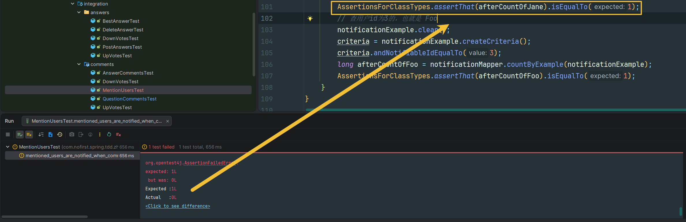

## 本节说明

本节我们来完成「通知」的功能：当在评论当中提到某个用户时，该用户会收到一条通知。

## 新增测试

依然还是从测试出发：

*src/test/java/com/nofirst/spring/tdd/zhihu/startup/integration/comments/MentionUsersTest.java*

```java
@TestInstance(TestInstance.Lifecycle.PER_CLASS)
public class MentionUsersTest extends BaseContainerTest {

    private MockMvc mockMvc;

    @Autowired
    private WebApplicationContext context;

    @Autowired
    private QuestionMapper questionMapper;

    @Autowired
    private UserMapper userMapper;

    @Autowired
    private NotificationMapper notificationMapper;

    @Autowired
    private ObjectMapper objectMapper;

    @BeforeAll
    public void setupMockMvc() {
        mockMvc = MockMvcBuilders
                .webAppContextSetup(context)
                .apply(springSecurity())
                .build();
    }

    @BeforeEach
    public void setupTestData() {
        // 清空通知表
        NotificationExample notificationExample = new NotificationExample();
        notificationExample.createCriteria();
        notificationMapper.deleteByExample(notificationExample);
    }

    @Test
    @WithUserDetails(value = "John", userDetailsServiceBeanName = "customUserDetailsService")
    void mentioned_users_are_notified_when_comment_a_question() throws Exception {
        // given
        Question question = QuestionFactory.createPublishedQuestion();
        questionMapper.insert(question);

        NotificationExample notificationExample = new NotificationExample();
        NotificationExample.Criteria criteria = notificationExample.createCriteria();
        // 查用户id为1的，也就是 Jane
        criteria.andNotifiableIdEqualTo(1);
        long beforeCountOfJane = notificationMapper.countByExample(notificationExample);
        AssertionsForClassTypes.assertThat(beforeCountOfJane).isEqualTo(0);
        // 查用户id为3的，也就是 Foo
        notificationExample.clear();
        criteria.andNotifiableIdEqualTo(3);
        long beforeCountOfFoo = notificationMapper.countByExample(notificationExample);
        AssertionsForClassTypes.assertThat(beforeCountOfFoo).isEqualTo(0);
        // when
        CommentDto commentDto = new CommentDto();
        commentDto.setContent("@Jane @Foo look at this");
        this.mockMvc.perform(post("/comments/questions/{questionId}", question.getId())
                        .contentType(MediaType.APPLICATION_JSON)
                        .content(objectMapper.writeValueAsString(commentDto))
                ).andDo(print())
                .andExpect(status().isOk())
                .andExpect(jsonPath("$.code").value(ResultCode.SUCCESS.getCode()));

        // then
        // 查用户id为1的，也就是 Jane
        notificationExample.clear();
        criteria = notificationExample.createCriteria();
        criteria.andNotifiableIdEqualTo(1);
        long afterCountOfJane = notificationMapper.countByExample(notificationExample);
        AssertionsForClassTypes.assertThat(afterCountOfJane).isEqualTo(1);
        // 查用户id为3的，也就是 Foo
        notificationExample.clear();
        criteria = notificationExample.createCriteria();
        criteria.andNotifiableIdEqualTo(3);
        long afterCountOfFoo = notificationMapper.countByExample(notificationExample);
        AssertionsForClassTypes.assertThat(afterCountOfFoo).isEqualTo(1);
    }
}
```

运行测试，自然会失败：



因为此时被提到的用户不会收到通知。在邀请某人的功能中，我们使用了事件机制来通知被邀请的用户。在这里，我们也进行类似处理。让我们先来定义一个事件：

*src/main/java/com/nofirst/spring/tdd/zhihu/startup/event/PostCommentEvent.java*

```java
public class PostCommentEvent extends ApplicationEvent {

    @Getter
    private final Comment comment;

    public PostCommentEvent(Comment comment) {
        super(comment);
        this.comment = comment;
    }
}
```

再定义一个触发事件的方法：

*src/main/java/com/nofirst/spring/tdd/zhihu/startup/publisher/CustomEventPublisher.java*

```java
.
    .
    .
    public void firePostCommentEvent(Comment comment) {
        PostCommentEvent postCommentEvent = new PostCommentEvent(comment);
        applicationEventPublisher.publishEvent(postCommentEvent);
    }
}
```

定义监听者：

*src/main/java/com/nofirst/spring/tdd/zhihu/startup/listener/PostCommentEventListener.java*

```java
@Component
@AllArgsConstructor
public class PostCommentEventListener {

    private final NotificationMapper notificationMapper;
    private final UserMapper userMapper;
    private final ObjectMapper objectMapper;

    @EventListener
    public void notifyMentionedUsers(PostCommentEvent event) {
        Comment comment = event.getComment();
        String data = getData(comment);
        
        // 从评论内容中提取被@的用户
        List<String> mentionedUsers = InviteUserUtil.extractInvitedUser(comment.getContent());
        
        if (CollectionUtils.isEmpty(mentionedUsers)) {
            return;
        }

        mentionedUsers.forEach(mentionedUser -> {
            UserExample example = new UserExample();
            UserExample.Criteria criteria = example.createCriteria();
            criteria.andNameEqualTo(mentionedUser);
            List<User> users = userMapper.selectByExample(example);
            
            if (!CollectionUtils.isEmpty(users)) {
                users.forEach(user -> {
                    Notification notification = new Notification();
                    notification.setType(PostCommentEvent.class.getName());
                    notification.setNotifiableId(user.getId());
                    notification.setNotifiableType(User.class.getName());
                    Date now = new Date();
                    notification.setCreatedAt(now);
                    notification.setUpdatedAt(now);
                    notification.setData(data);

                    notificationMapper.insert(notification);
                });
            }
        });
    }

    private String getData(Comment comment) {
        Map<String, String> data = new HashMap<>(2);
        data.put("content", comment.getContent());
        data.put("comment_id", String.valueOf(comment.getId()));
        try {
            return objectMapper.writeValueAsString(data);
        } catch (JsonProcessingException e) {
            throw new RuntimeException(e);
        }
    }
}
```

最后，在评论问题的是时候触发事件：

*src/main/java/com/nofirst/spring/tdd/zhihu/startup/service/impl/QuestionCommentServiceImpl.java*

```java
public class QuestionCommentServiceImpl implements QuestionCommentService {

    private final CommentMapper commentMapper;
    private final CustomEventPublisher customEventPublisher;


    @Override
    public void comment(Integer questionId, CommentDto commentDto, AccountUser accountUser) {
        Comment comment = new Comment();
        comment.setUserId(accountUser.getUserId());
        comment.setContent(commentDto.getContent());
        comment.setCommentedId(questionId);
        comment.setCommentedType(Question.class.getSimpleName());
        Date date = new Date();
        comment.setCreatedAt(date);
        comment.setUpdatedAt(date);
        commentMapper.insert(comment);

        // 发布评论事件，触发通知等后续处理
        customEventPublisher.firePostCommentEvent(comment);
    }
    .
    .
    .
}
```

再次运行测试，测试通过！

接下来添加新的测试用例：

```java
.
    .
    .
    @Test
    @WithUserDetails(value = "John", userDetailsServiceBeanName = "customUserDetailsService")
    void mentioned_users_are_notified_when_comment_a_answer() throws Exception {
        // given
        Answer answer = AnswerFactory.createAnswer(1);
        answerMapper.insert(answer);

        NotificationExample notificationExample = new NotificationExample();
        NotificationExample.Criteria criteria = notificationExample.createCriteria();
        // 查用户 id 为 1 的，也就是 Jane
        criteria.andNotifiableIdEqualTo(1);
        long beforeCountOfJane = notificationMapper.countByExample(notificationExample);
        AssertionsForClassTypes.assertThat(beforeCountOfJane).isEqualTo(0);
        // 查用户 id 为 3 的，也就是 Foo
        notificationExample.clear();
        criteria.andNotifiableIdEqualTo(3);
        long beforeCountOfFoo = notificationMapper.countByExample(notificationExample);
        AssertionsForClassTypes.assertThat(beforeCountOfFoo).isEqualTo(0);

        // when
        CommentDto commentDto = new CommentDto();
        commentDto.setContent("@Jane @Foo look at this answer");
        this.mockMvc.perform(post("/comments/answers/{answerId}", answer.getId())
                        .contentType(MediaType.APPLICATION_JSON)
                        .content(objectMapper.writeValueAsString(commentDto))
                ).andDo(print())
                .andExpect(status().isOk())
                .andExpect(jsonPath("$.code").value(ResultCode.SUCCESS.getCode()));

        // then
        // 查用户 id 为 1 的，也就是 Jane
        notificationExample.clear();
        criteria = notificationExample.createCriteria();
        criteria.andNotifiableIdEqualTo(1);
        long afterCountOfJane = notificationMapper.countByExample(notificationExample);
        AssertionsForClassTypes.assertThat(afterCountOfJane).isEqualTo(1);
        // 查用户 id 为 3 的，也就是 Foo
        notificationExample.clear();
        criteria = notificationExample.createCriteria();
        criteria.andNotifiableIdEqualTo(3);
        long afterCountOfFoo = notificationMapper.countByExample(notificationExample);
        AssertionsForClassTypes.assertThat(afterCountOfFoo).isEqualTo(1);
    }
}
```

由于我们已经定义好了事件触发的逻辑，所以这次我们只需要在评论答案的逻辑中触发事件即可：

*src/main/java/com/nofirst/spring/tdd/zhihu/startup/service/impl/AnswerCommentServiceImpl.java*

```java
public class AnswerCommentServiceImpl implements AnswerCommentService {

    private final CommentMapper commentMapper;
    private final CustomEventPublisher customEventPublisher;


    @Override
    public void comment(Integer answerId, CommentDto commentDto, AccountUser accountUser) {
        Comment comment = new Comment();
        comment.setUserId(accountUser.getUserId());
        comment.setContent(commentDto.getContent());
        comment.setCommentedId(answerId);
        comment.setCommentedType(Answer.class.getSimpleName());
        Date date = new Date();
        comment.setCreatedAt(date);
        comment.setUpdatedAt(date);
        commentMapper.insert(comment);
        
        // 发布评论事件，触发通知等后续处理
        customEventPublisher.firePostCommentEvent(comment);
    }
    .
    .
    .
}
```

运行测试，测试通过。

## 提交代码

最后，我们提交一下代码：

```
$ git add .
$ git commit -m 'mention someone'
```