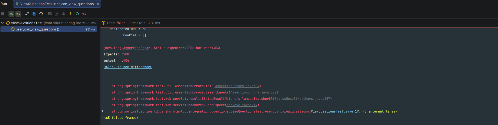

## 第一个测试

本节我们开始正式上手编写测试代码。

---

## 测试文件结构

通常我们组织一个测试，需要分三步走（**AAA 模式**）：

| 步骤 | 说明 | 对应内容 |
|------|------|---------|
| **Arrange（前提条件）** | 准备测试环境和数据 | 假设已存在对应接口 |
| **Act（行为动作）** | 执行测试动作 | 访问对应接口 |
| **Assert（预期结果）** | 验证测试结果 | 检查返回状态码 |

---

笔者更习惯用 Given、When、Then 的表达方式，因此后续均沿用此风格：

| 步骤                  | 说明               | 对应内容           |
| --------------------- | ------------------ | ------------------ |
| **Given（前提条件）** | 准备测试环境和数据 | 假设已存在对应接口 |
| **When（行为动作）**  | 执行测试动作       | 访问对应接口       |
| **Then（预期结果）**  | 验证测试结果       | 检查返回状态码     |


## 创建测试类

### 测试类代码

创建测试文件：
*src/test/java/com/nofirst/spring/tdd/zhihu/startup/integration/questions/ViewQuestionsTest.java*：

```java
package com.nofirst.spring.tdd.zhihu.startup.integration;

import org.junit.jupiter.api.Test;

import static org.springframework.test.web.servlet.request.MockMvcRequestBuilders.get;
import static org.springframework.test.web.servlet.result.MockMvcResultMatchers.status;

class ViewQuestionsTest extends BaseContainerTest {

    @Test
    void user_can_view_questions() throws Exception {
        // given
        // 暂无需准备数据

        // when
        this.mockMvc.perform(get("/questions"))
                // then
                .andExpect(status().isOk());
    }
}

```

### 代码解析

#### 测试方法

```java
@Test
void user_can_view_questions() throws Exception {
    // given
    // 暂无需准备数据

    // when
    this.mockMvc.perform(get("/questions"))
    // then
            .andExpect(status().isOk());
}
```

| 部分 | 说明 |
|------|------|
| `@Test` | 标记这是一个测试方法 |
| `user_can_view_questions()` | 测试方法名，使用下划线风格提高可读性 |
| `given` | 准备测试数据（本节暂无需准备） |
| `when` | 发送 GET 请求到 `/questions` 接口 |
| `then` | 断言响应状态码为 200（OK） |

---

## 运行测试

### 执行测试

在 IDE 中右键运行测试类，或使用 Maven 命令：

```bash
mvn test -Dtest=ViewQuestionsTest
```

### 预期结果

由于我们还未编写任何业务代码，测试会失败，显示 404 错误：

```
java.lang.AssertionError: Status expected:<200> but was:<404>
Expected :200
Actual   :404
```

>注意：在第一次运行测试的时候，`Testcontainers`测试框架会通过 Docker 启动一个 MySql 容器，因此你需要保证 Docker 是启动状态。
> 此外，如果你没有下载过对应的镜像，第一次运行测试的时候会先去下载镜像。

### 错误分析

| 错误码 | 含义 | 原因 |
|--------|------|------|
| 404 | Not Found | 路由不存在，未创建对应的 Controller |

这是**正常的**，因为我们还没有创建对应的 Controller。

### 测试失败截图



---

## 测试方法命名规范

### 两种命名方式

通常而言，测试方法命名有两种方式：

| 方式 | 示例 | 特点 |
|------|------|------|
| **test 开头 + 驼峰** | `testUserCanViewQuestions()` | 传统方式，较冗长 |
| **下划线风格** | `user_can_view_questions()` | 可读性更好，推荐 |

### 推荐使用下划线风格

本教程所有测试方法均采用下划线风格，原因：

- ✅ 可读性更佳，像一句完整的描述
- ✅ 清晰表达测试意图

### 命名模板

```java
@Test
void [角色]_[动作]_[预期结果]() {
    // 示例
}

@Test
void user_can_view_questions() { }

@Test
void guest_cannot_create_question() { }

@Test
void signed_in_user_can_answer_question() { }
```

