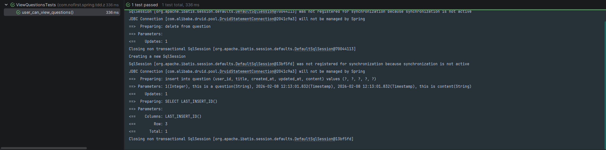

# 第一个测试

本节我们开始正式上手编写测试代码。

---

## 一、测试文件结构

通常我们组织一个测试，需要分三步走（**AAA 模式**）：

| 步骤 | 说明 | 对应内容 |
|------|------|---------|
| **Arrange（前提条件）** | 准备测试环境和数据 | 假设已存在对应接口 |
| **Act（行为动作）** | 执行测试动作 | 访问对应接口 |
| **Assert（预期结果）** | 验证测试结果 | 检查返回状态码 |

---

## 二、创建测试类

### 2.1 测试类代码

创建测试文件 *src/test/java/com/nofirst/spring/tdd/zhihu/startup/integration/questions/ViewQuestionsTest.java*：

```java
package com.nofirst.spring.tdd.zhihu.startup.integration.questions;

import com.nofirst.spring.tdd.zhihu.startup.BaseContainerTest;
import org.junit.jupiter.api.BeforeAll;
import org.junit.jupiter.api.Test;
import org.junit.jupiter.api.TestInstance;
import org.springframework.beans.factory.annotation.Autowired;
import org.springframework.test.web.servlet.MockMvc;
import org.springframework.test.web.servlet.setup.MockMvcBuilders;
import org.springframework.web.context.WebApplicationContext;

import static org.springframework.test.web.servlet.request.MockMvcRequestBuilders.get;
import static org.springframework.test.web.servlet.result.MockMvcResultMatchers.status;

// 添加 TestInstance 注解，设置为 PER_CLASS 模式
// 允许@BeforeAll 使用非 static 方法
@TestInstance(TestInstance.Lifecycle.PER_CLASS)
public class ViewQuestionsTest extends BaseContainerTest {

    private MockMvc mockMvc;

    @Autowired
    private WebApplicationContext context;

    @BeforeAll
    public void setupMockMvc() {
        mockMvc = MockMvcBuilders
                .webAppContextSetup(context)
                .build();
    }

    @Test
    void user_can_view_questions() throws Exception {
        // given
        // 暂无需准备数据

        // when
        this.mockMvc.perform(get("/questions"))
        // then
                .andExpect(status().isOk());
    }
}
```

### 2.2 代码解析

#### 类级别注解

| 注解 | 说明 |
|------|------|
| `@TestInstance(TestInstance.Lifecycle.PER_CLASS)` | 设置测试实例生命周期为整个类，允许 `@BeforeAll` 使用非静态方法 |
| `public class ViewQuestionsTest extends BaseContainerTest` | 继承基类，自动获得 Testcontainers 支持 |

#### 成员变量

```java
private MockMvc mockMvc;  // 模拟 HTTP 请求的工具

@Autowired
private WebApplicationContext context;  // Spring Web 应用上下文
```

#### setupMockMvc 方法

```java
@BeforeAll
public void setupMockMvc() {
    mockMvc = MockMvcBuilders
            .webAppContextSetup(context)  // 使用 Web 应用上下文
            .build();  // 构建 MockMvc 实例
}
```

此方法在所有测试之前执行一次，用于初始化 `MockMvc` 实例。

> 💡 **MockMvc 的作用**：在测试用例中用来模拟向 Web 应用发送 HTTP 请求，无需启动真实的服务器。

#### 测试方法

```java
@Test
void user_can_view_questions() throws Exception {
    // given
    // 暂无需准备数据

    // when
    this.mockMvc.perform(get("/questions"))
    // then
            .andExpect(status().isOk());
}
```

| 部分 | 说明 |
|------|------|
| `@Test` | 标记这是一个测试方法 |
| `user_can_view_questions()` | 测试方法名，使用下划线风格提高可读性 |
| `given` | 准备测试数据（本节暂无需准备） |
| `when` | 发送 GET 请求到 `/questions` 接口 |
| `then` | 断言响应状态码为 200（OK） |

---

## 三、运行测试

### 3.1 执行测试

在 IDE 中右键运行测试类，或使用 Maven 命令：

```bash
mvn test -Dtest=ViewQuestionsTest
```

### 3.2 预期结果

由于我们还未编写任何业务代码，测试会失败，显示 404 错误：

```
java.lang.AssertionError: Status expected:<200> but was:<404>
Expected :200
Actual   :404
```

### 3.3 错误分析

| 错误码 | 含义 | 原因 |
|--------|------|------|
| 404 | Not Found | 路由不存在，未创建对应的 Controller |

这是**正常的**，因为我们还没有创建对应的 Controller。

### 3.4 测试失败截图



---

## 四、测试方法命名规范

### 两种命名方式

通常而言，测试方法命名有两种方式：

| 方式 | 示例 | 特点 |
|------|------|------|
| **test 开头 + 驼峰** | `testUserCanViewQuestions()` | 传统方式，较冗长 |
| **下划线风格** | `user_can_view_questions()` | 可读性更好，推荐 |

### 推荐使用下划线风格

本教程所有测试方法均采用下划线风格，原因：

- ✅ 可读性更佳，像一句完整的描述
- ✅ 清晰表达测试意图
- ✅ 符合行为驱动开发（BDD）理念

### 命名模板

```java
@Test
void [角色]_[动作]_[预期结果]() {
    // 示例
}

@Test
void user_can_view_questions() { }

@Test
void guest_cannot_create_question() { }

@Test
void signed_in_user_can_answer_question() { }
```

---

## 五、测试代码结构总结

完整的测试类结构如下：

```java
@TestInstance(TestInstance.Lifecycle.PER_CLASS)
public class ViewQuestionsTest extends BaseContainerTest {

    // ========== 依赖注入 ==========
    
    private MockMvc mockMvc;

    @Autowired
    private WebApplicationContext context;

    // ========== 初始化方法 ==========

    @BeforeAll
    public void setupMockMvc() {
        // 初始化 MockMvc
    }

    @BeforeEach
    public void setUp() {
        // 每个测试前执行（可选）
    }

    // ========== 测试方法 ==========

    @Test
    void user_can_view_questions() throws Exception {
        // given
        // 准备测试数据

        // when
        // 执行测试动作

        // then
        // 验证预期结果
    }

    // ========== 清理方法 ==========

    @AfterEach
    public void tearDown() {
        // 每个测试后执行（可选）
    }

    @AfterAll
    public void cleanAll() {
        // 所有测试后执行（可选）
    }
}
```

---

## 六、常见问题

### Q: 为什么要继承 BaseContainerTest？

**A:** `BaseContainerTest` 提供了：
- Testcontainers 容器配置
- Spring Boot 测试上下文
- MockMvc 自动配置

继承后可直接使用，无需重复配置。

### Q: @BeforeAll 为什么要设置 TestInstance？

**A:** 默认情况下，JUnit 5 为每个测试方法创建新实例，因此 `@BeforeAll` 方法必须是 `static` 的。使用 `@TestInstance(PER_CLASS)` 后，整个测试类只创建一个实例，`@BeforeAll` 可以是非静态的，方便访问实例变量。

### Q: 测试失败怎么办？

**A:** 第一个测试失败是**预期的**，因为我们还没写实现代码。这正是 TDD 的流程：先写测试（失败），再写实现（通过）。

---

## 七、下一步

测试已创建并运行（虽然失败了），请继续阅读：

1. [让测试通过](./4.让测试通过.md) - 编写代码使测试通过
2. [编写测试](./5.编写测试.md) - 完善更多测试用例

---

## 附录：完整测试代码

```java
package com.nofirst.spring.tdd.zhihu.startup.integration.questions;

import com.nofirst.spring.tdd.zhihu.startup.BaseContainerTest;
import org.junit.jupiter.api.BeforeAll;
import org.junit.jupiter.api.Test;
import org.junit.jupiter.api.TestInstance;
import org.springframework.beans.factory.annotation.Autowired;
import org.springframework.test.web.servlet.MockMvc;
import org.springframework.test.web.servlet.setup.MockMvcBuilders;
import org.springframework.web.context.WebApplicationContext;

import static org.springframework.test.web.servlet.request.MockMvcRequestBuilders.get;
import static org.springframework.test.web.servlet.result.MockMvcResultMatchers.status;

@TestInstance(TestInstance.Lifecycle.PER_CLASS)
public class ViewQuestionsTest extends BaseContainerTest {

    private MockMvc mockMvc;

    @Autowired
    private WebApplicationContext context;

    @BeforeAll
    public void setupMockMvc() {
        mockMvc = MockMvcBuilders
                .webAppContextSetup(context)
                .build();
    }

    @Test
    void user_can_view_questions() throws Exception {
        // given
        // 暂无需准备数据

        // when
        this.mockMvc.perform(get("/questions"))
        // then
                .andExpect(status().isOk());
    }
}
```
