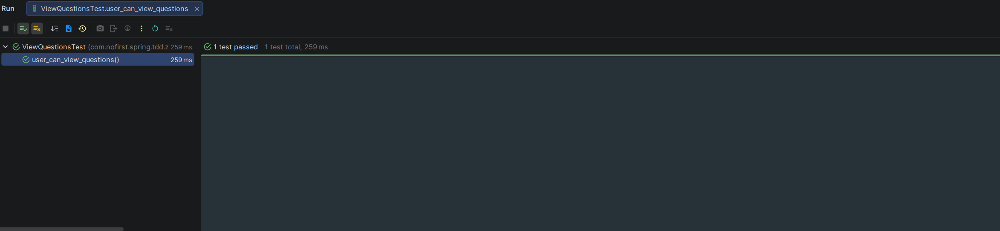

## 让测试通过

上一节中，我们创建并运行了第一个测试（虽然失败了）。这一节我们一起来编写代码，让测试通过。

---

## 创建 Controller

创建文件 *src/main/java/com/nofirst/spring/tdd/zhihu/startup/controller/QuestionController.java*：

```java
package com.nofirst.spring.tdd.zhihu.startup.controller;

import org.springframework.web.bind.annotation.GetMapping;
import org.springframework.web.bind.annotation.RestController;

@RestController
public class QuestionController {
    
    @GetMapping("/questions")
    public void index() {
        // 暂时不实现任何逻辑
    }
}
```

> 💡 **说明**：返回 `void` 时，Spring Boot 默认返回 200 OK 且响应体为空。这对于我们的第一个测试已经足够。

---
再次运行测试：



---

## TDD 循环完成

至此，我们完成了第一个 TDD 循环：

```
┌─────────────────────────────────────────┐
│                  第一个 TDD 循环                         │
├─────────────────────────────────────────────────────────┤
│                                                         │
│ 1. 编写测试 ──────→ 2. 运行测试（失败）               │
│       ↑                              │                  │
│       │                              │                  │
│       │                              ↓                  │
│       │                        3. 编写代码              │
│       │                              │                  │
│       │                              ↓                  │
│       └────────────────────── 4. 运行测试（通过）       │
│                                                         │
└─────────────────────────────────────────────────────────┘
```

| 步骤 | 动作 | 结果 |
|------|------|------|
| 1️⃣ | 编写测试 `user_can_view_questions()` | 测试代码完成 |
| 2️⃣ | 运行测试 | ❌ 404 错误 |
| 3️⃣ | 创建 `QuestionController` | 实现最少量代码 |
| 4️⃣ | 再次运行测试 | ✅ 测试通过 |

---

## 改进 Controller 返回值

虽然测试通过了，但返回空响应体并不友好。让我们改进一下，返回一个标准的响应格式。

### 修改 Controller

更新 *QuestionController.java*：

```java
package com.nofirst.spring.tdd.zhihu.startup.controller;

import com.nofirst.spring.tdd.zhihu.startup.common.CommonResult;
import org.springframework.web.bind.annotation.GetMapping;
import org.springframework.web.bind.annotation.RestController;

import java.util.Collections;
import java.util.List;

@RestController
public class QuestionController {
    
    @GetMapping("/questions")
    public CommonResult<List<Object>> index() {
        // 返回空列表
        return CommonResult.success(Collections.emptyList());
    }
}
```

再次运行测试，应该仍然通过。

现在访问 `/questions` 接口会返回：

```json
{
    "code": 200,
    "message": "操作成功",
    "data": []
}
```

---

## 提交代码

让我们将本次更改纳入版本控制中：

```bash
$ git add -A
$ git commit -m "view all questions"
```
