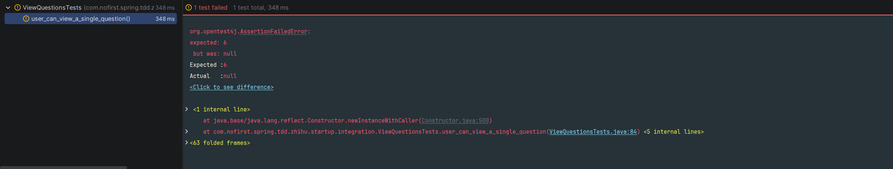
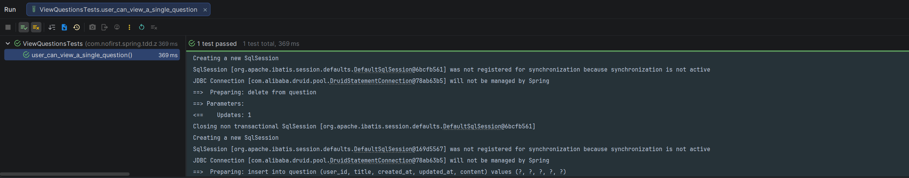

## 本节说明

本节我们来使测试通过。

## 使测试通过

添加路由如下：

*routes/web.php*
```
@RestController
public class QuestionController {

    @GetMapping("/questions")
    public void index() {
        // do nothing here
    }

    @GetMapping("/questions/{id}")
    public QuestionVo show(@PathVariable Integer id) {
        return new QuestionVo();
    }
}
```

再次运行测试：





我们的测试失败了，因为我们虽然添加了 `show()` 方法，但是我们并没有写业务逻辑。现在我们补充上业务逻辑：

```
@RestController
@AllArgsConstructor
public class QuestionController {

    private QuestionService questionService;

    @GetMapping("/questions")
    public void index() {
        // do nothing here
    }

    @GetMapping("/questions/{id}")
    public QuestionVo show(@PathVariable Integer id) {
        return questionService.show(id);
    }
}

```

按照惯例，我们将实现的逻辑放到了`QuestionService#show()`方法中，以下是该方法的实现：

```
package com.nofirst.spring.tdd.zhihu.startup.service;

import com.nofirst.spring.tdd.zhihu.startup.model.vo.QuestionVo;

/**
 * QuestionService
 *
 * @author nofirst
 */
public interface QuestionService {
    
    QuestionVo show(Integer id);

}	
```

```
package com.nofirst.spring.tdd.zhihu.startup.service.impl;

import com.nofirst.spring.tdd.zhihu.startup.mbg.mapper.QuestionMapper;
import com.nofirst.spring.tdd.zhihu.startup.mbg.model.Question;
import com.nofirst.spring.tdd.zhihu.startup.model.vo.QuestionVo;
import com.nofirst.spring.tdd.zhihu.startup.service.QuestionService;
import lombok.AllArgsConstructor;
import org.springframework.stereotype.Service;

@Service
@AllArgsConstructor
public class QuestionServiceImpl implements QuestionService {

    private QuestionMapper questionMapper;


    @Override
    public QuestionVo show(Integer id) {
        Question question = questionMapper.selectByPrimaryKey(id);

        QuestionVo questionVo = new QuestionVo();
        questionVo.setId(question.getId());
        questionVo.setUserId(question.getUserId());
        questionVo.setTitle(question.getTitle());
        questionVo.setContent(question.getContent());

        return questionVo;
    }
}

```

再次运行测试：


测试通过了！你可能非常奇怪，为什么每次写了一点点代码就需要重新运行测试呢？为什么不能先写完逻辑再一起运行测试呢？对不起，不行。

**TDD** 开发的原则就是，每次只需尽可能做出小的改动，让我们得到进步即可。

**何谓取得进步呢？** 测试从一个错误，进入到下一个错误，即为进步。当然，我们的最终目标，就是让我们的测试通过。

## 提交代码

让我们将本次更改纳入版本控制中：

```
$ git add -A
$ git commit -m "test view single question"
```