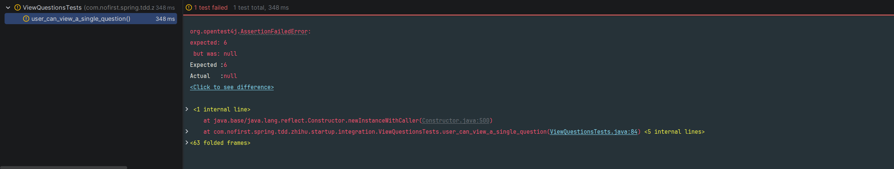
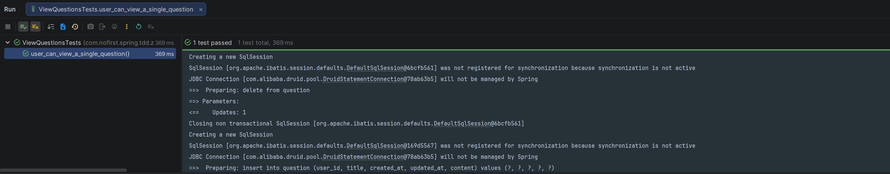

# 让测试通过

本节我们来使测试通过。

---

## 一、问题分析

### 1.1 错误回顾

上一节运行测试后，我们看到以下错误：

```
java.lang.AssertionError: Status expected:<200> but was:<404>
Expected :200
Actual   :404
```

### 1.2 错误分析

| 错误码 | 含义 | 原因 |
|--------|------|------|
| 404 | Not Found | 路由不存在，未创建 `/questions/{id}` 接口 |

---

## 二、添加路由

### 2.1 更新 Controller

添加路由如下：

```java
@RestController
public class QuestionController {

    @GetMapping("/questions")
    public void index() {
        // do nothing here
    }

    @GetMapping("/questions/{id}")
    public QuestionVo show(@PathVariable Integer id) {
        return new QuestionVo();
    }
}
```

### 2.2 代码说明

| 方法 | 说明 |
|------|------|
| `index()` | 问题列表接口（之前已创建） |
| `show(@PathVariable Integer id)` | 问题详情接口（新增） |

### 2.3 路径变量

```java
@GetMapping("/questions/{id}")
public QuestionVo show(@PathVariable Integer id)
```

- `@PathVariable`：将 URL 中的 `{id}` 绑定到方法参数 `id`
- 访问 `/questions/1` 时，`id` 的值为 `1`

---

## 三、运行测试

### 3.1 执行测试

再次运行测试：

```bash
mvn test -Dtest=ViewQuestionsTests
```

### 3.2 测试结果



我们的测试失败了，因为我们虽然添加了 `show()` 方法，但是我们并没有写业务逻辑，返回的是一个空的 `QuestionVo` 对象。

---

## 四、实现业务逻辑

### 4.1 添加 Service 依赖

按照惯例，我们将实现的逻辑放到了 `QuestionService#show()` 方法中。

更新 Controller：

```java
@RestController
@AllArgsConstructor
public class QuestionController {

    private QuestionService questionService;

    @GetMapping("/questions")
    public void index() {
        // do nothing here
    }

    @GetMapping("/questions/{id}")
    public QuestionVo show(@PathVariable Integer id) {
        return questionService.show(id);
    }
}
```

### 4.2 创建 Service 接口

以下是该方法的实现：

```java
package com.nofirst.spring.tdd.zhihu.startup.service;

import com.nofirst.spring.tdd.zhihu.startup.model.vo.QuestionVo;

/**
 * QuestionService
 *
 * @author nofirst
 */
public interface QuestionService {

    QuestionVo show(Integer id);

}
```

### 4.3 实现 Service

```java
package com.nofirst.spring.tdd.zhihu.startup.service.impl;

import com.nofirst.spring.tdd.zhihu.startup.mbg.mapper.QuestionMapper;
import com.nofirst.spring.tdd.zhihu.startup.mbg.model.Question;
import com.nofirst.spring.tdd.zhihu.startup.model.vo.QuestionVo;
import com.nofirst.spring.tdd.zhihu.startup.service.QuestionService;
import lombok.AllArgsConstructor;
import org.springframework.stereotype.Service;

@Service
@AllArgsConstructor
public class QuestionServiceImpl implements QuestionService {

    private QuestionMapper questionMapper;


    @Override
    public QuestionVo show(Integer id) {
        Question question = questionMapper.selectByPrimaryKey(id);

        QuestionVo questionVo = new QuestionVo();
        questionVo.setId(question.getId());
        questionVo.setUserId(question.getUserId());
        questionVo.setTitle(question.getTitle());
        questionVo.setContent(question.getContent());

        return questionVo;
    }
}
```

### 4.4 代码解析

#### Service 层职责

| 步骤 | 代码 | 说明 |
|------|------|------|
| 1. 查询数据库 | `questionMapper.selectByPrimaryKey(id)` | 根据 ID 查询问题 |
| 2. 创建 VO | `new QuestionVo()` | 创建视图对象 |
| 3. 属性拷贝 | `questionVo.setId(...)` | 将 DO 属性拷贝到 VO |
| 4. 返回结果 | `return questionVo` | 返回给 Controller |

#### 依赖注入

```java
@Service
@AllArgsConstructor
public class QuestionServiceImpl implements QuestionService {

    private QuestionMapper questionMapper;
    // Lombok 自动生成构造函数
}
```

- `@Service`：标记这是一个 Spring 服务
- `@AllArgsConstructor`：Lombok 自动生成包含所有字段的构造函数，实现依赖注入

---

## 五、再次运行测试

### 5.1 执行测试

```bash
mvn test -Dtest=ViewQuestionsTests
```

### 5.2 测试结果



测试通过了！

---

## 六、TDD 开发原则

你可能非常奇怪，为什么每次写了一点点代码就需要重新运行测试呢？为什么不能先写完逻辑再一起运行测试呢？

**对不起，不行。**

### 6.1 小步前进

**TDD** 开发的原则就是，每次只需尽可能做出小的改动，让我们得到进步即可。

```
┌─────────────────────────────────────────────────────────┐
│                  小步快跑的 TDD 循环                     │
│                                                         │
│  写一点代码 → 运行测试 → 得到反馈 → 再写一点代码        │
│       ↑                                    │           │
│       └────────────────────────────────────┘           │
│                                                         │
└─────────────────────────────────────────────────────────┘
```

### 6.2 何谓取得进步？

> **测试从一个错误，进入到下一个错误，即为进步。**

当然，我们的最终目标，就是让我们的测试通过。

### 6.3 小步前进的优势

| 优势 | 说明 |
|------|------|
| **快速反馈** | 及时发现问题，定位更容易 |
| **降低风险** | 每次改动小，出错概率低 |
| **保持信心** | 不断看到进步，增强信心 |
| **易于调试** | 问题范围小，容易定位 |

---

## 七、完整代码回顾

### 7.1 QuestionController

```java
@RestController
@AllArgsConstructor
public class QuestionController {

    private QuestionService questionService;

    @GetMapping("/questions")
    public void index() {
        // do nothing here
    }

    @GetMapping("/questions/{id}")
    public QuestionVo show(@PathVariable Integer id) {
        return questionService.show(id);
    }
}
```

### 7.2 QuestionService

```java
public interface QuestionService {

    QuestionVo show(Integer id);

}
```

### 7.3 QuestionServiceImpl

```java
@Service
@AllArgsConstructor
public class QuestionServiceImpl implements QuestionService {

    private QuestionMapper questionMapper;

    @Override
    public QuestionVo show(Integer id) {
        Question question = questionMapper.selectByPrimaryKey(id);

        QuestionVo questionVo = new QuestionVo();
        questionVo.setId(question.getId());
        questionVo.setUserId(question.getUserId());
        questionVo.setTitle(question.getTitle());
        questionVo.setContent(question.getContent());

        return questionVo;
    }
}
```

---

## 八、提交代码

让我们将本次更改纳入版本控制中：

```bash
$ git add -A
$ git commit -m "test view single question"
```

### 提交信息规范

| 前缀 | 说明 | 示例 |
|------|------|------|
| `test:` | 测试相关 | `test: 添加问题详情测试` |
| `feat:` | 新功能 | `feat: 添加问题详情接口` |
| `fix:` | 修复 bug | `fix: 修复空指针异常` |
| `refactor:` | 重构代码 | `refactor: 重构服务层` |

---

## 九、总结

### 9.1 本节学习要点

| 要点 | 说明 |
|------|------|
| 路由添加 | 使用 `@GetMapping("/questions/{id}")` |
| 路径变量 | 使用 `@PathVariable` 获取 URL 参数 |
| Service 层 | 分离业务逻辑，便于测试和维护 |
| 依赖注入 | 使用构造函数注入（`@AllArgsConstructor`） |
| TDD 原则 | 小步前进，每次只做一个小改动 |

### 9.2 TDD 循环完成

| 步骤 | 动作 | 结果 |
|------|------|------|
| 1️⃣ | 编写测试 `user_can_view_a_single_question()` | 测试代码完成 |
| 2️⃣ | 运行测试 | ❌ 404 错误 |
| 3️⃣ | 创建数据表和工厂类 | 数据模型完成 |
| 4️⃣ | 运行测试 | ❌ 404 错误（路由不存在） |
| 5️⃣ | 添加 `show()` 方法 | 路由存在，返回空对象 |
| 6️⃣ | 运行测试 | ❌ 断言失败 |
| 7️⃣ | 实现 Service 业务逻辑 | 功能完成 |
| 8️⃣ | 运行测试 | ✅ 测试通过 |

---

## 十、下一步

测试已通过，但功能还不完善。请继续阅读：

1. [集成测试与单元测试](./4.集成测试与单元测试.md) - 了解两种测试的区别

---

## 附录：潜在问题

### 空指针异常

当前代码没有处理数据不存在的情况，如果查询的 ID 不存在，会抛出 `NullPointerException`。

这个问题将在后续章节通过单元测试来发现并修复。
