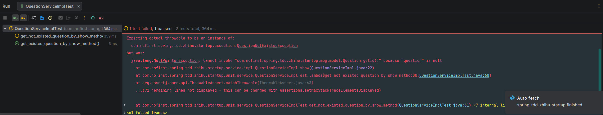

## 集成测试

到目前为止，我们完成了一个完整的测试用例开发。如果你仔细观察的话，你会发现，这个测试会启动一个完整的Spring环境，这也就意味着，整个测试的时间会非常长，当你的项目很大时，测试时间会变得非常长，TDD 开发流程也会变得非常长。

所以，现在是一个很好的时机来讨论集成测试和单元测试


## 单元测试

*src/test/java/com/nofirst/spring/tdd/zhihu/startup/unit/service/QuestionServiceImplTest.java*

```java
package com.nofirst.spring.tdd.zhihu.startup.unit.service;

import com.nofirst.spring.tdd.zhihu.startup.exception.QuestionNotExistedException;
import com.nofirst.spring.tdd.zhihu.startup.factory.QuestionFactory;
import com.nofirst.spring.tdd.zhihu.startup.mbg.mapper.QuestionMapper;
import com.nofirst.spring.tdd.zhihu.startup.mbg.model.Question;
import com.nofirst.spring.tdd.zhihu.startup.model.vo.QuestionVo;
import com.nofirst.spring.tdd.zhihu.startup.service.impl.QuestionServiceImpl;
import org.junit.jupiter.api.BeforeEach;
import org.junit.jupiter.api.Test;
import org.junit.jupiter.api.extension.ExtendWith;
import org.mockito.InjectMocks;
import org.mockito.Mock;
import org.mockito.junit.jupiter.MockitoExtension;

import static org.assertj.core.api.Assertions.assertThat;
import static org.assertj.core.api.Assertions.assertThatThrownBy;
import static org.mockito.BDDMockito.given;

@ExtendWith(MockitoExtension.class)
class QuestionServiceImplTest {

    @InjectMocks
    private QuestionServiceImpl questionService;

    @Mock
    private QuestionMapper questionMapper;

    private Question question;

    @BeforeEach
    public void setup() {
        question = QuestionFactory.createQuestion();
    }

    @Test
    void get_existed_question_by_show_method() {
        // given
        given(questionMapper.selectByPrimaryKey(1)).willReturn(this.question);

        // when
        QuestionVo existedQuestion = questionService.show(1);

        // then
        assertThat(existedQuestion).isNotNull();
        assertThat(existedQuestion.getId()).isEqualTo(this.question.getId());
        assertThat(existedQuestion.getUserId()).isEqualTo(this.question.getUserId());
        assertThat(existedQuestion.getTitle()).isEqualTo(this.question.getTitle());
        assertThat(existedQuestion.getContent()).isEqualTo(this.question.getContent());
    }

    @Test
    void get_not_existed_question_by_show_method() {
        // given
        given(questionMapper.selectByPrimaryKey(1)).willReturn(null);

        // then
        assertThatThrownBy(() -> {
            // when
            questionService.show(1);
        }).isInstanceOf(QuestionNotExistedException.class)
                .hasMessageStartingWith("question not exist");
    }
}
```

通常情况下，是一定需要考虑查询的数据不存在的情况的。所以，我们写了两个测试用例，测试`QuestionServiceImpl#show()`方法的完整逻辑。如果此时运行测试，你会发现一个测试通过，一个测试不通过。并且，测试运行的速度会非常快：



测试不通过的原因也很简单，我们并没有在数据不存在的情况下抛出相应的异常。我们完善逻辑：

```java
public QuestionVo show(Integer id) {
    Question question = questionMapper.selectByPrimaryKey(id);
    if (Objects.isNull(question)) {
        throw new QuestionNotExistedException();
    }

    QuestionVo questionVo = new QuestionVo();
    questionVo.setId(question.getId());
    questionVo.setUserId(question.getUserId());
    questionVo.setTitle(question.getTitle());
    questionVo.setContent(question.getContent());

    return questionVo;	
}
```

再次运行测试，测试全部通过！