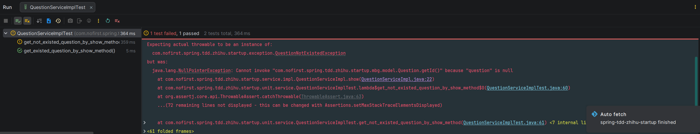

# 集成测试与单元测试

到目前为止，我们完成了一个完整的测试用例开发。如果你仔细观察的话，你会发现，这个测试会启动一个完整的 Spring 环境，这也就意味着，整个测试的时间会非常长。当你的项目很大时，测试时间会变得非常长，TDD 开发流程也会变得非常长。

所以，现在是一个很好的时机来讨论**集成测试**和**单元测试**。

---

## 测试类型对比

### 集成测试

| 特点 | 说明 |
|------|------|
| **测试范围** | 测试多个组件协作的完整流程 |
| **启动环境** | 启动完整的 Spring 容器 |
| **依赖** | 使用真实的数据库（Testcontainers） |
| **速度** | 较慢 |
| **用途** | 验证端到端的功能 |

### 单元测试

| 特点 | 说明 |
|------|------|
| **测试范围** | 测试单一组件（如 Service 方法） |
| **启动环境** | 不启动 Spring 容器 |
| **依赖** | 使用 Mock 对象隔离外部依赖 |
| **速度** | 非常快 |
| **用途** | 验证业务逻辑正确性 |

## 创建单元测试

创建单元测试文件：
*src/test/java/com/nofirst/spring/tdd/zhihu/startup/unit/service/QuestionServiceImplTest.java*：

```java
package com.nofirst.spring.tdd.zhihu.startup.unit.service;

import com.nofirst.spring.tdd.zhihu.startup.exception.QuestionNotExistedException;
import com.nofirst.spring.tdd.zhihu.startup.factory.QuestionFactory;
import com.nofirst.spring.tdd.zhihu.startup.mbg.mapper.QuestionMapper;
import com.nofirst.spring.tdd.zhihu.startup.mbg.model.Question;
import com.nofirst.spring.tdd.zhihu.startup.model.vo.QuestionVo;
import com.nofirst.spring.tdd.zhihu.startup.service.impl.QuestionServiceImpl;
import org.junit.jupiter.api.BeforeEach;
import org.junit.jupiter.api.Test;
import org.junit.jupiter.api.extension.ExtendWith;
import org.mockito.InjectMocks;
import org.mockito.Mock;
import org.mockito.junit.jupiter.MockitoExtension;

import static org.assertj.core.api.Assertions.assertThat;
import static org.assertj.core.api.Assertions.assertThatThrownBy;
import static org.mockito.BDDMockito.given;

@ExtendWith(MockitoExtension.class)
class QuestionServiceImplTest {

    @InjectMocks
    private QuestionServiceImpl questionService;

    @Mock
    private QuestionMapper questionMapper;

    private Question question;

    @BeforeEach
    public void setup() {
        question = QuestionFactory.createQuestion();
    }

    @Test
    void get_existed_question_by_show_method() {
        // given
        given(questionMapper.selectByPrimaryKey(1)).willReturn(this.question);

        // when
        QuestionVo existedQuestion = questionService.show(1);

        // then
        assertThat(existedQuestion).isNotNull();
        assertThat(existedQuestion.getId()).isEqualTo(this.question.getId());
        assertThat(existedQuestion.getUserId()).isEqualTo(this.question.getUserId());
        assertThat(existedQuestion.getTitle()).isEqualTo(this.question.getTitle());
        assertThat(existedQuestion.getContent()).isEqualTo(this.question.getContent());
    }

    @Test
    void get_not_existed_question_by_show_method() {
        // given
        given(questionMapper.selectByPrimaryKey(1)).willReturn(null);

        // then
        assertThatThrownBy(() -> {
            // when
            questionService.show(1);
        }).isInstanceOf(QuestionNotExistedException.class)
                .hasMessageStartingWith("question not exist");
    }
}
```

### 代码解析

#### 类级别注解

```java
@ExtendWith(MockitoExtension.class)
class QuestionServiceImplTest {
    // ...
}
```

| 注解 | 说明 |
|------|------|
| `@ExtendWith(MockitoExtension.class)` | 启用 Mockito 扩展，自动初始化 Mock 对象 |

#### 依赖注入

```java
@InjectMocks
private QuestionServiceImpl questionService;  // 被测对象

@Mock
private QuestionMapper questionMapper;  // Mock 对象
```

| 注解 | 说明 |
|------|------|
| `@Mock` | 创建 Mock 对象，模拟依赖行为 |
| `@InjectMocks` | 创建被测对象，并自动注入 Mock 依赖 |

#### 测试数据准备

```java
private Question question;

@BeforeEach
public void setup() {
    question = QuestionFactory.createQuestion();
}
```

每个测试前执行，使用工厂类创建测试数据。

### 测试用例 1：查询存在的问题模型

```java
@Test
void get_existed_question_by_show_method() {
    // given
    given(questionMapper.selectByPrimaryKey(1)).willReturn(this.question);

    // when
    QuestionVo existedQuestion = questionService.show(1);

    // then
    assertThat(existedQuestion).isNotNull();
    assertThat(existedQuestion.getId()).isEqualTo(this.question.getId());
    assertThat(existedQuestion.getUserId()).isEqualTo(this.question.getUserId());
    assertThat(existedQuestion.getTitle()).isEqualTo(this.question.getTitle());
    assertThat(existedQuestion.getContent()).isEqualTo(this.question.getContent());
}
```

| 步骤 | 说明 |
|------|------|
| `given(...).willReturn(...)` | 定义 Mock 行为：当查询 ID=1 时，返回测试数据 |
| `questionService.show(1)` | 调用被测方法 |
| `assertThat(...)` | 断言返回的 VO 对象字段正确 |

### 测试用例 2：查询不存在的问题模型

```java
@Test
void get_not_existed_question_by_show_method() {
    // given
    given(questionMapper.selectByPrimaryKey(1)).willReturn(null);

    // then
    assertThatThrownBy(() -> {
        // when
        questionService.show(1);
    }).isInstanceOf(QuestionNotExistedException.class)
            .hasMessageStartingWith("question not exist");
}
```

| 步骤 | 说明 |
|------|------|
| `given(...).willReturn(null)` | 定义 Mock 行为：当查询 ID=1 时，返回 null |
| `assertThatThrownBy(...)` | 断言抛出异常 |
| `.isInstanceOf(...)` | 验证异常类型 |
| `.hasMessageStartingWith(...)` | 验证异常消息 |

> 💡 **提示**：通常情况下，是一定需要考虑查询的数据不存在的情况的。所以，我们写了两个测试用例，测试 `QuestionServiceImpl#show()` 方法的完整逻辑。

---

## 运行单元测试

我们定义了`QuestionNotExistedException`异常，但是目前还不存在，所以我们先创建该异常类：
```java
package com.nofirst.spring.tdd.zhihu.startup.exception;

import com.nofirst.spring.tdd.zhihu.startup.common.ResultCode;

public class QuestionNotExistedException extends ApiException {

    public QuestionNotExistedException() {
        super(ResultCode.FAILED, "question not exist");
    }
}
```


运行测试：



你会发现：

- ✅ 一个测试通过（查询存在的问题）
- ❌ 一个测试不通过（查询不存在的问题）

并且，**测试运行的速度会非常快**。

### 测试失败原因

测试不通过的原因很简单：我们并没有在数据不存在的情况下抛出相应的异常。

当前代码：

```java
public QuestionVo show(Integer id) {
    Question question = questionMapper.selectByPrimaryKey(id);
    // ❌ 没有处理 question 为 null 的情况

    QuestionVo questionVo = new QuestionVo();
    questionVo.setId(question.getId());  // 这里会抛出 NullPointerException
    // ...
}
```

---

## 修复代码

### 添加异常处理

我们完善逻辑：

```java
public QuestionVo show(Integer id) {
    Question question = questionMapper.selectByPrimaryKey(id);
    if (Objects.isNull(question)) {
        throw new QuestionNotExistedException();
    }

    QuestionVo questionVo = new QuestionVo();
    questionVo.setId(question.getId());
    questionVo.setUserId(question.getUserId());
    questionVo.setTitle(question.getTitle());
    questionVo.setContent(question.getContent());

    return questionVo;
}
```

再次运行测试，测试全部通过！

## 提交代码

让我们将本次更改纳入版本控制中：

```bash
$ git add -A
$ git commit -m "service unit test"
```

