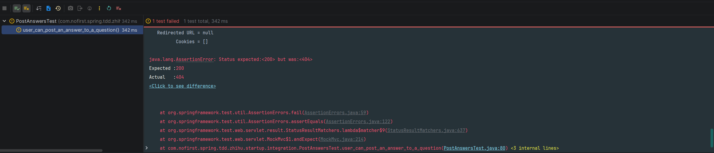
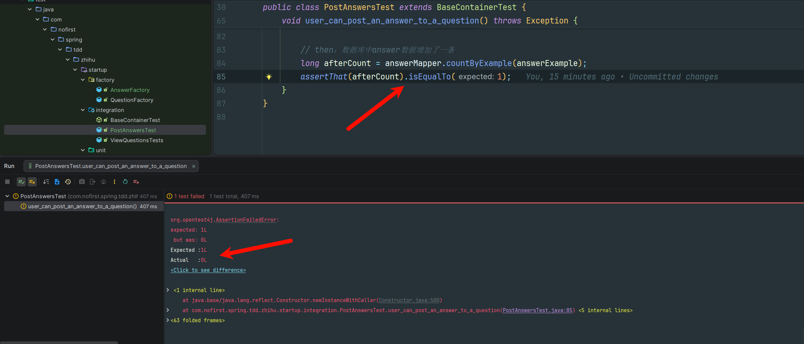

# 回答问题

本章我们继续 TDD 开发之旅，要实现的功能是：**回答问题**。

---

## 功能说明

在完成了「显示问题」功能后，我们继续开发问答系统的核心功能——回答问题。

### 功能目标

| 目标 | 说明 |
|------|------|
| 用户可以回答问题 | 登录用户可以对已发布的问题提交回答 |
| 回答存储在数据库 | 回答数据持久化到 `answer` 表 |
| 验证问题存在性 | 只能对已存在且已发布的问题进行回答 |

---

## 创建集成测试

### 新建测试文件

首先我们新建一个测试文件：

*src/test/java/com/nofirst/spring/tdd/zhihu/startup/integration/answers/PostAnswersTest.java*

```java
package com.nofirst.spring.tdd.zhihu.startup.integration.questions;

import com.fasterxml.jackson.databind.ObjectMapper;
import com.nofirst.spring.tdd.zhihu.startup.integration.BaseContainerTest;
import com.nofirst.spring.tdd.zhihu.startup.mbg.mapper.QuestionMapper;
import com.nofirst.spring.tdd.zhihu.startup.mbg.model.AnswerExample;
import com.nofirst.spring.tdd.zhihu.startup.mbg.model.QuestionExample;
import org.junit.jupiter.api.BeforeEach;
import org.junit.jupiter.api.Test;
import org.springframework.beans.factory.annotation.Autowired;

class ViewQuestionsTest extends BaseContainerTest {

    @Autowired
    private QuestionMapper questionMapper;

    @Autowired
    private ObjectMapper objectMapper;

    @BeforeEach
    public void setupTestData() {
        QuestionExample questionExample = new QuestionExample();
        // 空条件，匹配所有数据，等价于 delete * from question
        questionExample.createCriteria();
        questionMapper.deleteByExample(questionExample);

        AnswerExample answerExample = new AnswerExample();
        // 空条件，匹配所有数据，等价于 delete * from answer
        answerExample.createCriteria();
        answerMapper.deleteByExample(answerExample);
    }

    @Test
    void user_can_post_an_answer_to_a_question() throws Exception {
        // 假设已存在某个问题

        // 然后我们触发某个路由

        // 我们要看到预期结果
    }
}
```

### 填充测试代码

按照我们的思路，我们填充代码如下：

```java
@TestInstance(TestInstance.Lifecycle.PER_CLASS)
public class PostAnswersTest extends BaseContainerTest {

    private MockMvc mockMvc;

    @Autowired
    private WebApplicationContext context;

    @Autowired
    private QuestionMapper questionMapper;

    @Autowired
    private AnswerDao answerDao;


    @BeforeAll
    public void setupMockMvc() {
        mockMvc = MockMvcBuilders
                .webAppContextSetup(context)
                .build();
    }

    @BeforeEach
    public void setupTestData() {
        QuestionExample questionExample = new QuestionExample();
        // 空条件，匹配所有数据，等价于 delete * from question
        questionExample.createCriteria();
        questionMapper.deleteByExample(questionExample);

        AnswerExample answerExample = new AnswerExample();
        // 空条件，匹配所有数据，等价于 delete * from answer
        answerExample.createCriteria();
        answerMapper.deleteByExample(answerExample);
    }

    @Test
    void user_can_post_an_answer_to_a_question() throws Exception {
        // given：准备测试数据
        Question question = QuestionFactory.createQuestion();
        questionMapper.insert(question);
        AnswerExample answerExample = new AnswerExample();
        long beforeCount = answerMapper.countByExample(answerExample);
        assertThat(beforeCount).isEqualTo(0);

        // when：调用接口并获取返回结果
        AnswerDto answer = AnswerFactory.createAnswerDto();
        this.mockMvc.perform(post("/questions/{id}/answers", question.getId())
                        .contentType(MediaType.APPLICATION_JSON)
                        .content(JSONUtil.toJsonStr(answer))
                )
                .andDo(print())
                .andExpect(status().isOk())
                .andExpect(jsonPath("$.code").value(ResultCode.SUCCESS.getCode()));

        // then：数据库中 answer 数据增加了一条
        long afterCount = answerMapper.countByExample(answerExample);
        assertThat(afterCount).isEqualTo(1);
    }
}
```

### 测试代码解析

| 步骤 | 说明 |
|------|------|
| `given` | 准备测试数据：创建问题，验证 answer 表初始为空 |
| `when` | 调用 `POST /questions/{id}/answers` 接口提交回答 |
| `then` | 验证响应状态码和 code，验证数据库增加了一条记录 |

---

## 创建数据模型

### 创建 answer 表

编辑器提醒我们 `AnswerMapper`、`AnswerExample` 都不存在，所以我们接下来的工作，就是定义 `answer` 数据表，并产生对应的 ORM 映射模型。

`answer` 表的定义如下：

*src/main/resources/db/migration/V20260209__create_table_answer.sql*

```sql
CREATE TABLE `answer` (
    `id` int unsigned NOT NULL AUTO_INCREMENT,
    `question_id` int NOT NULL,
    `user_id` int NOT NULL,
    `content` text  NOT NULL,
    `created_at` timestamp NOT NULL,
    `updated_at` timestamp NOT NULL,
    PRIMARY KEY (`id`)
) ENGINE=InnoDB AUTO_INCREMENT=1 ;
```

### 字段说明

| 字段 | 类型 | 说明 |
|------|------|------|
| `id` | int unsigned | 主键，自增 |
| `question_id` | int | 关联的问题 ID |
| `user_id` | int | 回答者 ID |
| `content` | text | 回答内容 |
| `created_at` | timestamp | 创建时间 |
| `updated_at` | timestamp | 更新时间 |

### 运行迁移

运行 Maven 的 `flyway` 插件的 `flyway:migrate` 命令生成表：

```bash
mvn flyway:migrate
```

修改 `generatorConfig.xml` 的配置，改为生成 `answer` 表，运行 `Generator#main()` 方法生成对应的数据库映射文件。

---

## 创建模型工厂

重新导入缺失的类之后，我们应该立即运行测试。但是你会发现，相关的工厂类还不存在。

### AnswerFactory

*src/test/java/com/nofirst/spring/tdd/zhihu/startup/factory/AnswerFactory.java*

```java
package com.nofirst.spring.tdd.zhihu.startup.factory;

import com.nofirst.spring.tdd.zhihu.startup.model.dto.AnswerDto;

public class AnswerFactory {

    public static AnswerDto createAnswerDto() {
        AnswerDto answer = new AnswerDto();
        answer.setContent("this is a answer");

        return answer;
    }
}
```

### AnswerDto

*src/main/java/com/nofirst/spring/tdd/zhihu/startup/model/dto/AnswerDto.java*

```java
package com.nofirst.spring.tdd.zhihu.startup.model.dto;

import lombok.Data;

@Data
public class AnswerDto {

    private String content;
}
```

---

## 创建 Controller

### 运行测试

重新导入缺失的类，运行测试：



问题显而易见：还没有对应的路由。

### 添加路由

下面添加路由：

*src/main/java/com/nofirst/spring/tdd/zhihu/startup/controller/AnswerController.java*

```java
package com.nofirst.spring.tdd.zhihu.startup.controller;

import com.nofirst.spring.tdd.zhihu.startup.common.CommonResult;
import com.nofirst.spring.tdd.zhihu.startup.model.dto.AnswerDto;
import org.springframework.web.bind.annotation.PathVariable;
import org.springframework.web.bind.annotation.PostMapping;
import org.springframework.web.bind.annotation.RequestBody;
import org.springframework.web.bind.annotation.RestController;

@RestController
public class AnswerController {

    @PostMapping("/questions/{questionId}/answers")
    public CommonResult<String> store(@PathVariable Integer questionId, @RequestBody AnswerDto answerDto) {
        return CommonResult.success("success");
    }
}
```

### 运行测试

运行测试：



虽然没有报错 404，但是由于我们在 controller 里面什么也没做，所以 `answer` 表里面的数据数量仍然是 0。

按照惯例，我们会将具体逻辑写在 Service 层，下一节我们继续。

---

## TDD 理念

### 先写测试

在 TDD 开发中，我们总是：

1. 先编写测试代码（即使相关的类还不存在）
2. 运行测试，看着它失败
3. 编写最少量的代码使测试通过
4. 重构代码

### 小步前进

> **何谓取得进步？** 测试从一个错误，进入到下一个错误，即为进步。

当然，我们的最终目标，就是让我们的测试通过。

---

## 下一步

测试已创建，数据模型和工厂类已准备就绪。请继续阅读：

1. [单元测试](./2.单元测试.md) - 编写 Service 层单元测试
2. [问题的发布属性](./3.问题的发布属性.md) - 添加发布状态控制

---

## 附录：测试要点

| 要点 | 说明 |
|------|------|
| 测试名称 | `user_can_post_an_answer_to_a_question` - 描述用户行为 |
| 测试数据 | 使用 `QuestionFactory` 和 `AnswerFactory` 创建 |
| 数据清理 | `@BeforeEach` 清理旧数据 |
| HTTP 请求 | `POST /questions/{id}/answers` |
| 响应验证 | 状态码 + JSON code + 数据库记录数 |
| 断言库 | AssertJ (`assertThat`) |
