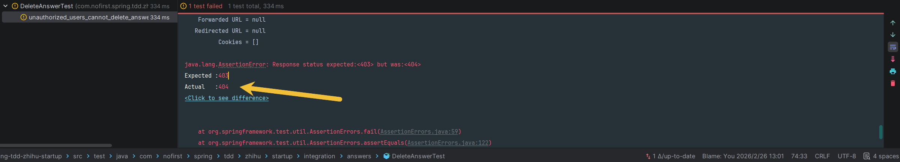
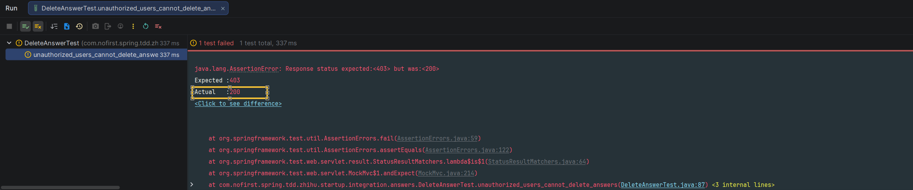
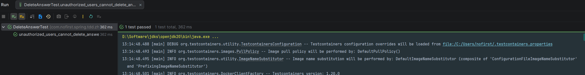
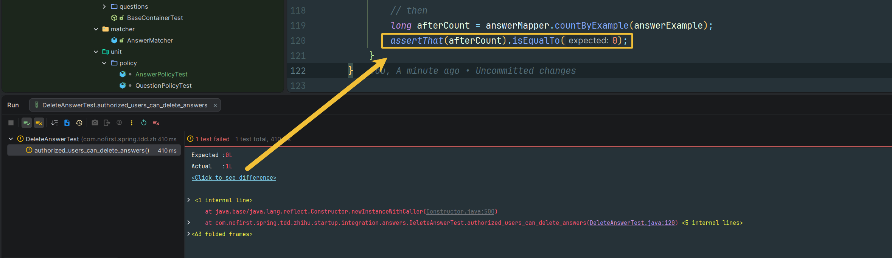

# 删除答案

本节我们进行删除答案功能的开发。

---

## 功能说明

### 删除答案功能

用户应该能够删除自己创建的回答，但不能删除他人的回答。

### 开发目标

| 目标 | 说明 |
|------|------|
| 未登录用户不能删除 | 返回 401 未授权 |
| 非作者不能删除 | 返回 403 禁止访问 |
| 作者可以删除 | 删除成功，返回 200 |

---

## 创建测试

### 新建测试文件

首先新增测试文件：

*src/test/java/com/nofirst/spring/tdd/zhihu/startup/integration/answers/DeleteAnswerTest.java*

```java
@TestInstance(TestInstance.Lifecycle.PER_CLASS)
public class DeleteAnswerTest extends BaseContainerTest {

    private MockMvc mockMvc;

    @Autowired
    private WebApplicationContext context;

    @Autowired
    private QuestionMapper questionMapper;

    @Autowired
    private AnswerMapper answerMapper;


    @BeforeAll
    public void setupMockMvc() {
        mockMvc = MockMvcBuilders
                .webAppContextSetup(context)
                // 启用 spring security
                .apply(springSecurity())
                .build();
    }

    @BeforeEach
    public void setupTestData() {
        QuestionExample questionExample = new QuestionExample();
        // 空条件，匹配所有数据，等价于 delete * from question
        questionExample.createCriteria();
        questionMapper.deleteByExample(questionExample);

        AnswerExample answerExample = new AnswerExample();
        // 空条件，匹配所有数据，等价于 delete * from answer
        answerExample.createCriteria();
        answerMapper.deleteByExample(answerExample);
    }

    @Test
    void guests_cannot_delete_answers() throws Exception {
        // 目前这个路由还不存在，但是不影响 401 的返回
        this.mockMvc.perform(delete("/answers/{id}", 1))
                .andExpect(status().is(401));
    }
}
```

### 运行测试

运行测试：



---

## 未授权用户不能删除

### 添加测试用例

接下来编写未授权用户（非作者的登录用户）无法删除答案的逻辑。

新增测试：

*src/test/java/com/nofirst/spring/tdd/zhihu/startup/integration/answers/DeleteAnswerTest.java*

```java
@Test
@WithUserDetails(value = "John", userDetailsServiceBeanName = "customUserDetailsService")
void unauthorized_users_cannot_delete_answers() throws Exception {
    // given：准备测试数据
    Question questionOfOtherUser = QuestionFactory.createPublishedQuestion();
    questionOfOtherUser.setUserId(1);
    questionMapper.insert(questionOfOtherUser);
    Answer answerOfOther = AnswerFactory.createAnswer(questionOfOtherUser.getId());
    answerMapper.insert(answerOfOther);

    // when
    this.mockMvc.perform(delete("/answers/{id}", answerOfOther.getId())
                    .contentType(MediaType.APPLICATION_JSON)
            ).andDo(print())
            .andExpect(status().is(403));
}
```

### 运行测试

运行测试：


测试结果提示我们路由还不存在。

---

## 创建 Controller

### 添加路由

添加对应的路由：

*src/main/java/com/nofirst/spring/tdd/zhihu/startup/controller/AnswerController.java*

```java
@DeleteMapping("/answers/{answerId}")
public CommonResult<String> destroy(@PathVariable Integer answerId) {
    return CommonResult.success("ok");
}
```

### 运行测试

运行测试：



---

## 权限策略

### 创建 AnswerPolicy

我们还是通过权限策略来控制权限，首先创建权限策略：

*src/main/java/com/nofirst/spring/tdd/zhihu/startup/policy/AnswerPolicy.java*

```java
@Component
@AllArgsConstructor
public class AnswerPolicy {

    private final AnswerMapper answerMapper;

    public boolean canDelete(Integer answerId, AccountUser accountUser) {
        Answer answer = answerMapper.selectByPrimaryKey(answerId);
        if (Objects.isNull(answer)) {
            throw new AnswerNotExistedException();
        }
        return accountUser.getUserId().equals(answer.getUserId());
    }
}
```

### 权限验证逻辑

```java
public boolean canDelete(Integer answerId, AccountUser accountUser) {
    // 1. 验证回答是否存在
    Answer answer = answerMapper.selectByPrimaryKey(answerId);
    if (Objects.isNull(answer)) {
        throw new AnswerNotExistedException();
    }
    
    // 2. 验证当前用户是否是回答作者
    return accountUser.getUserId().equals(answer.getUserId());
}
```

---

## 单元测试

### 添加 Policy 测试

编写对应的单元测试：

*src/test/java/com/nofirst/spring/tdd/zhihu/startup/unit/policy/AnswerPolicyTest.java*

```java
@ExtendWith(MockitoExtension.class)
class AnswerPolicyTest {

    @InjectMocks
    private AnswerPolicy answerPolicy;

    @Mock
    private AnswerMapper answerMapper;

    @Test
    void judge_can_delete_answer() {
        // given
        Answer answer = AnswerFactory.createAnswer(1);
        given(answerMapper.selectByPrimaryKey(answer.getId())).willReturn(answer);

        // when
        AccountUser accountUser = UserFactory.createAccountUser();
        // 这个时候 answer 的 userId 为 1
        boolean canDelete1 = answerPolicy.canDelete(1, accountUser);

        // then
        assertThat(canDelete1).isTrue();

        // given
        answer.setUserId(100);
        given(answerMapper.selectByPrimaryKey(answer.getId())).willReturn(answer);

        // when
        boolean canDelete2 = answerPolicy.canDelete(1, accountUser);

        // then
        assertThat(canDelete2).isFalse();
    }

    @Test
    void answer_is_valid_when_judge() {
        // given
        AccountUser accountUser = UserFactory.createAccountUser();
        given(answerMapper.selectByPrimaryKey(anyInt())).willReturn(null);

        // then
        assertThatThrownBy(() -> {
            // when
            answerPolicy.canDelete(1, accountUser);
        }).isInstanceOf(AnswerNotExistedException.class)
                .hasMessageContaining("answer not exist");
    }
}
```

### 运行单元测试

运行单元测试：


---

## 应用权限策略

### 修改 Controller

接下来应用策略：

*src/main/java/com/nofirst/spring/tdd/zhihu/startup/controller/AnswerController.java*

```java
@DeleteMapping("/answers/{answerId}")
@PreAuthorize("@answerPolicy.canDelete(#answerId, #accountUser)")
public CommonResult<String> destroy(@PathVariable Integer answerId, 
                                    @AuthenticationPrincipal AccountUser accountUser) {
    return CommonResult.success("ok");
}
```

### 运行测试

运行测试 `unauthorized_users_cannot_delete_answers`，测试通过：



---

## 作者可以删除

### 添加测试用例

接下来开发作者可删除答案的逻辑。

再次添加测试：

*src/test/java/com/nofirst/spring/tdd/zhihu/startup/integration/answers/DeleteAnswerTest.java*

```java
@Test
@WithUserDetails(value = "John", userDetailsServiceBeanName = "customUserDetailsService")
void authorized_users_can_delete_answers() throws Exception {
    // given：准备测试数据
    Question questionOfJohn = QuestionFactory.createPublishedQuestion();
    questionOfJohn.setUserId(2);
    questionMapper.insert(questionOfJohn);
    Answer answerOfJohn = AnswerFactory.createAnswer(questionOfJohn.getId());
    answerOfJohn.setUserId(2);
    answerMapper.insert(answerOfJohn);

    AnswerExample answerExample = new AnswerExample();
    AnswerExample.Criteria criteria = answerExample.createCriteria();
    // John 用户的 userId 就是 2
    criteria.andUserIdEqualTo(2);
    long beforeCount = answerMapper.countByExample(answerExample);
    assertThat(beforeCount).isEqualTo(1);

    // when
    this.mockMvc.perform(delete("/answers/{id}", answerOfJohn.getId())
                    .contentType(MediaType.APPLICATION_JSON)
            ).andDo(print())
            .andExpect(status().isOk())
            .andExpect(jsonPath("$.code").value(ResultCode.SUCCESS.getCode()));

    // then
    long afterCount = answerMapper.countByExample(answerExample);
    assertThat(afterCount).isEqualTo(0);
}
```

### 运行测试

运行测试：



---

## 实现业务逻辑

### 完善 Controller

补充逻辑：

*src/main/java/com/nofirst/spring/tdd/zhihu/startup/controller/AnswerController.java*

```java
@DeleteMapping("/answers/{answerId}")
@PreAuthorize("@answerPolicy.canDelete(#answerId, #accountUser)")
public CommonResult<String> destroy(@PathVariable Integer answerId, 
                                    @AuthenticationPrincipal AccountUser accountUser) {
    answerService.destroy(answerId);
    return CommonResult.success("ok");
}
```

### 实现 Service 方法

*src/main/java/com/nofirst/spring/tdd/zhihu/startup/service/impl/AnswerServiceImpl.java*

```java
@Override
public void destroy(Integer answerId) {
    answerMapper.deleteByPrimaryKey(answerId);
}
```

### 添加单元测试

先添加一个单元测试用例：

*src/test/java/com/nofirst/spring/tdd/zhihu/startup/unit/service/AnswerServiceImplTest.java*

```java
@Test
void can_delete_answer() {
    // given

    // when
    answerService.destroy(1);

    // then
    verify(answerMapper, times(1)).deleteByPrimaryKey(1);
}
```

### 运行测试

运行测试：

该测试已通过，运行全部测试：


---

## 提交代码

最后，我们来提交一下代码：

```bash
$ git add .
$ git commit -m 'delete answer'
```

---

## 总结

### 本节学习要点

| 要点 | 说明 |
|------|------|
| 删除功能 | 使用 `@DeleteMapping` 定义删除接口 |
| 权限控制 | 使用 Policy 控制只有作者可以删除 |
| 测试覆盖 | 未登录、非作者、作者三种场景 |
| 单元测试 | 验证 Policy 和 Service 逻辑 |

### 测试用例总结

| 测试用例 | 用户状态 | 预期结果 |
|---------|---------|---------|
| `guests_cannot_delete_answers` | 未登录 | 401 未授权 |
| `unauthorized_users_cannot_delete_answers` | 非作者登录 | 403 禁止访问 |
| `authorized_users_can_delete_answers` | 作者 | 200 成功 |

---

## 下一步

删除功能已完成，请继续阅读：

1. [答案列表](./12.答案列表.md) - 显示答案列表功能
2. [小结](./13.小结.md) - 本章总结

---

## 附录：RESTful 风格

```java
// RESTful 风格的 API 设计

@GetMapping("/answers/{id}")        // 查看回答
@PostMapping("/questions/{id}/answers")  // 创建回答
@DeleteMapping("/answers/{id}")     // 删除回答
@PutMapping("/answers/{id}")        // 更新回答
```
