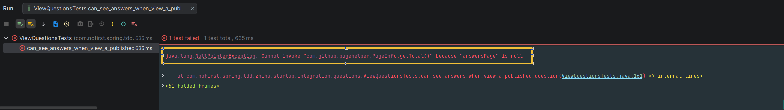

# 答案列表

本节我们开发答案列表功能，将提交的答案显示出来。

---

## 一、功能说明

### 1.1 答案列表功能

在查看问题详情时，应该显示该问题下的所有回答列表，支持分页显示。

### 1.2 开发目标

| 目标 | 说明 |
|------|------|
| 查看问题时显示答案列表 | 问题详情包含答案列表 |
| 支持分页 | 默认每页 20 条 |
| 答案数量正确 | 返回总记录数 |

---

## 二、创建测试

### 2.1 添加测试用例

首先新建测试：

*src/test/java/com/nofirst/spring/tdd/zhihu/startup/integration/questions/ViewQuestionsTests.java*

```java
@Test
@WithUserDetails(value = "John", userDetailsServiceBeanName = "customUserDetailsService")
void can_see_answers_when_view_a_published_question() throws Exception {
    // given：准备测试数据
    Question question = QuestionFactory.createPublishedQuestion();
    questionMapper.insert(question);
    List<Answer> answers = AnswerFactory.createAnswerBatch(40, question.getId());
    for (Answer answer : answers) {
        answerMapper.insert(answer);
    }

    // when：调用接口并获取返回结果
    String jsonResponse = this.mockMvc.perform(
                    get("/questions/{id}", question.getId())
                            .accept(MediaType.APPLICATION_JSON)
            )
            .andDo(print())
            .andExpect(status().isOk())
            .andReturn()
            .getResponse()
            .getContentAsString();

    // then：1. 解析 JSON 为 QuestionVo
    TypeReference<CommonResult<QuestionVo>> typeRef = new TypeReference<>() {
    };
    CommonResult<QuestionVo> commonResult = objectMapper.readValue(jsonResponse, typeRef);

    // then：2. 断言
    assertThat(commonResult.getCode()).isEqualTo(ResultCode.SUCCESS.getCode());
    QuestionVo questionVo = commonResult.getData();
    PageInfo<Answer> answersPage = questionVo.getAnswers();
    assertThat(answersPage.getTotal()).isEqualTo(40);
    assertThat(answersPage.getSize()).isEqualTo(20);
}
```

### 2.2 测试说明

| 步骤 | 说明 |
|------|------|
| `given` | 创建问题和 40 条答案 |
| `when` | 调用 `GET /questions/{id}` 接口 |
| `then` | 验证返回的答案列表总数为 40，每页 20 条 |

---

## 三、工厂方法

### 3.1 添加批量创建方法

*src/test/java/com/nofirst/spring/tdd/zhihu/startup/factory/AnswerFactory.java*

```java
public static List<Answer> createAnswerBatch(Integer times, Integer questionId) {
    List<Answer> answers = new ArrayList<>();
    for (int i = 0; i < times; i++) {
        answers.add(createAnswer(questionId));
    }

    return answers;
}
```

### 3.2 方法说明

| 方法 | 参数 | 返回 | 说明 |
|------|------|------|------|
| `createAnswerBatch()` | `times`: 数量，`questionId`: 问题 ID | 答案列表 | 批量创建答案 |

---

## 四、修改 QuestionVo

### 4.1 添加 answers 字段

*src/main/java/com/nofirst/spring/tdd/zhihu/startup/model/vo/QuestionVo.java*

```java
@Data
public class QuestionVo {

    private Integer id;

    private Integer userId;

    private String title;

    private String content;

    PageInfo<Answer> answers;
}
```

### 4.2 字段说明

| 字段 | 类型 | 说明 |
|------|------|------|
| `answers` | `PageInfo<Answer>` | 答案分页列表 |

### 4.3 PageInfo 说明

`PageInfo` 是 PageHelper 提供的分页对象，包含：

| 属性 | 说明 |
|------|------|
| `total` | 总记录数 |
| `size` | 每页大小 |
| `pageNum` | 当前页码 |
| `pages` | 总页数 |
| `list` | 当前页数据列表 |

---

## 五、运行测试

### 5.1 执行测试

运行测试：



---

## 六、实现业务逻辑

### 6.1 修改 Service

修改控制器，返回关联的答案列表：

*src/main/java/com/nofirst/spring/tdd/zhihu/startup/service/impl/QuestionServiceImpl.java*

```java
public class QuestionServiceImpl implements QuestionService {

    private QuestionMapper questionMapper;
    private AnswerService answerService;


    @Override
    public QuestionVo show(Integer id) {
        Question question = questionMapper.selectByPrimaryKey(id);
        if (Objects.isNull(question)) {
            throw new QuestionNotExistedException();
        }
        if (Objects.isNull(question.getPublishedAt())) {
            throw new QuestionNotPublishedException();
        }

        QuestionVo questionVo = new QuestionVo();
        questionVo.setId(question.getId());
        questionVo.setUserId(question.getUserId());
        questionVo.setTitle(question.getTitle());
        questionVo.setContent(question.getContent());
        questionVo.setAnswers(answerService.answers(question.getId(), 1, 20)); // 首次显示第一页，每页 20 个

        return questionVo;
    }
}
```

### 6.2 代码说明

正如以上代码所示，我们预期把显示答案列表的逻辑放到 `AnswerService` 中，但是现在还没有 `answers()` 方法。

---

## 七、添加 answers 方法

### 7.1 单元测试

让我们先从单元测试开始进行：

*src/test/java/com/nofirst/spring/tdd/zhihu/startup/unit/service/AnswerServiceImplTest.java*

```java
public class AnswerServiceImplTest {

    @InjectMocks
    private AnswerServiceImpl answerService;

    @Mock
    private AnswerMapper answerMapper;
    @Mock
    private AnswerMapperExt answerMapperExt;
    @Mock
    private QuestionMapper questionMapper;
    @Mock
    private QuestionMapperExt questionMapperExt;

    private Answer defaultAnswer;
    private AnswerDto defaultAnswerDto;
    private List<Answer> answers;

    @BeforeEach
    public void setup() {
        this.defaultAnswer = AnswerFactory.createAnswer(1);
        this.defaultAnswerDto = AnswerFactory.createAnswerDto();
        this.answers = AnswerFactory.createAnswerBatch(10, 1);
    }
    .
    .
    .
    @Test
    void a_question_has_many_answers() {
        // given
        given(answerMapperExt.selectByQuestionId(1)).willReturn(this.answers);

        // when
        PageInfo<Answer> answersPage = answerService.answers(1, 1, 20);

        // then
        assertThat(answersPage.getTotal()).isEqualTo(10);
        assertThat(answersPage.getSize()).isEqualTo(10);
    }
}
```

### 7.2 添加 Mapper

添加对应的 Mapper 和 XML 文件：

*src/main/java/com/nofirst/spring/tdd/zhihu/startup/mbg/mapper/AnswerMapperExt.java*

```java
public interface AnswerMapperExt {

    List<Answer> selectByQuestionId(Integer questionId);
}
```

### 7.3 XML 映射文件

*src/main/resources/mapper/AnswerMapperExt.xml*

```xml
<?xml version="1.0" encoding="UTF-8"?>
<!DOCTYPE mapper PUBLIC "-//mybatis.org//DTD Mapper 3.0//EN" "http://mybatis.org/dtd/mybatis-3-mapper.dtd">
<mapper namespace="com.nofirst.spring.tdd.zhihu.startup.mbg.mapper.AnswerMapperExt">

    <select id="selectByQuestionId"
            resultMap="com.nofirst.spring.tdd.zhihu.startup.mbg.mapper.AnswerMapper.BaseResultMap">
        select
        <include refid="com.nofirst.spring.tdd.zhihu.startup.mbg.mapper.AnswerMapper.Base_Column_List"/>
        from answer
        where question_id = #{questionId,jdbcType=INTEGER}
    </select>
</mapper>
```

### 7.4 实现 answers 方法

添加 `answers()` 方法：

*src/main/java/com/nofirst/zhihu/service/impl/AnswerServiceImpl.java*

```java
public class AnswerServiceImpl implements AnswerService {

    private final AnswerMapper answerMapper;
    private final AnswerMapperExt answerMapperExt;
    private final QuestionMapper questionMapper;
    private final QuestionMapperExt questionMapperExt;

    @Override
    public PageInfo<Answer> answers(Integer questionId, int pageIndex, int pageSize) {
        PageHelper.startPage(pageIndex, pageSize);
        List<Answer> answers = answerMapperExt.selectByQuestionId(questionId);
        return new PageInfo<>(answers);
    }
}
```

### 7.5 PageHelper 说明

| 方法 | 说明 |
|------|------|
| `PageHelper.startPage(pageIndex, pageSize)` | 开启分页，必须在查询之前调用 |
| `new PageInfo<>(list)` | 将查询结果包装为分页对象 |

---

## 八、运行测试

### 8.1 运行单元测试

运行单元测试：


### 8.2 运行集成测试

再运行集成测试 `can_see_answers_when_view_a_published_question`：


---

## 九、提交代码

最后，我们来提交一下代码：

```bash
$ git add .
$ git commit -m 'fetch question with answers'
```

---

## 十、总结

### 10.1 本节学习要点

| 要点 | 说明 |
|------|------|
| 关联查询 | 查看问题时同时返回答案列表 |
| 分页支持 | 使用 PageHelper 实现分页 |
| PageInfo | 返回分页对象包含总数和列表 |
| 扩展 Mapper | 使用 AnswerMapperExt 添加自定义查询 |

### 10.2 答案列表功能完成

| 功能 | 状态 |
|------|------|
| 查看问题时显示答案 | ✅ 完成 |
| 答案分页显示 | ✅ 完成 |
| 显示答案总数 | ✅ 完成 |

---

## 十一、下一步

答案列表功能已完成，请继续阅读：

1. [小结](./13.小结.md) - 本章总结

---

## 附录：PageHelper 使用

```java
// PageHelper 分页使用

// 1. 开启分页（必须在查询之前）
PageHelper.startPage(pageIndex, pageSize);

// 2. 执行查询
List<Answer> answers = answerMapperExt.selectByQuestionId(questionId);

// 3. 包装为分页对象
PageInfo<Answer> pageInfo = new PageInfo<>(answers);

// 4. 分页对象属性
pageInfo.getTotal();    // 总记录数
pageInfo.getSize();     // 每页大小
pageInfo.getPageNum();  // 当前页码
pageInfo.getPages();    // 总页数
pageInfo.getList();     // 当前页数据
```
