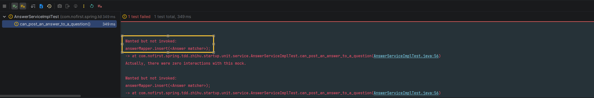
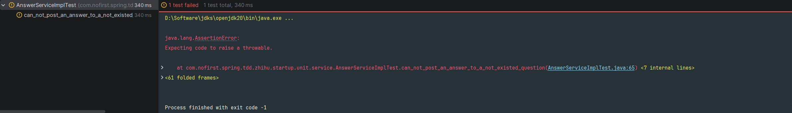
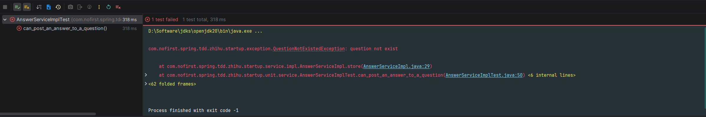
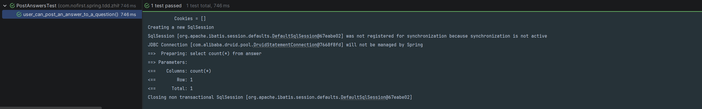

# 单元测试

本节我们来编写 Service 层的单元测试。

---

## 单元测试的作用

单元测试的作用是帮助你编写简洁无错的代码。单元测试是针对你的代码中非常少，而且相对独立的一部分代码来进行的测试。实际上，大部分单元测试都是针对单个方法进行的。

### 单元测试 vs 集成测试

| 特性 | 单元测试 | 集成测试 |
|------|---------|---------|
| 测试对象 | 单一方法/类 | 多个组件协作 |
| 运行速度 | 快（<1 秒） | 慢（10-30 秒） |
| 依赖处理 | Mock 隔离 | 真实依赖 |
| 启动环境 | 无 Spring 容器 | 完整 Spring 环境 |
| 用途 | 验证业务逻辑 | 验证端到端流程 |

### TDD 中的单元测试

编写单元测试时，按照程序员的方式思考：

1. 在终端里运行单元测试，看它们是如何失败的
2. 在编辑器中改动最少量的代码，让当前失败的测试通过
3. 然后不断重复

想保证编写的代码无误，每次改动的幅度就要尽量小。这么做才能确保每一部分代码都有对应的测试保驾护航。乍看起来工作量很大，但熟练后速度还是很快的。

---

## 添加单元测试

### 创建测试类

*src/test/java/com/nofirst/spring/tdd/zhihu/startup/unit/service/AnswerServiceImplTest.java*

```java
package com.nofirst.spring.tdd.zhihu.startup.unit.service;

import com.nofirst.spring.tdd.zhihu.startup.factory.AnswerFactory;
import com.nofirst.spring.tdd.zhihu.startup.factory.QuestionFactory;
import com.nofirst.spring.tdd.zhihu.startup.mbg.mapper.AnswerMapper;
import com.nofirst.spring.tdd.zhihu.startup.mbg.mapper.QuestionMapper;
import com.nofirst.spring.tdd.zhihu.startup.mbg.model.Answer;
import com.nofirst.spring.tdd.zhihu.startup.mbg.model.Question;
import com.nofirst.spring.tdd.zhihu.startup.model.dto.AnswerDto;
import org.junit.jupiter.api.BeforeEach;
import org.junit.jupiter.api.Test;
import org.junit.jupiter.api.extension.ExtendWith;
import org.mockito.InjectMocks;
import org.mockito.Mock;
import org.mockito.junit.jupiter.MockitoExtension;

import static org.mockito.ArgumentMatchers.argThat;
import static org.mockito.BDDMockito.given;
import static org.mockito.Mockito.times;
import static org.mockito.Mockito.verify;

@ExtendWith(MockitoExtension.class)
public class AnswerServiceImplTest {

    @InjectMocks
    private AnswerServiceImpl answerService;

    @Mock
    private AnswerMapper answerMapper;

    private Answer defaultAnswer;
    private AnswerDto defaultAnswerDto;

    @BeforeEach
    public void setup() {
        this.defaultAnswer = AnswerFactory.createAnswer(1);
        this.defaultAnswerDto = AnswerFactory.createAnswerDto();
    }

    @Test
    void can_post_an_answer_to_a_question() {
        // given

        // when
        answerService.store(1, this.defaultAnswerDto);

        // then
        verify(answerMapper, times(1)).insert(argThat(new AnswerMatcher(defaultAnswer)));
    }
}
```

### 代码解析

#### 类级别注解

```java
@ExtendWith(MockitoExtension.class)
public class AnswerServiceImplTest {
    // ...
}
```

| 注解 | 说明 |
|------|------|
| `@ExtendWith(MockitoExtension.class)` | 启用 Mockito 扩展，自动初始化 Mock 对象 |

#### 依赖注入

```java
@InjectMocks
private AnswerServiceImpl answerService;  // 被测对象

@Mock
private AnswerMapper answerMapper;  // Mock 对象
```

| 注解 | 说明 |
|------|------|
| `@Mock` | 创建 Mock 对象，模拟依赖行为 |
| `@InjectMocks` | 创建被测对象，并自动注入 Mock 依赖 |

#### 测试方法

```java
@Test
void can_post_an_answer_to_a_question() {
    // given

    // when
    answerService.store(1, this.defaultAnswerDto);

    // then
    verify(answerMapper, times(1)).insert(argThat(new AnswerMatcher(defaultAnswer)));
}
```

| 步骤 | 说明 |
|------|------|
| `given` | 暂无需准备（Mock 行为在需要时定义） |
| `when` | 调用 `answerService.store()` 方法 |
| `then` | 验证 `answerMapper.insert()` 被调用了 1 次 |

---

## 测试说明

### TDD 理念

对以上测试我们进行以下几点说明：

首先，我们本次单元测试的类是 `AnswerServiceImpl`，方法是 `store()`，尽管我们还没有建立对应的类跟方法，但是，**TDD 的理念就是在测试用例中先写出不存在的类跟方法，再根据测试用例的测试逻辑，写出正确的代码逻辑**。

### 工厂方法

接着，我们在 `AnswerFactory` 中添加了一个方法，用来产生一个 `Answer` 实例对象：

```java
public static Answer createAnswer(Integer questionId) {
    Date now = new Date();
    Answer answer = new Answer();
    answer.setId(1);
    answer.setQuestionId(questionId);
    answer.setUserId(1);
    answer.setCreatedAt(now);
    answer.setUpdatedAt(now);
    answer.setContent("this is an answer");

    return answer;
}
```

### 自定义 Matcher

最后需要说明的是，此处我们验证单元测试通过的方式，是验证 `answerMapper#insert()` 方法被调用了 1 次，并且对象是 `defaultAnswer`（这里是通过 `AnswerMatcher()` 对象来进行参数匹配，因为在实际的方法调用中，最终的 `Answer` 对象实例肯定不是 `defaultAnswer`。但是通过自定义 matcher 的方式，我们可以认为调用参数就是 `defaultAnswer`）。

*src/test/java/com/nofirst/spring/tdd/zhihu/startup/matcher/AnswerMatcher.java*

```java
package com.nofirst.spring.tdd.zhihu.startup.matcher;

import com.nofirst.spring.tdd.zhihu.startup.mbg.model.Answer;
import org.mockito.ArgumentMatcher;

public class AnswerMatcher implements ArgumentMatcher<Answer> {

    private Answer left;

    public AnswerMatcher(Answer left) {
        this.left = left;
    }

    @Override
    public boolean matches(Answer right) {
        return left.getQuestionId().equals(right.getQuestionId()) &&
                left.getContent().equals(right.getContent()) &&
                left.getUserId().equals(right.getUserId());
    }
}
```

> 💡 **提示**：还可以通过自定义 matcher 的方式来进行测试，特别注意，有多个参数时，每个参数都需要 mock，如 `eq(1L)`
>
> ```java
> verify(answerService, times(1)).store(eq(1L), argThat(new AnswerMatcher(answer)));
> ```

---

## 创建 Service 层

### 创建接口和实现类

铺垫了这么久，总算可以进行下一步了。现在编辑器提示我们，`AnswerServiceImpl` 类还不存在。接下来建立对应的接口和类：

*src/main/java/com/nofirst/spring/tdd/zhihu/startup/service/AnswerService.java*

```java
package com.nofirst.spring.tdd.zhihu.startup.service;


import com.nofirst.spring.tdd.zhihu.startup.model.dto.AnswerDto;

public interface AnswerService {

    void store(Integer questionId, AnswerDto answerDto);
}
```

*src/main/java/com/nofirst/spring/tdd/zhihu/startup/service/impl/AnswerServiceImpl.java*

```java
package com.nofirst.spring.tdd.zhihu.startup.service.impl;


import com.nofirst.spring.tdd.zhihu.startup.exception.QuestionNotExistedException;
import com.nofirst.spring.tdd.zhihu.startup.mbg.mapper.AnswerMapper;
import com.nofirst.spring.tdd.zhihu.startup.mbg.mapper.QuestionMapper;
import com.nofirst.spring.tdd.zhihu.startup.mbg.model.Answer;
import com.nofirst.spring.tdd.zhihu.startup.mbg.model.Question;
import com.nofirst.spring.tdd.zhihu.startup.model.dto.AnswerDto;
import com.nofirst.spring.tdd.zhihu.startup.service.AnswerService;
import lombok.AllArgsConstructor;
import org.springframework.stereotype.Service;

import java.util.Date;
import java.util.Objects;

@Service
@AllArgsConstructor
public class AnswerServiceImpl implements AnswerService {

    private final AnswerMapper answerMapper;
    private final QuestionMapper questionMapper;


    @Override
    public void store(Integer questionId, AnswerDto answerDto) {
        // do nothing
    }
}
```

### 运行单元测试

可以看到，我们只实现了空方法，接下来运行测试：



测试中清楚地显示，我们没有调用到 `answerMapper.insert(<Answer matcher>)` 方法。

### 实现业务逻辑

下面我们补充完整逻辑：

```java
public void store(Integer questionId, AnswerDto answerDto) {
    Date now = new Date();
    Answer answer = new Answer();
    answer.setQuestionId(questionId);
    // todo:此时我们还没有引入用户登录的概念，暂且先 hard code
    answer.setUserId(1);
    answer.setCreatedAt(now);
    answer.setUpdatedAt(now);
    answer.setContent(answerDto.getContent());

    answerMapper.insert(answer);
}
```

接下来运行测试，会发现测试已经通过了。

---

## 添加异常测试

### 编写异常测试用例

通常情况下，对一个具体的 `question` 进行回答问题的操作，一般会去验证一下该 `question` 是否存在。我们预期在 `question` 不存在时，抛出一个异常。

仍然先从测试开始：

```java
@Test
void can_not_post_an_answer_to_a_not_existed_question() {
    // given
    given(questionMapper.selectByPrimaryKey(1)).willReturn(null);

    // then
    assertThatThrownBy(() -> {
        // when
        answerService.store(1, this.defaultAnswerDto);
    }).isInstanceOf(QuestionNotExistedException.class)
            .hasMessageStartingWith("question not exist");
}
```

### 运行测试

运行测试：



### 补齐逻辑

```java
public void store(Integer questionId, AnswerDto answerDto) {
    Question question = questionMapper.selectByPrimaryKey(questionId);
    if (Objects.isNull(question)) {
        throw new QuestionNotExistedException();
    }
    Date now = new Date();
    Answer answer = new Answer();
    answer.setQuestionId(questionId);
    answer.setUserId(1);
    answer.setCreatedAt(now);
    answer.setUpdatedAt(now);
    answer.setContent(answerDto.getContent());

    answerMapper.insert(answer);
}
```

### 修复单元测试

但是当我们重新运行 `can_post_an_answer_to_a_question()` 测试时，你会发现：



因为我们在新的逻辑里面增加了 `questionMapper` 的调用，但是却没有进行打桩。我们对测试进行修复：

```java
void can_post_an_answer_to_a_question() {
    // given
    Question question = QuestionFactory.createQuestion();
    question.setId(1);
    given(questionMapper.selectByPrimaryKey(question.getId())).willReturn(question);
    // when
    answerService.store(1, this.defaultAnswerDto);

    // then
    verify(answerMapper, times(1)).insert(argThat(new AnswerMatcher(defaultAnswer)));
}
```

重新运行测试，测试通过。

---

## 完善 Controller

别忘了，我们的集成测试还未通过呢。下面我们完善 controller 里面的逻辑：

```java
public class AnswerController {

    private AnswerService answerService;

    @PostMapping("/questions/{questionId}/answers")
    public CommonResult<String> store(@PathVariable Integer questionId, @RequestBody AnswerDto answerDto) {
        answerService.store(questionId, answerDto);
        return CommonResult.success("success");
    }
}
```

运行 `user_can_post_an_answer_to_a_question()` 集成测试：



---

## 总结

### 本节学习要点

| 要点 | 说明 |
|------|------|
| 单元测试 | 使用 Mockito 隔离依赖，测试 Service 层逻辑 |
| 自定义 Matcher | 验证复杂对象的参数匹配 |
| 异常测试 | 使用 `assertThatThrownBy` 验证异常抛出 |
| Mock 打桩 | 使用 `given().willReturn()` 定义 Mock 行为 |
| 验证调用 | 使用 `verify().times()` 验证方法调用次数 |

### 单元测试优势

| 优势 | 说明 |
|------|------|
| 快速反馈 | 运行速度快，及时发现问题 |
| 隔离测试 | 使用 Mock 隔离外部依赖 |
| 覆盖边界 | 容易测试各种边界条件 |
| 重构信心 | 测试通过后，重构有保护网 |

---

## 下一步

单元测试已完成，请继续阅读：

1. [问题的发布属性](./3.问题的发布属性.md) - 添加发布状态控制
2. [代码重构](./4.代码重构.md) - 优化工厂类

---

## 附录：常用 Mockito 方法

| 方法 | 说明 | 示例 |
|------|------|------|
| `given().willReturn()` | 定义 Mock 返回值 | `given(mock.get(1)).willReturn(obj)` |
| `given().willThrow()` | 定义 Mock 抛异常 | `given(mock.get(1)).willThrow(new Exception())` |
| `verify()` | 验证方法调用 | `verify(mock).get(1)` |
| `verify(times)` | 验证调用次数 | `verify(mock, times(2)).get(1)` |
| `verifyNever()` | 验证从未调用 | `verify(mock, never()).get(1)` |
| `argThat()` | 自定义参数匹配 | `verify(mock).insert(argThat(matcher))` |
