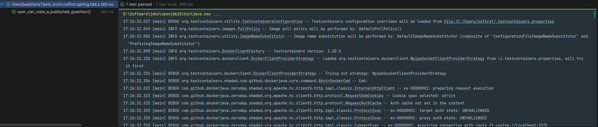
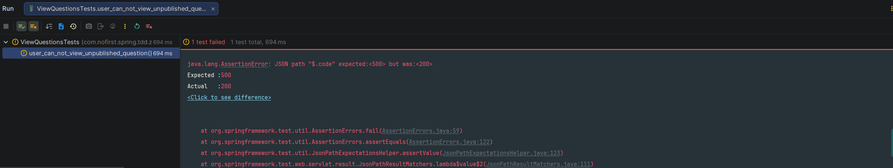
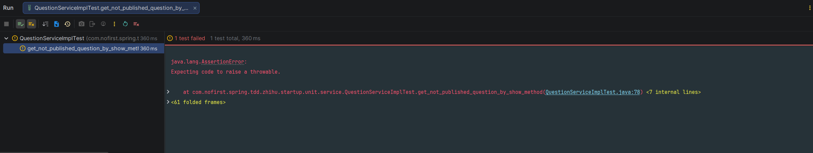

# 问题的发布属性

本节我们给 `Question` 问题模型添加一个是否发布的属性，并且用户只能浏览跟回答已发布的问题，而不能对未发布的问题进行操作。

---

## 一、功能说明

### 1.1 为什么要添加发布属性？

在实际的问答产品中，问题创建后通常需要审核或确认后才能公开显示。通过 `published_at` 字段，我们可以：

| 场景 | 说明 |
|------|------|
| 问题草稿 | 创建问题但未发布，`published_at` 为 null |
| 已发布问题 | 问题已公开，`published_at` 有值 |
| 控制访问 | 用户只能查看和回答已发布的问题 |

### 1.2 开发目标

| 目标 | 说明 |
|------|------|
| 添加 `published_at` 字段 | 记录问题发布时间 |
| 只能查看已发布问题 | 未发布问题返回错误 |
| 只能回答已发布问题 | 未发布问题不能回答 |

---

## 二、修改测试

### 2.1 重命名测试方法

首先我们需要修改测试文件，修改测试方法：

*src/test/java/com/nofirst/spring/tdd/zhihu/startup/integration/questions/ViewQuestionsTests.java*

```java
@TestInstance(TestInstance.Lifecycle.PER_CLASS)
public class ViewQuestionsTests extends BaseContainerTest {
    .
    .
    .

    @Test
    void user_can_view_questions() throws Exception {
        .
        .
        .
    }

    @Test
    void user_can_view_a_published_question() throws Exception {
        // given：准备测试数据
        Question question = QuestionFactory.createQuestion();
        Date lastWeek = DateUtils.addWeeks(new Date(), -1);
        question.setPublishedAt(lastWeek);
        questionMapper.insert(question);

        // when：调用接口并获取返回结果
        String jsonResponse = this.mockMvc.perform(
                        get("/questions/{id}", question.getId())
                                .accept(MediaType.APPLICATION_JSON)
                )
                .andDo(print())
                .andExpect(status().isOk())
                .andReturn()
                .getResponse()
                .getContentAsString();

        // then：1. 解析 JSON 为 QuestionVo，用 TypeReference 解决泛型擦除问题
        TypeReference<CommonResult<QuestionVo>> typeRef = new TypeReference<>() {
        };
        CommonResult<QuestionVo> commonResult = objectMapper.readValue(jsonResponse, typeRef);

        // then：2. 断言 QuestionVo 的核心字段
        assertThat(commonResult.getCode()).isEqualTo(ResultCode.SUCCESS.getCode());

        QuestionVo questionVo = commonResult.getData();
        assertThat(questionVo.getId()).isEqualTo(question.getId());
        assertThat(questionVo.getUserId()).isEqualTo(question.getUserId());
        assertThat(questionVo.getTitle()).isEqualTo(question.getTitle());
        assertThat(questionVo.getContent()).isEqualTo(question.getContent());
    }

}
```

### 2.2 测试说明

| 变化 | 说明 |
|------|------|
| 方法名 | `user_can_view_a_single_question` → `user_can_view_a_published_question` |
| 测试数据 | 添加了 `published_at` 字段（一周前） |
| 响应解析 | 使用 `TypeReference` 解决泛型擦除问题 |

---

## 三、添加数据库字段

### 3.1 创建迁移脚本

此时，我们还没有添加 `publishedAt` 属性，因此我们先添加字段，再重新生成 `question` 相关模型文件。

添加字段：

*src/main/resources/db/migration/V20260212__alter_table_question.sql*

```sql
alter table question
    add published_at timestamp null;
```

### 3.2 运行迁移

运行 Maven 的 `flyway` 插件的 `flyway:migrate` 命令执行迁移：

```bash
mvn flyway:migrate
```

修改 `generatorConfig.xml` 的配置，重新生成 `question` 表对应的模型文件：

```bash
mvn mybatis-generator:generate
```

### 3.3 运行测试

运行测试：



测试通过！

---

## 四、新增测试：不能浏览未发布的问题

### 4.1 添加测试用例

测试通过，但是，一般而言，我们还需要另一个对应测试，来完善我们的测试逻辑，那就是：**不能浏览未发布的问题**。

所以我们新建测试：

```java
@Test
void user_can_not_view_unpublished_question() throws Exception {
    // given：准备测试数据
    Question question = QuestionFactory.createQuestion();
    question.setPublishedAt(null);
    questionMapper.insert(question);

    // when:
    this.mockMvc.perform(get("/questions/{id}", question.getId()))
            // then:
            .andExpect(status().isOk())
            .andExpect(jsonPath("$.code").value(ResultCode.FAILED.getCode()))
            .andExpect(jsonPath("$.message").value("question not publish"));
}
```

### 4.2 运行测试

运行该测试：



我们的测试未通过，我们需要修改 `QuestionService#show()` 方法。

---

## 五、编写单元测试

### 5.1 添加单元测试用例

别忘了，我们已经给该方法添加过单元测试，现在我们想对该方法的逻辑进行修改，我们需要先编写单元测试用例：

*src/test/java/com/nofirst/spring/tdd/zhihu/startup/unit/service/QuestionServiceImplTest.java*

```java
@ExtendWith(MockitoExtension.class)
class QuestionServiceImplTest {

    @InjectMocks
    private QuestionServiceImpl questionService;

    @Mock
    private QuestionMapper questionMapper;

    private Question question;

    @BeforeEach
    public void setup() {
        question = QuestionFactory.createQuestion();
        Date lastWeek = DateUtils.addWeeks(new Date(), -1);
        question.setPublishedAt(lastWeek);
    }
    .
    .
    .
    @Test
    void get_not_published_question_by_show_method() {
        // given
        this.question.setPublishedAt(null);
        given(questionMapper.selectByPrimaryKey(1)).willReturn(this.question);

        // then
        assertThatThrownBy(() -> {
            // when
            questionService.show(1);
        }).isInstanceOf(QuestionNotPublishedException.class)
                .hasMessageStartingWith("question not publish");
    }
}
```

### 5.2 创建异常类

添加 `QuestionNotPublishedException`：

*src/main/java/com/nofirst/spring/tdd/zhihu/startup/exception/QuestionNotPublishedException.java*

```java
package com.nofirst.spring.tdd.zhihu.startup.exception;

import com.nofirst.spring.tdd.zhihu.startup.common.ResultCode;

public class QuestionNotPublishedException extends ApiException {

    public QuestionNotPublishedException() {
        super(ResultCode.FAILED, "question not publish");
    }
}
```

### 5.3 运行单元测试

运行单元测试：



### 5.4 实现业务逻辑

添加逻辑：

*src/main/java/com/nofirst/spring/tdd/zhihu/startup/service/impl/QuestionServiceImpl.java*

```java
@Override
public QuestionVo show(Integer id) {
    Question question = questionMapper.selectByPrimaryKey(id);
    if (Objects.isNull(question)) {
        throw new QuestionNotExistedException();
    }
    if (Objects.isNull(question.getPublishedAt())) {
        throw new QuestionNotPublishedException();
    }

    QuestionVo questionVo = new QuestionVo();
    questionVo.setId(question.getId());
    questionVo.setUserId(question.getUserId());
    questionVo.setTitle(question.getTitle());
    questionVo.setContent(question.getContent());

    return questionVo;
}
```

### 5.5 运行测试

运行单元测试即可通过，幸运地是，运行集成测试 `user_can_not_view_unpublished_question` 也通过了！

---

## 六、测试覆盖情况

### 6.1 测试用例总结

| 测试用例 | 测试场景 | 预期结果 |
|---------|---------|---------|
| `user_can_view_a_published_question` | 查看已发布问题 | 返回 200，问题数据正确 |
| `user_can_not_view_unpublished_question` | 查看未发布问题 | 返回失败，提示"question not publish" |

### 6.2 业务逻辑总结

```java
public QuestionVo show(Integer id) {
    Question question = questionMapper.selectByPrimaryKey(id);
    
    // 1. 检查问题是否存在
    if (Objects.isNull(question)) {
        throw new QuestionNotExistedException();
    }
    
    // 2. 检查问题是否已发布
    if (Objects.isNull(question.getPublishedAt())) {
        throw new QuestionNotPublishedException();
    }
    
    // 3. 返回问题数据
    QuestionVo questionVo = new QuestionVo();
    // ...
}
```

---

## 七、提交代码

最后，我们提交一下代码：

```bash
$ git add .
$ git commit -m 'question published_at attribute'
```

---

## 八、下一步

发布属性已添加，请继续阅读：

1. [代码重构](./4.代码重构.md) - 优化工厂类
2. [回答问题](./5.回答问题.md) - 修改回答逻辑支持发布状态

---

## 附录：DateUtils 使用

```java
// 添加一周
Date lastWeek = DateUtils.addWeeks(new Date(), -1);

// 添加一天
Date tomorrow = DateUtils.addDays(new Date(), 1);

// 添加一小时
Date oneHourLater = DateUtils.addHours(new Date(), 1);
```
