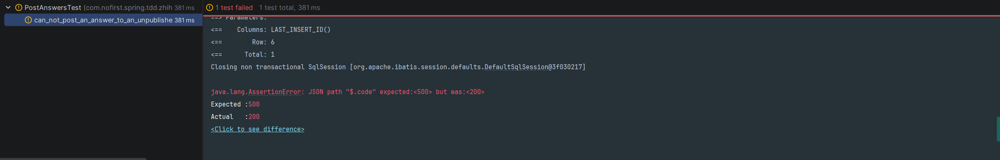
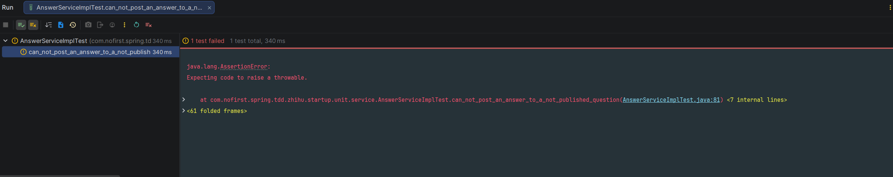

# 回答问题

之前的章节我们给问题模型定义了一个 `published_at` 属性，本节我们来修改下提交回答的逻辑。

---

## 一、功能说明

### 1.1 背景

在添加了问题的发布属性后，我们需要确保用户只能对**已发布的问题**进行回答。

### 1.2 开发目标

| 目标 | 说明 |
|------|------|
| 只能回答已发布问题 | 对未发布问题回答应返回错误 |
| 重命名测试 | 测试名应反映测试场景 |
| 添加新测试 | 测试未发布问题的回答限制 |

---

## 二、重命名测试

### 2.1 修改测试方法

首先，我们重命名 `user_can_post_an_answer_to_a_question()` 测试为 `user_can_post_an_answer_to_a_published_question`，并做一些修改：

```java
@Test
void user_can_post_an_answer_to_a_published_question() throws Exception {
    // given：准备测试数据
    Question question = QuestionFactory.createPublishedQuestion();
    questionMapper.insert(question);
    AnswerExample answerExample = new AnswerExample();
    long beforeCount = answerMapper.countByExample(answerExample);
    assertThat(beforeCount).isEqualTo(0);

    // when：调用接口并获取返回结果
    AnswerDto answer = AnswerFactory.createAnswerDto();
    this.mockMvc.perform(post("/questions/{id}/answers", question.getId())
                    .contentType(MediaType.APPLICATION_JSON)
                    .content(JSONUtil.toJsonStr(answer))
            )
            .andDo(print())
            .andExpect(status().isOk())
            .andExpect(jsonPath("$.code").value(ResultCode.SUCCESS.getCode()));

    // then：数据库中 answer 数据增加了一条
    long afterCount = answerMapper.countByExample(answerExample);
    assertThat(afterCount).isEqualTo(1);
}
```

### 2.2 测试说明

| 变化 | 说明 |
|------|------|
| 方法名 | `user_can_post_an_answer_to_a_question` → `user_can_post_an_answer_to_a_published_question` |
| 测试数据 | 使用 `createPublishedQuestion()` 创建已发布问题 |
| 测试意图 | 更清晰地表达测试场景 |

### 2.3 运行测试

运行测试以保证测试通过。

---

## 三、新增测试

### 3.1 添加测试用例

接下来我们新加一个测试：

*src/test/java/com/nofirst/spring/tdd/zhihu/startup/integration/PostAnswersTest.java*

```java
@Test
void can_not_post_an_answer_to_an_unpublished_question() throws Exception {
    // given：准备测试数据
    Question question = QuestionFactory.createUnpublishedQuestion();
    questionMapper.insert(question);

    // when:
    AnswerDto answer = AnswerFactory.createAnswerDto();
    this.mockMvc.perform(post("/questions/{id}/answers", question.getId())
                    .contentType(MediaType.APPLICATION_JSON)
                    .content(JSONUtil.toJsonStr(answer))
            )
            // then:
            .andExpect(status().isOk())
            .andExpect(jsonPath("$.code").value(ResultCode.FAILED.getCode()))
            .andExpect(jsonPath("$.message").value("question not publish"));
}
```

### 3.2 运行测试

运行测试：



我们收到了 `200` 的响应，说明尽管当前问题没有发布，仍然能够提交回答。这是逻辑漏洞，我们来修复它。

---

## 四、修复逻辑

### 4.1 先写单元测试

依旧先从单元测试开始：

*src/test/java/com/nofirst/spring/tdd/zhihu/startup/unit/service/AnswerServiceImplTest.java*

```java
@Test
void can_not_post_an_answer_to_a_not_published_question() {
    // given
    Question question = QuestionFactory.createUnpublishedQuestion();
    question.setId(1);
    given(questionMapper.selectByPrimaryKey(question.getId())).willReturn(question);

    // then
    assertThatThrownBy(() -> {
        // when
        answerService.store(1, this.defaultAnswerDto);
    }).isInstanceOf(QuestionNotPublishedException.class)
            .hasMessageStartingWith("question not exist");
}
```

### 4.2 运行单元测试

运行测试：



### 4.3 实现业务逻辑

进行逻辑修复：

*src/main/java/com/nofirst/spring/tdd/zhihu/startup/service/impl/AnswerServiceImpl.java*

```java
@Override
public void store(Integer questionId, AnswerDto answerDto) {
    Question question = questionMapper.selectByPrimaryKey(questionId);
    if (Objects.isNull(question)) {
        throw new QuestionNotExistedException();
    }
    if (Objects.isNull(question.getPublishedAt())) {
        throw new QuestionNotPublishedException();
    }
    Date now = new Date();
    Answer answer = new Answer();
    answer.setQuestionId(questionId);
    answer.setUserId(1);
    answer.setCreatedAt(now);
    answer.setUpdatedAt(now);
    answer.setContent(answerDto.getContent());

    answerMapper.insert(answer);
}
```

### 4.4 运行测试

再次运行测试，单元测试已经通过。运行集成测试，也已通过，great！

---

## 五、测试覆盖情况

### 5.1 测试用例总结

| 测试用例 | 测试场景 | 预期结果 |
|---------|---------|---------|
| `user_can_post_an_answer_to_a_published_question` | 回答已发布问题 | 成功，返回 200 |
| `can_not_post_an_answer_to_an_unpublished_question` | 回答未发布问题 | 失败，提示"question not publish" |

### 5.2 业务逻辑总结

```java
public void store(Integer questionId, AnswerDto answerDto) {
    Question question = questionMapper.selectByPrimaryKey(questionId);
    
    // 1. 检查问题是否存在
    if (Objects.isNull(question)) {
        throw new QuestionNotExistedException();
    }
    
    // 2. 检查问题是否已发布
    if (Objects.isNull(question.getPublishedAt())) {
        throw new QuestionNotPublishedException();
    }
    
    // 3. 创建回答
    Answer answer = new Answer();
    answer.setQuestionId(questionId);
    answer.setUserId(1);  // TODO: 后续改为当前登录用户
    answer.setCreatedAt(now);
    answer.setUpdatedAt(now);
    answer.setContent(answerDto.getContent());

    answerMapper.insert(answer);
}
```

---

## 六、提交代码

最后，我们来提交代码：

```bash
$ git add .
$ git commit -m 'post answer'
```

---

## 七、下一步

回答功能已完成，但还有改进空间。请继续阅读：

1. [表单验证](./6.表单验证.md) - 添加表单验证
2. [权限控制](./7.权限控制.md) - 实现用户认证

---

## 附录：异常类型总结

| 异常 | 触发条件 | 消息 |
|------|---------|------|
| `QuestionNotExistedException` | 问题不存在 | "question not exist" |
| `QuestionNotPublishedException` | 问题未发布 | "question not publish" |
