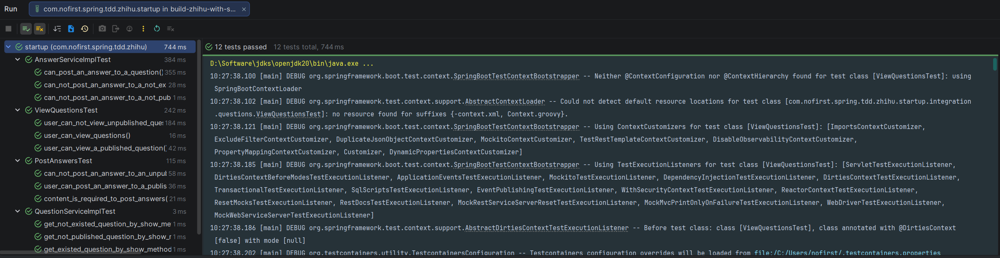

## 说明

本节我们关注表单验证的问题。

## 新增测试

现在我们的提交答案的功能完成了，但是并不完善。`web` 开发有一个安全原则：

> 永远不要相信用户的输入

因为你无法甄别善意客户与恶意客户，所以我们要对请求进行校验。目前我们提交的参数有两个：`user_id`和`content`。首先我们来校验`content`参数必填，依旧是从测试开始：

*src/test/java/com/nofirst/spring/tdd/zhihu/startup/integration/answers/PostAnswersTest.java*

```java
    .
    .
    .
    @Test
    @WithUserDetails(value = "John", userDetailsServiceBeanName = "customUserDetailsService")
    void content_is_required_to_post_answers() throws Exception {
        // given
        Question question = QuestionFactory.createPublishedQuestion();
        questionMapper.insert(question);
        AnswerDto answerDto = AnswerFactory.createAnswerDto();
        answerDto.setContent("");

        // when
        this.mockMvc.perform(post("/questions/{id}/answers", question.getId())
                        .contentType(MediaType.APPLICATION_JSON)
                        .content(objectMapper.writeValueAsString(answerDto))
                )
                // then
                .andExpect(status().isOk())
                .andExpect(jsonPath("$.code").value(ResultCode.VALIDATE_FAILED.getCode()))
                .andExpect(jsonPath("$.message").value("答案内容不能为空"));
    }
}
```

运行测试：


可以看到，我们期望得到400的响应，实际上却成功了。

## 完善逻辑

我们使用`Validation`框架进行校验。

首先加上校验逻辑：

```java
package com.nofirst.spring.tdd.zhihu.startup.model.dto;

import jakarta.validation.constraints.NotBlank;
import lombok.Data;

@Data
public class AnswerDto {

    @NotBlank(message = "答案内容不能为空")
    private String content;
}
```

然后在controller层使校验逻辑生效：

*src/main/java/com/nofirst/spring/tdd/zhihu/startup/controller/AnswerController.java*

``` java
package com.nofirst.spring.tdd.zhihu.startup.controller;

import com.nofirst.spring.tdd.zhihu.startup.common.CommonResult;
import com.nofirst.spring.tdd.zhihu.startup.model.dto.AnswerDto;
import com.nofirst.spring.tdd.zhihu.startup.service.AnswerService;
import lombok.AllArgsConstructor;
import org.springframework.validation.annotation.Validated;
import org.springframework.web.bind.annotation.PathVariable;
import org.springframework.web.bind.annotation.PostMapping;
import org.springframework.web.bind.annotation.RequestBody;
import org.springframework.web.bind.annotation.RestController;

@RestController
@AllArgsConstructor
public class AnswerController {

    private AnswerService answerService;

    @PostMapping("/questions/{questionId}/answers")
    public CommonResult<String> store(@PathVariable Integer questionId, @RequestBody @Validated // 注意此处 AnswerDto answerDto) {
        answerService.store(questionId, answerDto);
        return CommonResult.success("success");
    }
}
```

再次运行测试：


## 功能重构

测试通过，接下来我们该处理`user_id` 的问题了。当前我们提交回答的时候，会指定`user_id`为1，这当然是不对的。通常来说我们应该是限定当前登录用户才能进行提交回答，所以我们需要修改我们的业务代码。当我们准备修改代码时，首先要做的事情是，运行全部测试：




现在所有的测试都是通过的，接下来我们将 `user_can_post_an_answer_to_a_published_question()` 测试重命名为`signed_in_user_can_post_an_answer_to_a_published_question`，并进行一些逻辑修改：

*src/test/java/com/nofirst/spring/tdd/zhihu/startup/integration/answers/PostAnswersTest.java*

```java
    .
    .
    .
	@Test
	// 这个注解会尝试在SpringSecurity上下文中注入一个username为 John 的用户
    @WithUserDetails(value = "John", userDetailsServiceBeanName = "customUserDetailsService")
	void signed_in_user_can_post_an_answer_to_a_published_question() throws Exception {
        // given：准备测试数据
        Question question = QuestionFactory.createPublishedQuestion();
        questionMapper.insert(question);
        AnswerExample answerExample = new AnswerExample();
        AnswerExample.Criteria criteria = answerExample.createCriteria();
        // John 用户的userId就是2
        criteria.andUserIdEqualTo(2);
        long beforeCount = answerMapper.countByExample(answerExample);
        assertThat(beforeCount).isEqualTo(0);

        // when：调用接口并获取返回结果
        AnswerDto answer = AnswerFactory.createAnswerDto();
        this.mockMvc.perform(post("/questions/{id}/answers", question.getId())
                        .contentType(MediaType.APPLICATION_JSON)
                        .content(objectMapper.writeValueAsString(answer))
                )
                .andDo(print())
                .andExpect(status().isOk())
                .andExpect(jsonPath("$.code").value(ResultCode.SUCCESS.getCode()));

        // then：数据库中answer数据增加了一条
        long afterCount = answerMapper.countByExample(answerExample);
        assertThat(afterCount).isEqualTo(1);
    }
    .
    .
    .
```


运行测试：


原因也很简单，在之前的代码中，我们写死了`user_id`是1。现在我们进行修复。首先我们获取到当前用户：

*src/main/java/com/nofirst/spring/tdd/zhihu/startup/controller/AnswerController.java*

```java
@RestController
@AllArgsConstructor
public class AnswerController {

    private AnswerService answerService;

    @PostMapping("/questions/{questionId}/answers")
    public CommonResult<String> store(@PathVariable Integer questionId,
                                      @RequestBody @Validated AnswerDto answerDto,
                                      @AuthenticationPrincipal AccountUser accountUser // 注意此处) {
        answerService.store(questionId, answerDto, accountUser // 注意此处，要修改方法签名);
        return CommonResult.success("success");
    }
}
```

接着将`user_id`入库：

*src/main/java/com/nofirst/spring/tdd/zhihu/startup/service/impl/AnswerServiceImpl.java*

```java
	@Override
    public void store(Integer questionId, AnswerDto answerDto, AccountUser accountUser // 注意此处) {
        Question question = questionMapper.selectByPrimaryKey(questionId);
        if (Objects.isNull(question)) {
            throw new QuestionNotExistedException();
        }
        if (Objects.isNull(question.getPublishedAt())) {
            throw new QuestionNotPublishedException();
        }
        Date now = new Date();
        Answer answer = new Answer();
        answer.setQuestionId(questionId);
        answer.setUserId(accountUser.getUserId() // 注意此处);
        answer.setCreatedAt(now);
        answer.setUpdatedAt(now);
        answer.setContent(answerDto.getContent());

        answerMapper.insert(answer);
    }
```

> 注意：由于我们修改了`store()`方法的方法签名，因此有几个单元测试会失败，你需要自己使用`AccountUser accountUser = new AccountUser(1, "password", "username")`构造出`store()`方法的第三个参数，并传递到其中。

重新运行测试：


测试通过！一般而言，当我们某个测试是测试登录用户的某个行为时，通常会有一个相对应的测试：测试未登录用户不能进行该行为。

依旧从新增测试开始：

*src/test/java/com/nofirst/spring/tdd/zhihu/startup/integration/answers/PostAnswersTest.java*

```java
	.
	.
	.
	@BeforeEach
    public void setupTestData() {
        QuestionExample questionExample = new QuestionExample();
        // 空条件，匹配所有数据，等价于delete * from question
        questionExample.createCriteria();
        questionMapper.deleteByExample(questionExample);

        AnswerExample answerExample = new AnswerExample();
        // 空条件，匹配所有数据，等价于delete * from answer
        answerExample.createCriteria();
        answerMapper.deleteByExample(answerExample);
    }

    @Test
    void guests_may_not_post_an_answer() throws Exception {
        // given
        Question question = QuestionFactory.createPublishedQuestion();
        question.setId(1);

        AnswerDto answer = AnswerFactory.createAnswerDto();
        this.mockMvc.perform(post("/questions/{id}/answers", question.getId())
                        .contentType(MediaType.APPLICATION_JSON)
                        .content(objectMapper.writeValueAsString(answer))
                )
                .andDo(print())
                .andExpect(status().is(401));
    }
    .
    .
    .
```

运行测试，测试通过：


## 提交代码

运行一下全部的测试，以保证功能正常。最后，我们提交一下代码：

```
$ git add .
$ git commit -m 'post answer validation'
```