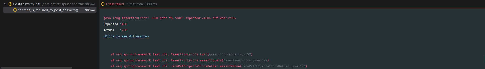
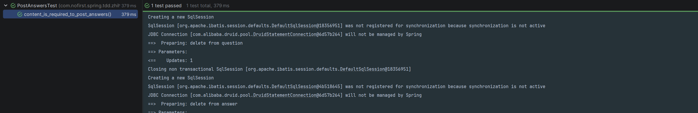
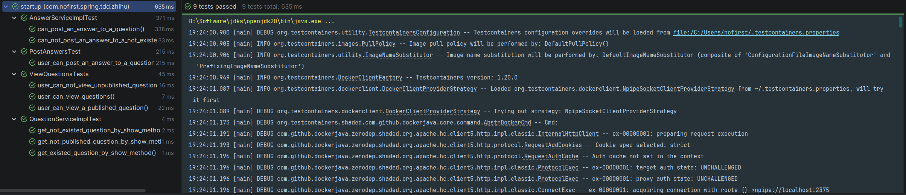
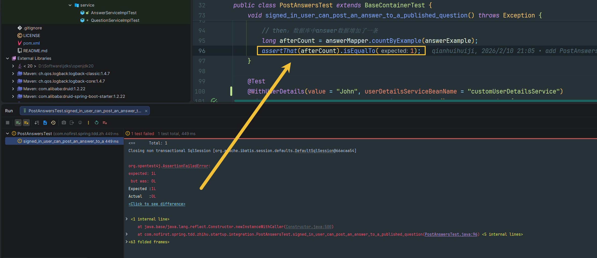
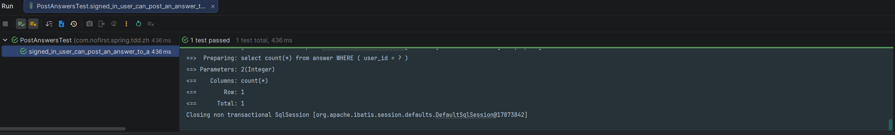

# 表单验证

本节我们关注表单验证的问题。

---

## 安全原则

### Web 开发安全原则

现在我们的提交答案的功能完成了，但是并不完善。`web` 开发有一个安全原则：

> ⚠️ **永远不要相信用户的输入**

因为你无法甄别善意客户与恶意客户，所以我们要对请求进行校验。

### 验证目标

目前我们提交的参数有：`content`（回答内容）。我们需要验证：

| 参数 | 验证规则 | 说明 |
|------|---------|------|
| `content` | 必填 | 回答内容不能为空 |

> 💡 **提示**：`user_id` 参数将在后续章节改为从当前登录用户获取。

---

## 新增测试

### 添加测试用例

首先我们来校验 `content` 参数必填，依旧是从测试开始：

*src/test/java/com/nofirst/spring/tdd/zhihu/startup/integration/PostAnswersTest.java*

```java
@Test
void content_is_required_to_post_answers() throws Exception {
    // given
    Question question = QuestionFactory.createPublishedQuestion();
    questionMapper.insert(question);
    AnswerDto answerDto = AnswerFactory.createAnswerDto();
    answerDto.setContent("");

    // when
    this.mockMvc.perform(post("/questions/{id}/answers", question.getId())
                    .contentType(MediaType.APPLICATION_JSON)
                    .content(objectMapper.writeValueAsString(answerDto))
            )
            // then
            .andExpect(status().isOk())
            .andExpect(jsonPath("$.code").value(ResultCode.VALIDATE_FAILED.getCode()))
            .andExpect(jsonPath("$.message").value("答案内容不能为空"));
}
```

### 测试说明

| 步骤 | 说明 |
|------|------|
| `given` | 准备已发布问题，创建内容为空的 AnswerDto |
| `when` | 调用接口提交空内容的回答 |
| `then` | 验证返回验证失败，提示"答案内容不能为空" |

### 运行测试

运行测试：



可以看到，我们期望得到验证失败的响应，实际上却成功了。

---

## 添加验证逻辑

### 使用 Validation 框架

首先加上校验逻辑：

*src/main/java/com/nofirst/spring/tdd/zhihu/startup/model/dto/AnswerDto.java*

```java
@Data
public class AnswerDto {

    @NotBlank(message = "答案内容不能为空")
    private String content;
}
```

### 注解说明

| 注解 | 说明 |
|------|------|
| `@NotBlank` | 验证字符串非 null 且非空 |
| `message` | 验证失败时的错误消息 |

### 常用验证注解

```java
// 字符串验证
@NotBlank(message = "不能为空")     // 非 null 且非空
@NotNull(message = "不能为 null")    // 非 null
@Size(min = 1, max = 100)          // 长度范围

// 数值验证
@Min(0)      // 最小值
@Max(100)    // 最大值
@DecimalMin("0.01")  // 最小值（小数）

// 其他
@Email       // 邮箱格式
@Pattern(regexp = "...")  // 正则匹配
```

---

## 启用验证

### 在 Controller 中启用验证

然后在 controller 层使校验逻辑生效：

```java
@PostMapping("/questions/{questionId}/answers")
public CommonResult<String> store(@PathVariable Integer questionId, 
                                  @RequestBody @Validated AnswerDto answerDto) {
    answerService.store(questionId, answerDto);
    return CommonResult.success("success");
}
```

### 验证说明

| 注解 | 说明 |
|------|------|
| `@Validated` | 启用 Spring Validation 验证 |
| `@RequestBody` | 绑定请求体到对象 |

### 运行测试

再次运行测试：



测试通过！

---

## 用户认证重构

### 发现问题

测试通过，接下来我们该处理 `user_id` 的问题了。等等，好像有点奇怪，我们当前的业务逻辑有点问题！

当前我们提交回答的时候，会指定 `user_id`，这很奇怪，通常来说我们应该是限定**当前登录用户**才能进行提交回答，所以我们需要修改我们的业务代码。

### 运行全部测试

当我们准备修改代码时，首先要做的事情是，运行全部测试：



现在所有的测试都是通过的。

### 修改测试

接下来我们将 `user_can_post_an_answer_to_a_published_question()` 测试重命名，并去掉 `user_id` 的参数：

*src/test/java/com/nofirst/spring/tdd/zhihu/startup/integration/PostAnswersTest.java*

```java
@BeforeAll
public void setupMockMvc() {
    mockMvc = MockMvcBuilders
            .webAppContextSetup(context)
            // 启用 spring security
            .apply(springSecurity())
            .build();
}
.
.
.
@Test
// 这个注解会尝试在 SpringSecurity 上下文中注入一个 username 为 John 的用户
@WithUserDetails(value = "John", userDetailsServiceBeanName = "customUserDetailsService")
void signed_in_user_can_post_an_answer_to_a_published_question() throws Exception {
    // given：准备测试数据
    Question question = QuestionFactory.createPublishedQuestion();
    questionMapper.insert(question);
    AnswerExample answerExample = new AnswerExample();
    AnswerExample.Criteria criteria = answerExample.createCriteria();
    // John 用户的 userId 就是 2
    criteria.andUserIdEqualTo(2);
    long beforeCount = answerMapper.countByExample(answerExample);
    assertThat(beforeCount).isEqualTo(0);

    // when：调用接口并获取返回结果
    AnswerDto answer = AnswerFactory.createAnswerDto();
    this.mockMvc.perform(post("/questions/{id}/answers", question.getId())
                    .contentType(MediaType.APPLICATION_JSON)
                    .content(objectMapper.writeValueAsString(answer))
            )
            .andDo(print())
            .andExpect(status().isOk())
            .andExpect(jsonPath("$.code").value(ResultCode.SUCCESS.getCode()));

    // then：数据库中 answer 数据增加了一条
    long afterCount = answerMapper.countByExample(answerExample);
    assertThat(afterCount).isEqualTo(1);
}
.
.
.
```

### 测试说明

| 变化 | 说明 |
|------|------|
| `@BeforeAll` | 添加 `.apply(springSecurity())` 启用 Spring Security |
| `@WithUserDetails` | 模拟登录用户 John（userId=2） |
| 验证逻辑 | 验证回答的 `user_id` 等于当前登录用户的 ID |

### 运行测试

运行测试：



原因也很简单，在之前的代码中，我们写死了 `user_id` 是 1。现在我们进行修复。

---

## 获取当前用户

### 修改 Controller

首先我们获取到当前用户：

*src/main/java/com/nofirst/spring/tdd/zhihu/startup/controller/AnswerController.java*

```java
@RestController
@AllArgsConstructor
public class AnswerController {

    private AnswerService answerService;

    @PostMapping("/questions/{questionId}/answers")
    public CommonResult<String> store(@PathVariable Integer questionId,
                                      @RequestBody @Validated AnswerDto answerDto,
                                      @AuthenticationPrincipal AccountUser accountUser) {
        answerService.store(questionId, answerDto, accountUser);
        return CommonResult.success("success");
    }
}
```

### 注解说明

| 注解 | 说明 |
|------|------|
| `@AuthenticationPrincipal` | 获取当前认证用户 |
| `AccountUser` | 自定义用户详情类 |

### 修改 Service

接着将 `user_id` 入库：

*src/main/java/com/nofirst/spring/tdd/zhihu/startup/service/impl/AnswerServiceImpl.java*

```java
@Override
public void store(Integer questionId, AnswerDto answerDto, AccountUser accountUser) {
    Question question = questionMapper.selectByPrimaryKey(questionId);
    if (Objects.isNull(question)) {
        throw new QuestionNotExistedException();
    }
    if (Objects.isNull(question.getPublishedAt())) {
        throw new QuestionNotPublishedException();
    }
    Date now = new Date();
    Answer answer = new Answer();
    answer.setQuestionId(questionId);
    answer.setUserId(accountUser.getUserId());
    answer.setCreatedAt(now);
    answer.setUpdatedAt(now);
    answer.setContent(answerDto.getContent());

    answerMapper.insert(answer);
}
```

> ⚠️ **注意**：由于我们修改了 `store()` 方法的方法签名，因此有几个单元测试会失败，你需要自己使用 `AccountUser accountUser = new AccountUser(1, "password", "username");` 构造出 `store()` 方法的第三个参数，并传递到其中。

### 运行测试

重新运行测试：



测试通过！

---

## 总结

### 本节学习要点

| 要点 | 说明 |
|------|------|
| 表单验证 | 使用 `@Validated` 和 `@NotBlank` 验证输入 |
| 用户认证 | 使用 `@AuthenticationPrincipal` 获取当前用户 |
| Spring Security | 使用 `.apply(springSecurity())` 启用安全 |
| 模拟用户 | 使用 `@WithUserDetails` 模拟登录用户 |

### 安全最佳实践

| 实践 | 说明 |
|------|------|
| 验证输入 | 永远不要相信用户输入 |
| 认证用户 | 操作前验证用户身份 |
| 记录用户 | 操作记录应关联到当前用户 |

---

## 下一步

表单验证已完成，请继续阅读：

1. [权限控制](./7.权限控制.md) - 测试未登录用户不能回答
2. [最佳答案](./8.最佳答案.md) - 实现最佳答案功能

---

## 附录：AccountUser 类

```java
public class AccountUser implements UserDetails {
    private Integer userId;
    private String password;
    private String username;
    
    // 构造函数、getter/setter
}
```
