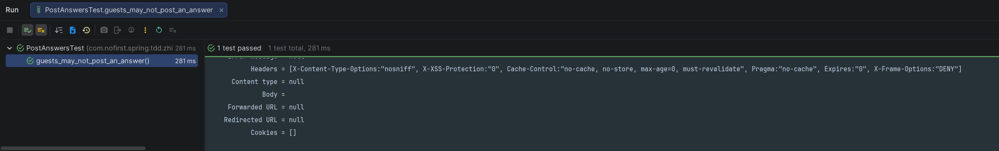

# 权限控制

本节我们补充 —— **未登录用户不能进行发布问题** 的逻辑。

---

## 一、功能说明

### 1.1 为什么要测试未登录用户？

一般而言，当我们某个测试是测试登录用户的某个行为时，通常会有一个相对应的测试：**测试未登录用户不能进行该行为**。

### 1.2 开发目标

| 目标 | 说明 |
|------|------|
| 未登录用户不能回答 | 返回 401 未授权 |
| 登录用户可以回答 | 返回 200 成功 |

---

## 二、新增测试

### 2.1 添加测试用例

依旧从新增测试开始：

*src/test/java/com/nofirst/spring/tdd/zhihu/startup/integration/PostAnswersTest.java*

```java
@BeforeEach
public void setupTestData() {
    QuestionExample questionExample = new QuestionExample();
    // 空条件，匹配所有数据，等价于 delete * from question
    questionExample.createCriteria();
    questionMapper.deleteByExample(questionExample);

    AnswerExample answerExample = new AnswerExample();
    // 空条件，匹配所有数据，等价于 delete * from answer
    answerExample.createCriteria();
    answerMapper.deleteByExample(answerExample);
}

@Test
void guests_may_not_post_an_answer() throws Exception {
    // given
    Question question = QuestionFactory.createPublishedQuestion();
    question.setId(1);

    AnswerDto answer = AnswerFactory.createAnswerDto();
    this.mockMvc.perform(post("/questions/{id}/answers", question.getId())
                    .contentType(MediaType.APPLICATION_JSON)
                    .content(objectMapper.writeValueAsString(answer))
            )
            .andDo(print())
            .andExpect(status().is(401));
}
```

### 2.2 测试说明

| 步骤 | 说明 |
|------|------|
| `@BeforeEach` | 每个测试前清理数据 |
| `given` | 准备已发布问题 |
| `when` | 未登录用户调用接口（无 `@WithUserDetails` 注解） |
| `then` | 验证返回 401 未授权状态码 |

### 2.3 测试对比

| 测试用例 | 用户状态 | 预期结果 |
|---------|---------|---------|
| `signed_in_user_can_post_an_answer_to_a_published_question` | 已登录 | 200 成功 |
| `guests_may_not_post_an_answer` | 未登录 | 401 未授权 |

---

## 三、运行测试

### 3.1 执行测试

运行测试：



测试通过。

### 3.2 测试通过原因

测试通过的原因是我们在 `AnswerController` 的接口上虽然没有显式添加权限控制，但是 Spring Security 默认配置会拦截所有请求，要求用户认证。

### 3.3 运行全部测试

运行全部测试：


所有测试都应该通过。

---

## 四、Spring Security 配置

### 4.1 安全配置示例

```java
@Configuration
@EnableWebSecurity
public class SecurityConfig {

    @Bean
    public SecurityFilterChain filterChain(HttpSecurity http) throws Exception {
        http
            .authorizeHttpRequests(auth -> auth
                .anyRequest().authenticated()  // 所有请求需要认证
            )
            .httpBasic(Customizer.withDefaults());
        return http.build();
    }
}
```

### 4.2 配置说明

| 配置 | 说明 |
|------|------|
| `.anyRequest().authenticated()` | 所有请求需要认证 |
| `.httpBasic()` | 启用 HTTP Basic 认证 |

### 4.3 测试中的安全配置

在测试中，我们使用以下方式启用 Spring Security：

```java
@BeforeAll
public void setupMockMvc() {
    mockMvc = MockMvcBuilders
            .webAppContextSetup(context)
            // 启用 spring security
            .apply(springSecurity())
            .build();
}
```

---

## 五、测试用户

### 5.1 测试用户配置

在测试中，我们使用 `@WithUserDetails` 注解来模拟登录用户：

```java
@Test
@WithUserDetails(value = "John", userDetailsServiceBeanName = "customUserDetailsService")
void signed_in_user_can_post_an_answer() {
    // 模拟 John 用户（userId=2）登录
}
```

### 5.2 用户详情服务

```java
@Service("customUserDetailsService")
public class CustomUserDetailsService implements UserDetailsService {
    
    @Override
    public UserDetails loadUserByUsername(String username) {
        // 根据用户名加载用户详情
        return new AccountUser(...);
    }
}
```

### 5.3 测试用户数据

| 用户名 | userId | 说明 |
|--------|--------|------|
| John | 2 | 测试用登录用户 |
| Guest | - | 未登录用户（无注解） |

---

## 六、提交代码

最后，我们提交一下代码：

```bash
$ git add .
$ git commit -m 'post answer validation:part 2'
```

---

## 七、总结

### 7.1 本节学习要点

| 要点 | 说明 |
|------|------|
| 权限测试 | 测试未登录用户不能执行操作 |
| 401 状态码 | 未授权时返回 401 |
| Spring Security | 使用 `.apply(springSecurity())` 启用 |
| 测试对比 | 登录 vs 未登录的对比测试 |

### 7.2 权限测试模式

```java
// ✅ 好的做法：成对的权限测试

@Test
@WithUserDetails("John")
void signed_in_user_can_do_something() {
    // 登录用户可以执行操作
}

@Test
void guests_may_not_do_something() {
    // 未登录用户不能执行操作（返回 401）
}
```

---

## 八、下一步

权限控制已完成，请继续阅读：

1. [最佳答案](./8.最佳答案.md) - 实现最佳答案功能
2. [选择最佳答案的权限](./9.选择最佳答案的权限.md) - 权限控制

---

## 附录：HTTP 状态码

| 状态码 | 含义 | 使用场景 |
|--------|------|---------|
| 200 | OK | 请求成功 |
| 400 | Bad Request | 请求参数错误 |
| 401 | Unauthorized | 未登录/认证失败 |
| 403 | Forbidden | 无权限访问 |
| 404 | Not Found | 资源不存在 |
