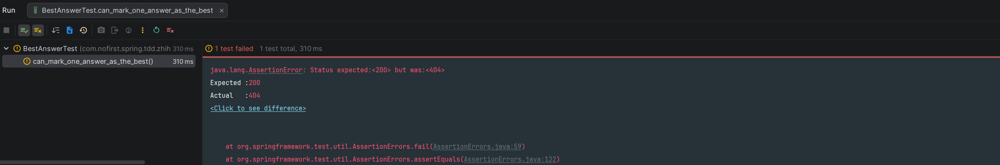
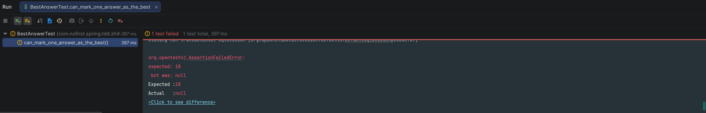

## 本节说明

本节我们来开发最佳答案的功能。

## 新建测试

依旧是先从测试开始，新建测试文件：

*src/test/java/com/nofirst/spring/tdd/zhihu/startup/integration/BestAnswerTest.java*

```java
@TestInstance(TestInstance.Lifecycle.PER_CLASS)
public class BestAnswerTest extends BaseContainerTest {

    private MockMvc mockMvc;

    @Autowired
    private WebApplicationContext context;


    @BeforeAll
    public void setupMockMvc() {
        mockMvc = MockMvcBuilders
                .webAppContextSetup(context)
                // 启用 spring security
                .apply(springSecurity())
                .build();
    }

    @Test
    void guests_can_not_mark_best_answer() throws Exception {
        // 目前这个路由还不存在，但是不影响 401 的返回
        this.mockMvc.perform(post("/answers/{id}/best", 1))
                .andExpect(status().is(401));
    }

}
```

运行测试：


## 添加测试

接下来添加测试：

*src/test/java/com/nofirst/spring/tdd/zhihu/startup/integration/BestAnswerTest.java*

```
.
.
.
@TestInstance(TestInstance.Lifecycle.PER_CLASS)
public class BestAnswerTest extends BaseContainerTest {
{
   .
   .
   .
   @BeforeAll
    public void setupMockMvc() {
        mockMvc = MockMvcBuilders
                .webAppContextSetup(context)
                // 启用 spring security
                .apply(springSecurity())
                .build();
    }

    @BeforeEach
    public void setupTestData() {
        QuestionExample questionExample = new QuestionExample();
        // 空条件，匹配所有数据，等价于delete * from question
        questionExample.createCriteria();
        questionMapper.deleteByExample(questionExample);

        AnswerExample answerExample = new AnswerExample();
        // 空条件，匹配所有数据，等价于delete * from answer
        answerExample.createCriteria();
        answerMapper.deleteByExample(answerExample);
    }
    .
    .
    .

    @Test
    @WithMockUser
    void can_mark_one_answer_as_the_best() throws Exception {
        // given：准备测试数据
        Question question = QuestionFactory.createPublishedQuestion();
        questionMapper.insert(question);
        Answer answer = AnswerFactory.createAnswer(question.getId());
        answerMapper.insert(answer);

        // when
        this.mockMvc.perform(post("/answers/{answerId}/best", answer.getId())
                        .contentType(MediaType.APPLICATION_JSON)
                ).andDo(print())
                .andExpect(status().isOk())
                .andExpect(jsonPath("$.code").value(ResultCode.SUCCESS.getCode()));

        // then
        Question questionAfter = questionMapper.selectByPrimaryKey(question.getId());
        assertThat(questionAfter.getBestAnswerId()).isEqualTo(answer.getId());
    }
}
```

在运行测试之前，可以看到我们给`question`添加了一个`best_answer_id`属性（对应方法为`getBestAnswerId()`）。按照之前的节奏，我们添加`sql`文件：

*src/main/resources/db/migration/V20260225__alter_table_question.sql*

```sql
alter table question
    add best_answer_id int null comment '最佳答案';
```


接下来运行Maven的`flyway`插件的`flyway:migrate`命令生成表，并修改`generatorConfig.xml`的配置，改为生成`question`表，运行`Generator#main()`方法重新生成对应的数据库映射文件。

运行测试：



测试结果提示我们路由不存在，那我们添加对应的controller：

*src/main/java/com/nofirst/spring/tdd/zhihu/startup/controller/BestAnswerController.java*

```java
@RestController
public class BestAnswerController {

    @PostMapping("/answers/{answerId}/best")
    public CommonResult<String> store(@PathVariable Integer answerId) {
        return CommonResult.success("ok");
    }
}
```

运行测试：



因为我们什么逻辑也没写，所以测试注定会失败。我们继续补充完善逻辑：

*src/main/java/com/nofirst/spring/tdd/zhihu/startup/controller/BestAnswerController.java*

```java
@RestController
@AllArgsConstructor
public class BestAnswerController {

    private final AnswerService answerService;

    @PostMapping("/answers/{answerId}/best")
    public CommonResult<String> store(@PathVariable Integer answerId) {
        answerService.markAsBest(answerId);
        return CommonResult.success("ok");
    }
}
```

先添加一个单元测试用例：

*src/test/java/com/nofirst/spring/tdd/zhihu/startup/unit/service/AnswerServiceImplTest.java*

```java
	.
    .
    .
	@Test
    void can_mark_one_answer_as_the_best() {
        // given
        Question publishedQuestion = QuestionFactory.createPublishedQuestion();
        Answer answer = AnswerFactory.createAnswer(publishedQuestion.getId());
        publishedQuestion.setBestAnswerId(answer.getId());
        given(questionMapper.selectByPrimaryKey(publishedQuestion.getId())).willReturn(publishedQuestion);
        given(answerMapper.selectByPrimaryKey(answer.getId())).willReturn(answer);

        // when
        answerService.markAsBest(1);

        // then
        verify(questionMapperExt, times(1)).markAsBestAnswer(publishedQuestion.getId(), answer.getId());
    }
}
```

接着添加`markAsBest()`方法：

*src/main/java/com/nofirst/spring/tdd/zhihu/startup/service/impl/AnswerServiceImpl.java*

```java
public class AnswerServiceImpl implements AnswerService {

    private final AnswerMapper answerMapper;
    private final QuestionMapper questionMapper;
    private final QuestionMapperExt questionMapperExt;
	.
    .
    .
    @Override
    public void markAsBest(Integer answerId) {
        Answer answer = answerMapper.selectByPrimaryKey(answerId);
        questionMapperExt.markAsBestAnswer(answer.getQuestionId(), answer.getId());
    }
}
```

`QuestionMapperExt`是在生成的`QuestionMapper`基础上，放置额外逻辑的`Mapper`文件：

*src/main/java/com/nofirst/spring/tdd/zhihu/startup/mbg/mapper/QuestionMapperExt.java*

```java
public interface QuestionMapperExt {

    void markAsBestAnswer(Integer questionId, Integer answerId);
}
```

对应 xml 文件：

*src/main/resources/mapper/QuestionMapperExt.xml*

```xml
<?xml version="1.0" encoding="UTF-8"?>
<!DOCTYPE mapper PUBLIC "-//mybatis.org//DTD Mapper 3.0//EN" "http://mybatis.org/dtd/mybatis-3-mapper.dtd">
<mapper namespace="com.nofirst.spring.tdd.zhihu.startup.mbg.mapper.QuestionMapperExt">
    <update id="markAsBestAnswer">
        update question
        set best_answer_id = #{answerId,jdbcType=INTEGER}
        where id = #{questionId,jdbcType=INTEGER}
    </update>
</mapper>
```

先运行测试，测试通过。接着运行集成测试用例，测试同样通过。但是可以明显看出，我们的代码逻辑很有漏洞。如果`answerId`不存在会怎样？如果对应的`question`不存在又会怎么样呢？

我么将在下一节进行修复。


## 提交代码

最后，我们提交一下代码：

```
$ git add .
$ git commit -m 'best answer'
```