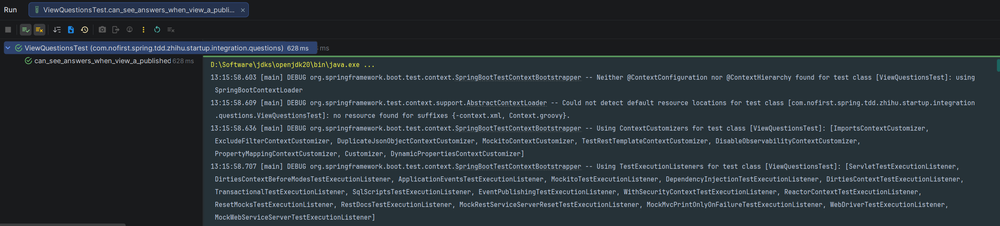

## 本节说明

本节我们开发答案列表功能，将提交的答案显示出来。

## 新建测试

首先我们是预期在查看问题详情的时候，看到第一页的答案列表。我们新建测试用例：

*src/test/java/com/nofirst/spring/tdd/zhihu/startup/integration/questions/ViewQuestionsTest.java*

```java
    .
    .
    .
    @Test
    @WithUserDetails(value = "John", userDetailsServiceBeanName = "customUserDetailsService")
    void can_see_answers_when_view_a_published_question() throws Exception {
        // given：准备测试数据
        Question question = QuestionFactory.createPublishedQuestion();
        questionMapper.insert(question);
        List<Answer> answers = AnswerFactory.createAnswerBatch(40, question.getId());
        for (Answer answer : answers) {
            answerMapper.insert(answer);
        }

        // when：调用接口并获取返回结果
        String jsonResponse = this.mockMvc.perform(
                        get("/questions/{id}", question.getId())
                                .accept(MediaType.APPLICATION_JSON)
                )
                .andDo(print())
                .andExpect(status().isOk())
                .andReturn()
                .getResponse()
                .getContentAsString();

        // then：1. 解析JSON为QuestionVo，用TypeReference解决泛型擦除问题，确保data字段解析为QuestionVo
        TypeReference<CommonResult<QuestionVo>> typeRef = new TypeReference<>() {
        };
        CommonResult<QuestionVo> commonResult = objectMapper.readValue(jsonResponse, typeRef);

        // then：2. 断言
        assertThat(commonResult.getCode()).isEqualTo(ResultCode.SUCCESS.getCode());
        QuestionVo questionVo = commonResult.getData();
        PageInfo<AnswerVo> answersPage = questionVo.getAnswers();
        assertThat(answersPage.getTotal()).isEqualTo(40);
        assertThat(answersPage.getSize()).isEqualTo(20);
    }
}
```

添加工厂方法：

*src/test/java/com/nofirst/spring/tdd/zhihu/startup/factory/AnswerFactory.java*

```java
    .
    .
    .
    public static List<Answer> createAnswerBatch(Integer times, Integer questionId) {
        List<Answer> answers = new ArrayList<>();
        for (int i = 0; i < times; i++) {
            answers.add(createAnswer(questionId));
        }

        return answers;
    }
}
```

添加 AnswerVo:

*src/main/java/com/nofirst/spring/tdd/zhihu/startup/model/vo/AnswerVo.java*

```java
package com.nofirst.spring.tdd.zhihu.startup.model.vo;

import lombok.Data;

import java.util.Date;

@Data
public class AnswerVo {

    private Integer id;

    private Integer questionId;

    private Integer userId;

    private Date createdAt;

    private Date updatedAt;
    
    private String content;
}
```

修改 QuestionVo：

*src/main/java/com/nofirst/spring/tdd/zhihu/startup/model/vo/QuestionVo.java*

```java
@Data
public class QuestionVo {

    private Integer id;

    private Integer userId;

    private String title;

    private String content;

    PageInfo<AnswerVo> answers;
}
```


运行测试：


## 完善逻辑

修改控制器，返回关联的答案列表：

*src/main/java/com/nofirst/spring/tdd/zhihu/startup/service/impl/QuestionServiceImpl.java*

```java
.
.
.
public class QuestionServiceImpl implements QuestionService {

    private QuestionMapper questionMapper;
    private AnswerService answerService;// 此处


    @Override
    public QuestionVo show(Integer id) {
        Question question = questionMapper.selectByPrimaryKey(id);
        if (Objects.isNull(question)) {
            throw new QuestionNotExistedException();
        }
        if (Objects.isNull(question.getPublishedAt())) {
            throw new QuestionNotPublishedException();
        }

        QuestionVo questionVo = new QuestionVo();
        questionVo.setId(question.getId());
        questionVo.setUserId(question.getUserId());
        questionVo.setTitle(question.getTitle());
        questionVo.setContent(question.getContent());
        questionVo.setAnswers(answerService.answers(question.getId(), 1, 20)); // 此处表示，首次显示问题列表的第一页，每页20个

        return questionVo;
    }
}
```

正如以上代码所示，我们预期把显示答案列表的逻辑放到`AnswerService`中，但是现在还没有`answers()`方法。让我们先从单元测试开始进行：

*src/test/java/com/nofirst/spring/tdd/zhihu/startup/unit/service/AnswerServiceImplTest.java*

```java
public class AnswerServiceImplTest {

    @InjectMocks
    private AnswerServiceImpl answerService;

    @Mock
    private AnswerMapper answerMapper;
    @Mock
    private QuestionMapper questionMapper;
    @Mock
    private QuestionMapperExt questionMapperExt;

    private Answer defaultAnswer;
    private AnswerDto defaultAnswerDto;
    private List<Answer> answers;

    @BeforeEach
    public void setup() {
        this.defaultAnswer = AnswerFactory.createAnswer(1);
        this.defaultAnswerDto = AnswerFactory.createAnswerDto();
        this.answers = AnswerFactory.createAnswerBatch(10, 1);
    }
    .
    .
    .
    @Test
    void a_question_has_many_answers() {
        // given
        given(answerMapper.selectByExample(any())).willReturn(this.answers);

        // when
        PageInfo<AnswerVo> answersPage = answerService.answers(1, 1, 20);

        // then
        assertThat(answersPage.getTotal()).isEqualTo(10);
        assertThat(answersPage.getSize()).isEqualTo(10);
    }
}
```

添加`answers()`方法：

*src/main/java/com/nofirst/zhihu/service/impl/AnswerServiceImpl.java*

```java
package com.nofirst.spring.tdd.zhihu.startup.service.impl;


import com.github.pagehelper.PageHelper;
import com.github.pagehelper.PageInfo;
import com.nofirst.spring.tdd.zhihu.startup.exception.QuestionNotExistedException;
import com.nofirst.spring.tdd.zhihu.startup.exception.QuestionNotPublishedException;
import com.nofirst.spring.tdd.zhihu.startup.mbg.mapper.AnswerMapper;
import com.nofirst.spring.tdd.zhihu.startup.mbg.mapper.QuestionMapper;
import com.nofirst.spring.tdd.zhihu.startup.mbg.mapper.QuestionMapperExt;
import com.nofirst.spring.tdd.zhihu.startup.mbg.model.Answer;
import com.nofirst.spring.tdd.zhihu.startup.mbg.model.AnswerExample;
import com.nofirst.spring.tdd.zhihu.startup.mbg.model.Question;
import com.nofirst.spring.tdd.zhihu.startup.model.dto.AnswerDto;
import com.nofirst.spring.tdd.zhihu.startup.model.vo.AnswerVo;
import com.nofirst.spring.tdd.zhihu.startup.security.AccountUser;
import com.nofirst.spring.tdd.zhihu.startup.service.AnswerService;
import lombok.AllArgsConstructor;
import org.springframework.stereotype.Service;

import java.util.ArrayList;
import java.util.Date;
import java.util.List;
import java.util.Objects;

@Service
@AllArgsConstructor
public class AnswerServiceImpl implements AnswerService {

    private final AnswerMapper answerMapper;
    private final QuestionMapper questionMapper;
    private final QuestionMapperExt questionMapperExt;

    @Override
    public PageInfo<AnswerVo> answers(Integer questionId, int pageIndex, int pageSize) {
        PageHelper.startPage(pageIndex, pageSize);
        AnswerExample example = new AnswerExample();
        example.createCriteria().andQuestionIdEqualTo(questionId);
        List<Answer> answers = answerMapper.selectByExample(example);
        PageInfo<Answer> answerPageInfo = new PageInfo<>(answers);
        List<AnswerVo> result = new ArrayList<>();
        for (Answer answer : answers) {
            AnswerVo vo = new AnswerVo();
            vo.setId(answer.getId());
            vo.setQuestionId(answer.getQuestionId());
            vo.setUserId(answer.getUserId());
            vo.setCreatedAt(answer.getCreatedAt());
            vo.setUpdatedAt(answer.getUpdatedAt());
            vo.setContent(answer.getContent());

            result.add(vo);
        }
        PageInfo<AnswerVo> pageResult = new PageInfo<>();
        pageResult.setTotal(answerPageInfo.getTotal());
        pageResult.setPageNum(answerPageInfo.getPageNum());
        pageResult.setPageSize(answerPageInfo.getPageSize());
        pageResult.setSize(answerPageInfo.getSize());
        pageResult.setList(result);

        return pageResult;
    }
   .
   .
   .
}
```

运行单元测试，测试通过。再运行集成测试`can_see_answers_when_view_a_published_question`：



我们在查看问题详情的时候，会返回答案列表第一页的内容，如果答案很多的话，我们需要进行翻页。让我们来为答案列表的翻页功能添加测试：

*src/test/java/com/nofirst/spring/tdd/zhihu/startup/integration/answers/ViewAnswersTest.java*

```java
package com.nofirst.spring.tdd.zhihu.startup.integration.answers;

import com.fasterxml.jackson.core.type.TypeReference;
import com.fasterxml.jackson.databind.ObjectMapper;
import com.github.pagehelper.PageInfo;
import com.nofirst.spring.tdd.zhihu.startup.common.CommonResult;
import com.nofirst.spring.tdd.zhihu.startup.common.ResultCode;
import com.nofirst.spring.tdd.zhihu.startup.factory.AnswerFactory;
import com.nofirst.spring.tdd.zhihu.startup.integration.BaseContainerTest;
import com.nofirst.spring.tdd.zhihu.startup.mbg.mapper.AnswerMapper;
import com.nofirst.spring.tdd.zhihu.startup.mbg.model.Answer;
import com.nofirst.spring.tdd.zhihu.startup.mbg.model.AnswerExample;
import com.nofirst.spring.tdd.zhihu.startup.model.vo.AnswerVo;
import org.junit.jupiter.api.BeforeEach;
import org.junit.jupiter.api.Test;
import org.springframework.beans.factory.annotation.Autowired;
import org.springframework.security.test.context.support.WithUserDetails;

import java.nio.charset.StandardCharsets;
import java.util.List;

import static org.assertj.core.api.Assertions.assertThat;
import static org.springframework.test.web.servlet.request.MockMvcRequestBuilders.get;
import static org.springframework.test.web.servlet.result.MockMvcResultMatchers.status;

class ViewAnswersTest extends BaseContainerTest {

    @Autowired
    private AnswerMapper answerMapper;

    @Autowired
    private ObjectMapper objectMapper;

    @BeforeEach
    public void setupTestData() {
        AnswerExample example = new AnswerExample();
        example.createCriteria();
        answerMapper.deleteByExample(example);
    }

    @Test
    void guest_can_not_view_answers() throws Exception {
        // given
        // when
        this.mockMvc.perform(get("/answers"))
                // then
                .andExpect(status().is(401));
    }

    @Test
    // 下面这行代码，会在 customUserDetailsService 的 loadUserByUsername() 方法中，将 John 查出来，模拟登录
    @WithUserDetails(value = "John", userDetailsServiceBeanName = "customUserDetailsService")
    void signed_in_user_can_view_answers_page_by_page() throws Exception {
        // given
        //  30 个回答，这样可以分成两页，且每页个数不同
        int questionId = 1;
        List<Answer> answers = AnswerFactory.createAnswerBatch(30, questionId);
        answers.forEach(t -> answerMapper.insert(t));

        // when：访问第一页
        String json = this.mockMvc.perform(get("/questions/{questionId}/answers?pageIndex=1&pageSize=20", questionId))
                .andExpect(status().isOk()).andReturn().getResponse()
                .getContentAsString(StandardCharsets.UTF_8);

        // then
        TypeReference<CommonResult<PageInfo<AnswerVo>>> typeRef = new TypeReference<>() {
        };
        CommonResult<PageInfo<AnswerVo>> firstPageResult = objectMapper.readValue(json, typeRef);
        long code = firstPageResult.getCode();
        assertThat(code).isEqualTo(ResultCode.SUCCESS.getCode());

        PageInfo<AnswerVo> data = firstPageResult.getData();
        assertThat(data.getTotal()).isEqualTo(30);
        assertThat(data.getList().size()).isEqualTo(20);


        // when：访问第二页
        json = this.mockMvc.perform(get("/questions/{questionId}/answers?pageIndex=2&pageSize=20", questionId))
                .andExpect(status().isOk()).andReturn().getResponse()
                .getContentAsString(StandardCharsets.UTF_8);

        // then
        CommonResult<PageInfo<AnswerVo>> secondPageResult = objectMapper.readValue(json, typeRef);
        data = secondPageResult.getData();
        assertThat(data.getTotal()).isEqualTo(30);
        assertThat(data.getList().size()).isEqualTo(10);
    }
}
```

`guest_can_not_view_answers`会直接通过，`signed_in_user_can_view_answers_page_by_page`测试会失败。因为现在路由还不存在，我们来添加路由：

*src/main/java/com/nofirst/spring/tdd/zhihu/startup/controller/AnswerController.java*

```java
@RestController
@AllArgsConstructor
public class AnswerController {

    private AnswerService answerService;

    @GetMapping("/questions/{questionId}/answers")
    public CommonResult<PageInfo<AnswerVo>> index(@PathVariable Integer questionId,
                                                  @RequestParam Integer pageIndex,
                                                  @RequestParam Integer pageSize) {
        PageInfo<AnswerVo> answerPage = answerService.answers(questionId, pageIndex, pageSize);
        return CommonResult.success(answerPage);
    }
    .
    .
    .
}
```

再次运行测试，测试通过。


## 提交代码

运行一下全部测试，保证功能一切正常：

episode5_2026-03-16_13-45-16.png

但是我们看到，有一个测试用例失败了。因为我们在`QuestionServiceImpl`新引入了`AnswerService`，但是没有进行`Mock`。我们修改测试用例：

*src/test/java/com/nofirst/spring/tdd/zhihu/startup/unit/service/QuestionServiceImplTest.java*

```java
@ExtendWith(MockitoExtension.class)
class QuestionServiceImplTest {

    @InjectMocks
    private QuestionServiceImpl questionService;
    
    @Mock
    private AnswerServiceImpl answerService;// 此处
    .
    .
    .
}
```

再次运行全部测试，测试都通过了。最后，我们来提交一下代码：

```
$ git add .
$ git commit -m 'fetch question with answers'
```