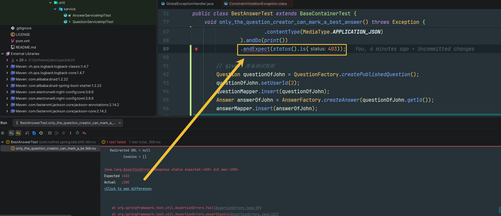

# 选择最佳答案的权限

本节我们添加一个逻辑：**只有问题的创建者才能标记最佳答案**。

---

## 功能说明

### 为什么要限制权限？

在问答系统中，只有问题的提问者才有权选择最佳答案，这是为了确保：

| 原因 | 说明 |
|------|------|
| 公平性 | 防止他人恶意标记 |
| 准确性 | 提问者最清楚哪个回答解决了问题 |
| 安全性 | 避免权限滥用 |

### 开发目标

| 目标 | 说明 |
|------|------|
| 只有问题创建者可以标记 | 非创建者返回 403 |
| 使用 Policy 控制权限 | 使用 Spring Security 的 `@PreAuthorize` |
| 添加单元测试 | 验证 Policy 逻辑正确 |

---

## 修改测试

### 添加测试用例

将 `can_mark_one_answer_as_the_best` 测试用例进行如下修改：

```java
@Test
@WithUserDetails(value = "John", userDetailsServiceBeanName = "customUserDetailsService")
void only_the_question_creator_can_mark_a_best_answer() throws Exception {
    // given：准备测试数据
    Question questionOfOtherUser = QuestionFactory.createPublishedQuestion();
    questionOfOtherUser.setUserId(1);
    questionMapper.insert(questionOfOtherUser);
    Answer answerOfOther = AnswerFactory.createAnswer(questionOfOtherUser.getId());
    answerMapper.insert(answerOfOther);

    // when
    this.mockMvc.perform(post("/answers/{answerId}/best", answerOfOther.getId())
                    .contentType(MediaType.APPLICATION_JSON)
            ).andDo(print())
            .andExpect(status().is(403));

    // given：准备测试数据
    Question questionOfJohn = QuestionFactory.createPublishedQuestion();
    questionOfJohn.setUserId(2);
    questionMapper.insert(questionOfJohn);
    Answer answerOfJohn = AnswerFactory.createAnswer(questionOfJohn.getId());
    answerMapper.insert(answerOfJohn);

    // when
    this.mockMvc.perform(post("/answers/{answerId}/best", answerOfJohn.getId())
                    .contentType(MediaType.APPLICATION_JSON)
            ).andDo(print())
            .andExpect(status().isOk())
            .andExpect(jsonPath("$.code").value(ResultCode.SUCCESS.getCode()));

    // then
    Question questionAfter = questionMapper.selectByPrimaryKey(questionOfJohn.getId());
    assertThat(questionAfter.getBestAnswerId()).isEqualTo(answerOfJohn.getId());
}
```

### 测试说明

| 步骤 | 说明 |
|------|------|
| `given1` | 创建其他用户（userId=1）的问题和回答 |
| `when1` | John 用户尝试标记其他用户问题的最佳答案 |
| `then1` | 验证返回 403 禁止访问 |
| `given2` | 创建 John 用户（userId=2）的问题和回答 |
| `when2` | John 用户标记自己问题的最佳答案 |
| `then2` | 验证成功，`best_answer_id` 被更新 |

### 运行测试

运行测试：



可以看到由于我们没有添加任何的逻辑限制，导致返回了 200。

---

## 创建权限策略

### 使用 Bean 校验

下面我们引入一个 Bean 校验的方式来进行权限控制，而不是把校验逻辑放到 service 层中。

*src/main/java/com/nofirst/spring/tdd/zhihu/startup/policy/QuestionPolicy.java*

```java
@Component
@AllArgsConstructor
public class QuestionPolicy {

    private final QuestionMapper questionMapper;
    private final AnswerMapper answerMapper;

    /**
     * Can mark answer as best boolean.
     *
     * @param answerId    the answer id
     * @param accountUser the account user
     * @return the boolean
     */
    public boolean canMarkAnswerAsBest(Integer answerId, AccountUser accountUser) {
        Answer answer = answerMapper.selectByPrimaryKey(answerId);
        if (Objects.isNull(answer)) {
            throw new AnswerNotExistedException();
        }
        Question question = questionMapper.selectByPrimaryKey(answer.getQuestionId());
        if (Objects.isNull(question)) {
            throw new QuestionNotExistedException();
        }
        if (Objects.isNull(question.getPublishedAt())) {
            throw new QuestionNotPublishedException();
        }
        return accountUser.getUserId().equals(question.getUserId());
    }
}
```

### 权限验证逻辑

```java
public boolean canMarkAnswerAsBest(Integer answerId, AccountUser accountUser) {
    // 1. 验证回答是否存在
    Answer answer = answerMapper.selectByPrimaryKey(answerId);
    if (Objects.isNull(answer)) {
        throw new AnswerNotExistedException();
    }
    
    // 2. 验证问题是否存在
    Question question = questionMapper.selectByPrimaryKey(answer.getQuestionId());
    if (Objects.isNull(question)) {
        throw new QuestionNotExistedException();
    }
    
    // 3. 验证问题是否已发布
    if (Objects.isNull(question.getPublishedAt())) {
        throw new QuestionNotPublishedException();
    }
    
    // 4. 验证当前用户是否是问题创建者
    return accountUser.getUserId().equals(question.getUserId());
}
```

### 创建异常类

*src/main/java/com/nofirst/spring/tdd/zhihu/startup/exception/AnswerNotExistedException.java*

```java
public class AnswerNotExistedException extends ApiException {

    public AnswerNotExistedException() {
        super(ResultCode.FAILED, "answer not exist");
    }
}
```

---

## 单元测试

### 添加 Policy 测试

我们新引入了一个 component，理应先添加单元测试：

*src/test/java/com/nofirst/spring/tdd/zhihu/startup/unit/policy/QuestionPolicyTest.java*

```java
@ExtendWith(MockitoExtension.class)
class QuestionPolicyTest {

    @InjectMocks
    private QuestionPolicy questionPolicy;

    @Mock
    private AnswerMapper answerMapper;
    @Mock
    private QuestionMapper questionMapper;

    @Test
    void can_judge_user_is_question_owner_when_mark_best_answer() {
        // given
        Question publishedQuestion = QuestionFactory.createPublishedQuestion();
        given(questionMapper.selectByPrimaryKey(publishedQuestion.getId())).willReturn(publishedQuestion);
        Answer answer = AnswerFactory.createAnswer(publishedQuestion.getId());
        given(answerMapper.selectByPrimaryKey(answer.getId())).willReturn(answer);

        // when
        AccountUser accountUser = UserFactory.createAccountUser();
        boolean questionOwner = questionPolicy.canMarkAnswerAsBest(1, accountUser);

        // then
        assertThat(questionOwner).isTrue();
    }

    @Test
    void answer_and_question_are_both_valid() {
        // given
        AccountUser accountUser = UserFactory.createAccountUser();
        given(answerMapper.selectByPrimaryKey(anyInt())).willReturn(null);

        // then
        assertThatThrownBy(() -> {
            // when
            questionPolicy.canMarkAnswerAsBest(1, accountUser);
        }).isInstanceOf(AnswerNotExistedException.class)
                .hasMessageContaining("answer not exist");


        // given
        Answer answer = AnswerFactory.createAnswer(1);
        given(answerMapper.selectByPrimaryKey(1)).willReturn(answer);
        given(questionMapper.selectByPrimaryKey(anyInt())).willReturn(null);

        // then
        assertThatThrownBy(() -> {
            // when
            questionPolicy.canMarkAnswerAsBest(1, accountUser);
        }).isInstanceOf(QuestionNotExistedException.class)
                .hasMessageContaining("question not exist");

        // given
        Question unpublishedQuestion = QuestionFactory.createUnpublishedQuestion();
        unpublishedQuestion.setId(1);
        given(questionMapper.selectByPrimaryKey(unpublishedQuestion.getId())).willReturn(unpublishedQuestion);
        Answer anotherAnswer = AnswerFactory.createAnswer(unpublishedQuestion.getId());
        given(answerMapper.selectByPrimaryKey(anotherAnswer.getId())).willReturn(anotherAnswer);

        // then
        assertThatThrownBy(() -> {
            // when
            questionPolicy.canMarkAnswerAsBest(1, accountUser);
        }).isInstanceOf(QuestionNotPublishedException.class)
                .hasMessageContaining("question not publish");
    }
}
```

### 测试说明

| 测试用例 | 测试场景 | 预期结果 |
|---------|---------|---------|
| `can_judge_user_is_question_owner_when_mark_best_answer` | 用户是问题创建者 | 返回 true |
| `answer_and_question_are_both_valid` | 回答不存在 | 抛出 `AnswerNotExistedException` |
| `answer_and_question_are_both_valid` | 问题不存在 | 抛出 `QuestionNotExistedException` |
| `answer_and_question_are_both_valid` | 问题未发布 | 抛出 `QuestionNotPublishedException` |

### 运行单元测试

运行单元测试：


---

## 应用权限策略

### 修改 Controller

现在 policy 已经生效，接下来应用到 controller 上：

*src/main/java/com/nofirst/spring/tdd/zhihu/startup/controller/BestAnswerController.java*

```java
@RestController
@AllArgsConstructor
public class BestAnswerController {

    private final AnswerService answerService;

    @PostMapping("/answers/{answerId}/best")
    @PreAuthorize("@questionPolicy.canMarkAnswerAsBest(#answerId, #accountUser)")
    public CommonResult<String> store(@PathVariable Integer answerId,
                                      @AuthenticationPrincipal AccountUser accountUser) {
        answerService.markAsBest(answerId);
        return CommonResult.success("ok");
    }
}
```

### 注解说明

| 注解 | 说明 |
|------|------|
| `@PreAuthorize` | Spring Security 权限注解，在方法执行前验证 |
| `@questionPolicy.canMarkAnswerAsBest(...)` | 调用 Bean 的 `canMarkAnswerAsBest` 方法 |
| `#answerId` | 方法参数 `answerId` |
| `#accountUser` | 方法参数 `accountUser` |

### 运行测试

运行单元测试 `only_the_question_creator_can_mark_a_best_answer`，测试通过：


---

## 提交代码

我们提交一下代码：

```bash
$ git add .
$ git commit -m 'markAsBestAnswer() policy'
```

---

## 总结

### 本节学习要点

| 要点 | 说明 |
|------|------|
| Policy 模式 | 使用独立的 Policy 类控制权限 |
| @PreAuthorize | Spring Security 权限注解 |
| 单元测试 | 测试 Policy 的各种场景 |
| 异常处理 | 验证失败时抛出异常 |

### 权限验证流程

```
┌─────────────────────────────────────────────────────────┐
│              标记最佳答案权限验证流程                    │
│                                                         │
│  1. 验证回答是否存在 ────→ 不存在则抛出异常            │
│       ↓                                                 │
│  2. 验证问题是否存在 ────→ 不存在则抛出异常            │
│       ↓                                                 │
│  3. 验证问题是否已发布 ──→ 未发布则抛出异常            │
│       ↓                                                 │
│  4. 验证用户是否是创建者 ─→ 不是则返回 false(403)      │
│       ↓                                                 │
│  5. 权限验证通过，执行方法                              │
│                                                         │
└─────────────────────────────────────────────────────────┘
```

---

## 下一步

权限控制已完成，请继续阅读：

1. [整理测试目录](./10.整理测试目录.md) - 重构测试目录
2. [删除答案](./11. 删除答案.md) - 实现删除功能

---

## 附录：Spring Security 表达式

```java
// 常用表达式

@PreAuthorize("hasRole('ADMIN')")           // 需要 ADMIN 角色
@PreAuthorize("hasAuthority('USER_WRITE')") // 需要 USER_WRITE 权限
@PreAuthorize("@myBean.check(#id)")         // 调用 Bean 方法
@PreAuthorize("#userId == authentication.principal.id") // 使用认证信息
```
