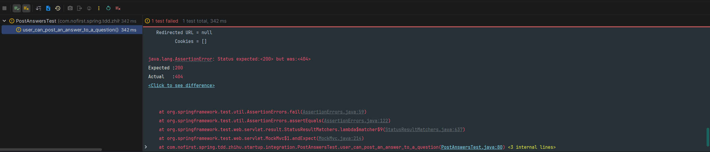
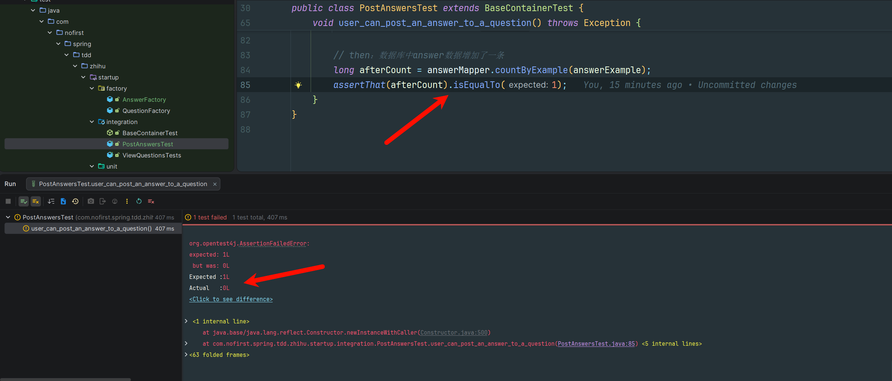

## 说明

本节我们继续`TDD`开发之旅，我们在本节要实现的功能是：回答问题。

## 新建测试

首先我们新建一个测试文件：

*src/test/java/com/nofirst/spring/tdd/zhihu/startup/integration/PostAnswersTest.java*

```java
@TestInstance(TestInstance.Lifecycle.PER_CLASS)
public class PostAnswersTest extends BaseContainerTest {

    private MockMvc mockMvc;

    @Autowired
    private WebApplicationContext context;

    @Autowired
    private QuestionMapper questionMapper;

    @Autowired
    private AnswerDao answerDao;

    @BeforeAll
    public void setupMockMvc() {
        mockMvc = MockMvcBuilders
                .webAppContextSetup(context)
                .build();
    }

    @BeforeEach
    public void setupTestData() {
        QuestionExample questionExample = new QuestionExample();
        // 空条件，匹配所有数据，等价于delete * from question
        questionExample.createCriteria();
        questionMapper.deleteByExample(questionExample);

        AnswerExample answerExample = new AnswerExample();
        // 空条件，匹配所有数据，等价于delete * from answer
        answerExample.createCriteria();
        answerMapper.deleteByExample(answerExample);
    }

    @Test
    void user_can_post_an_answer_to_a_question() throws Exception {
    	// 假设已存在某个问题

        // 然后我们触发某个路由

        // 我们要看到预期结果
    }
  }
```

按照我们的思路，我们填充代码如下：

```java
@TestInstance(TestInstance.Lifecycle.PER_CLASS)
public class PostAnswersTest extends BaseContainerTest {

    private MockMvc mockMvc;

    @Autowired
    private WebApplicationContext context;

    @Autowired
    private QuestionMapper questionMapper;

    @Autowired
    private AnswerDao answerDao;


    @BeforeAll
    public void setupMockMvc() {
        mockMvc = MockMvcBuilders
                .webAppContextSetup(context)
                .build();
    }

    @BeforeEach
    public void setupTestData() {
        QuestionExample questionExample = new QuestionExample();
        // 空条件，匹配所有数据，等价于delete * from question
        questionExample.createCriteria();
        questionMapper.deleteByExample(questionExample);

        AnswerExample answerExample = new AnswerExample();
        // 空条件，匹配所有数据，等价于delete * from answer
        answerExample.createCriteria();
        answerMapper.deleteByExample(answerExample);
    }

    @Test
    void user_can_post_an_answer_to_a_question() throws Exception {
        // given：准备测试数据
        Question question = QuestionFactory.createQuestion();
        questionMapper.insert(question);
        AnswerExample answerExample = new AnswerExample();
        long beforeCount = answerMapper.countByExample(answerExample);
        assertThat(beforeCount).isEqualTo(0);

        // when：调用接口并获取返回结果
        AnswerDto answer = AnswerFactory.createAnswerDto();
        this.mockMvc.perform(post("/questions/{id}/answers", question.getId())
                        .contentType(MediaType.APPLICATION_JSON)
                        .content(JSONUtil.toJsonStr(answer))
                )
                .andDo(print())
                .andExpect(status().isOk())
                .andExpect(jsonPath("$.code").value(ResultCode.SUCCESS.getCode()));

        // then：数据库中answer数据增加了一条
        long afterCount = answerMapper.countByExample(answerExample);
        assertThat(afterCount).isEqualTo(1);
    }
}
```

编辑器提醒我们`AnswerMapper`、`AnswerExample`都不存在，所以我们接下来的工作，就是定义`question`数据表，并产生对应的ORM映射模型。`question`表的定义如下：

*src/main/resources/db/migration/V20260209__create_table_answer.sql*

```sql
CREATE TABLE `answer` (
                          `id` int unsigned NOT NULL AUTO_INCREMENT,
                          `question_id` int NOT NULL,
                          `user_id` int NOT NULL,
                          `content` text  NOT NULL,
                          `created_at` timestamp NOT NULL,
                          `updated_at` timestamp NOT NULL,
                          PRIMARY KEY (`id`)
) ENGINE=InnoDB AUTO_INCREMENT=1 ;
```

接下来运行Maven的`flyway`插件的`flyway:migrate`命令生成表，并修改`generatorConfig.xml`的配置，改为生成`answer`表，运行`Generator#main()`方法生成对应的数据库映射文件。

重新导入缺失的类之后，我们应该立即运行测试。但是你会发现，`QuestionFactory`类还不存在。`xxxFactory`类是我们为了测试方便而定义的模型工厂类，它会生产我们需要的模型对象。


## 新建模型工厂

*src/test/java/com/nofirst/spring/tdd/zhihu/startup/factory/AnswerFactory.java*

```java
package com.nofirst.spring.tdd.zhihu.startup.factory;

import com.nofirst.spring.tdd.zhihu.startup.model.dto.AnswerDto;

public class AnswerFactory {

    public static AnswerDto createAnswerDto() {
        AnswerDto answer = new AnswerDto();
        answer.setContent("this is a answer");

        return answer;
    }
}

```

*src/main/java/com/nofirst/spring/tdd/zhihu/startup/model/dto/AnswerDto.java*

```java
package com.nofirst.spring.tdd.zhihu.startup.model.dto;

import lombok.Data;

@Data
public class AnswerDto {

    private String content;
}		
```

## 运行测试

重新导入缺失的类，运行测试：



问题显而易见：还没有对应的路由。下面添加路由：

*src/main/java/com/nofirst/spring/tdd/zhihu/startup/controller/AnswerController.java*

```java
package com.nofirst.spring.tdd.zhihu.startup.controller;

import com.nofirst.spring.tdd.zhihu.startup.common.CommonResult;
import com.nofirst.spring.tdd.zhihu.startup.model.dto.AnswerDto;
import org.springframework.web.bind.annotation.PathVariable;
import org.springframework.web.bind.annotation.PostMapping;
import org.springframework.web.bind.annotation.RequestBody;
import org.springframework.web.bind.annotation.RestController;

@RestController
public class AnswerController {

    @PostMapping("/questions/{questionId}/answers")
    public CommonResult<String> store(@PathVariable Integer questionId, @RequestBody AnswerDto answerDto) {
        return CommonResult.success("success");
    }
}
```

运行测试：



虽然没有报错404，但是由于我们在controller里面什么也没做，所以`answer`表里面的数据数量仍然是0。按照惯例，我们会将具体逻辑写在 Service 层，下一节我们继续。