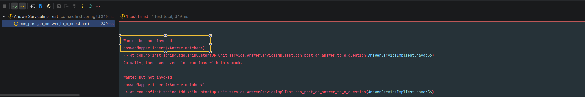
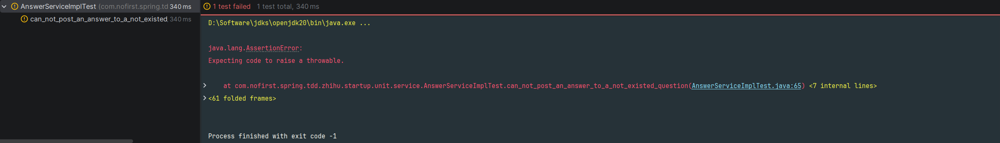
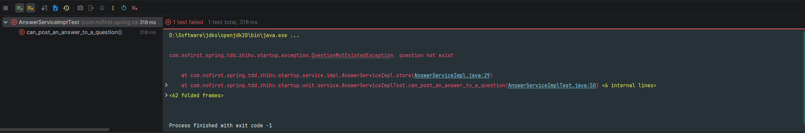
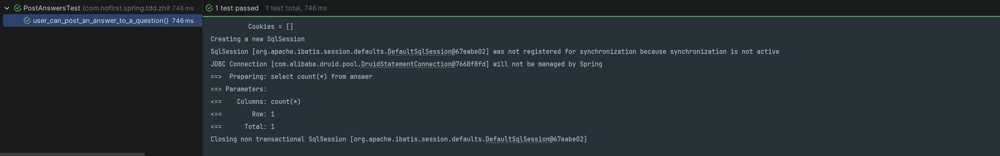

## 本节说明

本节我们来编写Service层的单元测试。

## 单元测试

单元测试的作用是帮助你编写简洁无错的代码。单元测试是针对你的代码中非常少，而且相对独立的一部分代码来进行的测试。实际上，大部分单元测试都是针对单个方法进行的。单元测试由功能测试驱动，而且更接近于真正的代码。编写单元测试时，按照程序员的方式思考：

-  在终端里运行单元测试，看它们是如何失败的;
- 在编辑器中改动最少量的代码，让当前失败的测试通过。
- 然后不断重复。

想保证编写的代码无误，每次改动的幅度就要尽量小。这么做才能确保每一部分代码都有对应的测试保驾护航。乍看起来工作量很大，但熟练后速度还是很快的。

## 添加单元测试

*src/test/java/com/nofirst/spring/tdd/zhihu/startup/unit/service/AnswerServiceImplTest.java*

```java
package com.nofirst.spring.tdd.zhihu.startup.unit.service;

import com.nofirst.spring.tdd.zhihu.startup.factory.AnswerFactory;
import com.nofirst.spring.tdd.zhihu.startup.factory.QuestionFactory;
import com.nofirst.spring.tdd.zhihu.startup.mbg.mapper.AnswerMapper;
import com.nofirst.spring.tdd.zhihu.startup.mbg.mapper.QuestionMapper;
import com.nofirst.spring.tdd.zhihu.startup.mbg.model.Answer;
import com.nofirst.spring.tdd.zhihu.startup.mbg.model.Question;
import com.nofirst.spring.tdd.zhihu.startup.model.dto.AnswerDto;
import org.junit.jupiter.api.BeforeEach;
import org.junit.jupiter.api.Test;
import org.junit.jupiter.api.extension.ExtendWith;
import org.mockito.InjectMocks;
import org.mockito.Mock;
import org.mockito.junit.jupiter.MockitoExtension;

import static org.mockito.ArgumentMatchers.argThat;
import static org.mockito.BDDMockito.given;
import static org.mockito.Mockito.times;
import static org.mockito.Mockito.verify;

@ExtendWith(MockitoExtension.class)
public class AnswerServiceImplTest {

    @InjectMocks
    private AnswerServiceImpl answerService;

    @Mock
    private AnswerMapper answerMapper;

    private Answer defaultAnswer;
    private AnswerDto defaultAnswerDto;

    @BeforeEach
    public void setup() {
        this.defaultAnswer = AnswerFactory.createAnswer(1);
        this.defaultAnswerDto = AnswerFactory.createAnswerDto();
    }

    @Test
    void can_post_an_answer_to_a_question() {
        // given

        // when
        answerService.store(1, this.defaultAnswerDto);

        // then
        verify(answerMapper, times(1)).insert(argThat(new AnswerMatcher(defaultAnswer)));
    }
}
```

对以上测试我们进行以下几点说明。首先，我们本次单元测试的类是`AnswerServiceImpl`，方法是`store()`，尽管我们还没有建立对应的类跟方法，但是，TDD的理念就是在测试用例中先写出不存在的类跟方法，再根据测试用例的测试逻辑，写出正确的代码逻辑。

接着，我们在`AnswerFactory`中添加了一个方法，用来产生一个`Answer`实例对象：

```java
public static Answer createAnswer(Integer questionId) {
    Date now = new Date();
    Answer answer = new Answer();
    answer.setId(1);
    answer.setQuestionId(questionId);
    answer.setUserId(1);
    answer.setCreatedAt(now);
    answer.setUpdatedAt(now);
    answer.setContent("this is an answer");

    return answer;
}
```

最后需要说明的是，此处我们验证单元测试用例通过的方式，是验证`answerMapper#insert()`方法被调用了1次，并且对象是`defaultAnswer`（这里是通过AnswerMatcher()对象来进行参数匹配，因为在实际的方法调用中，最终的`Answer`对象实例肯定不是`defaultAnswer`。但是通过自定义matcher 的方式，我们可以认为调用参数就是`defaultAnswer`）。

*src/test/java/com/nofirst/spring/tdd/zhihu/startup/matcher/AnswerMatcher.java*

```java
package com.nofirst.spring.tdd.zhihu.startup.matcher;

import com.nofirst.spring.tdd.zhihu.startup.mbg.model.Answer;
import org.mockito.ArgumentMatcher;

public class AnswerMatcher implements ArgumentMatcher<Answer> {

    private Answer left;

    public AnswerMatcher(Answer left) {
        this.left = left;
    }

    @Override
    public boolean matches(Answer right) {
        return left.getQuestionId().equals(right.getQuestionId()) &&
                left.getContent().equals(right.getContent()) &&
                left.getUserId().equals(right.getUserId());
    }
}
```

> 注：还可以通过自定义 matcher 的方式来进行测试，特别注意，有多个参数时，每个参数都需要mock，如eq(1L)
>
> ```java
> verify(answerService, times(1)).store(eq(1L), argThat(new AnswerMatcher(answer)));
> ```

铺垫了这么久，总算可以进行下一步了。现在编辑器提示我们，`AnswerServiceImpl`类还不存在。接下来建立对应的接口和类：

*src/main/java/com/nofirst/spring/tdd/zhihu/startup/service/AnswerService.java*

```java
package com.nofirst.spring.tdd.zhihu.startup.service;


import com.nofirst.spring.tdd.zhihu.startup.model.dto.AnswerDto;

public interface AnswerService {

    void store(Integer questionId, AnswerDto answerDto);
}

```

*src/main/java/com/nofirst/spring/tdd/zhihu/startup/service/impl/AnswerServiceImpl.java*

```java
package com.nofirst.spring.tdd.zhihu.startup.service.impl;


import com.nofirst.spring.tdd.zhihu.startup.exception.QuestionNotExistedException;
import com.nofirst.spring.tdd.zhihu.startup.mbg.mapper.AnswerMapper;
import com.nofirst.spring.tdd.zhihu.startup.mbg.mapper.QuestionMapper;
import com.nofirst.spring.tdd.zhihu.startup.mbg.model.Answer;
import com.nofirst.spring.tdd.zhihu.startup.mbg.model.Question;
import com.nofirst.spring.tdd.zhihu.startup.model.dto.AnswerDto;
import com.nofirst.spring.tdd.zhihu.startup.service.AnswerService;
import lombok.AllArgsConstructor;
import org.springframework.stereotype.Service;

import java.util.Date;
import java.util.Objects;

@Service
@AllArgsConstructor
public class AnswerServiceImpl implements AnswerService {

    private final AnswerMapper answerMapper;
    private final QuestionMapper questionMapper;


    @Override
    public void store(Integer questionId, AnswerDto answerDto) {
        // do nothing
    }
}
```

可以看到，我们只实现了空方法，接下来运行测试：



测试中清楚地显示，我们没有调用到`answerMapper.insert(<Answer matcher>)`方法。下面我们补充完整逻辑：

```java
public void store(Integer questionId, AnswerDto answerDto) {
    Date now = new Date();
    Answer answer = new Answer();
    answer.setQuestionId(questionId);
    // todo:此时我们还没有引入用户登录的概念，暂且先 hard code
    answer.setUserId(1); 
    answer.setCreatedAt(now);
    answer.setUpdatedAt(now);
    answer.setContent(answerDto.getContent());

    answerMapper.insert(answer);
}
```

接下来运行测试，会发现测试已经通过了。通常情况下，对一个具体的`question`进行回答问题的操作，一般会去验证一下该`question`是否存在。我们预期在`question`不存在时，抛出一个异常。仍然先从测试开始：

```java
@Test
void can_not_post_an_answer_to_a_not_existed_question() {
    // given
    given(questionMapper.selectByPrimaryKey(1)).willReturn(null);

    // then
    assertThatThrownBy(() -> {
        // when
        answerService.store(1, this.defaultAnswerDto);
    }).isInstanceOf(QuestionNotExistedException.class)
            .hasMessageStartingWith("question not exist");
}
```

运行测试：



补齐逻辑：

```java
public void store(Integer questionId, AnswerDto answerDto) {
    Question question = questionMapper.selectByPrimaryKey(questionId);
    if (Objects.isNull(question)) {
        throw new QuestionNotExistedException();
    }
    Date now = new Date();
    Answer answer = new Answer();
    answer.setQuestionId(questionId);
    answer.setUserId(1);
    answer.setCreatedAt(now);
    answer.setUpdatedAt(now);
    answer.setContent(answerDto.getContent());

    answerMapper.insert(answer);
}
```

但是当我们重新运行`can_post_an_answer_to_a_question()`测试时，你会发现：



因为我们在新的逻辑里面增加了`questionMapper`的调用，但是却没有进行打桩。我们对测试进行修复：

```java
void can_post_an_answer_to_a_question() {
    // given
    Question question = QuestionFactory.createQuestion();
    question.setId(1);
    given(questionMapper.selectByPrimaryKey(question.getId())).willReturn(question);
    // when
    answerService.store(1, this.defaultAnswerDto);

    // then
    verify(answerMapper, times(1)).insert(argThat(new AnswerMatcher(defaultAnswer)));
}
```

重新运行测试，测试通过。别忘了，我们的集成测试还未通过呢。下面我们完善controller里面的逻辑：

```java
public class AnswerController {

    private AnswerService answerService;

    @PostMapping("/questions/{questionId}/answers")
    public CommonResult<String> store(@PathVariable Integer questionId, @RequestBody AnswerDto answerDto) {
        answerService.store(questionId, answerDto);
        return CommonResult.success("success");
    }
}
```

运行`user_can_post_an_answer_to_a_question()`集成测试：



