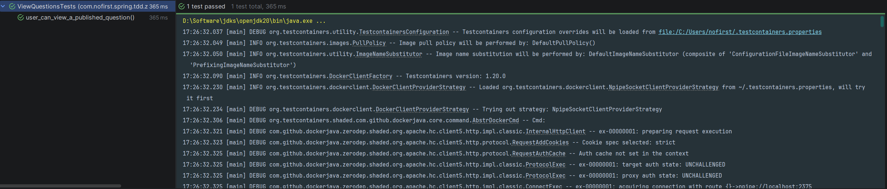
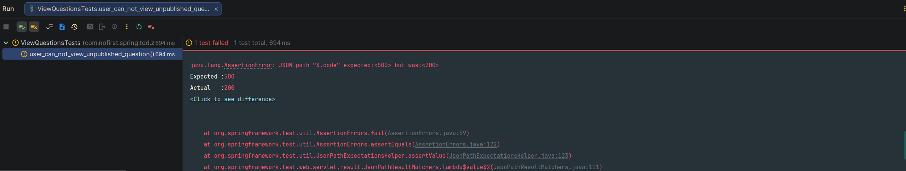
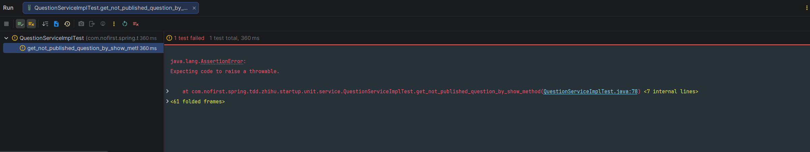

## 本节说明

在本节，我们给`Question`问题模型添加一个是否发布的属性，并且用户只能浏览跟回答已发布的问题，而不能对未发布的问题进行操作。

## 修改测试

首先我们需要修改`ViewQuestionsTest.php` 文件，修改测试方法（注意顶部 `use Carbon\Carbon;`）：

*tests/Feature/ViewQuestionsTest.php*
```java
@TestInstance(TestInstance.Lifecycle.PER_CLASS)
public class ViewQuestionsTests extends BaseContainerTest {
	.
    .
    .

    @Test
    void user_can_view_questions() throws Exception {
        .
        .
        .
    }

    @Test
    void user_can_view_a_published_question() throws Exception {
        // given：准备测试数据
        Question question = QuestionFactory.createQuestion();
        Date lastWeek = DateUtils.addWeeks(new Date(), -1);
        question.setPublishedAt(lastWeek);
        questionMapper.insert(question);

        // when：调用接口并获取返回结果
        String jsonResponse = this.mockMvc.perform(
                        get("/questions/{id}", question.getId())
                                .accept(MediaType.APPLICATION_JSON)
                )
                .andDo(print())
                .andExpect(status().isOk())
                .andReturn()
                .getResponse()
                .getContentAsString();

        // then：1. 解析JSON为QuestionVo，用TypeReference解决泛型擦除问题，确保data字段解析为QuestionVo
        TypeReference<CommonResult<QuestionVo>> typeRef = new TypeReference<>() {
        };
        CommonResult<QuestionVo> commonResult = objectMapper.readValue(jsonResponse, typeRef);

        // then：2. 断言QuestionVo的核心字段（覆盖所有关键字段）
        assertThat(commonResult.getCode()).isEqualTo(ResultCode.SUCCESS.getCode());

        QuestionVo questionVo = commonResult.getData();
        assertThat(questionVo.getId()).isEqualTo(question.getId());
        assertThat(questionVo.getUserId()).isEqualTo(question.getUserId());
        assertThat(questionVo.getTitle()).isEqualTo(question.getTitle());
        assertThat(questionVo.getContent()).isEqualTo(question.getContent());
    }

}
```

此时，我们还没有添加`publishedAt`属性，因此我们先添加字段，再重新生成`question`相关模型文件。

添加字段：

*V20260212__alter_table_question.sql*

```sql
alter table question
    add published_at timestamp null;
```

接下来运行Maven的`flyway`插件的`flyway:migrate`命令生成表，并修改`generatorConfig.xml`的配置，改为生成`question`表，运行`Generator#main()`方法重新生成对应的数据库映射文件。

运行测试：



## 新增测试

测试通过，但是，一般而言，我们还需要另一个对应测试，来完善我们的测试逻辑，那就是：不能浏览未发布的问题。所以我们新建测试：

```java
@Test
void user_can_not_view_unpublished_question() throws Exception {
    // given：准备测试数据
    Question question = QuestionFactory.createQuestion();
    question.setPublishedAt(null);
    questionMapper.insert(question);

    // when:
    this.mockMvc.perform(get("/questions/{id}", question.getId()))
            // then:
            .andExpect(status().isOk())
            .andExpect(jsonPath("$.code").value(ResultCode.FAILED.getCode()))
            .andExpect(jsonPath("$.message").value("question not publish"));
}
```

运行该测试：



我们的测试未通过，我们需要修改`QuestionService#show()`方法。别忘了，我们已经给该方法添加过单元测试，现在我们想对该方法的逻辑进行修改，我们需要先编写单元测试用例：

*src/test/java/com/nofirst/spring/tdd/zhihu/startup/unit/service/QuestionServiceImplTest.java*

```java
@ExtendWith(MockitoExtension.class)
class QuestionServiceImplTest {

    @InjectMocks
    private QuestionServiceImpl questionService;

    @Mock
    private QuestionMapper questionMapper;

    private Question question;

    @BeforeEach
    public void setup() {
        question = QuestionFactory.createQuestion();
        Date lastWeek = DateUtils.addWeeks(new Date(), -1);
        question.setPublishedAt(lastWeek);
    }
	.
    .
    .
    @Test
    void get_not_published_question_by_show_method() {
        // given
        this.question.setPublishedAt(null);
        given(questionMapper.selectByPrimaryKey(1)).willReturn(this.question);

        // then
        assertThatThrownBy(() -> {
            // when
            questionService.show(1);
        }).isInstanceOf(QuestionNotPublishedException.class)
                .hasMessageStartingWith("question not publish");
    }
}
```

添加`QuestionNotPublishedException`：

*src/main/java/com/nofirst/spring/tdd/zhihu/startup/exception/QuestionNotPublishedException.java*

```java
package com.nofirst.spring.tdd.zhihu.startup.exception;

import com.nofirst.spring.tdd.zhihu.startup.common.ResultCode;

public class QuestionNotPublishedException extends ApiException {
    
    public QuestionNotPublishedException() {
        super(ResultCode.FAILED, "question not publish");
    }
}

```

运行单元测试：



添加逻辑：

*src/main/java/com/nofirst/spring/tdd/zhihu/startup/service/impl/QuestionServiceImpl.java*

```java
@Override
public QuestionVo show(Integer id) {
    Question question = questionMapper.selectByPrimaryKey(id);
    if (Objects.isNull(question)) {
        throw new QuestionNotExistedException();
    }
    if (Objects.isNull(question.getPublishedAt())) {
        throw new QuestionNotPublishedException();
    }

    QuestionVo questionVo = new QuestionVo();
    questionVo.setId(question.getId());
    questionVo.setUserId(question.getUserId());
    questionVo.setTitle(question.getTitle());
    questionVo.setContent(question.getContent());

    return questionVo;
}
```

运行单元测试即可通过，幸运地是，运行集成测试`user_can_not_view_unpublished_question`也通过了！

## 提交代码
最后，我们提交一下代码：

```
$ git add .
$ git commit -m 'question published_at attribute'
```