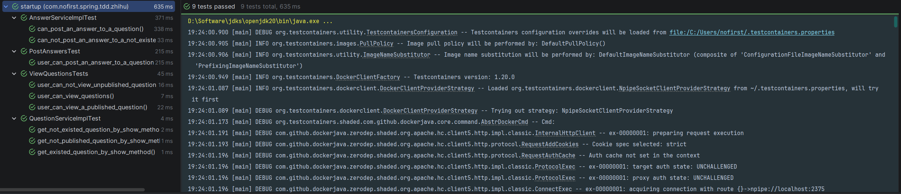

## 说明

本节我们对现有代码进行些重构。

## 重构代码

在重构之前，我们先运行全部测试：



现在我们的测试都是通过的，当我们进行重构或开发时，必须要保证在全部测试都通过的前提下进行。

我们来看下面这些代码：

```java
Question question = QuestionFactory.createQuestion();
Date lastWeek = DateUtils.addWeeks(new Date(), -1);
question.setPublishedAt(lastWeek);
questionMapper.insert(question);
```
我们在很多地方都用了类似上面的代码，但是当过几个月我们再看这段代码的时候，我们还能一眼就看出这行代码的目的吗？`DateUtils.addWeeks(new Date(), -1)`到底是想做什么呢？我们可以回答：这行代码的目的是希望得到一个已发布的问题实例。我们修改一下`QuestionFactory`：

```java
package com.nofirst.spring.tdd.zhihu.startup.factory;

import com.nofirst.spring.tdd.zhihu.startup.mbg.model.Question;
import org.apache.commons.lang3.time.DateUtils;

import java.util.Date;

public class QuestionFactory {

    public static Question createPublishedQuestion() {
        Date lastWeek = DateUtils.addWeeks(new Date(), -1);
        Date now = new Date();

        Question question = new Question();
        question.setUserId(1);
        question.setTitle("this is a question");
        question.setContent("this is content");
        question.setCreatedAt(now);
        question.setUpdatedAt(now);
        question.setPublishedAt(lastWeek);

        return question;
    }

    public static Question createUnpublishedQuestion() {
        Date now = new Date();

        Question question = new Question();
        question.setUserId(1);
        question.setTitle("this is a question");
        question.setContent("this is content");
        question.setCreatedAt(now);
        question.setUpdatedAt(now);
        question.setPublishedAt(null);

        return question;
    }
}
```

可以看到我们新提供了两个不同的方法，用以区分`question`是否发布。将涉及到的地方进行修改后再运行全部测试：


很好，测试通过！

## 提交代码

最后，我们来提交代码：

```
$ git add .
$ git commit -m 'refactory'
```