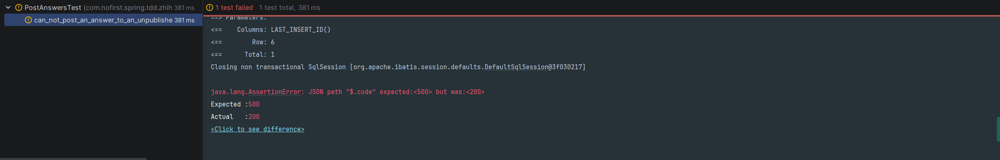
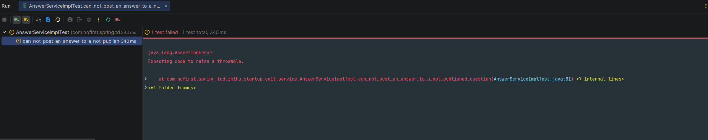

## 本节说明

之前的章节我们给问题模型定义了一个`published_at`属性，本节我们来修改下提交回答的逻辑。

## 新增测试

首先，我们重命名`user_can_post_an_answer_to_a_question()` 测试为`user_can_post_an_answer_to_a_published_question `，并做一些修改：

```java
@Test
void user_can_post_an_answer_to_a_published_question() throws Exception {
    // given：准备测试数据
    Question question = QuestionFactory.createPublishedQuestion();
    questionMapper.insert(question);
    AnswerExample answerExample = new AnswerExample();
    long beforeCount = answerMapper.countByExample(answerExample);
    assertThat(beforeCount).isEqualTo(0);

    // when：调用接口并获取返回结果
    AnswerDto answer = AnswerFactory.createAnswerDto();
    this.mockMvc.perform(post("/questions/{id}/answers", question.getId())
                    .contentType(MediaType.APPLICATION_JSON)
                    .content(JSONUtil.toJsonStr(answer))
            )
            .andDo(print())
            .andExpect(status().isOk())
            .andExpect(jsonPath("$.code").value(ResultCode.SUCCESS.getCode()));

    // then：数据库中answer数据增加了一条
    long afterCount = answerMapper.countByExample(answerExample);
    assertThat(afterCount).isEqualTo(1);
}
```

运行测试以保证测试通过。接下来我们新加一个测试，：

*src/test/java/com/nofirst/spring/tdd/zhihu/startup/integration/PostAnswersTest.java*

```java
    .
    .
    .
    @Test
    void can_not_post_an_answer_to_an_unpublished_question() throws Exception {
        // given：准备测试数据
        Question question = QuestionFactory.createUnpublishedQuestion();
        questionMapper.insert(question);

        // when:
        // when：调用接口并获取返回结果
        AnswerDto answer = AnswerFactory.createAnswerDto();
        this.mockMvc.perform(post("/questions/{id}/answers", question.getId())
                        .contentType(MediaType.APPLICATION_JSON)
                        .content(JSONUtil.toJsonStr(answer))
                )
                // then:
                .andExpect(status().isOk())
                .andExpect(jsonPath("$.code").value(ResultCode.FAILED.getCode()))
                .andExpect(jsonPath("$.message").value("question not publish"));
    }
}

```

运行测试：



我们收到了 `200` 的响应，说明尽管当前问题没有发布，仍然能够提交回答。这是逻辑漏洞，我们来修复它。依旧先从单元测试开始：

*src/test/java/com/nofirst/spring/tdd/zhihu/startup/unit/service/AnswerServiceImplTest.java*

```java
    .
    .
    .
    @Test
    void can_not_post_an_answer_to_a_not_published_question() {
        // given
        Question question = QuestionFactory.createUnpublishedQuestion();
        question.setId(1);
        given(questionMapper.selectByPrimaryKey(question.getId())).willReturn(question);

        // then
        assertThatThrownBy(() -> {
            // when
            answerService.store(1, this.defaultAnswerDto);
        }).isInstanceOf(QuestionNotExistedException.class)
                .hasMessageStartingWith("question not exist");
    }
}
```

运行测试：



进行逻辑修复：

*src/main/java/com/nofirst/spring/tdd/zhihu/startup/service/impl/AnswerServiceImpl.java*

```java
	.
	.
	.
	@Override
    public void store(Integer questionId, AnswerDto answerDto) {
        Question question = questionMapper.selectByPrimaryKey(questionId);
        if (Objects.isNull(question)) {
            throw new QuestionNotExistedException();
        }
        if (Objects.isNull(question.getPublishedAt())) {
            throw new QuestionNotPublishedException();
        }
        Date now = new Date();
        Answer answer = new Answer();
        answer.setQuestionId(questionId);
        answer.setUserId(1);
        answer.setCreatedAt(now);
        answer.setUpdatedAt(now);
        answer.setContent(answerDto.getContent());

        answerMapper.insert(answer);
    }
}
```

再次运行测试，单元测试已经通过。运行集成测试，也已通过，greate！

## 提交代码

最后，我们来提交代码：
```
$ git add .
$ git commit -m 'post answer'
```