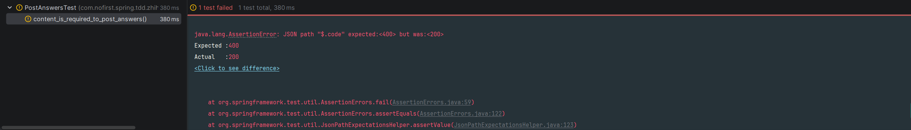
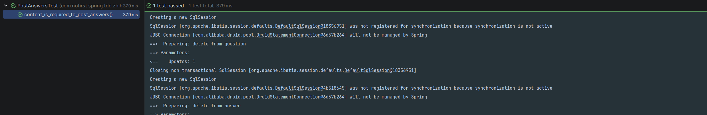

## 说明

本节我们关注表单验证的问题。

## 新增测试

现在我们的提交答案的功能完成了，但是并不完善。`web` 开发有一个安全原则：

> 永远不要相信用户的输入

因为你无法甄别善意客户与恶意客户，所以我们要对请求进行校验。目前我们提交的参数有两个：`user_id`和`content`。首先我们来校验`content`参数必填，依旧是从测试开始：

*src/test/java/com/nofirst/spring/tdd/zhihu/startup/integration/PostAnswersTest.java*

```java
    .
    .
    .
    @Test
    void content_is_required_to_post_answers() throws Exception {
        // given
        Question question = QuestionFactory.createPublishedQuestion();
        questionMapper.insert(question);
        AnswerDto answerDto = AnswerFactory.createAnswerDto();
        answerDto.setContent("");

        // when
        this.mockMvc.perform(post("/questions/{id}/answers", question.getId())
                        .contentType(MediaType.APPLICATION_JSON)
                        .content(objectMapper.writeValueAsString(answerDto))
                )
                // then
                .andExpect(status().isOk())
                .andExpect(jsonPath("$.code").value(ResultCode.VALIDATE_FAILED.getCode()))
                .andExpect(jsonPath("$.message").value("答案内容不能为空"));
    }
}
```

运行测试：



可以看到，我们期望得到400的响应，实际上却成功了。

## 完善逻辑

`Validation`框架进行校验。

首先加上校验逻辑：

```
@Data
public class AnswerDto {

    @NotBlank(message = "答案内容不能为空")
    private String content;
}
```

然后在controller层使校验逻辑生效：

``` java
@PostMapping("/questions/{questionId}/answers")
public CommonResult<String> store(@PathVariable Integer questionId, @RequestBody @Validated // 注意此处 AnswerDto answerDto) {
    answerService.store(questionId, answerDto);
    return CommonResult.success("success");
}
```

再次运行测试：




## 功能重构

测试通过，接下来我们该处理`user_id` 的问题了。等等，好像有点奇怪，我们当前的业务逻辑有点问题！当前我们提交回答的时候，会指定`user_id`，这很奇怪，通常来说我们应该是限定当前登录用户才能进行提交回答，所以我们需要修改我们的业务代码。当我们准备修改代码时，首先要做的事情是，运行全部测试：

```
$ phpunit
```


现在所有的测试都是通过的，接下来我们将 `user_can_post_an_answer_to_a_published_question()` 测试重命名，并去掉`user_id`的参数：

*tests/Feature/PostAnswersTest.php*
```
<?php
.
.
.
class PostAnswersTest extends TestCase
{
    .
	.
	.

    /** @test */
    public function signed_in_user_can_post_an_answer_to_a_published_question()
    {
        $question = Question::factory()->published()->create();
        $user = User::factory()->create();

        $response = $this->post("/questions/{$question->id}/answers", [
            'content' => 'This is an answer.'
        ]);

        $response->assertStatus(201);

        $answer = $question->answers()->where('user_id',$user->id)->first();
        $this->assertNotNull($answer);

        $this->assertEquals(1,$question->answers()->count());
    }
.
.
.
```

运行测试：

```
$ phpunit --filter  signed_in_user_can_post_an_answer_to_a_published_question 
```


现在我们没有传递`user_id`参数，所以控制器获取到的请求中的`user_id` 的值时`null`。我们来修改控制器，应用`auth`中间件，只允许已经登录的用户访问：

*app/Http/Controllers/AnswersController.php*
```
.
.
.
class AnswersController extends Controller
{
    public function __construct()
    {
        $this->middleware('auth');
    }

    public function store($questionId)
    {
        $question = Question::published()->findOrFail($questionId);

        $this->validate(request(), [
            'content' => 'required'
        ]);

        $question->answers()->create([
            'user_id' => auth()->id(),
            'content' => request('content')
        ]);

        return response()->json([],201);
    }
}

```

再次运行测试：

```
$ phpunit --filter  signed_in_user_can_post_an_answer_to_a_published_question 
```


这次的错误有点令人迷惑，由于我们已经在控制器的构造方法中使用了`auth`中间件，所以未登录用户尝试提交回答时，会被重定向到 `/login`，但是我们现在还没有这个路由。

趁此机会，我们来引入`Laravel` 的 [用户认证](https://learnku.com/docs/laravel/{{doc_version}}/authentication) 功能。首先我们安装`laravel/ui`，依次运行下面两行命令：

```
$ composer require laravel/ui:^3.0 --dev
```

`composer require` 是用来安装扩展包使用的命令，参数 `--dev` 是指定此扩展包只在开发环境中使用。

然后：
```
$ php artisan ui vue --auth
```

接下来安装前端依赖：

```
$ npm install
```

接下来运行前端编译：

```
$ npm run dev
```

成功后的界面（如有报错，请再次运行 `npm run dev` 命令）：


现在查看一下路由文件：

*web.php*
```
<?php

use Illuminate\Support\Facades\Route;

Route::get('/questions', 'QuestionsController@index');
Route::get('/questions/{question}', 'QuestionsController@show');

Route::post('/questions/{question}/answers','AnswersController@store');

Auth::routes();

Route::get('/home', 'HomeController@index')->name('home');

```

修改如下：

*web.php*

```
<?php

use Illuminate\Support\Facades\Route;

Auth::routes();

Route::get('/questions', 'QuestionsController@index');
Route::get('/questions/{question}', 'QuestionsController@show');

Route::post('/questions/{question}/answers', 'AnswersController@store');
```


现在再次运行测试：

```
$ phpunit --filter  signed_in_user_can_post_an_answer_to_a_published_question 
```


这次的错误有一个信息我们需要注意：未认证时异常的类型是`Illuminate\Auth\AuthenticationException`。接下来我们就需要在测试中模拟用户的登录行为，我们修改测试：

*tests/Feature/PostAnswersTest.php*
```
.
.
.
class PostAnswersTest extends TestCase
{
    .
	.
	.

    /** @test */
    public function signed_in_user_can_post_an_answer_to_a_published_question()
    {
        $question = Question::factory()->published()->create();
        $this->actingAs($user = User::factory()->create());

        $response = $this->post("/questions/{$question->id}/answers", [
            'content' => 'This is a answer.'
        ]);

        $response->assertStatus(201);

        $answer = $question->answers()->where('user_id', $user->id)->first();
        $this->assertNotNull($answer);

        $this->assertEquals(1, $question->answers()->count());
    }
	.
	.
	.
}
```

再次运行测试：

```
$ phpunit --filter  signed_in_user_can_post_an_answer_to_a_published_question 
```


测试通过！一般而言，当我们某个测试是测试登录用户的某个行为时，通常会有一个相对应的测试：测试未登录用户不能进行该行为。我们在下一节添加该测试。


## 提交代码
最后，我们提交一下代码：

```
$ git add .
$ git commit -m 'post answer validation:part 1'
```