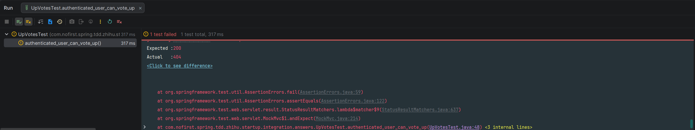

## 本节说明

本节我们来开发对答案的赞同功能。

## 未登录用户

首先我们新建测试：

*src/test/java/com/nofirst/spring/tdd/zhihu/startup/integration/answers/UpVotesTest.java*

```java
package com.nofirst.spring.tdd.zhihu.startup.integration.answers;

import com.nofirst.spring.tdd.zhihu.startup.integration.BaseContainerTest;
import org.junit.jupiter.api.Test;

import static org.springframework.test.web.servlet.request.MockMvcRequestBuilders.post;
import static org.springframework.test.web.servlet.result.MockMvcResultHandlers.print;
import static org.springframework.test.web.servlet.result.MockMvcResultMatchers.status;

class UpVotesTest extends BaseContainerTest {

    @Test
    void guest_can_not_vote_up() throws Exception {
        this.mockMvc.perform(post("/answers/1/up-votes"))
                .andDo(print())
                .andExpect(status().is(401));
    }
}
```

这个测试会直接通过。

## 已登录用户

接下来新增已登录用户进行`vote`的测试：

*src/test/java/com/nofirst/spring/tdd/zhihu/startup/integration/answers/UpVotesTest.java*

```java
package com.nofirst.spring.tdd.zhihu.startup.integration.answers;

import com.nofirst.spring.tdd.zhihu.startup.common.ResultCode;
import com.nofirst.spring.tdd.zhihu.startup.integration.BaseContainerTest;
import com.nofirst.spring.tdd.zhihu.startup.mbg.mapper.VoteMapper;
import com.nofirst.spring.tdd.zhihu.startup.mbg.model.Answer;
import com.nofirst.spring.tdd.zhihu.startup.mbg.model.Vote;
import com.nofirst.spring.tdd.zhihu.startup.mbg.model.VoteExample;
import com.nofirst.spring.tdd.zhihu.startup.model.enums.VoteActionType;
import org.junit.jupiter.api.BeforeEach;
import org.junit.jupiter.api.Test;
import org.springframework.beans.factory.annotation.Autowired;
import org.springframework.security.test.context.support.WithUserDetails;

import java.util.List;

import static org.assertj.core.api.Assertions.assertThat;
import static org.springframework.test.web.servlet.request.MockMvcRequestBuilders.post;
import static org.springframework.test.web.servlet.result.MockMvcResultHandlers.print;
import static org.springframework.test.web.servlet.result.MockMvcResultMatchers.jsonPath;
import static org.springframework.test.web.servlet.result.MockMvcResultMatchers.status;

class UpVotesTest extends BaseContainerTest {

    @Autowired
    private VoteMapper voteMapper;

    @BeforeEach
    public void setupTestData() {
        VoteExample voteExample = new VoteExample();
        voteExample.createCriteria();
        voteMapper.deleteByExample(voteExample);
    }

    @Test
    void guest_can_not_vote_up() throws Exception {
        this.mockMvc.perform(post("/answers/1/up-votes"))
                .andDo(print())
                .andExpect(status().is(401));
    }

    @Test
    @WithUserDetails(value = "John", userDetailsServiceBeanName = "customUserDetailsService")
    void authenticated_user_can_vote_up() throws Exception {
        // given
        this.mockMvc.perform(post("/answers/1/up-votes"))
                .andDo(print())
                .andExpect(status().isOk())
                .andExpect(jsonPath("$.code").value(ResultCode.SUCCESS.getCode()));

        VoteExample voteExample = new VoteExample();
        VoteExample.Criteria criteria = voteExample.createCriteria();
        criteria.andResourceIdEqualTo(1);
        criteria.andResourceTypeEqualTo(Answer.class.getSimpleName());
        criteria.andActionTypeEqualTo(VoteActionType.VOTE_UP.getCode());
        List<Vote> votes = voteMapper.selectByExample(voteExample);

        assertThat(votes).size().isEqualTo(1);
    }
}
```

准备好创建`vote`表：

*src/main/resources/db/migration/V2026022701__create_table_vote.sql*

```sql
CREATE TABLE `vote` (
                        `id` int unsigned NOT NULL AUTO_INCREMENT,
                        `user_id` int NOT NULL comment '用户编号',
                        `resource_id` int NOT NULL comment '所属资源的编号，例如 Question、Answer模型的id',
                        `resource_type` VARCHAR(10) NOT NULL comment '所属资源的类型，如Question、Answer',
                        `action_type` tinyint NOT NULL comment '投票类型，1：赞同；2：反对',
                        `created_at` timestamp NOT NULL  comment '创建时间',
                        `updated_at` timestamp NOT NULL  comment '更新时间',
                        PRIMARY KEY (`id`)
) ENGINE=InnoDB AUTO_INCREMENT=1 comment '投票表';

ALTER TABLE `vote` add CONSTRAINT unq_user_id_vote UNIQUE (`user_id`, `resource_id`,`resource_type`);
```

从建表语句可以看出来，这个表除了可以给答案模型进行赞同与反对之外，还可以给其他模型，例如问题模型进行推荐与举报，给后面的评论模型进行赞同与反对。并且，我们设置了唯一索引，这意味着对同一个模型资源，同一个用户只能赞同或者反对一次。

接下来运行Maven的`flyway`插件的`flyway:migrate`命令生成表，并修改`generatorConfig.xml`的配置，改为生成`vote`表，运行`Generator#main()`方法重新生成对应的数据库映射文件。

新建`VoteActionType`枚举：

*src/main/java/com/nofirst/spring/tdd/zhihu/startup/model/enums/VoteActionType.java*

```java
package com.nofirst.spring.tdd.zhihu.startup.model.enums;

public enum VoteActionType {

    NOTHING((byte) 0, "未进行"),

    VOTE_UP((byte) 1, "赞同"),

    VOTE_DOWN((byte) 2, "反对");

    private final Byte code;
    private final String description;

    VoteActionType(Byte code, String description) {
        this.code = code;
        this.description = description;
    }

    public Byte getCode() {
        return code;
    }

    public String getDescription() {
        return description;
    }
}
```

运行测试：



显示路由不存在，那我们就来添加对应的controller和路由：

*src/main/java/com/nofirst/spring/tdd/zhihu/startup/controller/AnswerUpVoteController.java*

```java
package com.nofirst.spring.tdd.zhihu.startup.controller;

import com.nofirst.spring.tdd.zhihu.startup.common.CommonResult;
import com.nofirst.spring.tdd.zhihu.startup.security.AccountUser;
import lombok.AllArgsConstructor;
import org.springframework.security.core.annotation.AuthenticationPrincipal;
import org.springframework.web.bind.annotation.PathVariable;
import org.springframework.web.bind.annotation.PostMapping;
import org.springframework.web.bind.annotation.RestController;

@RestController
@AllArgsConstructor
public class AnswerUpVoteController {

    @PostMapping("/answers/{answerId}/up-votes")
    public CommonResult<String> store(@PathVariable Integer answerId, @AuthenticationPrincipal AccountUser accountUser) {
        return CommonResult.success("ok");
    }
}
```

再次运行测试：


我们没有写任何逻辑，当然测试会失败。我们补充完整逻辑：

*src/main/java/com/nofirst/spring/tdd/zhihu/startup/service/AnswerVoteUpService.java*

```java
public interface AnswerVoteUpService {

    void store(Integer answerId, AccountUser accountUser);
}
```

*src/main/java/com/nofirst/spring/tdd/zhihu/startup/service/impl/AnswerVoteUpServiceImpl.java*

```java
package com.nofirst.spring.tdd.zhihu.startup.service.impl;

import com.nofirst.spring.tdd.zhihu.startup.mbg.mapper.VoteMapper;
import com.nofirst.spring.tdd.zhihu.startup.mbg.model.Answer;
import com.nofirst.spring.tdd.zhihu.startup.mbg.model.Vote;
import com.nofirst.spring.tdd.zhihu.startup.model.enums.VoteActionType;
import com.nofirst.spring.tdd.zhihu.startup.security.AccountUser;
import com.nofirst.spring.tdd.zhihu.startup.service.AnswerVoteUpService;
import lombok.AllArgsConstructor;
import org.springframework.stereotype.Service;

import java.util.Date;

@Service
@AllArgsConstructor
public class AnswerVoteUpServiceImpl implements AnswerVoteUpService {

    private VoteMapper voteMapper;

    @Override
    public void store(Integer answerId, AccountUser accountUser) {
        Vote vote = new Vote();
        vote.setUserId(accountUser.getUserId());
        vote.setResourceId(answerId);
        vote.setResourceType(Answer.class.getSimpleName());
        vote.setActionType(VoteActionType.VOTE_UP.getCode());
        Date now = new Date();
        vote.setCreatedAt(now);
        vote.setUpdatedAt(now);

        voteMapper.insert(vote);
    }
}
```

*src/main/java/com/nofirst/spring/tdd/zhihu/startup/controller/AnswerUpVoteController.java*

```java
@RestController
@AllArgsConstructor
public class AnswerUpVoteController {

    private final AnswerVoteUpService answerVoteUpService;
    
    @PostMapping("/answers/{answerId}/up-votes")
    public CommonResult<String> store(@PathVariable Integer answerId, @AuthenticationPrincipal AccountUser accountUser) {
        answerVoteUpService.store(answerId, accountUser);
        return CommonResult.success("ok");
    }
}
```

再次运行测试，测试通过。

## 提交代码

最后，我们提交一下代码：

```
$ git add .
$ git commit -m 'vote up'
```