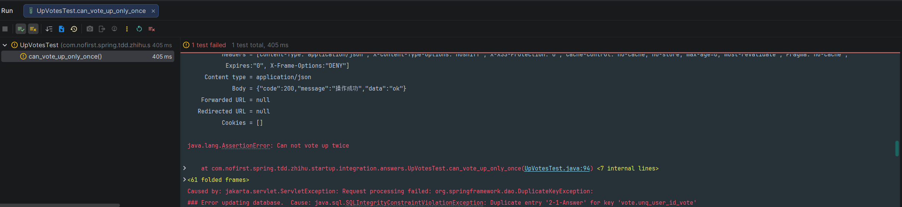

## 本节说明

本节我们来为赞同功能增加一个逻辑限定：不能重复赞同相同的问题。


## 新增测试

依旧是从新增测试开始：

*src/test/java/com/nofirst/spring/tdd/zhihu/startup/integration/answers/UpVotesTest.java*

```java
	.
	.
	.
    @Test
    @WithUserDetails(value = "John", userDetailsServiceBeanName = "customUserDetailsService")
    void can_vote_up_only_once() {
        // given
        try {
            this.mockMvc.perform(post("/answers/1/up-votes"));
            this.mockMvc.perform(post("/answers/1/up-votes"));
        } catch (Exception e) {
            fail("Can not vote up twice", e);
        }
    }
}
```

运行测试：



在我们的测试中，我们连续向同一个答案`upVote`了两次，导致程序发生异常；然后我们捕获异常，将测试失败的信息打印出来。

**为什么会发生异常呢？** 因为我们在`votes`表中设置了唯一索引：

```sql
ALTER TABLE `vote` add CONSTRAINT unq_user_id_vote UNIQUE (`user_id`, `resource_id`,`resource_type`);
```

那我们的测试需要修改吗？修改成遇到此类异常才算测试未通过？答案是不需要，因为我们不允许任何异常抛出，只要有异常发生就可以认为测试失败。

我们来修改 `AnswerVoteUpService#store()` 方法：

*src/main/java/com/nofirst/spring/tdd/zhihu/startup/service/impl/AnswerVoteUpServiceImpl.java*

```java
	@Override
    public void store(Integer answerId, AccountUser accountUser) {
        VoteExample voteExample = new VoteExample();
        VoteExample.Criteria criteria = voteExample.createCriteria();
        criteria.andResourceIdEqualTo(answerId);
        criteria.andUserIdEqualTo(accountUser.getUserId());
        criteria.andResourceTypeEqualTo(Answer.class.getSimpleName());
        criteria.andActionTypeEqualTo(VoteActionType.VOTE_UP.getCode());
        long count = voteMapper.countByExample(voteExample);
        if (count == 0) {
            Vote vote = new Vote();
            vote.setUserId(accountUser.getUserId());
            vote.setResourceId(answerId);
            vote.setResourceType(Answer.class.getSimpleName());
            vote.setActionType(VoteActionType.VOTE_UP.getCode());
            Date now = new Date();
            vote.setCreatedAt(now);
            vote.setUpdatedAt(now);

            voteMapper.insert(vote);
        }
    }
```

再次运行测试，测试通过。

> 注：其实我们这里悄悄留下来一个坑，虽然我们不能赞同两次，但是在目前的代码逻辑下，我们可以先反对，再赞同，这样程序会因为唯一索引的原因报错。这个坑等到了后续开发反对功能的时候我们再填。


## 提交代码

```
$ git add .
$ git commit -m 'vote only once'
```