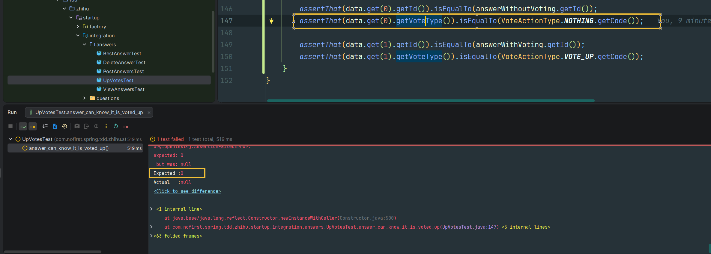
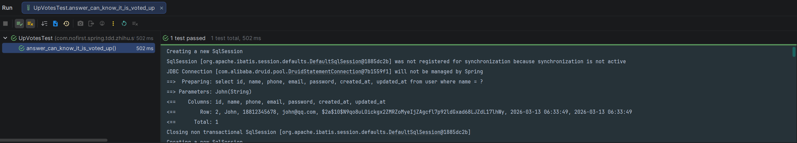
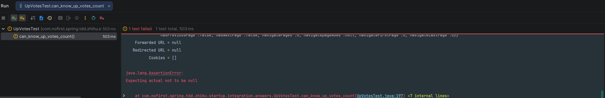

## 本节说明

本节我们来获取一些跟赞同有关的数据：是否被赞同以及赞同的数量。当一个用户登录后，该用户在查看问题详情页时会看到答案列表，那么他可以看到每个答案是否已经被他赞同过，以及每个答案被赞同的次数。

## 是否被赞同

我们依旧是从新增测试开始：
*tests/Feature/Answers/UpVotesTest.php*

```
package com.nofirst.spring.tdd.zhihu.startup.integration.answers;

import com.fasterxml.jackson.core.type.TypeReference;
import com.fasterxml.jackson.databind.ObjectMapper;
import com.github.pagehelper.PageInfo;
import com.nofirst.spring.tdd.zhihu.startup.common.CommonResult;
import com.nofirst.spring.tdd.zhihu.startup.common.ResultCode;
import com.nofirst.spring.tdd.zhihu.startup.factory.AnswerFactory;
import com.nofirst.spring.tdd.zhihu.startup.factory.QuestionFactory;
import com.nofirst.spring.tdd.zhihu.startup.integration.BaseContainerTest;
import com.nofirst.spring.tdd.zhihu.startup.mbg.mapper.AnswerMapper;
import com.nofirst.spring.tdd.zhihu.startup.mbg.mapper.QuestionMapper;
import com.nofirst.spring.tdd.zhihu.startup.mbg.mapper.VoteMapper;
import com.nofirst.spring.tdd.zhihu.startup.mbg.model.Answer;
import com.nofirst.spring.tdd.zhihu.startup.mbg.model.AnswerExample;
import com.nofirst.spring.tdd.zhihu.startup.mbg.model.Question;
import com.nofirst.spring.tdd.zhihu.startup.mbg.model.Vote;
import com.nofirst.spring.tdd.zhihu.startup.mbg.model.VoteExample;
import com.nofirst.spring.tdd.zhihu.startup.model.enums.VoteActionType;
import com.nofirst.spring.tdd.zhihu.startup.model.vo.AnswerVo;
import org.junit.jupiter.api.BeforeEach;
import org.junit.jupiter.api.Test;
import org.springframework.beans.factory.annotation.Autowired;
import org.springframework.security.test.context.support.WithUserDetails;

import java.nio.charset.StandardCharsets;
import java.util.List;

import static org.assertj.core.api.Assertions.assertThat;
import static org.assertj.core.api.Fail.fail;
import static org.springframework.test.web.servlet.request.MockMvcRequestBuilders.delete;
import static org.springframework.test.web.servlet.request.MockMvcRequestBuilders.get;
import static org.springframework.test.web.servlet.request.MockMvcRequestBuilders.post;
import static org.springframework.test.web.servlet.result.MockMvcResultHandlers.print;
import static org.springframework.test.web.servlet.result.MockMvcResultMatchers.jsonPath;
import static org.springframework.test.web.servlet.result.MockMvcResultMatchers.status;

class UpVotesTest extends BaseContainerTest {

    @Autowired
    private VoteMapper voteMapper;
    @Autowired
    private AnswerMapper answerMapper;
    @Autowired
    private QuestionMapper questionMapper;

    @Autowired
    private ObjectMapper objectMapper;
    @Autowired
    private CustomUserDetailsService customUserDetailsService;

    @BeforeEach
    public void setupTestData() {
        VoteExample voteExample = new VoteExample();
        voteExample.createCriteria();
        voteMapper.deleteByExample(voteExample);
        AnswerExample answerExample = new AnswerExample();
        answerExample.createCriteria();
        answerMapper.deleteByExample(answerExample);
    }
    .
    .
    .
    @Test
    @WithUserDetails(value = "John", userDetailsServiceBeanName = "customUserDetailsService")
    void answer_can_know_it_is_voted_up() throws Exception {
        // given
        Question publishedQuestion = QuestionFactory.createPublishedQuestion();
        questionMapper.insert(publishedQuestion);
        Answer answerWithoutVoting = AnswerFactory.createAnswer(publishedQuestion.getId());
        answerMapper.insert(answerWithoutVoting);
        Answer answerWithVoting = AnswerFactory.createAnswer(publishedQuestion.getId());
        answerMapper.insert(answerWithVoting);
        // vote up
        this.mockMvc.perform(post("/answers/{answerId}/up-votes", answerWithVoting.getId()));

        // when
        String json = this.mockMvc.perform(get("/questions/{questionId}/answers?pageIndex=1&pageSize=20", publishedQuestion.getId()))
                .andExpect(status().isOk()).andReturn().getResponse()
                .getContentAsString(StandardCharsets.UTF_8);

        // then
        TypeReference<CommonResult<PageInfo<AnswerVo>>> typeRef = new TypeReference<>() {
        };
        CommonResult<PageInfo<AnswerVo>> pageResult = objectMapper.readValue(json, typeRef);
        List<AnswerVo> data = pageResult.getData().getList();
        assertThat(data.size()).isEqualTo(2);

        assertThat(data.get(0).getId()).isEqualTo(answerWithoutVoting.getId());
        assertThat(data.get(0).getVoteType()).isEqualTo(VoteActionType.NOTHING.getCode());

        assertThat(data.get(1).getId()).isEqualTo(answerWithVoting.getId());
        assertThat(data.get(1).getVoteType()).isEqualTo(VoteActionType.VOTE_UP.getCode());
        
        // 切换到1号用户进行访问
        json = this.mockMvc.perform(get("/questions/{questionId}/answers?pageIndex=1&pageSize=20", publishedQuestion.getId())
                        .with(user(customUserDetailsService.loadUserByUsername("Jane")))
                ).andExpect(status().isOk()).andReturn().getResponse()
                .getContentAsString(StandardCharsets.UTF_8);
        pageResult = objectMapper.readValue(json, typeRef);
        data = pageResult.getData().getList();
        assertThat(data.size()).isEqualTo(2);
        // 对1号用户而言，两条都是没有点过赞的
        assertThat(data.get(0).getId()).isEqualTo(answerWithoutVoting.getId());
        assertThat(data.get(0).getVoteType()).isEqualTo(VoteActionType.NOTHING.getCode());
        assertThat(data.get(1).getId()).isEqualTo(answerWithVoting.getId());
        assertThat(data.get(1).getVoteType()).isEqualTo(VoteActionType.NOTHING.getCode());
    }
}
```

从测试可以看到，我们创建了两个`Answer`，第一个没有被用户赞同，第二个被用户赞同过。在查看答案列表页的时候，可以知道第一个没有被赞同过，第二个被赞同过。我们通过`voteType`字段来表达不同的含义：

*src/main/java/com/nofirst/spring/tdd/zhihu/startup/model/vo/AnswerVo.java*

```java
package com.nofirst.spring.tdd.zhihu.startup.model.vo;

import lombok.Data;

import java.util.Date;

@Data
public class AnswerVo {

    private Integer id;

    private Integer questionId;

    private Integer userId;

    private Date createdAt;

    private Date updatedAt;

    private String content;

    private Byte voteType;
}
```

运行测试，会发现测试失败：



完善功能逻辑：

*src/main/java/com/nofirst/spring/tdd/zhihu/startup/service/impl/AnswerServiceImpl.java*

```java
@Service
@AllArgsConstructor
public class AnswerServiceImpl implements AnswerService {

    private final AnswerMapper answerMapper;
    private final QuestionMapper questionMapper;
    private final QuestionMapperExt questionMapperExt;
    private final VoteMapper voteMapper;

    @Override
    public PageInfo<AnswerVo> answers(Integer questionId, int pageIndex, int pageSize, AccountUser accountUser) {
        PageHelper.startPage(pageIndex, pageSize);
        AnswerExample example = new AnswerExample();
        example.createCriteria().andQuestionIdEqualTo(questionId);
        List<Answer> answers = answerMapper.selectByExample(example);
        PageInfo<Answer> answerPageInfo = new PageInfo<>(answers);
        List<AnswerVo> result = new ArrayList<>();
        for (Answer answer : answers) {
            AnswerVo vo = new AnswerVo();
            vo.setId(answer.getId());
            vo.setQuestionId(answer.getQuestionId());
            vo.setUserId(answer.getUserId());
            vo.setCreatedAt(answer.getCreatedAt());
            vo.setUpdatedAt(answer.getUpdatedAt());
            vo.setContent(answer.getContent());
            vo.setVoteType(getVoteType(answer.getId(),accountUser.getUserId()));
            result.add(vo);
        }
        PageInfo<AnswerVo> pageResult = new PageInfo<>();
        pageResult.setTotal(answerPageInfo.getTotal());
        pageResult.setPageNum(answerPageInfo.getPageNum());
        pageResult.setPageSize(answerPageInfo.getPageSize());
        pageResult.setSize(answerPageInfo.getSize());
        pageResult.setList(result);

        return pageResult;
    }

    private Byte getVoteType(Integer answerId, Integer userId) {
        VoteExample voteExample = new VoteExample();
        voteExample.createCriteria()
                .andResourceIdEqualTo(answerId)
                .andUserIdEqualTo(userId)
                .andResourceTypeEqualTo(Answer.class.getSimpleName());

        List<Vote> votes = voteMapper.selectByExample(voteExample);

        if (CollectionUtils.isEmpty(votes)) {
            return VoteActionType.NOTHING.getCode();
        }

        return votes.get(0).getActionType();
    }
    .
    .
    .
}
```

我们使用`getVoteType()`方法获得了vote的类型，再次运行测试，测试会通过。

但是，你肯定会注意到，这里已经引入了`N+1`问题，是一个性能隐患。由于我们已经完善了测试用例，所以我们可以放心大胆地进行重构，而不用担心功能被破坏，这正是`TDD`的核心优势之一。我们进行如下重构：

```java
package com.nofirst.spring.tdd.zhihu.startup.service.impl;


import com.github.pagehelper.PageHelper;
import com.github.pagehelper.PageInfo;
import com.nofirst.spring.tdd.zhihu.startup.exception.QuestionNotExistedException;
import com.nofirst.spring.tdd.zhihu.startup.exception.QuestionNotPublishedException;
import com.nofirst.spring.tdd.zhihu.startup.mbg.mapper.AnswerMapper;
import com.nofirst.spring.tdd.zhihu.startup.mbg.mapper.QuestionMapper;
import com.nofirst.spring.tdd.zhihu.startup.mbg.mapper.QuestionMapperExt;
import com.nofirst.spring.tdd.zhihu.startup.mbg.mapper.VoteMapper;
import com.nofirst.spring.tdd.zhihu.startup.mbg.model.Answer;
import com.nofirst.spring.tdd.zhihu.startup.mbg.model.AnswerExample;
import com.nofirst.spring.tdd.zhihu.startup.mbg.model.Question;
import com.nofirst.spring.tdd.zhihu.startup.mbg.model.Vote;
import com.nofirst.spring.tdd.zhihu.startup.mbg.model.VoteExample;
import com.nofirst.spring.tdd.zhihu.startup.model.dto.AnswerDto;
import com.nofirst.spring.tdd.zhihu.startup.model.enums.VoteActionType;
import com.nofirst.spring.tdd.zhihu.startup.model.vo.AnswerVo;
import com.nofirst.spring.tdd.zhihu.startup.security.AccountUser;
import com.nofirst.spring.tdd.zhihu.startup.service.AnswerService;
import lombok.AllArgsConstructor;
import org.springframework.stereotype.Service;
import org.springframework.util.CollectionUtils;

import java.util.ArrayList;
import java.util.Date;
import java.util.List;
import java.util.Map;
import java.util.Objects;
import java.util.stream.Collectors;

@Service
@AllArgsConstructor
public class AnswerServiceImpl implements AnswerService {

    private final AnswerMapper answerMapper;
    private final QuestionMapper questionMapper;
    private final QuestionMapperExt questionMapperExt;
    private final VoteMapper voteMapper;

    @Override
    public PageInfo<AnswerVo> answers(Integer questionId, int pageIndex, int pageSize) {
        PageHelper.startPage(pageIndex, pageSize);
        AnswerExample example = new AnswerExample();
        example.createCriteria().andQuestionIdEqualTo(questionId);
        List<Answer> answers = answerMapper.selectByExample(example);
        PageInfo<Answer> answerPageInfo = new PageInfo<>(answers);
        List<AnswerVo> result = new ArrayList<>();
        for (Answer answer : answers) {
            AnswerVo vo = new AnswerVo();
            vo.setId(answer.getId());
            vo.setQuestionId(answer.getQuestionId());
            vo.setUserId(answer.getUserId());
            vo.setCreatedAt(answer.getCreatedAt());
            vo.setUpdatedAt(answer.getUpdatedAt());
            vo.setContent(answer.getContent());
            result.add(vo);
        }
        appendVoteType(result);

        PageInfo<AnswerVo> pageResult = new PageInfo<>();
        pageResult.setTotal(answerPageInfo.getTotal());
        pageResult.setPageNum(answerPageInfo.getPageNum());
        pageResult.setPageSize(answerPageInfo.getPageSize());
        pageResult.setSize(answerPageInfo.getSize());
        pageResult.setList(result);

        return pageResult;
    }

    private void appendVoteType(List<AnswerVo> result) {
        if (CollectionUtils.isEmpty(result)) {
            return;
        }

        List<Integer> answerIds = result.stream().map(AnswerVo::getId).toList();

        VoteExample voteExample = new VoteExample();
        voteExample.createCriteria()
                .andResourceIdIn(answerIds)
                .andUserIdEqualTo(userId)
                .andResourceTypeEqualTo(Answer.class.getSimpleName());
        List<Vote> votes = voteMapper.selectByExample(voteExample);
        if (CollectionUtils.isEmpty(votes)) {
            result.forEach(t -> t.setVoteType(VoteActionType.NOTHING.getCode()));
            return;
        }

        Map<Integer, Byte> answerActionMap = votes.stream().collect(Collectors.toMap(Vote::getResourceId, Vote::getActionType));
        result.forEach(t -> {
            if (answerActionMap.containsKey(t.getId())) {
                t.setVoteType(answerActionMap.get(t.getId()));
            } else {
                t.setVoteType(VoteActionType.NOTHING.getCode());
            }
        });
    }
    .
    .
    .	
}
```

> 注：这里我们新加了方法参数`AccountUser accountUser`，在`QuestionService#show()`方法中也要进行修改。
>
> 此外，会有几个单元测试会编译失败，需要自行创建变量：`AccountUser accountUser = new AccountUser(1, "password", "user");`。

重新运行测试：



测试是通过的，这说明我们没有破坏任何功能。

## 点赞数量

添加测试：

*src/test/java/com/nofirst/spring/tdd/zhihu/startup/integration/answers/UpVotesTest.java*

```
class UpVotesTest extends BaseContainerTest {

    @Autowired
    private VoteMapper voteMapper;
    @Autowired
    private AnswerMapper answerMapper;
    @Autowired
    private QuestionMapper questionMapper;

    @Autowired
    private ObjectMapper objectMapper;
    @Autowired
    private CustomUserDetailsService customUserDetailsService;

    @BeforeEach
    public void setupTestData() {
        VoteExample voteExample = new VoteExample();
        voteExample.createCriteria();
        voteMapper.deleteByExample(voteExample);
        AnswerExample answerExample = new AnswerExample();
        answerExample.createCriteria();
        answerMapper.deleteByExample(answerExample);
    }
    .
    .
    .
    @Test
    @WithUserDetails(value = "John", userDetailsServiceBeanName = "customUserDetailsService")
    void can_know_up_votes_count() throws Exception {
        // given
        Question publishedQuestion = QuestionFactory.createPublishedQuestion();
        questionMapper.insert(publishedQuestion);
        Answer answer = AnswerFactory.createAnswer(publishedQuestion.getId());
        answerMapper.insert(answer);
        // 2号用户 vote up
        this.mockMvc.perform(post("/answers/{answerId}/up-votes", answer.getId()));
        // 1号用户 vote up
        this.mockMvc.perform(post("/answers/{answerId}/up-votes", answer.getId())
                .with(user(customUserDetailsService.loadUserByUsername("Jane"))));

        // when
        String json = this.mockMvc.perform(get("/questions/{questionId}/answers?pageIndex=1&pageSize=20", publishedQuestion.getId()))
                .andExpect(status().isOk()).andReturn().getResponse()
                .getContentAsString(StandardCharsets.UTF_8);

        // then
        TypeReference<CommonResult<PageInfo<AnswerVo>>> typeRef = new TypeReference<>() {
        };
        CommonResult<PageInfo<AnswerVo>> pageResult = objectMapper.readValue(json, typeRef);
        List<AnswerVo> data = pageResult.getData().getList();
        assertThat(data.size()).isEqualTo(1);
        assertThat(data.get(0).getId()).isEqualTo(answer.getId());
        assertThat(data.get(0).getVoteUpCount()).isEqualTo(2);
    }
}
```

添加`voteUpCount`属性：

*src/main/java/com/nofirst/spring/tdd/zhihu/startup/model/vo/AnswerVo.java*

```java
@Data
public class AnswerVo {

    private Integer id;

    private Integer questionId;

    private Integer userId;

    private Date createdAt;

    private Date updatedAt;

    private String content;

    private Byte voteType;

    private Integer voteUpCount;
}
```

运行测试，现在会失败：



添加逻辑：

*src/main/java/com/nofirst/spring/tdd/zhihu/startup/service/impl/AnswerServiceImpl.java*

```java
@Service
@AllArgsConstructor
public class AnswerServiceImpl implements AnswerService {

    private final AnswerMapper answerMapper;
    private final QuestionMapper questionMapper;
    private final QuestionMapperExt questionMapperExt;
    private final VoteMapper voteMapper;

    @Override
    public PageInfo<AnswerVo> answers(Integer questionId, int pageIndex, int pageSize, AccountUser accountUser) {
        PageHelper.startPage(pageIndex, pageSize);
        AnswerExample example = new AnswerExample();
        example.createCriteria().andQuestionIdEqualTo(questionId);
        List<Answer> answers = answerMapper.selectByExample(example);
        PageInfo<Answer> answerPageInfo = new PageInfo<>(answers);
        List<AnswerVo> result = new ArrayList<>();
        for (Answer answer : answers) {
            AnswerVo vo = new AnswerVo();
            vo.setId(answer.getId());
            vo.setQuestionId(answer.getQuestionId());
            vo.setUserId(answer.getUserId());
            vo.setCreatedAt(answer.getCreatedAt());
            vo.setUpdatedAt(answer.getUpdatedAt());
            vo.setContent(answer.getContent());
            result.add(vo);
        }
        appendVoteType(result, accountUser.getUserId());
        appendVoteUpCount(result);

        PageInfo<AnswerVo> pageResult = new PageInfo<>();
        pageResult.setTotal(answerPageInfo.getTotal());
        pageResult.setPageNum(answerPageInfo.getPageNum());
        pageResult.setPageSize(answerPageInfo.getPageSize());
        pageResult.setSize(answerPageInfo.getSize());
        pageResult.setList(result);

        return pageResult;
    }

    private void appendVoteUpCount(List<AnswerVo> result) {
        if (CollectionUtils.isEmpty(result)) {
            return;
        }

        List<Integer> answerIds = result.stream().map(AnswerVo::getId).toList();

        VoteExample voteExample = new VoteExample();
        voteExample.createCriteria()
                .andResourceIdIn(answerIds)
                .andActionTypeEqualTo(VoteActionType.VOTE_UP.getCode())
                .andResourceTypeEqualTo(Answer.class.getSimpleName());
        List<Vote> votes = voteMapper.selectByExample(voteExample);
        if (CollectionUtils.isEmpty(votes)) {
            result.forEach(t -> t.setVoteUpCount(0));
            return;
        }

        Map<Integer, List<Vote>> answserMap = votes.stream().collect(Collectors.groupingBy(Vote::getResourceId));
        result.forEach(t -> {
            if (answserMap.containsKey(t.getId())) {
                t.setVoteUpCount(answserMap.get(t.getId()).size());
            } else {
                t.setVoteUpCount(0);
            }
        });
    }
    .
    .
    .
}
```

再次运行测试，测试通过。但是，尽管测试通过，但是我们发现，我们从数据库查询了一大堆数据出来，映射成List对象，仅仅是为了知道数量而已。正好测试已经通过， 让我们使用自定义sql语句来进行优化：

*src/main/java/com/nofirst/spring/tdd/zhihu/startup/mbg/mapper/VoteMapperExt.java*

```java
package com.nofirst.spring.tdd.zhihu.startup.mbg.mapper;


import com.nofirst.spring.tdd.zhihu.startup.model.dto.VoteCountDto;

import java.util.List;


public interface VoteMapperExt {

    List<VoteCountDto> countByResource(String resourceType, Byte voteType, List<Integer> answerIds);
}
```

*src/main/resources/mapper/VoteMapperExt.xml*

```xml
<?xml version="1.0" encoding="UTF-8"?>
<!DOCTYPE mapper PUBLIC "-//mybatis.org//DTD Mapper 3.0//EN" "http://mybatis.org/dtd/mybatis-3-mapper.dtd">
<mapper namespace="com.nofirst.spring.tdd.zhihu.startup.mbg.mapper.VoteMapperExt">

    <select id="countByResource" resultType="com.nofirst.spring.tdd.zhihu.startup.model.dto.VoteCountDto">
        SELECT resource_id AS resourceId, COUNT(*) AS voteCount
        FROM vote
        WHERE action_type = #{voteType,jdbcType=TINYINT}
        AND resource_type = #{resourceType,jdbcType=VARCHAR}
        <if test="answerIds != null and answerIds.size() > 0">
            AND resource_id IN
            <foreach collection="answerIds" item="id" open="(" separator="," close=")">
                #{id}
            </foreach>
        </if>
        GROUP BY resource_id
    </select>
</mapper>
```

*src/main/java/com/nofirst/spring/tdd/zhihu/startup/model/dto/VoteCountDto.java*

```java
package com.nofirst.spring.tdd.zhihu.startup.model.dto;

import lombok.Data;

@Data
public class VoteCountDto {

    private Integer resourceId;

    private Integer voteCount;
}

```

修改逻辑：

```java
@Service
@AllArgsConstructor
public class AnswerServiceImpl implements AnswerService {

    private final AnswerMapper answerMapper;
    private final QuestionMapper questionMapper;
    private final QuestionMapperExt questionMapperExt;
    private final VoteMapper voteMapper;
    private final VoteMapperExt voteMapperExt;

    @Override
    public PageInfo<AnswerVo> answers(Integer questionId, int pageIndex, int pageSize, AccountUser accountUser) {
        PageHelper.startPage(pageIndex, pageSize);
        AnswerExample example = new AnswerExample();
        example.createCriteria().andQuestionIdEqualTo(questionId);
        List<Answer> answers = answerMapper.selectByExample(example);
        PageInfo<Answer> answerPageInfo = new PageInfo<>(answers);
        List<AnswerVo> result = new ArrayList<>();
        for (Answer answer : answers) {
            AnswerVo vo = new AnswerVo();
            vo.setId(answer.getId());
            vo.setQuestionId(answer.getQuestionId());
            vo.setUserId(answer.getUserId());
            vo.setCreatedAt(answer.getCreatedAt());
            vo.setUpdatedAt(answer.getUpdatedAt());
            vo.setContent(answer.getContent());
            result.add(vo);
        }
        appendVoteType(result, accountUser.getUserId());
        appendVoteUpCount(result);

        PageInfo<AnswerVo> pageResult = new PageInfo<>();
        pageResult.setTotal(answerPageInfo.getTotal());
        pageResult.setPageNum(answerPageInfo.getPageNum());
        pageResult.setPageSize(answerPageInfo.getPageSize());
        pageResult.setSize(answerPageInfo.getSize());
        pageResult.setList(result);

        return pageResult;
    }

    private void appendVoteUpCount(List<AnswerVo> result) {
        if (CollectionUtils.isEmpty(result)) {
            return;
        }

        List<Integer> answerIds = result.stream().map(AnswerVo::getId).toList();
        List<VoteCountDto> voteCountDtos = voteMapperExt.countByResource(Answer.class.getSimpleName(), VoteActionType.VOTE_UP.getCode(), answerIds);

        if (CollectionUtils.isEmpty(voteCountDtos)) {
            result.forEach(t -> t.setVoteUpCount(0));
            return;
        }

        Map<Integer, Integer> answserMap = voteCountDtos.stream().collect(Collectors.toMap(VoteCountDto::getResourceId, VoteCountDto::getVoteCount));
        result.forEach(t -> {
            t.setVoteUpCount(answserMap.getOrDefault(t.getId(), 0));
        });
    }
    .
    .
    .
}
```

再次测试，测试通过。

## 提交代码

运行全部测试，发现有一个测试失败了：

episode6_2026-03-18_14-34-48.png

我们之前也遇到过类似的问题，是因为新引入了依赖，但是没有在单元测试类上面进行打桩。我们添加如下代码：

*src/test/java/com/nofirst/spring/tdd/zhihu/startup/unit/service/AnswerServiceImplTest.java*

```java

@ExtendWith(MockitoExtension.class)
class AnswerServiceImplTest {

    @InjectMocks
    private AnswerServiceImpl answerService;

    @Mock
    private AnswerMapper answerMapper;
    @Mock
    private QuestionMapper questionMapper;
    @Mock
    private QuestionMapperExt questionMapperExt;
    @Mock
    private VoteMapper voteMapper; // 此处
    @Mock
    private VoteMapperExt voteMapperExt; // 此处
    .
    .
    .
}
```

再次运行全部测试，测试通过。最后，我们提交代码：

```
$ git add .
$ git commit -m 'vote up count'
```