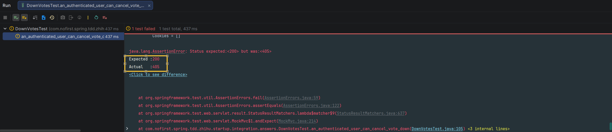
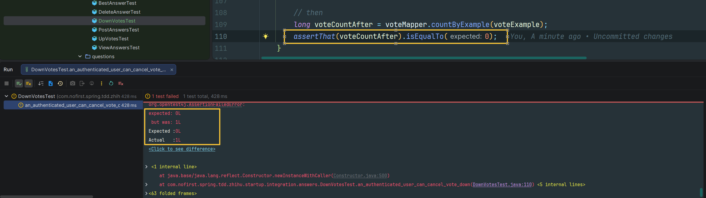

## 本节说明

本节我们开发「取消反对」的功能。

## 新增测试

我们从新增测试开始：

*src/test/java/com/nofirst/spring/tdd/zhihu/startup/integration/answers/DownVotesTest.java*

```java
    .
    .
    .
    @Test
    @WithUserDetails(value = "John", userDetailsServiceBeanName = "customUserDetailsService")
    void an_authenticated_user_can_cancel_vote_down() throws Exception {
        // given
        this.mockMvc.perform(post("/answers/1/down-votes"));
        VoteExample voteExample = new VoteExample();
        VoteExample.Criteria criteria = voteExample.createCriteria();
        criteria.andResourceIdEqualTo(1);
        criteria.andResourceTypeEqualTo(Answer.class.getSimpleName());
        criteria.andActionTypeEqualTo(VoteActionType.VOTE_DOWN.getCode());
        long voteCount = voteMapper.countByExample(voteExample);
        assertThat(voteCount).isEqualTo(1);
        // when
        this.mockMvc.perform(delete("/answers/1/down-votes"))
                .andDo(print())
                .andExpect(status().isOk())
                .andExpect(jsonPath("$.code").value(ResultCode.SUCCESS.getCode()));

        // then
        long voteCountAfter = voteMapper.countByExample(voteExample);
        assertThat(voteCountAfter).isEqualTo(0);
    }
}
```

运行功能测试：



路由错误，新增路由：

*src/main/java/com/nofirst/spring/tdd/zhihu/startup/controller/AnswerDownVoteController.java*

```java
	.
    .
    .
    @DeleteMapping("/answers/{answerId}/down-votes")
    public CommonResult<String> destroy(@PathVariable Integer answerId, @AuthenticationPrincipal AccountUser accountUser) {
        return CommonResult.success("ok");
    }
}
```

再次运行测试：



补充完善逻辑：

*src/main/java/com/nofirst/spring/tdd/zhihu/startup/service/AnswerVoteDownService.java*

```java
public interface AnswerVoteDownService {

    void store(Integer answerId, AccountUser accountUser);

    void destroy(Integer answerId, AccountUser accountUser);
}
```

*src/main/java/com/nofirst/spring/tdd/zhihu/startup/service/impl/AnswerVoteDownServiceImpl.java*

```java
    .
    .
    .
    @Override
    public void destroy(Integer answerId, AccountUser accountUser) {
        VoteExample voteExample = new VoteExample();
        VoteExample.Criteria criteria = voteExample.createCriteria();
        criteria.andResourceIdEqualTo(answerId);
        criteria.andResourceTypeEqualTo(Answer.class.getSimpleName());
        criteria.andActionTypeEqualTo(VoteActionType.VOTE_DOWN.getCode());
        voteMapper.deleteByExample(voteExample);
    }


}
```

*src/main/java/com/nofirst/spring/tdd/zhihu/startup/controller/AnswerDownVoteController.java*

```java
	.
    .
    .
	@DeleteMapping("/answers/{answerId}/down-votes")
    public CommonResult<String> destroy(@PathVariable Integer answerId, @AuthenticationPrincipal AccountUser accountUser) {
        answerVoteDownService.destroy(answerId, accountUser);
        return CommonResult.success("ok");
    }
}
```

再次运行测试，测试通过。


## 提交代码

最后，我们提交一下代码：

```
$ git add .
$ git commit -m 'cancel vote down'
```