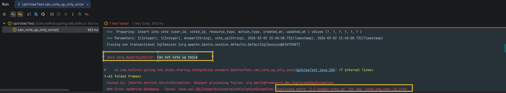

# 不能重复反对

本节我们来为反对功能增加一个逻辑限定：**不能重复反对相同的问题**。

---

## 一、功能说明

### 1.1 防止重复反对

与防止重复赞同类似，我们也需要确保每个用户对同一回答只能反对一次。

### 1.2 开发目标

| 目标 | 说明 |
|------|------|
| 防止重复投票 | 同一用户对同一回答只能反对一次 |
| 优雅处理 | 重复投票时不抛出异常，而是忽略 |

---

## 二、新增测试

### 2.1 添加测试用例

依旧是从新增测试开始：

*src/test/java/com/nofirst/spring/tdd/zhihu/startup/integration/answers/DownVotesTest.java*

```java
@Test
@WithUserDetails(value = "John", userDetailsServiceBeanName = "customUserDetailsService")
void can_vote_down_only_once() {
    // given
    try {
        this.mockMvc.perform(post("/answers/1/down-votes"));
        this.mockMvc.perform(post("/answers/1/down-votes"));
    } catch (Exception e) {
        fail("Can not vote down twice", e);
    }
}
```

### 2.2 测试说明

| 步骤 | 说明 |
|------|------|
| `given` | 连续两次调用反对接口 |
| `try-catch` | 捕获任何异常 |
| `fail` | 如果有异常则测试失败 |

### 2.3 运行测试

运行测试：



---

## 三、修复逻辑

### 3.1 修改 Service 方法

我们来修改 `AnswerVoteDownService#store()` 方法：

*src/main/java/com/nofirst/spring/tdd/zhihu/startup/service/impl/AnswerVoteDownServiceImpl.java*

```java
@Override
public void store(Integer answerId, AccountUser accountUser) {
    VoteExample voteExample = new VoteExample();
    VoteExample.Criteria criteria = voteExample.createCriteria();
    criteria.andVotedIdEqualTo(answerId);
    criteria.andResourceTypeEqualTo(Answer.class.getSimpleName());
    criteria.andActionTypeEqualTo(VoteActionType.VOTE_DOWN.getCode());
    long count = voteMapper.countByExample(voteExample);
    if (count == 0) {
        Vote vote = new Vote();
        vote.setUserId(accountUser.getUserId());
        vote.setVotedId(answerId);
        vote.setResourceType(Answer.class.getSimpleName());
        vote.setActionType(VoteActionType.VOTE_DOWN.getCode());
        Date now = new Date();
        vote.setCreatedAt(now);
        vote.setUpdatedAt(now);

        voteMapper.insert(vote);
    }
}
```

### 3.2 逻辑说明

```java
public void store(Integer answerId, AccountUser accountUser) {
    // 1. 查询是否已存在投票记录
    VoteExample voteExample = new VoteExample();
    VoteExample.Criteria criteria = voteExample.createCriteria();
    criteria.andVotedIdEqualTo(answerId);
    criteria.andResourceTypeEqualTo(Answer.class.getSimpleName());
    criteria.andActionTypeEqualTo(VoteActionType.VOTE_DOWN.getCode());
    long count = voteMapper.countByExample(voteExample);
    
    // 2. 如果不存在则创建，否则忽略
    if (count == 0) {
        Vote vote = new Vote();
        // ... 创建投票记录
        voteMapper.insert(vote);
    }
}
```

### 3.3 流程图

```
┌─────────────────────────────────────────────────────────┐
│              防止重复反对流程                            │
│                                                         │
│  用户发起反对 ──────→ 查询是否已存在投票记录            │
│                              ↓                          │
│                    ┌───────────────┐                   │
│                    │  count == 0?  │                   │
│                    └───────────────┘                   │
│                       ↓           ↓                    │
│                    是 (创建)    否 (忽略)              │
│                       ↓           ↓                    │
│                插入投票记录   直接返回                 │
│                                                         │
└─────────────────────────────────────────────────────────┘
```

### 3.4 运行测试

再次运行测试，测试通过。

---

## 四、总结

### 4.1 本节学习要点

| 要点 | 说明 |
|------|------|
| 代码复用 | 与防止重复赞同逻辑完全相同 |
| 唯一索引 | 数据库层面防止重复数据 |
| 应用层验证 | 代码层面检查是否存在记录 |

### 4.2 赞同 vs 反对对比

| 对比项 | 防止重复赞同 | 防止重复反对 |
|--------|------------|------------|
| 测试方法 | `can_vote_up_only_once()` | `can_vote_down_only_once()` |
| 查询条件 | `action_type = vote_up` | `action_type = vote_down` |
| 实现逻辑 | 先查询后插入 | 先查询后插入 |
| 唯一索引 | 同一用户 + 资源 + 类型 = 唯一 | 同一用户 + 资源 + 类型 = 唯一 |

---

## 五、提交代码

```bash
$ git add .
$ git commit -m 'vote only once'
```

---

## 六、下一步

防止重复反对功能已完成，请继续阅读：

1. [获取反对数量](./8.获取反对数量.md) - 查询反对数据
2. [小结](./9.小结.md) - 本章总结

---

## 附录：唯一索引说明

```sql
-- vote 表唯一索引
-- 确保：同一用户 + 同一资源 + 同一操作类型 = 唯一记录

-- 以下组合是唯一的：
(user_id, voted_id, resource_type, action_type)

-- 示例：
-- 用户 2 对回答 1 的赞同 - 唯一
(2, 1, 'Answer', 'vote_up') ✓

-- 用户 2 对回答 1 再次赞同 - 被阻止
(2, 1, 'Answer', 'vote_up') ✗

-- 但用户 2 可以同时对回答 1 赞同和反对（不同类型）
(2, 1, 'Answer', 'vote_up')   ✓
(2, 1, 'Answer', 'vote_down') ✓
```
