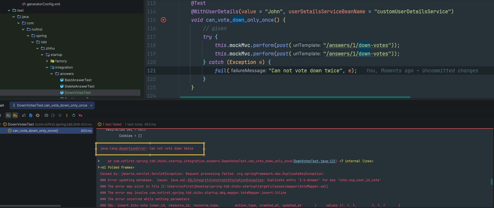
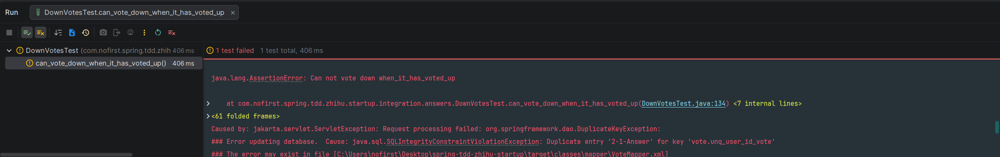

## 本节说明

本节我们来为赞同功能增加一个逻辑限定：不能重复反对相同的问题。


## 新增测试

依旧是从新增测试开始：

*src/test/java/com/nofirst/spring/tdd/zhihu/startup/integration/answers/DownVotesTest.java*

```java
	.
	.
	.
    @Test
    @WithUserDetails(value = "John", userDetailsServiceBeanName = "customUserDetailsService")
    void can_vote_down_only_once() {
        // given
        try {
            this.mockMvc.perform(post("/answers/1/down-votes"));
            this.mockMvc.perform(post("/answers/1/down-votes"));
        } catch (Exception e) {
            fail("Can not vote down twice", e);
        }
    }
}
```

运行测试：



在我们的测试中，我们连续向同一个答案`downVote`了两次，导致程序发生异常；然后我们捕获异常，将测试失败的信息打印出来。

我们来修改 `AnswerVoteDownService#store()` 方法：

*src/main/java/com/nofirst/spring/tdd/zhihu/startup/service/impl/AnswerVoteDownServiceImpl.java*

```java
	@Override
    public void store(Integer answerId, AccountUser accountUser) {
        VoteExample voteExample = new VoteExample();
        VoteExample.Criteria criteria = voteExample.createCriteria();
        criteria.andUserIdEqualTo(accountUser.getUserId());
        criteria.andResourceIdEqualTo(answerId);
        criteria.andResourceTypeEqualTo(Answer.class.getSimpleName());
        criteria.andActionTypeEqualTo(VoteActionType.VOTE_DOWN.getCode());
        long count = voteMapper.countByExample(voteExample);
        if (count == 0) {
            Vote vote = new Vote();
            vote.setUserId(accountUser.getUserId());
            vote.setResourceId(answerId);
            vote.setResourceType(Answer.class.getSimpleName());
            vote.setActionType(VoteActionType.VOTE_DOWN.getCode());
            Date now = new Date();
            vote.setCreatedAt(now);
            vote.setUpdatedAt(now);

            voteMapper.insert(vote);
        }
    }
```

再次运行测试，测试通过。

咱本章的第3小节，我们曾经挖过一个坑：虽然我们已经写了不能重复赞同的逻辑，但是没有加上在已经被反对的情况下，再次进行赞同的情形。在当前的代码逻辑下，这个情形会报错，这不符合我们的预期。所以我们添加一个测试：

*src/test/java/com/nofirst/spring/tdd/zhihu/startup/integration/answers/DownVotesTest.java*

```java
	.
    .
    .
	@Test
    @WithUserDetails(value = "John", userDetailsServiceBeanName = "customUserDetailsService")
    void can_vote_down_when_it_has_voted_up() {
        // given
        try {
            this.mockMvc.perform(post("/answers/1/up-votes"));
            this.mockMvc.perform(post("/answers/1/down-votes"));
        } catch (Exception e) {
            fail("Can not vote down when it has voted up", e);
        }
    }
}
```

运行测试会报错：



修改逻辑：

*src/main/java/com/nofirst/spring/tdd/zhihu/startup/service/impl/AnswerVoteDownServiceImpl.java*

```java
@Service
@AllArgsConstructor
public class AnswerVoteDownServiceImpl implements AnswerVoteDownService {

    private VoteMapper voteMapper;

    @Override
    public void store(Integer answerId, AccountUser accountUser) {
        VoteExample voteExample = new VoteExample();
        VoteExample.Criteria criteria = voteExample.createCriteria();
        criteria.andResourceIdEqualTo(answerId);
        criteria.andResourceTypeEqualTo(Answer.class.getSimpleName());
        long count = voteMapper.countByExample(voteExample);

        Date now = new Date();
        Vote vote = new Vote();
        if (count == 0) {
            vote.setUserId(accountUser.getUserId());
            vote.setResourceId(answerId);
            vote.setResourceType(Answer.class.getSimpleName());
            vote.setActionType(VoteActionType.VOTE_DOWN.getCode());

            vote.setCreatedAt(now);
            vote.setUpdatedAt(now);

            voteMapper.insert(vote);
        } else {
            vote.setActionType(VoteActionType.VOTE_DOWN.getCode());
            vote.setUpdatedAt(now);
            voteMapper.updateByExampleSelective(vote, voteExample);
        }
    }
    .
    .
    .
}
```

运行测试，测试通过。

相应地，给赞同功能添加一个新的测试用例：

*src/test/java/com/nofirst/spring/tdd/zhihu/startup/integration/answers/UpVotesTest.java*

```java
class UpVotesTest extends BaseContainerTest {

    @Autowired
    private VoteMapper voteMapper;
    @Autowired
    private AnswerMapper answerMapper;
    @Autowired
    private QuestionMapper questionMapper;

    @Autowired
    private ObjectMapper objectMapper;
    @Autowired
    private CustomUserDetailsService customUserDetailsService;

    @BeforeEach
    public void setupTestData() {
        VoteExample voteExample = new VoteExample();
        voteExample.createCriteria();
        voteMapper.deleteByExample(voteExample);
        AnswerExample answerExample = new AnswerExample();
        answerExample.createCriteria();
        answerMapper.deleteByExample(answerExample);
    }
	.
    .
    .
    @Test
    @WithUserDetails(value = "John", userDetailsServiceBeanName = "customUserDetailsService")
    void can_vote_up_only_once() {
        // given
        try {
            this.mockMvc.perform(post("/answers/1/up-votes"));
            this.mockMvc.perform(post("/answers/1/up-votes"));
        } catch (Exception e) {
            fail("Can not vote up twice", e);
        }
    }

    @Test
    @WithUserDetails(value = "John", userDetailsServiceBeanName = "customUserDetailsService")
    void can_vote_up_when_it_has_voted_down() {
        // given
        try {
            this.mockMvc.perform(post("/answers/1/down-votes"));
            this.mockMvc.perform(post("/answers/1/up-votes"));
        } catch (Exception e) {
            fail("Can not vote up when it has voted down", e);
        }
    }
    .
    .
    .
}
```

修改对应逻辑：

*src/main/java/com/nofirst/spring/tdd/zhihu/startup/service/impl/AnswerVoteUpServiceImpl.java*

```java
@Service
@AllArgsConstructor
public class AnswerVoteUpServiceImpl implements AnswerVoteUpService {

    private VoteMapper voteMapper;

    @Override
    public void store(Integer answerId, AccountUser accountUser) {
        VoteExample voteExample = new VoteExample();
        VoteExample.Criteria criteria = voteExample.createCriteria();
        criteria.andResourceIdEqualTo(answerId);
        criteria.andResourceTypeEqualTo(Answer.class.getSimpleName());
        long count = voteMapper.countByExample(voteExample);

        Date now = new Date();
        Vote vote = new Vote();
        if (count == 0) {
            vote.setUserId(accountUser.getUserId());
            vote.setResourceId(answerId);
            vote.setResourceType(Answer.class.getSimpleName());
            vote.setActionType(VoteActionType.VOTE_UP.getCode());

            vote.setCreatedAt(now);
            vote.setUpdatedAt(now);

            voteMapper.insert(vote);
        } else {
            vote.setActionType(VoteActionType.VOTE_UP.getCode());
            vote.setUpdatedAt(now);
            voteMapper.updateByExampleSelective(vote, voteExample);
        }
    }
	.
    .
    .
}
```

运行测试，测试通过。


## 提交代码

```
$ git add .
$ git commit -m 'vote only once'
```