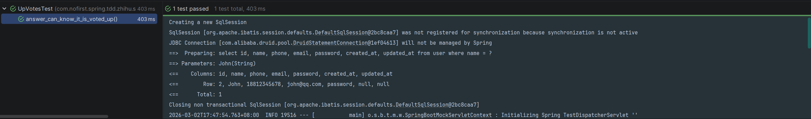

# 获取反对数量

本节我们来获取一些跟反对有关的数据：是否被反对以及反对的数量。

---

## 一、功能说明

### 1.1 查询反对数据

与赞同数据类似，用户和回答者也需要知道：

| 数据 | 说明 |
|------|------|
| 是否被反对 | 当前用户是否反对了该回答 |
| 反对数量 | 该回答获得了多少反对 |

### 1.2 开发目标

| 目标 | 说明 |
|------|------|
| 查询是否被反对 | `isVotedDown()` 方法 |
| 查询反对数量 | `downVotesCount()` 方法 |
| 代码复用 | 与赞同查询逻辑类似 |

---

## 二、是否被反对

### 2.1 添加测试用例

我们依旧是从新增测试开始：

*tests/Feature/Answers/DownVotesTest.php*

```java
@Test
@WithUserDetails(value = "John", userDetailsServiceBeanName = "customUserDetailsService")
void answer_can_know_it_is_voted_down() throws Exception {
    // given
    this.mockMvc.perform(post("/answers/1/down-votes"));

    // when
    Boolean votedDown = answerService.isVotedDown(1);

    // then
    assertThat(votedDown).isTrue();
}
```

### 2.2 测试说明

| 步骤 | 说明 |
|------|------|
| `given` | 创建一个反对记录 |
| `when` | 调用 `isVotedDown()` 方法 |
| `then` | 验证返回 true |

### 2.3 添加单元测试

使用了新的方法，先添加单元测试：

*src/test/java/com/nofirst/zhihu/service/AnswerServiceImplTest.java*

```java
@Test
void answer_can_know_it_is_voted_down() {
    // given
    Integer answerId = 1;
    given(voteMapper.countByExample(any())).willReturn(1L);

    // when
    Boolean votedDown = answerService.isVotedDown(answerId);

    // then
    assertThat(votedDown).isTrue();
}
```

### 2.4 实现 isVotedDown 方法

添加 `isVotedDown()` 方法：

*src/main/java/com/nofirst/spring/tdd/zhihu/startup/service/AnswerService.java*

```java
Boolean isVotedDown(Integer answerId);
```

*src/main/java/com/nofirst/spring/tdd/zhihu/startup/service/impl/AnswerServiceImpl.java*

```java
@Override
public Boolean isVotedDown(Integer answerId) {
    VoteExample voteExample = new VoteExample();
    VoteExample.Criteria criteria = voteExample.createCriteria();
    criteria.andVotedIdEqualTo(answerId);
    criteria.andResourceTypeEqualTo(Answer.class.getSimpleName());
    criteria.andActionTypeEqualTo(VoteActionType.VOTE_DOWN.getCode());
    long count = voteMapper.countByExample(voteExample);
    return count > 0;
}
```

### 2.5 运行单元测试

运行单元测试，测试通过。

### 2.6 运行集成测试

回到功能测试：



---

## 三、用户知道反对数量

### 3.1 添加测试用例

添加测试：

*src/test/java/com/nofirst/spring/tdd/zhihu/startup/integration/answers/DownVotesTest.java*

```java
@Test
@WithUserDetails(value = "John", userDetailsServiceBeanName = "customUserDetailsService")
void can_know_down_votes_count() throws Exception {
    long count = answerService.downVotesCount(1);
    assertThat(count).isEqualTo(0L);
    // given when
    this.mockMvc.perform(post("/answers/1/down-votes"));

    // when
    long countAfter = answerService.downVotesCount(1);
    assertThat(countAfter).isEqualTo(1L);

}
```

### 3.2 测试说明

| 步骤 | 说明 |
|------|------|
| `given` | 查询初始数量，应为 0 |
| `when` | 创建反对后再次查询 |
| `then` | 验证数量为 1 |

### 3.3 添加单元测试

添加 `downVotesCount()` 方法之前，先添加单元测试：

*src/test/java/com/nofirst/spring/tdd/zhihu/startup/unit/service/AnswerServiceImplTest.java*

```java
@Test
void answer_can_know_down_votes_count() {
    // given
    Integer answerId = 1;
    given(voteMapper.countByExample(any())).willReturn(1L);
    // when
    long votedDownCount = answerService.downVotesCount(answerId);

    // then
    assertThat(votedDownCount).isEqualTo(1L);
}
```

### 3.4 实现 downVotesCount 方法

添加 `downVotesCount()` 方法：

*src/main/java/com/nofirst/spring/tdd/zhihu/startup/service/impl/AnswerServiceImpl.java*

```java
@Override
public long downVotesCount(Integer answerId) {
    VoteExample voteExample = new VoteExample();
    VoteExample.Criteria criteria = voteExample.createCriteria();
    criteria.andVotedIdEqualTo(answerId);
    criteria.andResourceTypeEqualTo(Answer.class.getSimpleName());
    criteria.andActionTypeEqualTo(VoteActionType.VOTE_DOWN.getCode());
    return voteMapper.countByExample(voteExample);
}
```

### 3.5 运行单元测试

运行单元测试：


### 3.6 运行集成测试

回到功能测试：


---

## 四、总结

### 4.1 本节学习要点

| 要点 | 说明 |
|------|------|
| 查询方法 | `isVotedDown()` 和 `downVotesCount()` |
| 代码复用 | 与赞同查询逻辑完全相同 |
| 测试策略 | 单元测试 + 集成测试双重覆盖 |

### 4.2 投票查询方法汇总

```java
// AnswerService 接口
public interface AnswerService {
    // 赞同相关
    Boolean isVotedUp(Integer answerId);      // 是否被赞同
    long upVotesCount(Integer answerId);      // 赞同数量
    
    // 反对相关
    Boolean isVotedDown(Integer answerId);    // 是否被反对
    long downVotesCount(Integer answerId);    // 反对数量
}
```

### 4.3 使用场景

| 场景 | 使用的方法 |
|------|-----------|
| 显示回答列表 | `upVotesCount()` + `downVotesCount()` |
| 高亮已投票回答 | `isVotedUp()` + `isVotedDown()` |
| 回答详情页 | 全部使用 - 显示完整投票信息 |

---

## 五、提交代码

最后，我们提交代码：

```bash
$ git add .
$ git commit -m 'vote down count'
```

---

## 六、下一步

反对数量查询已完成，请继续阅读：

1. [小结](./9.小结.md) - 本章总结

---

## 附录：投票查询对比

| 查询 | 赞同 | 反对 |
|------|------|------|
| 是否投票 | `isVotedUp(answerId)` | `isVotedDown(answerId)` |
| 投票数量 | `upVotesCount(answerId)` | `downVotesCount(answerId)` |
| 查询条件 | `action_type = vote_up` | `action_type = vote_down` |

```java
// 查询示例
Boolean isVotedUp = answerService.isVotedUp(answerId);
long upVotesCount = answerService.upVotesCount(answerId);

Boolean isVotedDown = answerService.isVotedDown(answerId);
long downVotesCount = answerService.downVotesCount(answerId);

// 净胜票数（可用于排序）
long netVotes = upVotesCount - downVotesCount;
```
