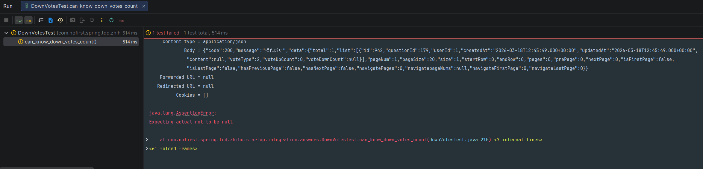

## 本节说明

本节我们来获取一些跟反对有关的数据：是否被反对以及反对的数量。

## 是否被反对

我们依旧是从新增测试开始：
*src/test/java/com/nofirst/spring/tdd/zhihu/startup/integration/answers/DownVotesTest.java*

```
package com.nofirst.spring.tdd.zhihu.startup.integration.answers;

import com.fasterxml.jackson.core.type.TypeReference;
import com.fasterxml.jackson.databind.ObjectMapper;
import com.github.pagehelper.PageInfo;
import com.nofirst.spring.tdd.zhihu.startup.common.CommonResult;
import com.nofirst.spring.tdd.zhihu.startup.common.ResultCode;
import com.nofirst.spring.tdd.zhihu.startup.factory.AnswerFactory;
import com.nofirst.spring.tdd.zhihu.startup.factory.QuestionFactory;
import com.nofirst.spring.tdd.zhihu.startup.integration.BaseContainerTest;
import com.nofirst.spring.tdd.zhihu.startup.mbg.mapper.AnswerMapper;
import com.nofirst.spring.tdd.zhihu.startup.mbg.mapper.QuestionMapper;
import com.nofirst.spring.tdd.zhihu.startup.mbg.mapper.VoteMapper;
import com.nofirst.spring.tdd.zhihu.startup.mbg.model.Answer;
import com.nofirst.spring.tdd.zhihu.startup.mbg.model.AnswerExample;
import com.nofirst.spring.tdd.zhihu.startup.mbg.model.Question;
import com.nofirst.spring.tdd.zhihu.startup.mbg.model.Vote;
import com.nofirst.spring.tdd.zhihu.startup.mbg.model.VoteExample;
import com.nofirst.spring.tdd.zhihu.startup.model.enums.VoteActionType;
import com.nofirst.spring.tdd.zhihu.startup.model.vo.AnswerVo;
import com.nofirst.spring.tdd.zhihu.startup.security.CustomUserDetailsService;
import org.junit.jupiter.api.BeforeEach;
import org.junit.jupiter.api.Test;
import org.springframework.beans.factory.annotation.Autowired;
import org.springframework.security.test.context.support.WithUserDetails;

import java.nio.charset.StandardCharsets;
import java.util.List;

import static org.assertj.core.api.Assertions.assertThat;
import static org.assertj.core.api.Fail.fail;
import static org.springframework.security.test.web.servlet.request.SecurityMockMvcRequestPostProcessors.user;
import static org.springframework.test.web.servlet.request.MockMvcRequestBuilders.delete;
import static org.springframework.test.web.servlet.request.MockMvcRequestBuilders.get;
import static org.springframework.test.web.servlet.request.MockMvcRequestBuilders.post;
import static org.springframework.test.web.servlet.result.MockMvcResultHandlers.print;
import static org.springframework.test.web.servlet.result.MockMvcResultMatchers.jsonPath;
import static org.springframework.test.web.servlet.result.MockMvcResultMatchers.status;

class DownVotesTest extends BaseContainerTest {

    @Autowired
    private VoteMapper voteMapper;
    @Autowired
    private AnswerMapper answerMapper;
    @Autowired
    private QuestionMapper questionMapper;

    @Autowired
    private ObjectMapper objectMapper;
    @Autowired
    private CustomUserDetailsService customUserDetailsService;

    @BeforeEach
    public void setupTestData() {
        VoteExample voteExample = new VoteExample();
        voteExample.createCriteria();
        voteMapper.deleteByExample(voteExample);
        AnswerExample answerExample = new AnswerExample();
        answerExample.createCriteria();
        answerMapper.deleteByExample(answerExample);
    }
	.
	.
	.
    @Test
    @WithUserDetails(value = "John", userDetailsServiceBeanName = "customUserDetailsService")
    void answer_can_know_it_is_voted_down() throws Exception {
        // given
        Question publishedQuestion = QuestionFactory.createPublishedQuestion();
        questionMapper.insert(publishedQuestion);
        Answer answerWithoutVoting = AnswerFactory.createAnswer(publishedQuestion.getId());
        answerMapper.insert(answerWithoutVoting);
        Answer answerWithVoting = AnswerFactory.createAnswer(publishedQuestion.getId());
        answerMapper.insert(answerWithVoting);
        // vote
        this.mockMvc.perform(post("/answers/{answerId}/down-votes", answerWithVoting.getId()));

        // when
        String json = this.mockMvc.perform(get("/questions/{questionId}/answers?pageIndex=1&pageSize=20", publishedQuestion.getId()))
                .andExpect(status().isOk()).andReturn().getResponse()
                .getContentAsString(StandardCharsets.UTF_8);

        // then
        TypeReference<CommonResult<PageInfo<AnswerVo>>> typeRef = new TypeReference<>() {
        };
        CommonResult<PageInfo<AnswerVo>> pageResult = objectMapper.readValue(json, typeRef);
        List<AnswerVo> data = pageResult.getData().getList();
        assertThat(data.size()).isEqualTo(2);

        assertThat(data.get(0).getId()).isEqualTo(answerWithoutVoting.getId());
        assertThat(data.get(0).getVoteType()).isEqualTo(VoteActionType.NOTHING.getCode());

        assertThat(data.get(1).getId()).isEqualTo(answerWithVoting.getId());
        assertThat(data.get(1).getVoteType()).isEqualTo(VoteActionType.VOTE_DOWN.getCode());

        // 切换到1号用户进行访问
        json = this.mockMvc.perform(get("/questions/{questionId}/answers?pageIndex=1&pageSize=20", publishedQuestion.getId())
                        .with(user(customUserDetailsService.loadUserByUsername("Jane")))
                ).andExpect(status().isOk()).andReturn().getResponse()
                .getContentAsString(StandardCharsets.UTF_8);
        pageResult = objectMapper.readValue(json, typeRef);
        data = pageResult.getData().getList();
        assertThat(data.size()).isEqualTo(2);
        // 对1号用户而言，两条都是没有点过赞的
        assertThat(data.get(0).getId()).isEqualTo(answerWithoutVoting.getId());
        assertThat(data.get(0).getVoteType()).isEqualTo(VoteActionType.NOTHING.getCode());
        assertThat(data.get(1).getId()).isEqualTo(answerWithVoting.getId());
        assertThat(data.get(1).getVoteType()).isEqualTo(VoteActionType.NOTHING.getCode());
    }
}
```

运行测试，测试直接通过了。因为我们之前的逻辑，已经处理了`VOTE_DOWN`的情况了。

## 用户知道反对数量

添加测试：

*src/test/java/com/nofirst/spring/tdd/zhihu/startup/integration/answers/DownVotesTest.java*

```
class DownVotesTest extends BaseContainerTest {

    @Autowired
    private VoteMapper voteMapper;
    @Autowired
    private AnswerMapper answerMapper;
    @Autowired
    private QuestionMapper questionMapper;

    @Autowired
    private ObjectMapper objectMapper;
    @Autowired
    private CustomUserDetailsService customUserDetailsService;

    @BeforeEach
    public void setupTestData() {
        VoteExample voteExample = new VoteExample();
        voteExample.createCriteria();
        voteMapper.deleteByExample(voteExample);
        AnswerExample answerExample = new AnswerExample();
        answerExample.createCriteria();
        answerMapper.deleteByExample(answerExample);
    }
	.
	.
	.
	@Test
    @WithUserDetails(value = "John", userDetailsServiceBeanName = "customUserDetailsService")
    void can_know_down_votes_count() throws Exception {
        // given
        Question publishedQuestion = QuestionFactory.createPublishedQuestion();
        questionMapper.insert(publishedQuestion);
        Answer answer = AnswerFactory.createAnswer(publishedQuestion.getId());
        answerMapper.insert(answer);
        // 2号用户 vote up
        this.mockMvc.perform(post("/answers/{answerId}/down-votes", answer.getId())).andDo(print());
        // 1号用户 vote up
        this.mockMvc.perform(post("/answers/{answerId}/down-votes", answer.getId())
                .with(user(customUserDetailsService.loadUserByUsername("Jane")))).andDo(print());

        // when
        String json = this.mockMvc.perform(get("/questions/{questionId}/answers?pageIndex=1&pageSize=20", publishedQuestion.getId()))
                .andExpect(status().isOk()).andReturn().getResponse()
                .getContentAsString(StandardCharsets.UTF_8);

        // then
        TypeReference<CommonResult<PageInfo<AnswerVo>>> typeRef = new TypeReference<>() {
        };
        CommonResult<PageInfo<AnswerVo>> pageResult = objectMapper.readValue(json, typeRef);
        List<AnswerVo> data = pageResult.getData().getList();
        assertThat(data.size()).isEqualTo(1);
        assertThat(data.get(0).getId()).isEqualTo(answer.getId());
        assertThat(data.get(0).getVoteDownCount()).isEqualTo(2);
    }
}
```

添加`voteDownCount`属性：

*src/main/java/com/nofirst/spring/tdd/zhihu/startup/model/vo/AnswerVo.java*

```java
package com.nofirst.spring.tdd.zhihu.startup.model.vo;

import lombok.Data;

import java.util.Date;

@Data
public class AnswerVo {

    private Integer id;

    private Integer questionId;

    private Integer userId;

    private Date createdAt;

    private Date updatedAt;

    private String content;

    private Byte voteType;

    private Integer voteUpCount;

    private Integer voteDownCount;
}
```

运行测试：



添加逻辑：

```
@Service
@AllArgsConstructor
public class AnswerServiceImpl implements AnswerService {

    private final AnswerMapper answerMapper;
    private final QuestionMapper questionMapper;
    private final QuestionMapperExt questionMapperExt;
    private final VoteMapper voteMapper;
    private final VoteMapperExt voteMapperExt;

    @Override
    public PageInfo<AnswerVo> answers(Integer questionId, int pageIndex, int pageSize, AccountUser accountUser) {
        PageHelper.startPage(pageIndex, pageSize);
        AnswerExample example = new AnswerExample();
        example.createCriteria().andQuestionIdEqualTo(questionId);
        List<Answer> answers = answerMapper.selectByExample(example);
        PageInfo<Answer> answerPageInfo = new PageInfo<>(answers);
        List<AnswerVo> result = new ArrayList<>();
        for (Answer answer : answers) {
            AnswerVo vo = new AnswerVo();
            vo.setId(answer.getId());
            vo.setQuestionId(answer.getQuestionId());
            vo.setUserId(answer.getUserId());
            vo.setCreatedAt(answer.getCreatedAt());
            vo.setUpdatedAt(answer.getUpdatedAt());
            vo.setContent(answer.getContent());
            result.add(vo);
        }
        appendVoteType(result, accountUser.getUserId());
        appendVoteCount(result);

        PageInfo<AnswerVo> pageResult = new PageInfo<>();
        pageResult.setTotal(answerPageInfo.getTotal());
        pageResult.setPageNum(answerPageInfo.getPageNum());
        pageResult.setPageSize(answerPageInfo.getPageSize());
        pageResult.setSize(answerPageInfo.getSize());
        pageResult.setList(result);

        return pageResult;
    }

    private void appendVoteCount(List<AnswerVo> result) {
        if (CollectionUtils.isEmpty(result)) {
            return;
        }

        List<Integer> answerIds = result.stream().map(AnswerVo::getId).toList();
        appendVoteUpCount(result, answerIds);
        appendVoteDownCount(result, answerIds);
    }


    private void appendVoteUpCount(List<AnswerVo> result, List<Integer> answerIds) {
        List<VoteCountDto> voteUpCountList = voteMapperExt.countByResource(Answer.class.getSimpleName(), VoteActionType.VOTE_UP.getCode(), answerIds);
        if (CollectionUtils.isEmpty(voteUpCountList)) {
            result.forEach(t -> t.setVoteUpCount(0));
            return;
        }

        Map<Integer, Integer> voteUpCountMap = voteUpCountList.stream().collect(Collectors.toMap(VoteCountDto::getResourceId, VoteCountDto::getVoteCount));
        result.forEach(t -> {
            t.setVoteUpCount(voteUpCountMap.getOrDefault(t.getId(), 0));
        });
    }

    private void appendVoteDownCount(List<AnswerVo> result, List<Integer> answerIds) {
        List<VoteCountDto> voteDownCountList = voteMapperExt.countByResource(Answer.class.getSimpleName(), VoteActionType.VOTE_DOWN.getCode(), answerIds);
        if (CollectionUtils.isEmpty(voteDownCountList)) {
            result.forEach(t -> t.setVoteDownCount(0));
            return;
        }

        Map<Integer, Integer> voteDownCountMap = voteDownCountList.stream().collect(Collectors.toMap(VoteCountDto::getResourceId, VoteCountDto::getVoteCount));
        result.forEach(t -> {
            t.setVoteDownCount(voteDownCountMap.getOrDefault(t.getId(), 0));
        });
    }
   	.
   	.
   	.
}
```

运行测试，测试通过。

## 提交代码

运行以下全部的测试，以保证功能正常。最后，我们提交代码：

```
$ git add .
$ git commit -m 'vote down count'
```