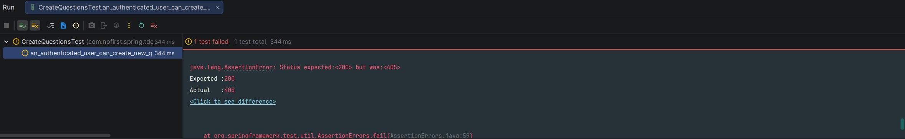

# 创建问题

本节开始我们来开发「创建问题」的功能。

---

## 一、功能说明

### 1.1 创建问题功能

在问答系统中，创建问题是核心功能之一。用户需要能够方便地创建新问题，并指定问题分类。

### 1.2 开发目标

| 目标 | 说明 |
|------|------|
| 未登录用户不能创建 | 返回 401 未授权 |
| 登录用户可以创建 | 创建问题记录 |
| 问题包含分类 | 支持问题分类功能 |

---

## 二、游客无法创建问题

### 2.1 创建测试

我们依然是从测试开始，首先我们新增测试：

*src/test/java/com/nofirst/spring/tdd/zhihu/startup/integration/questions/CreateQuestionsTest.java*

```java
@TestInstance(TestInstance.Lifecycle.PER_CLASS)
public class CreateQuestionsTest extends BaseContainerTest {

    private MockMvc mockMvc;

    @Autowired
    private WebApplicationContext context;

    @Autowired
    private QuestionMapper questionMapper;

    @Autowired
    private ObjectMapper objectMapper;


    @BeforeAll
    public void setupMockMvc() {
        mockMvc = MockMvcBuilders
                .webAppContextSetup(context)
                .apply(springSecurity())
                .build();
    }

    @BeforeEach
    public void setupTestData() {
        QuestionExample example = new QuestionExample();
        // 空条件，匹配所有数据，等价于 delete * from question
        example.createCriteria();
        questionMapper.deleteByExample(example);
    }

    @Test
    void guests_may_not_create_questions() throws Exception {
        QuestionDto questionDto = QuestionFactory.createQuestionDto();
        this.mockMvc.perform(post("/questions")
                        .contentType(MediaType.APPLICATION_JSON)
                        .content(objectMapper.writeValueAsString(questionDto)))

                .andDo(print())
                .andExpect(status().is(401));
    }
}
```

### 2.2 测试说明

| 步骤 | 说明 |
|------|------|
| `@BeforeAll` | 初始化 MockMvc，启用 Spring Security |
| `@BeforeEach` | 清理 question 表数据 |
| `guests_may_not_create_questions` | 测试未登录用户不能创建问题 |

### 2.3 创建 QuestionDto

*src/main/java/com/nofirst/spring/tdd/zhihu/startup/model/dto/QuestionDto.java*

```java
@Data
public class QuestionDto {

    private String title;

    private String content;

    private Integer categoryId;
}
```

### 2.4 添加工厂方法

*src/test/java/com/nofirst/spring/tdd/zhihu/startup/factory/QuestionFactory.java*

```java
public static QuestionDto createQuestionDto() {
    QuestionDto questionDto = new QuestionDto();
    questionDto.setTitle("this is a new question");
    questionDto.setContent("question content");
    questionDto.setCategoryId(1);

    return questionDto;
}
```

### 2.5 运行测试

运行测试，测试通过：



---

## 三、授权用户可以创建问题

### 3.1 添加测试用例

接下来新增测试：

*src/test/java/com/nofirst/spring/tdd/zhihu/startup/integration/questions/CreateQuestionsTest.java*

```java
@Test
@WithUserDetails(value = "John", userDetailsServiceBeanName = "customUserDetailsService")
void an_authenticated_user_can_create_new_questions() throws Exception {
    // given
    QuestionDto questionDto = QuestionFactory.createQuestionDto();
    QuestionExample example = new QuestionExample();
    example.createCriteria();
    long beforeCount = questionMapper.countByExample(example);

    // when
    this.mockMvc.perform(post("/questions")
                    .contentType(MediaType.APPLICATION_JSON)
                    .content(objectMapper.writeValueAsString(questionDto)))
            .andDo(print())
            .andExpect(status().isOk())
            .andExpect(jsonPath("$.code").value(ResultCode.SUCCESS.getCode()));

    // then
    long afterCount = questionMapper.countByExample(example);
    // 调用之后 questionDto 增加了 1 条
    assertThat(afterCount - beforeCount).isEqualTo(1);
}
```

### 3.2 测试说明

| 步骤 | 说明 |
|------|------|
| `@WithUserDetails` | 模拟 John 用户登录 |
| `given` | 准备测试数据，记录创建前的问题数量 |
| `when` | 发送 POST 请求创建问题 |
| `then` | 验证响应成功，数据库增加一条记录 |

### 3.3 运行测试

运行测试：


---

## 四、创建 Controller

### 4.1 添加路由

添加逻辑：

*src/main/java/com/nofirst/spring/tdd/zhihu/startup/controller/QuestionController.java*

```java
@PostMapping("/questions")
public CommonResult<String> store(@RequestBody QuestionDto dto, @AuthenticationPrincipal AccountUser accountUser) {
    return CommonResult.success("ok");
}
```

### 4.2 运行测试

再次测试：

此时的测试并未通过，但是可以看到，我们给 `question` 定义了一个 `categoryId` 的属性。这是一个新的概念：分类，我们接下来先添加 `category` 表。

---

## 五、创建分类表

### 5.1 创建 category 表

我们接下来先添加 `category` 表：

*src/main/resources/db/migration/V2026030301__create_table_category.sql*

```sql
create table `category`
(
    `id`   int auto_increment comment '主键'
        primary key,
    `name` varchar(10) not null comment '分类命',
    `slug` varchar(50) null comment '标签'
);
```

### 5.2 添加 category_id 字段

给 `question` 表添加 `category_id` 属性：

*src/main/resources/db/migration/V2026030302__alter_table_question.sql*

```sql
alter table question
    add category_id    int         not null comment '分类编号';
```

### 5.3 运行迁移

接下来运行 Maven 的 `flyway` 插件的 `flyway:migrate` 命令生成表：

```bash
mvn flyway:migrate
```

修改 `generatorConfig.xml` 的配置，改为生成 `question` 表和 `category` 表，运行 `Generator#main()` 方法生成对应的数据库映射文件。

---

## 六、完善业务逻辑

### 6.1 添加 Service 方法

*src/main/java/com/nofirst/spring/tdd/zhihu/startup/service/QuestionService.java*

```java
public interface QuestionService {

    QuestionVo show(Integer id);

    void store(QuestionDto dto, AccountUser accountUser);
}
```

### 6.2 实现 Service

*src/main/java/com/nofirst/spring/tdd/zhihu/startup/service/impl/QuestionServiceImpl.java*

```java
@Override
public void store(QuestionDto dto, AccountUser accountUser) {
    Date now = new Date();
    Question question = new Question();
    question.setUserId(accountUser.getUserId());
    question.setTitle(dto.getTitle());
    question.setContent(dto.getContent());
    question.setCategoryId(dto.getCategoryId());
    question.setCreatedAt(now);
    question.setUpdatedAt(now);

    questionMapper.insert(question);
}
```

### 6.3 完善 Controller

*src/main/java/com/nofirst/spring/tdd/zhihu/startup/controller/QuestionController.java*

```java
@PostMapping("/questions")
public CommonResult<String> store(@RequestBody QuestionDto dto, @AuthenticationPrincipal AccountUser accountUser) {
    questionService.store(dto, accountUser);
    return CommonResult.success("ok");
}
```

### 6.4 运行测试

再次运行功能测试，测试通过：


---

## 七、提交代码

最后，我们来提交一下代码：

```bash
$ git add .
$ git commit -m 'create question'
```

---

## 八、总结

### 8.1 本节学习要点

| 要点 | 说明 |
|------|------|
| 权限控制 | 未登录用户返回 401 |
| 分类功能 | 支持问题分类，添加 category 表 |
| 数据库迁移 | 使用 Flyway 管理表结构变更 |
| TDD 流程 | 测试 → 实现 → 测试通过 |

### 8.2 问题数据结构

```
┌─────────────────────────────────────────────────────────┐
│                    question 表                           │
├──────────┬──────────┬────────────┬──────────┬───────────┤
│ 字段     │ 类型     │ 说明       │ 必填     │ 示例      │
├──────────┼──────────┼────────────┼──────────┼───────────┤
│ id       │ int      │ 主键       │ 是       │ 1         │
│ user_id  │ int      │ 创建者 ID   │ 是       │ 2         │
│ title    │ varchar  │ 问题标题   │ 是       │ 如何学习  │
│ content  │ text     │ 问题内容   │ 是       │ 求指导    │
│ category_id │ int   │ 分类 ID     │ 是       │ 1         │
│ published_at │ timestamp │ 发布时间 │ 否      │ 2026-...  │
│ created_at | timestamp | 创建时间  │ 是       │ 2026-...  │
│ updated_at | timestamp | 更新时间  │ 是       │ 2026-...  │
└──────────┴──────────┴────────────┴──────────┴───────────┘
```

---

## 九、下一步

创建问题功能已完成，请继续阅读：

1. [表单验证](./2.表单验证.md) - 添加表单验证规则
2. [发布问题](./3.发布问题.md) - 实现发布问题功能

---

## 附录：Flyway 迁移脚本命名

```
V{版本号}__{描述}.sql

示例：
V2026030301__create_table_category.sql    - 创建分类表
V2026030302__alter_table_question.sql     - 修改问题表
V2026030303__init_category_data.sql       - 初始化分类数据
```
