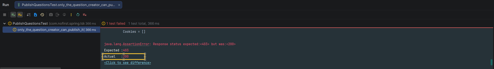

# 发布问题

本节我们完成「发布问题」的功能。

---

## 一、功能说明

### 1.1 发布问题功能

在问答系统中，问题创建后可能需要审核或确认后才能公开发布。通过「发布问题」功能，问题作者可以在合适的时间将问题公开发布。

### 1.2 开发目标

| 目标 | 说明 |
|------|------|
| 未登录用户不能发布 | 返回 401 未授权 |
| 登录用户可以发布 | 设置 `published_at` 时间 |
| 只有作者可以发布 | 返回 403 禁止访问 |

---

## 二、游客无法发布问题

### 2.1 创建测试

同样地，「发布问题」这个功能我们首先要求用户要登录，所以我们新增测试：

*src/test/java/com/nofirst/spring/tdd/zhihu/startup/integration/questions/PublishQuestionsTest.java*

```java
@TestInstance(TestInstance.Lifecycle.PER_CLASS)
public class PublishQuestionsTest extends BaseContainerTest {

    private MockMvc mockMvc;

    @Autowired
    private WebApplicationContext context;

    @Autowired
    private QuestionMapper questionMapper;

    @Autowired
    private ObjectMapper objectMapper;


    @BeforeAll
    public void setupMockMvc() {
        mockMvc = MockMvcBuilders
                .webAppContextSetup(context)
                .apply(springSecurity())
                .build();
    }

    @BeforeEach
    public void setupTestData() {
        QuestionExample example = new QuestionExample();
        // 空条件，匹配所有数据，等价于 delete * from question
        example.createCriteria();
        questionMapper.deleteByExample(example);
    }

    @Test
    void guests_may_not_publish_questions() throws Exception {
        // given
        Question question = QuestionFactory.createUnpublishedQuestion();
        question.setId(1);
        // when
        this.mockMvc.perform(post("/questions/{questionId}/published-questions", question.getId())
                        .contentType(MediaType.APPLICATION_JSON)
                        .content(objectMapper.writeValueAsString(question)))
                .andDo(print())
                .andExpect(status().is(401));
    }
}
```

### 2.2 测试说明

| 步骤 | 说明 |
|------|------|
| `@BeforeAll` | 初始化 MockMvc，启用 Spring Security |
| `@BeforeEach` | 清理 question 表数据 |
| `guests_may_not_publish_questions` | 测试未登录用户不能发布问题 |

### 2.3 运行测试

运行测试，测试通过。

---

## 三、登录用户能发布问题

### 3.1 添加测试用例

接下来新增测试：

```java
@Test
@WithUserDetails(value = "John", userDetailsServiceBeanName = "customUserDetailsService")
void can_publish_question() throws Exception {
    // given
    Question question = QuestionFactory.createUnpublishedQuestion();
    // 2 号用户就是 John
    question.setUserId(2);
    questionMapper.insert(question);
    QuestionExample example = new QuestionExample();
    QuestionExample.Criteria criteria = example.createCriteria();
    criteria.andPublishedAtIsNotNull();
    long beforeCount = questionMapper.countByExample(example);
    // when
    this.mockMvc.perform(post("/questions/{questionId}/published-questions", question.getId())
                    .contentType(MediaType.APPLICATION_JSON)
                    .content(objectMapper.writeValueAsString(question)))
            .andDo(print())
            .andExpect(status().isOk())
            .andExpect(jsonPath("$.code").value(ResultCode.SUCCESS.getCode()));

    // then
    long afterCount = questionMapper.countByExample(example);
    // 调用之后 question 增加了 1 条
    assertThat(afterCount - beforeCount).isEqualTo(1);
}
```

### 3.2 测试说明

| 步骤 | 说明 |
|------|------|
| `given` | 创建 John 用户的未发布问题 |
| `when` | 发送 POST 请求发布问题 |
| `then` | 验证已发布问题数量增加 1 条 |

### 3.3 运行测试

运行测试：



---

## 四、创建 Controller

### 4.1 添加路由

添加路由：

*src/main/java/com/nofirst/zhihu/controller/PublishedQuestionController.java*

```java
@RestController
@AllArgsConstructor
public class PublishedQuestionController {

    private final QuestionService questionService;

    @PostMapping("/questions/{questionId}/published-questions")
    public CommonResult<String> store(@PathVariable Integer questionId, @AuthenticationPrincipal AccountUser accountUser) {
        questionService.publish(questionId);
        return CommonResult.success("ok");
    }
}
```

### 4.2 添加 publish 方法

添加 `publish()` 方法：

```java
public class QuestionServiceImpl implements QuestionService {

    private QuestionMapper questionMapper;
    private QuestionMapperExt questionMapperExt;
    .
    .
    .
    @Override
    public void publish(Integer questionId) {
        questionMapperExt.publish(questionId, new Date());
    }
}
```

### 4.3 扩展 Mapper

*src/main/java/com/nofirst/spring/tdd/zhihu/startup/mbg/mapper/QuestionMapperExt.java*

```java
public interface QuestionMapperExt {

    void markAsBestAnswer(Integer questionId, Integer answerId);

    void publish(Integer questionId, Date publishedAt);
}
```

### 4.4 XML 映射文件

*src/main/resources/mapper/QuestionMapperExt.xml*

```xml
<update id="publish">
    update question
    set published_at = #{publishedAt,jdbcType=TIMESTAMP}
    where id = #{questionId,jdbcType=INTEGER}
</update>
```

### 4.5 运行测试

运行测试，测试通过：


---

## 五、限制问题作者能发布

### 5.1 添加测试用例

仅仅是登录限制还不够，我们还要限制只有 `Question` 的创建者才能发布，所以我们新增测试：

```java
@Test
@WithUserDetails(value = "John", userDetailsServiceBeanName = "customUserDetailsService")
void only_the_question_creator_can_publish_it() throws Exception {
    // given
    Question question = QuestionFactory.createUnpublishedQuestion();
    // 1 号用户不是 John
    question.setUserId(1);
    questionMapper.insert(question);

    // when
    this.mockMvc.perform(post("/questions/{questionId}/published-questions", question.getId())
                    .contentType(MediaType.APPLICATION_JSON)
                    .content(objectMapper.writeValueAsString(question)))
            .andDo(print())
            .andExpect(status().is(403));

}
```

### 5.2 测试说明

| 步骤 | 说明 |
|------|------|
| `given` | 创建其他用户（userId=1）的未发布问题 |
| `when` | John 用户尝试发布其他用户的问题 |
| `then` | 验证返回 403 禁止访问 |

### 5.3 运行测试

运行测试：


我们得到了 200 的响应码，说明一个用户可以发布另一个用户创建的 `Question`，这是逻辑漏洞，我们利用 `QuestionPolicy` 来修复。

---

## 六、添加权限策略

### 6.1 添加校验方法

之前我们已经生成过 `QuestionPolicy`，所以我们现在只需要添加校验方法：

*src/main/java/com/nofirst/spring/tdd/zhihu/startup/policy/QuestionPolicy.java*

```java
public boolean isQuestionOwner(Integer questionId, AccountUser accountUser) {
    Question question = questionMapper.selectByPrimaryKey(questionId);
    if (Objects.isNull(question)) {
        throw new QuestionNotExistedException();
    }

    return accountUser.getUserId().equals(question.getUserId());
}
```

### 6.2 应用权限策略

应用权限策略：

*src/main/java/com/nofirst/spring/tdd/zhihu/startup/controller/PublishedQuestionController.java*

```java
public class PublishedQuestionController {

    private final QuestionService questionService;

    @PostMapping("/questions/{questionId}/published-questions")
    @PreAuthorize("@questionPolicy.isQuestionOwner(#questionId, #accountUser)")
    public CommonResult<String> store(@PathVariable Integer questionId, @AuthenticationPrincipal AccountUser accountUser) {
        questionService.publish(questionId);
        return CommonResult.success("ok");
    }
}
```

### 6.3 运行测试

再次测试，测试通过。

---

## 七、提交代码

最后，我们来提交代码：

```bash
$ git add .
$ git commit -m 'publish question'
```

---

## 八、总结

### 8.1 本节学习要点

| 要点 | 说明 |
|------|------|
| 发布功能 | 设置 `published_at` 时间戳 |
| 权限控制 | 使用 `@PreAuthorize` 和 Policy |
| 扩展 Mapper | 使用 `QuestionMapperExt` 添加自定义 SQL |
| 测试覆盖 | 未登录、非作者、作者三种场景 |

### 8.2 测试用例总结

| 测试用例 | 用户状态 | 预期结果 |
|---------|---------|---------|
| `guests_may_not_publish_questions` | 未登录 | 401 未授权 |
| `can_publish_question` | 作者 | 200 成功 |
| `only_the_question_creator_can_publish_it` | 非作者 | 403 禁止访问 |

---

## 九、下一步

发布问题功能已完成，请继续阅读：

1. [邀请某人](./4.邀请某人.md) - 实现@用户功能
2. [小结](./5.小结.md) - 本章总结

---

## 附录：发布问题流程

```
┌─────────────────────────────────────────────────────────┐
│                  发布问题流程                            │
│                                                         │
│  用户发起发布 ──────→ 验证用户是否登录                  │
│                              ↓                          │
│                    ┌───────────────┐                   │
│                    │ 是否问题作者？ │                   │
│                    └───────────────┘                   │
│                       ↓           ↓                    │
│                    是 (发布)    否 (403)              │
│                       ↓                                │
│           更新 published_at 时间                       │
│                       ↓                                │
│                触发发布事件                            │
│                       ↓                                │
│                返回成功响应                            │
│                                                         │
└─────────────────────────────────────────────────────────┘
```
