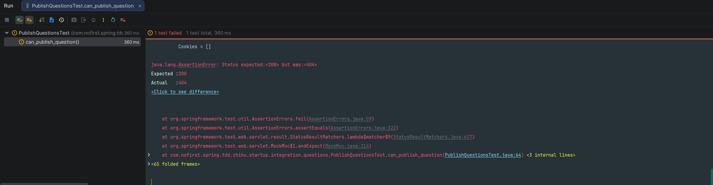

## 游客无法发布问题

同样地，「发布问题」这个功能我们首先要求用户要登录，所以我们新增测试：

*src/test/java/com/nofirst/spring/tdd/zhihu/startup/integration/questions/PublishQuestionsTest.java*

```java
package com.nofirst.spring.tdd.zhihu.startup.integration.questions;

import com.nofirst.spring.tdd.zhihu.startup.integration.BaseContainerTest;
import org.junit.jupiter.api.Test;
import org.springframework.http.MediaType;

import static org.springframework.test.web.servlet.request.MockMvcRequestBuilders.post;
import static org.springframework.test.web.servlet.result.MockMvcResultHandlers.print;
import static org.springframework.test.web.servlet.result.MockMvcResultMatchers.status;

class PublishQuestionsTest extends BaseContainerTest {

    @Test
    void guests_may_not_publish_questions() throws Exception {
        this.mockMvc.perform(post("/questions/1/published-questions")
                        .contentType(MediaType.APPLICATION_JSON))

                .andDo(print())
                .andExpect(status().is(401));
    }
}
```

运行测试，测试会直接通过。

## 登录用户能发布问题

接下来新增测试：

```java
	
	.
	.
	.
	@Test
    @WithUserDetails(value = "John", userDetailsServiceBeanName = "customUserDetailsService")
    void can_publish_question() throws Exception {
        // given
        Question question = QuestionFactory.createUnpublishedQuestion();
        // 2号用户就是 John
        question.setUserId(2);
        questionMapper.insert(question);
        QuestionExample example = new QuestionExample();
        QuestionExample.Criteria criteria = example.createCriteria();
        criteria.andPublishedAtIsNotNull();
        long beforeCount = questionMapper.countByExample(example);
        // when
        this.mockMvc.perform(post("/questions/{questionId}/published-questions", question.getId())
                        .contentType(MediaType.APPLICATION_JSON)
                        .content(objectMapper.writeValueAsString(question)))
                .andDo(print())
                .andExpect(status().isOk())
                .andExpect(jsonPath("$.code").value(ResultCode.SUCCESS.getCode()));

        // then
        long afterCount = questionMapper.countByExample(example);
        // 调用之后 question 增加了 1 条
        assertThat(afterCount - beforeCount).isEqualTo(1);
    }
}
```

运行测试：



添加路由：

*src/main/java/com/nofirst/zhihu/controller/PublishedQuestionController.java*

```java
@RestController
@AllArgsConstructor
public class PublishedQuestionController {

    private final QuestionService questionService;

    @PostMapping("/questions/{questionId}/published-questions")
    public CommonResult<String> store(@PathVariable Integer questionId, @AuthenticationPrincipal AccountUser accountUser) {
        questionService.publish(questionId);
        return CommonResult.success("ok");
    }
}
```

添加`publish()`方法：

*src/main/java/com/nofirst/spring/tdd/zhihu/startup/service/QuestionService.java*

```java
package com.nofirst.spring.tdd.zhihu.startup.service;

import com.nofirst.spring.tdd.zhihu.startup.model.dto.QuestionDto;
import com.nofirst.spring.tdd.zhihu.startup.model.vo.QuestionVo;
import com.nofirst.spring.tdd.zhihu.startup.security.AccountUser;

public interface QuestionService {

    QuestionVo show(Integer id, AccountUser accountUser);

    void store(QuestionDto dto, AccountUser accountUser);

    void publish(Integer questionId);
}
```

*src/main/java/com/nofirst/spring/tdd/zhihu/startup/service/impl/QuestionServiceImpl.java*

```java
public class QuestionServiceImpl implements QuestionService {

    private QuestionMapper questionMapper;
	.
    .
    .
    @Override
    public void publish(Integer questionId) {
        Question question = new Question();
        question.setId(questionId);
        Date now = new Date();
        question.setUpdatedAt(now);
        question.setPublishedAt(now);
        questionMapper.updateByPrimaryKeySelective(question);
    }
}
```

再次运行测试，测试通过。

## 限制问题作者能发布

仅仅是登录限制还不够，我们还要限制只有`Question`的创建者才能发布，所以我们新增测试：

```java
    .
    .
    .
    @Test
    @WithUserDetails(value = "John", userDetailsServiceBeanName = "customUserDetailsService")
    void only_the_question_creator_can_publish_it() throws Exception {
        // given
        Question question = QuestionFactory.createUnpublishedQuestion();
        // 1号用户不是 John
        question.setUserId(1);
        questionMapper.insert(question);

        // when
        this.mockMvc.perform(post("/questions/{questionId}/published-questions", question.getId())
                        .contentType(MediaType.APPLICATION_JSON)
                        .content(objectMapper.writeValueAsString(question)))
                .andDo(print())
                .andExpect(status().is(403));

    }
}
```

运行测试：


我们得到了 200 的响应码，说明一个用户可以发布另一个用户创建的`Question`，这是逻辑漏洞，我们利用`QuestionPolicy`来修复。之前我们已经生成过`QuestionPolicy`，所以我们现在只需要添加校验方法。我们从单元测试开始：

*src/test/java/com/nofirst/spring/tdd/zhihu/startup/unit/policy/QuestionPolicyTest.java*

```java
	.
    .
    .
    @Test
    void can_know_it_is_question_owner() {
        // given
        Question question = QuestionFactory.createUnpublishedQuestion();
        question.setId(1);
        given(questionMapper.selectByPrimaryKey(question.getId())).willReturn(question);

        // when
        AccountUser accountUser = UserFactory.createAccountUser();
        boolean questionOwner = questionPolicy.isQuestionOwner(1, accountUser);
        AccountUser another = UserFactory.createAccountUser();
        another.setUserId(2);
        boolean anotherOne = questionPolicy.isQuestionOwner(1, another);

        // then
        assertThat(questionOwner).isTrue();
        assertThat(anotherOne).isFalse();
    }
}
```

添加校验方法：

*src/main/java/com/nofirst/spring/tdd/zhihu/startup/policy/QuestionPolicy.java*

```java
    .
    .
    .
    public boolean isQuestionOwner(Integer questionId, AccountUser accountUser) {
        Question question = questionMapper.selectByPrimaryKey(questionId);
        if (Objects.isNull(question)) {
            throw new QuestionNotExistedException();
        }

        return accountUser.getUserId().equals(question.getUserId());
    }
}
```

应用权限策略：

*src/main/java/com/nofirst/spring/tdd/zhihu/startup/controller/PublishedQuestionController.java*

```java
public class PublishedQuestionController {

    private final QuestionService questionService;

    @PostMapping("/questions/{questionId}/published-questions")
    @PreAuthorize("@questionPolicy.isQuestionOwner(#questionId, #accountUser)") // 此处
    public CommonResult<String> store(@PathVariable Integer questionId, @AuthenticationPrincipal AccountUser accountUser) {
        questionService.publish(questionId);
        return CommonResult.success("ok");
    }
}
```


再次测试，测试通过。

