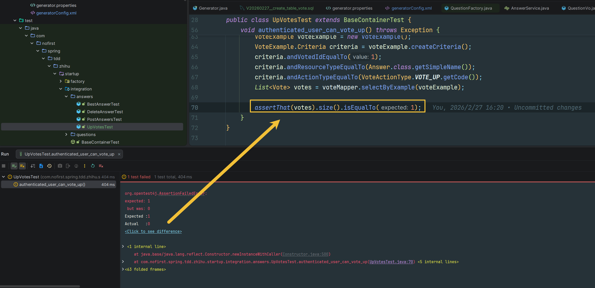

## 本节说明

本节我们来开发对答案的赞同与反对功能。

## 未登录用户

首先我们新建测试：

*src/test/java/com/nofirst/spring/tdd/zhihu/startup/integration/answers/UpVotesTest.java*

```java
public class UpVotesTest extends BaseContainerTest {

    private MockMvc mockMvc;

    @Autowired
    private WebApplicationContext context;

    @BeforeEach
    public void setup() {
        mockMvc = MockMvcBuilders
                .webAppContextSetup(context)
                .apply(springSecurity())
                .build();
    }


    @Test
    void guest_can_not_vote_up() throws Exception {
        this.mockMvc.perform(post("/answers/1/up-votes"))
                .andDo(print())
                .andExpect(status().is(401));
    }
}
```

接下来我们运行测试：


## 已登录用户

接下来新增已登录用户进行`vote`的测试：

*src/test/java/com/nofirst/spring/tdd/zhihu/startup/integration/answers/UpVotesTest.java*

```java
	@Test
    @WithUserDetails(value = "John", userDetailsServiceBeanName = "customUserDetailsService")
    void authenticated_user_can_vote_up() throws Exception {
        // given
        this.mockMvc.perform(post("/answers/1/up-votes"))
                .andDo(print())
                .andExpect(status().isOk())
                .andExpect(jsonPath("$.code").value(ResultCode.SUCCESS.getCode()));

        VoteExample voteExample = new VoteExample();
        VoteExample.Criteria criteria = voteExample.createCriteria();
        criteria.andVotedIdEqualTo(1);
        criteria.andResourceTypeEqualTo(Answer.class.getSimpleName());
        criteria.andActionTypeEqualTo(VoteActionType.VOTE_UP.getCode());
        List<Vote> votes = voteMapper.selectByExample(voteExample);

        assertThat(votes).size().isEqualTo(1);
    }
}
```

准备好创建`vote`表：

*src/main/resources/db/migration/V20260227__create_table_vote.sql*

```sql
CREATE TABLE `vote` (
                        `id` int unsigned NOT NULL AUTO_INCREMENT,
                        `user_id` int NOT NULL,
                        `voted_id` int NOT NULL,
                        `resource_type` VARCHAR(10) NOT NULL,
                        `action_type` VARCHAR(10) NOT NULL,
                        `created_at` timestamp NOT NULL  ,
                        `updated_at` timestamp NOT NULL  ,
                        PRIMARY KEY (`id`)
) ENGINE=InnoDB AUTO_INCREMENT=1 ;

ALTER TABLE `vote` add CONSTRAINT unq_user_id_vote UNIQUE (`user_id`, `voted_id`,`resource_type`,`action_type`);
```

接下来运行Maven的`flyway`插件的`flyway:migrate`命令生成表，并修改`generatorConfig.xml`的配置，改为生成`vote`表，运行`Generator#main()`方法重新生成对应的数据库映射文件。

*src/main/java/com/nofirst/spring/tdd/zhihu/startup/model/enums/VoteActionType.java*

```java
public enum VoteActionType {

    VOTE_UP("vote_up", "赞同"),

    VOTE_DOWN("vote_down", "反对");

    private final String code;
    private final String description;

    VoteActionType(String code, String description) {
        this.code = code;
        this.description = description;
    }

    public String getCode() {
        return code;
    }

    public String getDescription() {
        return description;
    }
}
```

运行测试：


添加对应的controller：

*src/main/java/com/nofirst/spring/tdd/zhihu/startup/controller/AnswerUpVoteController.java*

```java

@RestController
@AllArgsConstructor
public class AnswerUpVoteController {

    @PostMapping("/answers/{answerId}/up-votes")
    public CommonResult<String> store(@PathVariable Integer answerId, @AuthenticationPrincipal AccountUser accountUser) {
        return CommonResult.success("ok");
    }
}
```

再次运行测试：



补充完整逻辑：

*src/main/java/com/nofirst/spring/tdd/zhihu/startup/service/AnswerVoteUpService.java*

```java
public interface AnswerVoteUpService {

    void store(Integer answerId, AccountUser accountUser);
}
```

*src/main/java/com/nofirst/spring/tdd/zhihu/startup/service/impl/AnswerVoteUpServiceImpl.java*

```java
@Service
@AllArgsConstructor
public class AnswerVoteUpServiceImpl implements AnswerVoteUpService {

    private VoteMapper voteMapper;

    @Override
    public void store(Integer answerId, AccountUser accountUser) {
        Vote vote = new Vote();
        vote.setUserId(accountUser.getUserId());
        vote.setVotedId(answerId);
        vote.setResourceType(Answer.class.getSimpleName());
        vote.setActionType(VoteActionType.VOTE_UP.getCode());
        Date now = new Date();
        vote.setCreatedAt(now);
        vote.setUpdatedAt(now);

        voteMapper.insert(vote);
    }
}
```

*src/main/java/com/nofirst/spring/tdd/zhihu/startup/controller/AnswerUpVoteController.java*

```java
@RestController
@AllArgsConstructor
public class AnswerUpVoteController {

    private final AnswerVoteUpService answerVoteUpService;
    
    @PostMapping("/answers/{answerId}/up-votes")
    public CommonResult<String> store(@PathVariable Integer answerId, @AuthenticationPrincipal AccountUser accountUser) {
        answerVoteUpService.store(answerId, accountUser);
        return CommonResult.success("ok");
    }
}
```

再次运行测试，测试通过。

## 提交代码

最后，我们提交一下代码：

```
$ git add .
$ git commit -m 'vote up'
```