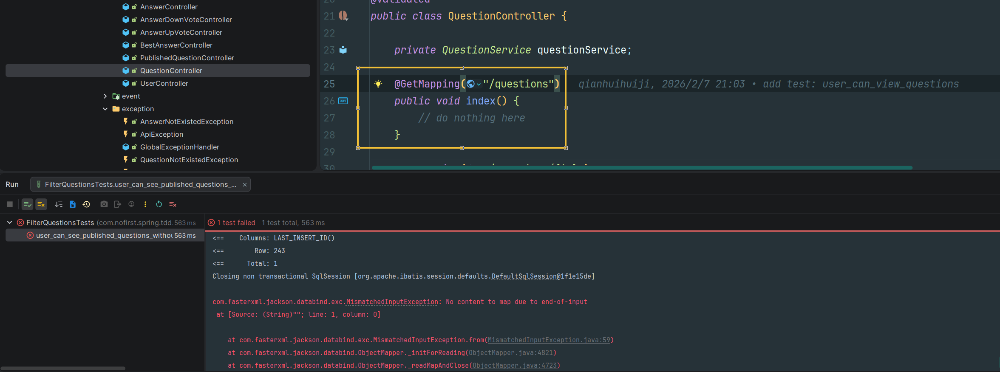
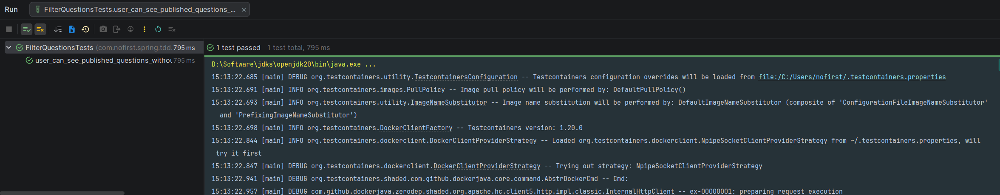
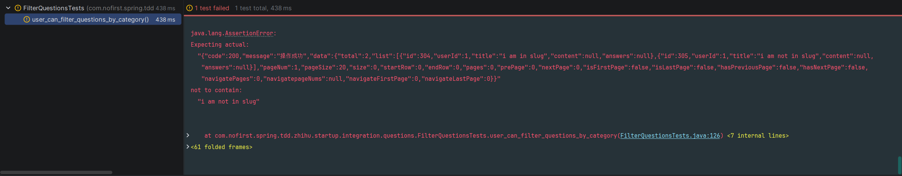
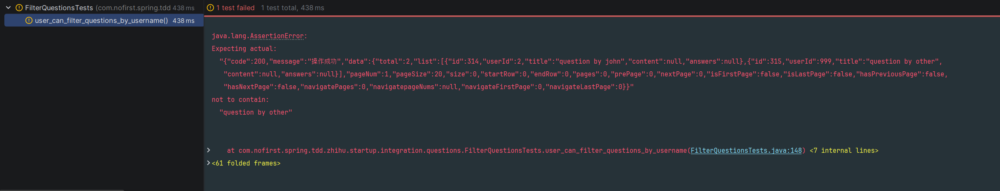

## 本节说明

本节我们来开发问题列表页的显示功能。

## 筛选功能

我们依然是从测试开始，首先我们新建测试：

*src/test/java/com/nofirst/spring/tdd/zhihu/startup/integration/questions/FilterQuestionsTests.java*

```java
@TestInstance(TestInstance.Lifecycle.PER_CLASS)
public class FilterQuestionsTests extends BaseContainerTest {

    private MockMvc mockMvc;

    @Autowired
    private WebApplicationContext context;

    @Autowired
    private QuestionMapper questionMapper;

    @Autowired
    private AnswerMapper answerMapper;

    @Autowired
    private ObjectMapper objectMapper;


    @BeforeAll
    public void setupMockMvc() {
        mockMvc = MockMvcBuilders
                .webAppContextSetup(context)
                .apply(springSecurity())
                .build();
    }

    @BeforeEach
    public void setupTestData() {
        QuestionExample example = new QuestionExample();
        // 空条件，匹配所有数据，等价于delete * from question
        example.createCriteria();
        questionMapper.deleteByExample(example);
    }

    @Test
    void user_can_see_published_questions_without_any_filter() throws Exception {
        // given
        // 10 条已发布
        List<Question> publishedQuestions = QuestionFactory.createPublishedQuestionBatch(10);
        publishedQuestions.forEach(t -> questionMapper.insert(t));
        // 中间插入一条未发布的
        Question unpublishedQuestion = QuestionFactory.createUnpublishedQuestion();
        questionMapper.insert(unpublishedQuestion);
        // 再来 30 条已发布
        List<Question> publishedQuestions2 = QuestionFactory.createPublishedQuestionBatch(30);
        publishedQuestions2.forEach(t -> questionMapper.insert(t));

        // when
        MvcResult result = this.mockMvc.perform(get("/questions?pageIndex=1&pageSize=20"))
                .andExpect(status().isOk()).andReturn();

        // then
        String json = result.getResponse().getContentAsString();

        TypeReference<CommonResult<PageInfo<QuestionVo>>> typeRef = new TypeReference<>() {
        };
        CommonResult<PageInfo<QuestionVo>> commonResult = objectMapper.readValue(json, typeRef);
        long code = commonResult.getCode();
        assertThat(code).isEqualTo(ResultCode.SUCCESS.getCode());

        PageInfo<QuestionVo> data = commonResult.getData();

        assertThat(json).doesNotContain(unpublishedQuestion.getContent());
        assertThat(data.getTotal()).isEqualTo(40);
        assertThat(data.getList().size()).isEqualTo(20);
    }
}
```

*src/test/java/com/nofirst/spring/tdd/zhihu/startup/factory/QuestionFactory.java*

```java
.
    .
    .
    public static List<Question> createPublishedQuestionBatch(Integer times) {
        List<Question> questions = new ArrayList<>();
        for (int i = 0; i < times; i++) {
            questions.add(createPublishedQuestion());
        }

        return questions;
    }
}
```

运行测试：



因为我们只是写了接口，却什么逻辑都没有实现修改`QuestionController`：

*src/main/java/com/nofirst/spring/tdd/zhihu/startup/controller/QuestionController.java*

```java
    .
    .
    .
    @GetMapping("/questions")
    public CommonResult<PageInfo<QuestionVo>> index(@RequestParam @NotNull Integer pageIndex,
                                                    @RequestParam @NotNull Integer pageSize) {
        PageInfo<QuestionVo> questionPage = questionService.index(pageIndex, pageSize);
        return CommonResult.success(questionPage);
    }
	.
	.
	.
```

添加`index()`方法：

*src/main/java/com/nofirst/spring/tdd/zhihu/startup/service/impl/QuestionServiceImpl.java*

```java
	.
    .
    .
	@Override
    public PageInfo<QuestionVo> index(Integer pageIndex, Integer pageSize) {
        QuestionExample example = new QuestionExample();
        QuestionExample.Criteria criteria = example.createCriteria();
        criteria.andPublishedAtIsNotNull();

        PageHelper.startPage(pageIndex, pageSize);
        List<Question> questions = questionMapper.selectByExample(example);
        // 如果不使用 mapper 返回的对象直接构造分页对象，total会被错误赋值成当前页的数据的数量，而不是总数
        PageInfo<Question> questionPageInfo = new PageInfo<>(questions);
        List<QuestionVo> result = new ArrayList<>();
        for (Question question : questions) {
            QuestionVo questionVo = new QuestionVo();
            questionVo.setId(question.getId());
            questionVo.setUserId(question.getUserId());
            questionVo.setTitle(question.getTitle());
            questionVo.setContent(question.getContent());
            result.add(questionVo);
        }
        PageInfo<QuestionVo> pageResult = new PageInfo<>();
        pageResult.setTotal(questionPageInfo.getTotal());
        pageResult.setPageNum(questionPageInfo.getPageNum());
        pageResult.setPageSize(questionPageInfo.getPageSize());
        pageResult.setList(result);
        return pageResult;
    }
```

再次运行测试，测试通过：




## 分类筛选

接下来我们来添加新的测试 —— 根据`Category`筛选问题。

新增测试：

```java
    .
    .
    .
    @Test
    void user_can_filter_questions_by_category() throws Exception {
        // given
        Category category = categoryMapper.selectByPrimaryKey(1);
        Question questionInSlug = QuestionFactory.createPublishedQuestion();
        questionInSlug.setCategoryId(category.getId());
        questionInSlug.setTitle("i am in slug");
        questionMapper.insert(questionInSlug);
        Question questionNotInSlug = QuestionFactory.createPublishedQuestion();
        questionNotInSlug.setCategoryId(999);
        questionNotInSlug.setTitle("i am not in slug");
        questionMapper.insert(questionNotInSlug);

        // when
        MvcResult result = this.mockMvc.perform(get("/questions?slug={slug}&pageIndex=1&pageSize=20", category.getSlug()))
                .andDo(print())
                .andExpect(status().isOk()).andReturn();

        // 这里注意要指定字符编码，Windows 默认 GBK，会导致中文乱码
        String json = new String(result.getResponse().getContentAsByteArray(), StandardCharsets.UTF_8);

        // then
        assertThat(json).contains(questionInSlug.getTitle());
        assertThat(json).doesNotContain(questionNotInSlug.getTitle());
    }
}
```

运行测试：



修改 `QuestionController`：

```java
    .
    .
    .
    @GetMapping("/questions")
    public CommonResult<PageInfo<QuestionVo>> index(@RequestParam @NotNull Integer pageIndex,
                                                    @RequestParam @NotNull Integer pageSize,
                                                    @RequestParam(required = false) String slug) {
        PageInfo<QuestionVo> questionPage = questionService.index(pageIndex, pageSize, slug);
        return CommonResult.success(questionPage);
    }
	.
	.
	.
}

```

修改`index()`方法：

```java

public class QuestionServiceImpl implements QuestionService {

    private CustomEventPublisher customEventPublisher;
    private QuestionMapper questionMapper;
    private QuestionMapperExt questionMapperExt;
    private AnswerService answerService;
    private CategoryMapper categoryMapper;

    @Override
    public PageInfo<QuestionVo> index(Integer pageIndex, Integer pageSize, String slug) {
        QuestionExample example = new QuestionExample();
        QuestionExample.Criteria criteria = example.createCriteria();
        criteria.andPublishedAtIsNotNull();
        if (StringUtils.isNotBlank(slug)) {
            slug(criteria, slug);
        }
        .
        .
        .
    }
    
    private void slug(QuestionExample.Criteria criteria, String slug) {
        CategoryExample categoryExample = new CategoryExample();
        categoryExample.createCriteria().andSlugEqualTo(slug);
        List<Category> categories = categoryMapper.selectByExample(categoryExample);
        if (!CollectionUtils.isEmpty(categories)) {
            Category category = categories.get(0);
            criteria.andCategoryIdEqualTo(category.getId());
        }
    }
    .
    .
}
```


再次测试，测试通过。

## 用户筛选

我们来继续添加测试：按照用户名来筛选问题。

添加测试：

```java
    .
    .
    .
    @Test
    void user_can_filter_questions_by_username() throws Exception {
        // given
        Question byJohn = QuestionFactory.createPublishedQuestion();
        byJohn.setTitle("question by john");
        byJohn.setUserId(2);
        questionMapper.insert(byJohn);
        Question byOther = QuestionFactory.createPublishedQuestion();
        byOther.setTitle("question by other");
        byOther.setUserId(999);
        questionMapper.insert(byOther);
        // when
        MvcResult result = this.mockMvc.perform(get("/questions?pageIndex=1&pageSize=20&by=John"))
                .andExpect(status().isOk()).andReturn();

        String json = result.getResponse().getContentAsString(StandardCharsets.UTF_8);

        // then
        assertThat(json).contains(byJohn.getTitle());
        assertThat(json).doesNotContain(byOther.getTitle());
    }
}
```

运行测试：

测试失败了，因为我们目前还没有相应的逻辑。

添加筛选逻辑：

```java
.
.
.
public class QuestionController {

    private QuestionService questionService;

    @GetMapping("/questions")
    public CommonResult<PageInfo<QuestionVo>> index(@RequestParam @NotNull Integer pageIndex,
                                                    @RequestParam @NotNull Integer pageSize,
                                                    @RequestParam(required = false) String slug,
                                                    @RequestParam(required = false) String by) {
        PageInfo<QuestionVo> questionPage = questionService.index(pageIndex, pageSize, slug, by);
        return CommonResult.success(questionPage);
    }
	.
	.
	.
}
```

修改`index()`方法：

```java
.
    .
    .
    .
    @Override
    public PageInfo<QuestionVo> index(Integer pageIndex, Integer pageSize, String slug, String by) {
        QuestionExample example = new QuestionExample();
        QuestionExample.Criteria criteria = example.createCriteria();
        criteria.andPublishedAtIsNotNull();
        if (StringUtils.isNotBlank(slug)) {
            slug(criteria, slug);
        }
        if (StringUtils.isNotBlank(by)) {
            by(criteria, by);
        }
    	.
        .
        .
	}

	private void by(QuestionExample.Criteria criteria, String username) {
        UserExample userExample = new UserExample();
        userExample.createCriteria().andNameEqualTo(username);
        List<User> users = userMapper.selectByExample(userExample);
        if (!CollectionUtils.isEmpty(users)) {
            User user = users.get(0);
            criteria.andUserIdEqualTo(user.getId());
        }
    }
```


运行测试，测试通过：

运行一下全部测试，发现有一个测试失败了：

episode9_2026-03-04_16-51-11.png

因为我们修改了`index()`方法的入参，`pageSize`和`pageIndex` ，因此需要修改一下测试用例：

```java
@Test
void user_can_view_questions() throws Exception {
    // given

    // when
    this.mockMvc.perform(get("/questions?pageIndex=1&pageSize=20"))
            // then
            .andExpect(status().isOk()).andReturn();
}
```

再次运行测试，测试全部通过。


## 提交代码

最后，让我们提交下代码：

```
$ git add .
$ git commit -m 'filter questions'
```