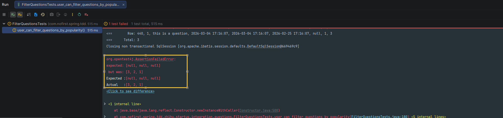
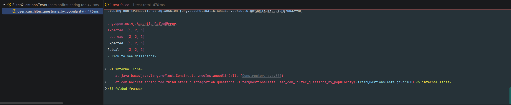
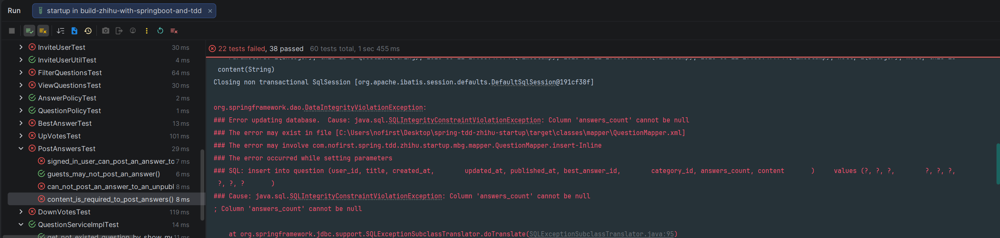
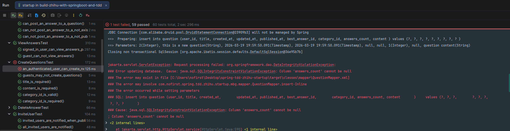
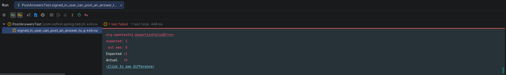
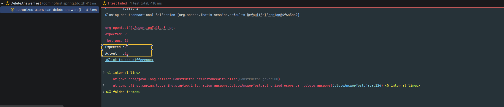
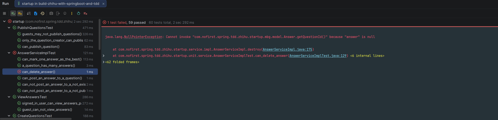
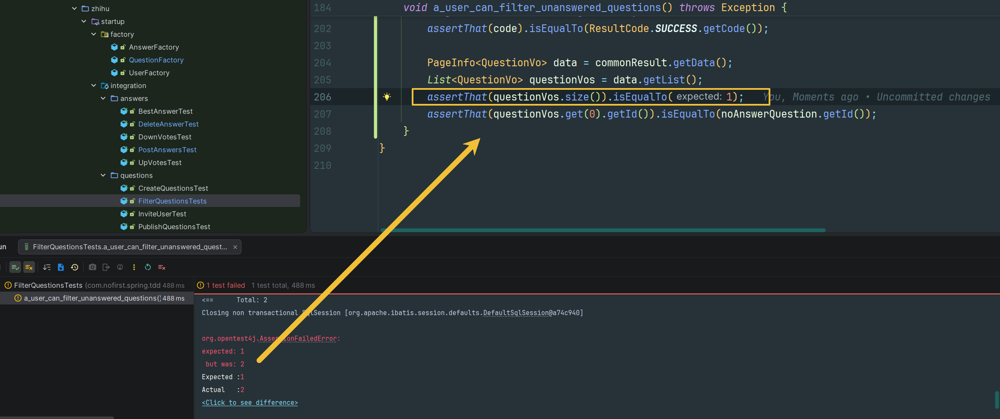

## 本节说明

本节我们来添加一个新的过滤条件 —— 按照回复数量来筛选。

## 新增测试

从新增测试开始：

*src/test/java/com/nofirst/spring/tdd/zhihu/startup/integration/questions/FilterQuestionsTests.java*

```java
package com.nofirst.spring.tdd.zhihu.startup.integration.questions;

import com.fasterxml.jackson.core.type.TypeReference;
import com.fasterxml.jackson.databind.ObjectMapper;
import com.github.pagehelper.PageInfo;
import com.nofirst.spring.tdd.zhihu.startup.common.CommonResult;
import com.nofirst.spring.tdd.zhihu.startup.common.ResultCode;
import com.nofirst.spring.tdd.zhihu.startup.factory.QuestionFactory;
import com.nofirst.spring.tdd.zhihu.startup.integration.BaseContainerTest;
import com.nofirst.spring.tdd.zhihu.startup.mbg.mapper.CategoryMapper;
import com.nofirst.spring.tdd.zhihu.startup.mbg.mapper.QuestionMapper;
import com.nofirst.spring.tdd.zhihu.startup.mbg.model.Category;
import com.nofirst.spring.tdd.zhihu.startup.mbg.model.Question;
import com.nofirst.spring.tdd.zhihu.startup.mbg.model.QuestionExample;
import com.nofirst.spring.tdd.zhihu.startup.model.vo.QuestionVo;
import org.junit.jupiter.api.BeforeEach;
import org.junit.jupiter.api.Test;
import org.springframework.beans.factory.annotation.Autowired;
import org.springframework.test.web.servlet.MvcResult;

import java.nio.charset.StandardCharsets;
import java.util.Arrays;
import java.util.List;
import java.util.stream.Collectors;

import static org.assertj.core.api.Assertions.assertThat;
import static org.springframework.test.web.servlet.request.MockMvcRequestBuilders.get;
import static org.springframework.test.web.servlet.result.MockMvcResultHandlers.print;
import static org.springframework.test.web.servlet.result.MockMvcResultMatchers.status;

class FilterQuestionsTest extends BaseContainerTest {

    @Autowired
    private QuestionMapper questionMapper;
    @Autowired
    private CategoryMapper categoryMapper;
    @Autowired
    private ObjectMapper objectMapper;

    @BeforeEach
    public void setupTestData() {
        QuestionExample example = new QuestionExample();
        example.createCriteria();
        questionMapper.deleteByExample(example);
    }
	.
    .
    .
    @Test
    void user_can_filter_questions_by_popularity() throws Exception {
        // given
        Question oneAnswerQuestion = QuestionFactory.createPublishedQuestion();
        oneAnswerQuestion.setAnswersCount(1);
        questionMapper.insert(oneAnswerQuestion);
        Question twoAnswerQuestion = QuestionFactory.createPublishedQuestion();
        twoAnswerQuestion.setAnswersCount(2);
        questionMapper.insert(twoAnswerQuestion);
        Question threeAnswerQuestion = QuestionFactory.createPublishedQuestion();
        threeAnswerQuestion.setAnswersCount(3);
        questionMapper.insert(threeAnswerQuestion);
        // when
        String json = this.mockMvc.perform(get("/questions?pageIndex=1&pageSize=20&popularity=1"))
                .andExpect(status().isOk()).andReturn().getResponse().getContentAsString(StandardCharsets.UTF_8);

        // then
        TypeReference<CommonResult<PageInfo<QuestionVo>>> typeRef = new TypeReference<>() {
        };
        CommonResult<PageInfo<QuestionVo>> commonResult = objectMapper.readValue(json, typeRef);
        long code = commonResult.getCode();
        assertThat(code).isEqualTo(ResultCode.SUCCESS.getCode());

        PageInfo<QuestionVo> data = commonResult.getData();
        List<Integer> answersCountList = data.getList().stream().map(QuestionVo::getAnswersCount).map(t -> (Integer) t).collect(Collectors.toList());

        assertThat(Arrays.asList(3, 2, 1)).isEqualTo(answersCountList);
    }
}
```

在测试中，我们给`question`模型增加了一个`answers_count`属性。对于我们的应用而言，`answers_count` 是一个常用的属性，所以我们准备将其作为 `questions` 表的一个字段进行存储。增加修改表结构的语句：

*src/main/resources/db/migration/V2026030401__alter_table_question.sql*

```sql
alter table question
    add answers_count int not null default 0 comment '回答数量';
```

接下来运行Maven的`flyway`插件的`flyway:migrate`命令生成表，并修改`generatorConfig.xml`的配置，改为生成`question`表，运行`Generator#main()`方法生成对应的数据库映射文件。

修改`QuestionVo`：

```java
@Data
public class QuestionVo {

    private Integer id;

    private Integer userId;

    private String title;

    private String content;

    private Integer answersCount;

    private PageInfo<Answer> answers;
}
```


运行测试：



测试失败了，因为我们还没有返回 `answers_count`。增加返回：

*src/main/java/com/nofirst/spring/tdd/zhihu/startup/service/impl/QuestionServiceImpl.java*

```java
	public PageInfo<QuestionVo> index(Integer pageIndex, Integer pageSize, String slug, String by) {
        QuestionExample example = new QuestionExample();
        QuestionExample.Criteria criteria = example.createCriteria();
        criteria.andPublishedAtIsNotNull();
        if (StringUtils.isNotBlank(slug)) {
            slug(criteria, slug);
        }
        if (StringUtils.isNotBlank(by)) {
            by(criteria, by);
        }

        PageHelper.startPage(pageIndex, pageSize);
        List<Question> questions = questionMapper.selectByExample(example);
        PageInfo<Question> questionPageInfo = new PageInfo<>(questions);
        List<QuestionVo> result = new ArrayList<>();
        for (Question question : questions) {
            QuestionVo questionVo = new QuestionVo();
            questionVo.setId(question.getId());
            questionVo.setUserId(question.getUserId());
            questionVo.setTitle(question.getTitle());
            questionVo.setContent(question.getContent());
            questionVo.setAnswersCount(question.getAnswersCount());// 此处
            result.add(questionVo);
        }
        PageInfo<QuestionVo> pageResult = new PageInfo<>();
        pageResult.setTotal(questionPageInfo.getTotal());
        pageResult.setPageNum(questionPageInfo.getPageNum());
        pageResult.setPageSize(questionPageInfo.getPageSize());
        pageResult.setList(result);
        return pageResult;
    }
```

再次测试：



可以看出与预期返回不符，所以我们要添加新的筛选逻辑：

*src/main/java/com/nofirst/spring/tdd/zhihu/startup/controller/QuestionController.java*

```java
@GetMapping("/questions")
public CommonResult<PageInfo<QuestionVo>> index(@RequestParam @NotNull Integer pageIndex,
                                                @RequestParam @NotNull Integer pageSize,
                                                @RequestParam(required = false) String slug,
                                                @RequestParam(required = false) String by,
                                                @RequestParam(required = false) Integer popularity) {
    PageInfo<QuestionVo> questionPage = questionService.index(pageIndex, pageSize, slug, by, popularity);
    return CommonResult.success(questionPage);
}
```

修改`index()`方法：

*src/main/java/com/nofirst/spring/tdd/zhihu/startup/service/impl/QuestionServiceImpl.java*

```java
	@Override
    public PageInfo<QuestionVo> index(Integer pageIndex, Integer pageSize, String slug, String by, Integer popularity) {
        QuestionExample example = new QuestionExample();
        QuestionExample.Criteria criteria = example.createCriteria();
        criteria.andPublishedAtIsNotNull();
        if (StringUtils.isNotBlank(slug)) {
            slug(criteria, slug);
        }
        if (StringUtils.isNotBlank(by)) {
            by(criteria, by);
        }
        if (Objects.nonNull(popularity) && popularity.equals(1)) {
            popularity(example);
        }
        .
        .
        .
    }

	private void popularity(QuestionExample example) {
        example.setOrderByClause("answers_count desc");
    }
	.
    .
    .
}
```

再次测试，测试通过。

让我们先来运行一下全部的测试用例：



类似的问题我们之前遇到过，因为我们增加了不允许为 null 的`answers_count`属性。让我们先来修改一个`QuestionFactory`的逻辑：

*src/test/java/com/nofirst/spring/tdd/zhihu/startup/factory/QuestionFactory.java*

```java
package com.nofirst.spring.tdd.zhihu.startup.factory;

import com.nofirst.spring.tdd.zhihu.startup.mbg.model.Question;
import com.nofirst.spring.tdd.zhihu.startup.model.dto.QuestionDto;
import org.apache.commons.lang3.time.DateUtils;

import java.util.ArrayList;
import java.util.Date;
import java.util.List;

public class QuestionFactory {

    public static Question createPublishedQuestion() {
        Date now = new Date();

        Question question = new Question();
        question.setUserId(1);
        question.setTitle("this is a question");
        question.setContent("this is content");
        question.setCreatedAt(now);
        question.setUpdatedAt(now);
        question.setPublishedAt(now);
        question.setCategoryId(1);
        question.setAnswersCount(0);

        return question;
    }

    public static Question createUnpublishedQuestion() {
        Date now = new Date();

        Question question = new Question();
        question.setUserId(1);
        question.setTitle("this is a question");
        question.setContent("this is content");
        question.setCreatedAt(now);
        question.setUpdatedAt(now);
        question.setPublishedAt(null);
        question.setCategoryId(1);
        question.setAnswersCount(0);

        return question;
    }

    public static QuestionDto createQuestionDto() {
        QuestionDto questionDto = new QuestionDto();
        questionDto.setTitle("this is a new question");
        questionDto.setContent("question content");
        questionDto.setCategoryId(1);

        return questionDto;
    }

    public static List<Question> createPublishedQuestionBatch(Integer times) {
        List<Question> questions = new ArrayList<>();
        for (int i = 0; i < times; i++) {
            questions.add(createPublishedQuestion());
        }

        return questions;
    }
}
```

再次测试，发现只剩一个测试用例不通过了：



这个是因为创建问题时，我们没有进行赋值：

*src/main/java/com/nofirst/spring/tdd/zhihu/startup/service/impl/QuestionServiceImpl.java*

```java
	@Override
    public void store(QuestionDto dto, AccountUser accountUser) {
        Date now = new Date();
        Question question = new Question();
        question.setUserId(accountUser.getUserId());
        question.setTitle(dto.getTitle());
        question.setContent(dto.getContent());
        question.setCategoryId(dto.getCategoryId());
        question.setCreatedAt(now);
        question.setUpdatedAt(now);
        question.setAnswersCount(0);// 此处

        questionMapper.insert(question);
    }
```

再次测试，测试全部通过。

但是你意识到没有，虽然我们增加了`answers_count`属性，但是我们却没有去更新它！我们期望是在添加一个答案时，增加`answers_count`；删除答案时，减少`answers_count`。在此之前我们已经对新增和删除答案写了单元测试，我们来更新一下对应的测试用例：

*src/test/java/com/nofirst/spring/tdd/zhihu/startup/integration/answers/PostAnswersTest.java*

```java
	@Test
    @WithUserDetails(value = "John", userDetailsServiceBeanName = "customUserDetailsService")
    void signed_in_user_can_post_an_answer_to_a_published_question() throws Exception {
        // given：准备测试数据
        Question question = QuestionFactory.createPublishedQuestion();
        questionMapper.insert(question);
        AnswerExample answerExample = new AnswerExample();
        AnswerExample.Criteria criteria = answerExample.createCriteria();
        // John 用户的userId就是2
        criteria.andUserIdEqualTo(2);
        long beforeCount = answerMapper.countByExample(answerExample);
        assertThat(beforeCount).isEqualTo(0);

        // when：调用接口并获取返回结果
        AnswerDto answer = AnswerFactory.createAnswerDto();
        this.mockMvc.perform(post("/questions/{id}/answers", question.getId())
                        .contentType(MediaType.APPLICATION_JSON)
                        .content(objectMapper.writeValueAsString(answer))
                )
                .andDo(print())
                .andExpect(status().isOk())
                .andExpect(jsonPath("$.code").value(ResultCode.SUCCESS.getCode()));

        // then：数据库中answer数据增加了一条
        long afterCount = answerMapper.countByExample(answerExample);
        assertThat(afterCount).isEqualTo(1);
        Question questionAfter = questionMapper.selectByPrimaryKey(question.getId()); // 此处
        assertThat(questionAfter.getAnswersCount()).isEqualTo(1);
    }
```

运行测试：



增加对应的逻辑：

*src/main/java/com/nofirst/spring/tdd/zhihu/startup/service/impl/AnswerServiceImpl.java*

```java
 	@Override
    public void store(Integer questionId, AnswerDto answerDto, AccountUser accountUser) {
        Question question = questionMapper.selectByPrimaryKey(questionId);
        if (Objects.isNull(question)) {
            throw new QuestionNotExistedException();
        }
        if (Objects.isNull(question.getPublishedAt())) {
            throw new QuestionNotPublishedException();
        }
        Date now = new Date();
        Answer answer = new Answer();
        answer.setQuestionId(questionId);
        answer.setUserId(accountUser.getUserId());
        answer.setCreatedAt(now);
        answer.setUpdatedAt(now);
        answer.setContent(answerDto.getContent());

        answerMapper.insert(answer);

        Question updateQuestion = new Question();
        updateQuestion.setId(question.getId());
        updateQuestion.setAnswersCount(question.getAnswersCount() + 1);
        updateQuestion.setUpdatedAt(now);
        questionMapper.updateByPrimaryKeySelective(updateQuestion);
    }
```

再次运行测试，测试通过。

接下来修改删除答案的测试用例：

*src/test/java/com/nofirst/spring/tdd/zhihu/startup/integration/answers/DeleteAnswerTest.java*

```java
@Test
    @WithUserDetails(value = "John", userDetailsServiceBeanName = "customUserDetailsService")
    void authorized_users_can_delete_answers() throws Exception {
        // given：准备测试数据
        Question questionOfJohn = QuestionFactory.createPublishedQuestion();
        questionOfJohn.setUserId(2);
        questionOfJohn.setAnswersCount(10); // 此处
        questionMapper.insert(questionOfJohn);
        Answer answerOfJohn = AnswerFactory.createAnswer(questionOfJohn.getId());
        answerOfJohn.setUserId(2);
        answerMapper.insert(answerOfJohn);

        AnswerExample answerExample = new AnswerExample();
        AnswerExample.Criteria criteria = answerExample.createCriteria();
        // John 用户的userId就是2
        criteria.andUserIdEqualTo(2);
        long beforeCount = answerMapper.countByExample(answerExample);
        assertThat(beforeCount).isEqualTo(1);

        // when
        this.mockMvc.perform(delete("/answers/{id}", answerOfJohn.getId())
                        .contentType(MediaType.APPLICATION_JSON)
                ).andDo(print())
                .andExpect(status().isOk())
                .andExpect(jsonPath("$.code").value(ResultCode.SUCCESS.getCode()));

        // then
        long afterCount = answerMapper.countByExample(answerExample);
        assertThat(afterCount).isEqualTo(0);

        Question questionAfter = questionMapper.selectByPrimaryKey(questionOfJohn.getId()); // 此处
        assertThat(questionAfter.getAnswersCount()).isEqualTo(9);
    }
```

运行测试：



接下来修改删除答案的逻辑：

*src/main/java/com/nofirst/spring/tdd/zhihu/startup/service/impl/AnswerServiceImpl.java*

```java
	@Override
    public void destroy(Integer answerId) {
        Answer answer = answerMapper.selectByPrimaryKey(answerId);
        Question question = questionMapper.selectByPrimaryKey(answer.getQuestionId());

        Question updateQuestion = new Question();
        updateQuestion.setId(question.getId());
        updateQuestion.setAnswersCount(question.getAnswersCount() - 1);
        updateQuestion.setUpdatedAt(new Date());
        questionMapper.updateByPrimaryKeySelective(updateQuestion);

        answerMapper.deleteByPrimaryKey(answerId);
    }
```

重新运行测试，测试通过。运行全部测试，发现有一个测试用例失败了：



同步更新一下测试用例：

*src/test/java/com/nofirst/spring/tdd/zhihu/startup/unit/service/AnswerServiceImplTest.java*

```java
	@Test
    void can_delete_answer() {
        // given
        Question publishedQuestion = QuestionFactory.createPublishedQuestion();
        publishedQuestion.setId(1);
        Answer answer = AnswerFactory.createAnswer(publishedQuestion.getId());
        publishedQuestion.setBestAnswerId(answer.getId());
        given(answerMapper.selectByPrimaryKey(answer.getId())).willReturn(answer);
        given(questionMapper.selectByPrimaryKey(publishedQuestion.getId())).willReturn(publishedQuestion);
        // when
        answerService.destroy(1);

        // then
        verify(questionMapper, times(1)).updateByPrimaryKeySelective(any());
        verify(answerMapper, times(1)).deleteByPrimaryKey(1);
    }
```

再次运行测试，测试用例全部通过！

## 过滤未解答的问题

接下来让我们添加一个新的筛选条件的测试：

```java
    .
    .
    .
    @Test
    void a_user_can_filter_unanswered_questions() throws Exception {
        // given
        Question oneAnswerQuestion = QuestionFactory.createPublishedQuestion();
        oneAnswerQuestion.setAnswersCount(1);
        questionMapper.insert(oneAnswerQuestion);
        Question noAnswerQuestion = QuestionFactory.createPublishedQuestion();
        noAnswerQuestion.setAnswersCount(0);
        questionMapper.insert(noAnswerQuestion);
        // when
        String json = this.mockMvc.perform(get("/questions?pageIndex=1&pageSize=20&unanswered=1"))
                .andExpect(status().isOk())
                .andReturn()
                .getResponse()
                .getContentAsString(StandardCharsets.UTF_8);
        TypeReference<CommonResult<PageInfo<QuestionVo>>> typeRef = new TypeReference<>() {
        };
        CommonResult<PageInfo<QuestionVo>> commonResult = objectMapper.readValue(json, typeRef);
        long code = commonResult.getCode();
        assertThat(code).isEqualTo(ResultCode.SUCCESS.getCode());

        PageInfo<QuestionVo> data = commonResult.getData();
        List<QuestionVo> questionVos = data.getList();
        assertThat(questionVos.size()).isEqualTo(1);
        assertThat(questionVos.get(0).getId()).isEqualTo(noAnswerQuestion.getId());
    }
}
```

运行测试：



测试结果表明我们并没有对结果进行过滤，接下来添加过滤逻辑：

*src/main/java/com/nofirst/spring/tdd/zhihu/startup/controller/QuestionController.java*

```
	@GetMapping("/questions")
    public CommonResult<PageInfo<QuestionVo>> index(@RequestParam @NotNull Integer pageIndex,
                                                    @RequestParam @NotNull Integer pageSize,
                                                    @RequestParam(required = false) String slug,
                                                    @RequestParam(required = false) String by,
                                                    @RequestParam(required = false) Integer popularity,
                                                    @RequestParam(required = false) Integer unanswered // 此处) {
        PageInfo<QuestionVo> questionPage = questionService.index(pageIndex, pageSize, slug, by, popularity, unanswered);
        return CommonResult.success(questionPage);
    }
```

*src/main/java/com/nofirst/spring/tdd/zhihu/startup/service/impl/QuestionServiceImpl.java*

```java
	@Override
    public PageInfo<QuestionVo> index(Integer pageIndex, Integer pageSize, String slug, String by, Integer popularity, Integer unanswered) {
        QuestionExample example = new QuestionExample();
        QuestionExample.Criteria criteria = example.createCriteria();
        criteria.andPublishedAtIsNotNull();
        if (StringUtils.isNotBlank(slug)) {
            slug(criteria, slug);
        }
        if (StringUtils.isNotBlank(by)) {
            by(criteria, by);
        }
        if (Objects.nonNull(popularity) && popularity.equals(1)) {
            popularity(example);
        }
        if (Objects.nonNull(unanswered) && unanswered.equals(1)) {
            unanswered(criteria);
        }
        .
        .
        .
    }

	private void unanswered(QuestionExample.Criteria criteria) {
        criteria.andAnswersCountEqualTo(0);
    }
```

再次运行测试，测试通过。

> 注：到这里，你可能会觉得这里的代码写的有点"丑陋"，因为我们的方法参数越塞越多。你可能会向做一点重构，那么就放心大胆地去干吧！因为我们有测试用例为我们的重构保驾护航，只要测试用例通过，那么功能就是正常的。

## 提交代码

运行全部测试，以确保功能正常。最后，让我们提交代码：

```
$ git add .
$ git commit -m 'filter questions'
```