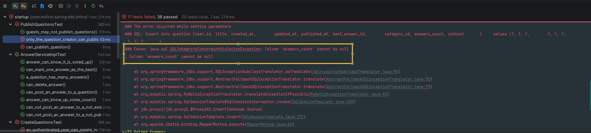
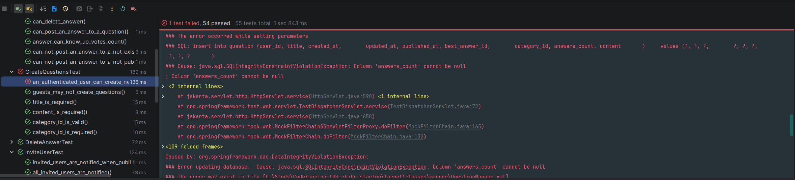
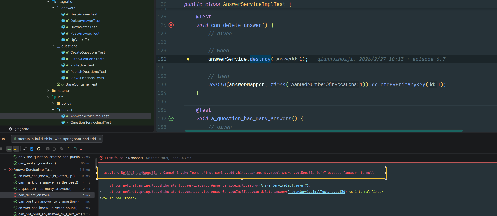

# 筛选功能（二）

本节我们来添加新的过滤条件 —— 按照回复数量来筛选。

---

## 一、功能说明

### 1.1 热度筛选

在问答系统中，用户希望能够按照问题的热度（回答数量）来筛选问题，这样可以快速找到热门问题。

### 1.2 开发目标

| 目标 | 说明 |
|------|------|
| 添加 answers_count 字段 | 在 question 表中存储回答数量 |
| 按热度排序 | 支持按回答数量降序排列 |
| 筛选未解答问题 | 支持只显示没有回答的问题 |
| 自动更新计数 | 创建/删除回答时更新计数 |

---

## 二、添加 answers_count 字段

### 2.1 创建测试

从新增测试开始：

*src/test/java/com/nofirst/spring/tdd/zhihu/startup/integration/questions/FilterQuestionsTests.java*

```java
/** @test */
public function user_can_filter_questions_by_popularity()
{
    // Question without answers
    $this->publishQuestion();

    // Question with two answers
    $questionOfTwoAnswers = $this->publishQuestion();
    create(Answer::class, ['question_id' => $questionOfTwoAnswers->id], 2);

    // Question with three answers
    $questionOfThreeAnswers = $this->publishQuestion();
    create(Answer::class, ['question_id' => $questionOfThreeAnswers->id], 3);

    $response = $this->get('questions?popularity=1');

    $questions = $response->data('questions')->items();

    $this->assertEquals([3,2,0], array_column($questions, 'answers_count'));
}
```

### 2.2 添加数据库字段

在测试中，我们给 `question` 增加了一个 `answers_count` 属性。对于我们的应用而言，`answers_count` 是一个常用的属性，所以我们准备将其作为 `questions` 表的一个字段进行存储。

增加修改表结构的语句：

*src/main/resources/db/migration/V2026030401__alter_table_question.sql*

```sql
alter table question
    add answers_count int not null default 0 comment '回答数量';
```

### 2.3 运行迁移

接下来运行 Maven 的 `flyway` 插件的 `flyway:migrate` 命令生成表：

```bash
mvn flyway:migrate
```

修改 `generatorConfig.xml` 的配置，改为生成 `question` 表，运行 `Generator#main()` 方法生成对应的数据库映射文件。

### 2.4 修改 QuestionVo

修改 `QuestionVo`：

```java
@Data
public class QuestionVo {

    private Integer id;

    private Integer userId;

    private String title;

    private String content;

    private Integer answersCount;

    PageInfo<Answer> answers;
}
```

---

## 三、返回 answers_count

### 3.1 运行测试

运行测试：


测试失败了，因为我们还没有返回 `answers_count`。

### 3.2 增加返回

增加返回：

*src/main/java/com/nofirst/spring/tdd/zhihu/startup/service/impl/QuestionServiceImpl.java*

```java
public PageInfo<QuestionVo> index(Integer pageIndex, Integer pageSize, String slug, String by) {
    QuestionExample example = new QuestionExample();
    QuestionExample.Criteria criteria = example.createCriteria();
    criteria.andPublishedAtIsNotNull();
    if (StringUtils.isNotBlank(slug)) {
        slug(criteria, slug);
    }
    if (StringUtils.isNotBlank(by)) {
        by(criteria, by);
    }

    PageHelper.startPage(pageIndex, pageSize);
    List<Question> questions = questionMapper.selectByExample(example);
    PageInfo<Question> questionPageInfo = new PageInfo<>(questions);
    List<QuestionVo> result = new ArrayList<>();
    for (Question question : questions) {
        QuestionVo questionVo = new QuestionVo();
        questionVo.setId(question.getId());
        questionVo.setUserId(question.getUserId());
        questionVo.setTitle(question.getTitle());
        questionVo.setContent(question.getContent());
        questionVo.setAnswersCount(question.getAnswersCount());
        result.add(questionVo);
    }
    PageInfo<QuestionVo> pageResult = new PageInfo<>();
    pageResult.setTotal(questionPageInfo.getTotal());
    pageResult.setPageNum(questionPageInfo.getPageNum());
    pageResult.setPageSize(questionPageInfo.getPageSize());
    pageResult.setList(result);
    return pageResult;
}
```

### 3.3 再次测试

再次测试：


可以看出与预期返回不符，所以我们要添加新的筛选逻辑。

---

## 四、实现热度筛选

### 4.1 添加 Controller 参数

```java
@GetMapping("/questions")
public CommonResult<PageInfo<QuestionVo>> index(@RequestParam @NotNull Integer pageIndex,
                                                @RequestParam @NotNull Integer pageSize,
                                                @RequestParam(required = false) String slug,
                                                @RequestParam(required = false) String by,
                                                @RequestParam(required = false) Integer popularity) {
    PageInfo<QuestionVo> questionPage = questionService.index(pageIndex, pageSize, slug, by, popularity);
    return CommonResult.success(questionPage);
}
```

### 4.2 修改 Service 方法

修改 `index()` 方法：

```java
@Override
public PageInfo<QuestionVo> index(Integer pageIndex, Integer pageSize, String slug, String by, Integer popularity) {
    QuestionExample example = new QuestionExample();
    QuestionExample.Criteria criteria = example.createCriteria();
    criteria.andPublishedAtIsNotNull();
    if (StringUtils.isNotBlank(slug)) {
        slug(criteria, slug);
    }
    if (StringUtils.isNotBlank(by)) {
        by(criteria, by);
    }
    if (Objects.nonNull(popularity) && popularity.equals(1)) {
        popularity(example);
    }
    .
    .
    .
}

private void popularity(QuestionExample example) {
    example.setOrderByClause("answers_count desc");
}
```

### 4.3 运行测试

再次测试，测试通过。

---

## 五、修复其他测试

### 5.1 运行全部测试

让我们先来运行一下全部的测试用例：



类似的问题我们之前遇到过，因为我们增加了不允许为 null 的 `answers_count` 属性。

### 5.2 修改 QuestionFactory

让我们先来修改一个 `QuestionFactory` 的逻辑：

```java
public class QuestionFactory {

    public static Question createPublishedQuestion() {
        Date lastWeek = DateUtils.addWeeks(new Date(), -1);
        Date now = new Date();

        Question question = new Question();
        question.setUserId(1);
        question.setTitle("this is a question");
        question.setContent("this is content");
        question.setCreatedAt(now);
        question.setUpdatedAt(now);
        question.setPublishedAt(lastWeek);
        question.setCategoryId(1);
        question.setAnswersCount(0);

        return question;
    }

    public static Question createUnpublishedQuestion() {
        Date now = new Date();

        Question question = new Question();
        question.setUserId(1);
        question.setTitle("this is a question");
        question.setContent("this is content");
        question.setCreatedAt(now);
        question.setUpdatedAt(now);
        question.setPublishedAt(null);
        question.setCategoryId(1);
        question.setAnswersCount(0);

        return question;
    }


    public static QuestionDto createQuestionDto() {
        QuestionDto questionDto = new QuestionDto();
        questionDto.setTitle("this is a new question");
        questionDto.setContent("question content");
        questionDto.setCategoryId(1);

        return questionDto;
    }

    public static List<Question> createPublishedQuestionBatch(Integer times) {
        List<Question> questions = new ArrayList<>();
        for (int i = 0; i < times; i++) {
            questions.add(createPublishedQuestion());
        }

        return questions;
    }
}
```

### 5.3 修改 store 方法

再次测试，发现只剩一个单元测试不通过了：



这个是因为创建问题时，我们没有进行赋值：

*src/main/java/com/nofirst/spring/tdd/zhihu/startup/service/impl/QuestionServiceImpl.java*

```java
@Override
public void store(QuestionDto dto, AccountUser accountUser) {
    Date now = new Date();
    Question question = new Question();
    question.setUserId(accountUser.getUserId());
    question.setTitle(dto.getTitle());
    question.setContent(dto.getContent());
    question.setCategoryId(dto.getCategoryId());
    question.setCreatedAt(now);
    question.setUpdatedAt(now);
    question.setAnswersCount(0);

    questionMapper.insert(question);
}
```

### 5.4 运行全部测试

再次测试，测试全部通过。

---

## 六、更新 answers_count

### 6.1 问题分析

但是你意识到没有，虽然我们增加了 `answers_count` 属性，但是我们却没有去更新它！我们期望是在添加一个答案时，增加 `answers_count`；删除答案时，减少 `answers_count`。

### 6.2 更新创建答案的测试

在此之前我们已经对新增和删除答案写了单元测试，我们来更新一下对应的测试用例：

*src/test/java/com/nofirst/spring/tdd/zhihu/startup/integration/answers/PostAnswersTest.java*

```java
@Test
@WithUserDetails(value = "John", userDetailsServiceBeanName = "customUserDetailsService")
void signed_in_user_can_post_an_answer_to_a_published_question() throws Exception {
    // given：准备测试数据
    Question question = QuestionFactory.createPublishedQuestion();
    questionMapper.insert(question);
    AnswerExample answerExample = new AnswerExample();
    AnswerExample.Criteria criteria = answerExample.createCriteria();
    // John 用户的 userId 就是 2
    criteria.andUserIdEqualTo(2);
    long beforeCount = answerMapper.countByExample(answerExample);
    assertThat(beforeCount).isEqualTo(0);

    // when：调用接口并获取返回结果
    AnswerDto answer = AnswerFactory.createAnswerDto();
    this.mockMvc.perform(post("/questions/{id}/answers", question.getId())
                    .contentType(MediaType.APPLICATION_JSON)
                    .content(objectMapper.writeValueAsString(answer))
            )
            .andDo(print())
            .andExpect(status().isOk())
            .andExpect(jsonPath("$.code").value(ResultCode.SUCCESS.getCode()));

    // then：数据库中 answer 数据增加了一条
    long afterCount = answerMapper.countByExample(answerExample);
    assertThat(afterCount).isEqualTo(1);
    Question questionAfter = questionMapper.selectByPrimaryKey(question.getId());
    assertThat(questionAfter.getAnswersCount()).isEqualTo(1);
}
```

### 6.3 运行测试

运行测试：


### 6.4 增加更新逻辑

增加对应的逻辑：

*src/main/java/com/nofirst/spring/tdd/zhihu/startup/service/impl/AnswerServiceImpl.java*

```java
@Override
public void store(Integer questionId, AnswerDto answerDto, AccountUser accountUser) {
    Question question = questionMapper.selectByPrimaryKey(questionId);
    if (Objects.isNull(question)) {
        throw new QuestionNotExistedException();
    }
    if (Objects.isNull(question.getPublishedAt())) {
        throw new QuestionNotPublishedException();
    }
    Date now = new Date();
    Answer answer = new Answer();
    answer.setQuestionId(questionId);
    answer.setUserId(accountUser.getUserId());
    answer.setCreatedAt(now);
    answer.setUpdatedAt(now);
    answer.setContent(answerDto.getContent());

    answerMapper.insert(answer);

    questionMapperExt.updateAnswersCount(questionId, question.getAnswersCount() + 1);
}
```

### 6.5 添加 Mapper 方法

*src/main/java/com/nofirst/spring/tdd/zhihu/startup/mbg/mapper/QuestionMapperExt.java*

```java
public interface QuestionMapperExt {

    void markAsBestAnswer(Integer questionId, Integer answerId);

    void publish(Integer questionId, Date publishedAt);

    void updateAnswersCount(Integer questionId, Integer answersCount);
}
```

### 6.6 XML 映射文件

*src/main/resources/mapper/QuestionMapperExt.xml*

```xml
<update id="updateAnswersCount">
    update question
    set answers_count = #{answersCount,jdbcType=INTEGER}
    where id = #{questionId,jdbcType=INTEGER}
</update>
```

### 6.7 运行测试

再次运行测试，测试通过。

---

## 七、更新删除答案逻辑

### 7.1 修改删除答案的测试

接下来修改删除答案的测试用例：

*src/test/java/com/nofirst/spring/tdd/zhihu/startup/integration/answers/DeleteAnswerTest.java*

```java
@Test
@WithUserDetails(value = "John", userDetailsServiceBeanName = "customUserDetailsService")
void authorized_users_can_delete_answers() throws Exception {
    // given：准备测试数据
    Question questionOfJohn = QuestionFactory.createPublishedQuestion();
    questionOfJohn.setUserId(2);
    questionOfJohn.setAnswersCount(10);
    questionMapper.insert(questionOfJohn);
    Answer answerOfJohn = AnswerFactory.createAnswer(questionOfJohn.getId());
    answerOfJohn.setUserId(2);
    answerMapper.insert(answerOfJohn);

    AnswerExample answerExample = new AnswerExample();
    AnswerExample.Criteria criteria = answerExample.createCriteria();
    // John 用户的 userId 就是 2
    criteria.andUserIdEqualTo(2);
    long beforeCount = answerMapper.countByExample(answerExample);
    assertThat(beforeCount).isEqualTo(1);

    // when
    this.mockMvc.perform(delete("/answers/{id}", answerOfJohn.getId())
                    .contentType(MediaType.APPLICATION_JSON)
            ).andDo(print())
            .andExpect(status().isOk())
            .andExpect(jsonPath("$.code").value(ResultCode.SUCCESS.getCode()));

    // then
    long afterCount = answerMapper.countByExample(answerExample);
    assertThat(afterCount).isEqualTo(0);

    Question questionAfter = questionMapper.selectByPrimaryKey(questionOfJohn.getId());
    assertThat(questionAfter.getAnswersCount()).isEqualTo(9);
}
```

### 7.2 运行测试

运行测试：


### 7.3 修改删除逻辑

接下来修改删除答案的逻辑：

*src/main/java/com/nofirst/spring/tdd/zhihu/startup/service/impl/AnswerServiceImpl.java*

```java
@Override
public void destroy(Integer answerId) {
    Answer answer = answerMapper.selectByPrimaryKey(answerId);
    Question question = questionMapper.selectByPrimaryKey(answer.getQuestionId());
    questionMapperExt.updateAnswersCount(answer.getQuestionId(), question.getAnswersCount() - 1);
    answerMapper.deleteByPrimaryKey(answerId);
}
```

### 7.4 更新单元测试

重新运行测试，测试通过。运行全部测试，发现有一个测试用例失败了：



同步更新一下测试用例：

*src/test/java/com/nofirst/spring/tdd/zhihu/startup/unit/service/AnswerServiceImplTest.java*

```java
@Test
void can_delete_answer() {
    // given
    Question publishedQuestion = QuestionFactory.createPublishedQuestion();
    publishedQuestion.setId(1);
    Answer answer = AnswerFactory.createAnswer(publishedQuestion.getId());
    publishedQuestion.setBestAnswerId(answer.getId());
    given(answerMapper.selectByPrimaryKey(answer.getId())).willReturn(answer);
    given(questionMapper.selectByPrimaryKey(publishedQuestion.getId())).willReturn(publishedQuestion);
    // when
    answerService.destroy(1);

    // then
    verify(questionMapperExt, times(1)).updateAnswersCount(publishedQuestion.getId(), publishedQuestion.getAnswersCount() - 1);
    verify(answerMapper, times(1)).deleteByPrimaryKey(1);
}
```

### 7.5 运行全部测试

再次运行测试，测试用例全部通过！

---

## 八、筛选未解答的问题

### 8.1 添加测试用例

接下来让我们添加一个新的筛选条件的测试：

```java
@Test
void a_user_can_filter_unanswered_questions() throws Exception {
    // given
    Question oneAnswerQuestion = QuestionFactory.createPublishedQuestion();
    oneAnswerQuestion.setAnswersCount(1);
    questionMapper.insert(oneAnswerQuestion);
    Question noAnswerQuestion = QuestionFactory.createPublishedQuestion();
    noAnswerQuestion.setAnswersCount(0);
    questionMapper.insert(noAnswerQuestion);
    // when
    MvcResult result = this.mockMvc.perform(get("/questions?pageIndex=1&pageSize=20&unanswered=1"))
            .andExpect(status().isOk()).andReturn();

    // then
    String json = result.getResponse().getContentAsString(StandardCharsets.UTF_8);
    TypeReference<CommonResult<PageInfo<QuestionVo>>> typeRef = new TypeReference<>() {
    };
    CommonResult<PageInfo<QuestionVo>> commonResult = objectMapper.readValue(json, typeRef);
    long code = commonResult.getCode();
    assertThat(code).isEqualTo(ResultCode.SUCCESS.getCode());

    PageInfo<QuestionVo> data = commonResult.getData();
    List<QuestionVo> questionVos = data.getList();
    assertThat(questionVos.size()).isEqualTo(1);
    assertThat(questionVos.get(0).getId()).isEqualTo(noAnswerQuestion.getId());
}
```

### 8.2 运行测试

运行测试：


测试结果表明我们并没有对结果进行过滤。

### 8.3 添加过滤逻辑

接下来添加过滤逻辑：

*src/main/java/com/nofirst/spring/tdd/zhihu/startup/controller/QuestionController.java*

```java
@GetMapping("/questions")
public CommonResult<PageInfo<QuestionVo>> index(@RequestParam @NotNull Integer pageIndex,
                                                @RequestParam @NotNull Integer pageSize,
                                                @RequestParam(required = false) String slug,
                                                @RequestParam(required = false) String by,
                                                @RequestParam(required = false) Integer popularity,
                                                @RequestParam(required = false) Integer unanswered) {
    PageInfo<QuestionVo> questionPage = questionService.index(pageIndex, pageSize, slug, by, popularity, unanswered);
    return CommonResult.success(questionPage);
}
```

*src/main/java/com/nofirst/spring/tdd/zhihu/startup/service/impl/QuestionServiceImpl.java*

```java
@Override
public PageInfo<QuestionVo> index(Integer pageIndex, Integer pageSize, String slug, String by, Integer popularity, Integer unanswered) {
    QuestionExample example = new QuestionExample();
    QuestionExample.Criteria criteria = example.createCriteria();
    criteria.andPublishedAtIsNotNull();
    if (StringUtils.isNotBlank(slug)) {
        slug(criteria, slug);
    }
    if (StringUtils.isNotBlank(by)) {
        by(criteria, by);
    }
    if (Objects.nonNull(popularity) && popularity.equals(1)) {
        popularity(example);
    }
    if (Objects.nonNull(unanswered) && unanswered.equals(1)) {
        unanswered(criteria);
    }
    .
    .
    .
}

private void unanswered(QuestionExample.Criteria criteria) {
    criteria.andAnswersCountEqualTo(0);
}
```

### 8.4 运行测试

再次运行测试，测试通过。

运行全部测试，所有测试都应该通过。

---

## 九、提交代码

最后，让我们提交代码：

```bash
$ git add .
$ git commit -m 'filter questions'
```

---

## 十、总结

### 10.1 本节学习要点

| 要点 | 说明 |
|------|------|
| 冗余字段 | 使用 answers_count 避免实时计算 |
| 数据一致性 | 创建/删除回答时更新计数 |
| 热度排序 | 使用 `orderByClause` 实现排序 |
| 未解答筛选 | 使用 `andAnswersCountEqualTo(0)` 筛选 |

### 10.2 筛选条件汇总

| 参数 | 说明 | 值 |
|------|------|------|
| `popularity=1` | 按热度排序 | 按 answers_count 降序 |
| `unanswered=1` | 未解答筛选 | answers_count = 0 |

---

## 十一、下一步

筛选功能已完成，请继续阅读：

1. [推荐与举报](./3.推荐与举报.md) - 实现投票功能
2. [关注问题](./4.关注问题.md) - 实现关注功能

---

## 附录：QuestionMapperExt 扩展

```java
public interface QuestionMapperExt {

    // 标记最佳答案
    void markAsBestAnswer(Integer questionId, Integer answerId);

    // 发布问题
    void publish(Integer questionId, Date publishedAt);

    // 更新回答数量
    void updateAnswersCount(Integer questionId, Integer answersCount);

    // 更新 slug
    void updateSlug(Integer questionId, String slug);
}
```
