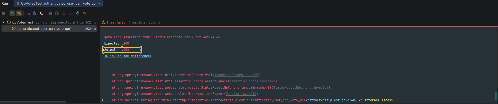
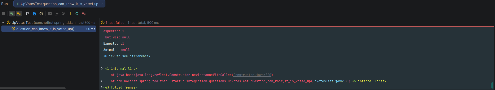
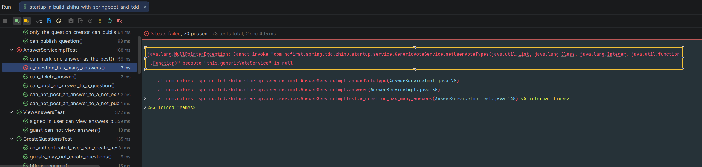

## 重构测试用例

在之前的章节中，我们开发过答案模型的「赞同与反对」功能，我们认为这与问题模型的「推荐与举报」是相同的概念。所以我们可以直接把「赞同与反对」功能的测试用例和功能代码直接"Copy"过来，但是你会发现，这里面很多的代码都是大同小异的，并且，到了之后的评论模型的「赞同与反对」功能的时候，你还得“Copy”一次。所以，趁着现在测试用例都是通过的，我们来进行一些抽象重构，达到代码复用的目的。

对于`UpVotesTest`而言，以下五个测试用例除了模型的区别，本质是相同的：

```java
void guest_can_not_vote_up();
void authenticated_user_can_vote_up();
void an_authenticated_user_can_cancel_vote_up();
void can_vote_up_only_once();
void can_vote_up_when_it_has_voted_down();
```

例如，我们只需要将路由`/answers/1/up-votes`中的`answers`换成`questions`就能得到问题模型相应的路由。因此我们将这几个测试用例抽取出来：

*src/test/java/com/nofirst/spring/tdd/zhihu/startup/integration/AbstractVoteUpTest.java*

```java
package com.nofirst.spring.tdd.zhihu.startup.integration;

import com.nofirst.spring.tdd.zhihu.startup.common.ResultCode;
import com.nofirst.spring.tdd.zhihu.startup.mbg.mapper.VoteMapper;
import com.nofirst.spring.tdd.zhihu.startup.mbg.model.Vote;
import com.nofirst.spring.tdd.zhihu.startup.mbg.model.VoteExample;
import com.nofirst.spring.tdd.zhihu.startup.model.enums.VoteActionType;
import org.junit.jupiter.api.Test;
import org.springframework.beans.factory.annotation.Autowired;
import org.springframework.security.test.context.support.WithUserDetails;

import java.util.List;

import static org.assertj.core.api.Assertions.assertThat;
import static org.assertj.core.api.Fail.fail;
import static org.springframework.test.web.servlet.request.MockMvcRequestBuilders.delete;
import static org.springframework.test.web.servlet.request.MockMvcRequestBuilders.post;
import static org.springframework.test.web.servlet.result.MockMvcResultHandlers.print;
import static org.springframework.test.web.servlet.result.MockMvcResultMatchers.jsonPath;
import static org.springframework.test.web.servlet.result.MockMvcResultMatchers.status;

public abstract class AbstractVoteUpTest extends BaseContainerTest {

    @Autowired
    protected VoteMapper voteMapper;

    /**
     * 获取资源类型名称，例如 "Question", "Answer", "Comment"
     */
    protected abstract String getResourceTypeName();

    /**
     * 获取资源路径，例如 "questions", "answers", "comments"
     */
    protected abstract String getResourcePath();

    protected String getUpVoteUrl(int resourceId) {
        return "/" + getResourcePath() + "/" + resourceId + "/up-votes";
    }

    protected String getDownVoteUrl(int resourceId) {
        return "/" + getResourcePath() + "/" + resourceId + "/down-votes";
    }

    @Test
    void guest_can_not_vote_up() throws Exception {
        this.mockMvc.perform(post(getUpVoteUrl(1)))
                .andDo(print())
                .andExpect(status().is(401));
    }

    @Test
    @WithUserDetails(value = "John", userDetailsServiceBeanName = "customUserDetailsService")
    void authenticated_user_can_vote_up() throws Exception {
        // given
        this.mockMvc.perform(post(getUpVoteUrl(1)))
                .andDo(print())
                .andExpect(status().isOk())
                .andExpect(jsonPath("$.code").value(ResultCode.SUCCESS.getCode()));

        VoteExample voteExample = new VoteExample();
        VoteExample.Criteria criteria = voteExample.createCriteria();
        criteria.andResourceIdEqualTo(1);
        criteria.andResourceTypeEqualTo(getResourceTypeName());
        criteria.andActionTypeEqualTo(VoteActionType.VOTE_UP.getCode());
        List<Vote> votes = voteMapper.selectByExample(voteExample);

        assertThat(votes).size().isEqualTo(1);
    }

    @Test
    @WithUserDetails(value = "John", userDetailsServiceBeanName = "customUserDetailsService")
    void an_authenticated_user_can_cancel_vote_up() throws Exception {
        // given
        this.mockMvc.perform(post(getUpVoteUrl(1)));
        VoteExample voteExample = new VoteExample();
        VoteExample.Criteria criteria = voteExample.createCriteria();
        criteria.andResourceIdEqualTo(1);
        criteria.andResourceTypeEqualTo(getResourceTypeName());
        criteria.andActionTypeEqualTo(VoteActionType.VOTE_UP.getCode());
        long voteCount = voteMapper.countByExample(voteExample);
        assertThat(voteCount).isEqualTo(1);
        // when
        this.mockMvc.perform(delete(getUpVoteUrl(1)))
                .andDo(print())
                .andExpect(status().isOk())
                .andExpect(jsonPath("$.code").value(ResultCode.SUCCESS.getCode()));

        // then
        long voteCountAfter = voteMapper.countByExample(voteExample);
        assertThat(voteCountAfter).isEqualTo(0);
    }

    @Test
    @WithUserDetails(value = "John", userDetailsServiceBeanName = "customUserDetailsService")
    void can_vote_up_only_once() {
        // given
        try {
            this.mockMvc.perform(post(getUpVoteUrl(1)));
            this.mockMvc.perform(post(getUpVoteUrl(1)));
        } catch (Exception e) {
            fail("Can not vote up twice", e);
        }
    }

    @Test
    @WithUserDetails(value = "John", userDetailsServiceBeanName = "customUserDetailsService")
    void can_vote_up_when_it_has_voted_down() {
        // given
        try {
            this.mockMvc.perform(post(getDownVoteUrl(1)));
            this.mockMvc.perform(post(getUpVoteUrl(1)));
        } catch (Exception e) {
            fail("Can not vote up when it has voted down", e);
        }
    }
}

```

所以`UpVotesTest`可以改成现在这样：

*src/test/java/com/nofirst/spring/tdd/zhihu/startup/integration/answers/UpVotesTest.java*

```java
package com.nofirst.spring.tdd.zhihu.startup.integration.answers;

import com.fasterxml.jackson.core.type.TypeReference;
import com.fasterxml.jackson.databind.ObjectMapper;
import com.github.pagehelper.PageInfo;
import com.nofirst.spring.tdd.zhihu.startup.common.CommonResult;
import com.nofirst.spring.tdd.zhihu.startup.factory.AnswerFactory;
import com.nofirst.spring.tdd.zhihu.startup.factory.QuestionFactory;
import com.nofirst.spring.tdd.zhihu.startup.integration.AbstractVoteUpTest;
import com.nofirst.spring.tdd.zhihu.startup.mbg.mapper.AnswerMapper;
import com.nofirst.spring.tdd.zhihu.startup.mbg.mapper.QuestionMapper;
import com.nofirst.spring.tdd.zhihu.startup.mbg.mapper.VoteMapper;
import com.nofirst.spring.tdd.zhihu.startup.mbg.model.Answer;
import com.nofirst.spring.tdd.zhihu.startup.mbg.model.AnswerExample;
import com.nofirst.spring.tdd.zhihu.startup.mbg.model.Question;
import com.nofirst.spring.tdd.zhihu.startup.mbg.model.VoteExample;
import com.nofirst.spring.tdd.zhihu.startup.model.enums.VoteActionType;
import com.nofirst.spring.tdd.zhihu.startup.model.vo.AnswerVo;
import com.nofirst.spring.tdd.zhihu.startup.security.CustomUserDetailsService;
import org.junit.jupiter.api.BeforeEach;
import org.junit.jupiter.api.Test;
import org.springframework.beans.factory.annotation.Autowired;
import org.springframework.security.test.context.support.WithUserDetails;

import java.nio.charset.StandardCharsets;
import java.util.List;

import static org.assertj.core.api.Assertions.assertThat;
import static org.springframework.security.test.web.servlet.request.SecurityMockMvcRequestPostProcessors.user;
import static org.springframework.test.web.servlet.request.MockMvcRequestBuilders.get;
import static org.springframework.test.web.servlet.request.MockMvcRequestBuilders.post;
import static org.springframework.test.web.servlet.result.MockMvcResultHandlers.print;
import static org.springframework.test.web.servlet.result.MockMvcResultMatchers.status;

class UpVotesTest extends AbstractVoteUpTest {

    @Autowired
    private VoteMapper voteMapper;
    @Autowired
    private AnswerMapper answerMapper;
    @Autowired
    private QuestionMapper questionMapper;

    @Autowired
    private ObjectMapper objectMapper;
    @Autowired
    private CustomUserDetailsService customUserDetailsService;

    @BeforeEach
    public void setupTestData() {
        VoteExample voteExample = new VoteExample();
        voteExample.createCriteria();
        voteMapper.deleteByExample(voteExample);
        AnswerExample answerExample = new AnswerExample();
        answerExample.createCriteria();
        answerMapper.deleteByExample(answerExample);
    }

    @Override
    protected String getResourceTypeName() {
        return Answer.class.getSimpleName();
    }

    @Override
    protected String getResourcePath() {
        return "answers";
    }

    @Test
    @WithUserDetails(value = "John", userDetailsServiceBeanName = "customUserDetailsService")
    void answer_can_know_it_is_voted_up() throws Exception {
        // given
        Question publishedQuestion = QuestionFactory.createPublishedQuestion();
        questionMapper.insert(publishedQuestion);
        Answer answerWithoutVoting = AnswerFactory.createAnswer(publishedQuestion.getId());
        answerMapper.insert(answerWithoutVoting);
        Answer answerWithVoting = AnswerFactory.createAnswer(publishedQuestion.getId());
        answerMapper.insert(answerWithVoting);
        // vote up
        this.mockMvc.perform(post(getUpVoteUrl(answerWithVoting.getId())));

        // when
        String json = this.mockMvc.perform(get("/questions/{questionId}/answers?pageIndex=1&pageSize=20", publishedQuestion.getId()))
                .andExpect(status().isOk()).andReturn().getResponse()
                .getContentAsString(StandardCharsets.UTF_8);

        // then
        TypeReference<CommonResult<PageInfo<AnswerVo>>> typeRef = new TypeReference<>() {
        };
        CommonResult<PageInfo<AnswerVo>> pageResult = objectMapper.readValue(json, typeRef);
        List<AnswerVo> data = pageResult.getData().getList();
        assertThat(data.size()).isEqualTo(2);

        assertThat(data.get(0).getId()).isEqualTo(answerWithoutVoting.getId());
        assertThat(data.get(0).getVoteType()).isEqualTo(VoteActionType.NOTHING.getCode());

        assertThat(data.get(1).getId()).isEqualTo(answerWithVoting.getId());
        assertThat(data.get(1).getVoteType()).isEqualTo(VoteActionType.VOTE_UP.getCode());

        // 切换到1号用户进行访问
        json = this.mockMvc.perform(get("/questions/{questionId}/answers?pageIndex=1&pageSize=20", publishedQuestion.getId())
                        .with(user(customUserDetailsService.loadUserByUsername("Jane")))
                ).andExpect(status().isOk()).andReturn().getResponse()
                .getContentAsString(StandardCharsets.UTF_8);
        pageResult = objectMapper.readValue(json, typeRef);
        data = pageResult.getData().getList();
        assertThat(data.size()).isEqualTo(2);
        // 对1号用户而言，两条都是没有点过赞的
        assertThat(data.get(0).getId()).isEqualTo(answerWithoutVoting.getId());
        assertThat(data.get(0).getVoteType()).isEqualTo(VoteActionType.NOTHING.getCode());
        assertThat(data.get(1).getId()).isEqualTo(answerWithVoting.getId());
        assertThat(data.get(1).getVoteType()).isEqualTo(VoteActionType.NOTHING.getCode());
    }

    @Test
    @WithUserDetails(value = "John", userDetailsServiceBeanName = "customUserDetailsService")
    void can_know_up_votes_count() throws Exception {
        // given
        Question publishedQuestion = QuestionFactory.createPublishedQuestion();
        questionMapper.insert(publishedQuestion);
        Answer answer = AnswerFactory.createAnswer(publishedQuestion.getId());
        answerMapper.insert(answer);
        // 2号用户 vote up
        this.mockMvc.perform(post(getUpVoteUrl(answer.getId()))).andDo(print());
        // 1号用户 vote up
        this.mockMvc.perform(post(getUpVoteUrl(answer.getId()))
                .with(user(customUserDetailsService.loadUserByUsername("Jane")))).andDo(print());

        // when
        String json = this.mockMvc.perform(get("/questions/{questionId}/answers?pageIndex=1&pageSize=20", publishedQuestion.getId()))
                .andExpect(status().isOk()).andReturn().getResponse()
                .getContentAsString(StandardCharsets.UTF_8);

        // then
        TypeReference<CommonResult<PageInfo<AnswerVo>>> typeRef = new TypeReference<>() {
        };
        CommonResult<PageInfo<AnswerVo>> pageResult = objectMapper.readValue(json, typeRef);
        List<AnswerVo> data = pageResult.getData().getList();
        assertThat(data.size()).isEqualTo(1);
        assertThat(data.get(0).getId()).isEqualTo(answer.getId());
        assertThat(data.get(0).getVoteUpCount()).isEqualTo(2);
    }
}
```

运行`UpVotesTest`测试，测试通过。对于`DownVotesTest`，我们可以做同样的操作。但是我们发现，以下这些代码也会发生重复：

```java
	/**
     * 获取资源类型名称，例如 "Question", "Answer", "Comment"
     */
    protected abstract String getResourceTypeName();

    /**
     * 获取资源路径，例如 "questions", "answers", "comments"
     */
    protected abstract String getResourcePath();

    protected String getUpVoteUrl(int resourceId) {
        return "/" + getResourcePath() + "/" + resourceId + "/up-votes";
    }

    protected String getDownVoteUrl(int resourceId) {
        return "/" + getResourcePath() + "/" + resourceId + "/down-votes";
    }
```

我们再把这些代码提取出来：
*src/test/java/com/nofirst/spring/tdd/zhihu/startup/integration/AbstractVoteTest.java*

```java
public abstract class AbstractVoteTest extends BaseContainerTest {

    /**
     * 获取资源类型名称，例如 "Question", "Answer", "Comment"
     */
    protected abstract String getResourceTypeName();

    /**
     * 获取资源路径，例如 "questions", "answers", "comments"
     */
    protected abstract String getResourcePath();

    protected String getUpVoteUrl(int resourceId) {
        return "/" + getResourcePath() + "/" + resourceId + "/up-votes";
    }

    protected String getDownVoteUrl(int resourceId) {
        return "/" + getResourcePath() + "/" + resourceId + "/down-votes";
    }
}
```

*src/test/java/com/nofirst/spring/tdd/zhihu/startup/integration/AbstractVoteUpTest.java*

```java
public abstract class AbstractVoteUpTest extends AbstractVoteTest {

    @Autowired
    protected VoteMapper voteMapper;

    @Test
    void guest_can_not_vote_up() throws Exception {
        this.mockMvc.perform(post(getUpVoteUrl(1)))
                .andDo(print())
                .andExpect(status().is(401));
    }
    .
    .
    .
}
```

接下来我们对`DownVotesTest`进行抽取：

*src/test/java/com/nofirst/spring/tdd/zhihu/startup/integration/AbstractVoteDownTest.java*

```java
package com.nofirst.spring.tdd.zhihu.startup.integration;

import com.nofirst.spring.tdd.zhihu.startup.common.ResultCode;
import com.nofirst.spring.tdd.zhihu.startup.mbg.mapper.VoteMapper;
import com.nofirst.spring.tdd.zhihu.startup.mbg.model.Vote;
import com.nofirst.spring.tdd.zhihu.startup.mbg.model.VoteExample;
import com.nofirst.spring.tdd.zhihu.startup.model.enums.VoteActionType;
import org.junit.jupiter.api.Test;
import org.springframework.beans.factory.annotation.Autowired;
import org.springframework.security.test.context.support.WithUserDetails;

import java.util.List;

import static org.assertj.core.api.Assertions.assertThat;
import static org.assertj.core.api.Fail.fail;
import static org.springframework.test.web.servlet.request.MockMvcRequestBuilders.delete;
import static org.springframework.test.web.servlet.request.MockMvcRequestBuilders.post;
import static org.springframework.test.web.servlet.result.MockMvcResultHandlers.print;
import static org.springframework.test.web.servlet.result.MockMvcResultMatchers.jsonPath;
import static org.springframework.test.web.servlet.result.MockMvcResultMatchers.status;

public abstract class AbstractVoteDownTest extends AbstractVoteTest {

    @Autowired
    protected VoteMapper voteMapper;

    @Test
    void guest_can_not_vote_down() throws Exception {
        this.mockMvc.perform(post(getDownVoteUrl(1)))
                .andDo(print())
                .andExpect(status().is(401));
    }

    @Test
    @WithUserDetails(value = "John", userDetailsServiceBeanName = "customUserDetailsService")
    void authenticated_user_can_vote_down() throws Exception {
        // given
        this.mockMvc.perform(post(getDownVoteUrl(1)))
                .andDo(print())
                .andExpect(status().isOk())
                .andExpect(jsonPath("$.code").value(ResultCode.SUCCESS.getCode()));

        VoteExample voteExample = new VoteExample();
        VoteExample.Criteria criteria = voteExample.createCriteria();
        criteria.andResourceIdEqualTo(1);
        criteria.andResourceTypeEqualTo(getResourceTypeName());
        criteria.andActionTypeEqualTo(VoteActionType.VOTE_DOWN.getCode());
        List<Vote> votes = voteMapper.selectByExample(voteExample);

        assertThat(votes).size().isEqualTo(1);
    }

    @Test
    @WithUserDetails(value = "John", userDetailsServiceBeanName = "customUserDetailsService")
    void an_authenticated_user_can_cancel_vote_down() throws Exception {
        // given
        this.mockMvc.perform(post(getDownVoteUrl(1)));
        VoteExample voteExample = new VoteExample();
        VoteExample.Criteria criteria = voteExample.createCriteria();
        criteria.andResourceIdEqualTo(1);
        criteria.andResourceTypeEqualTo(getResourceTypeName());
        criteria.andActionTypeEqualTo(VoteActionType.VOTE_DOWN.getCode());
        long voteCount = voteMapper.countByExample(voteExample);
        assertThat(voteCount).isEqualTo(1);
        // when
        this.mockMvc.perform(delete(getDownVoteUrl(1)))
                .andDo(print())
                .andExpect(status().isOk())
                .andExpect(jsonPath("$.code").value(ResultCode.SUCCESS.getCode()));

        // then
        long voteCountAfter = voteMapper.countByExample(voteExample);
        assertThat(voteCountAfter).isEqualTo(0);
    }

    @Test
    @WithUserDetails(value = "John", userDetailsServiceBeanName = "customUserDetailsService")
    void can_vote_down_only_once() {
        // given
        try {
            this.mockMvc.perform(post(getDownVoteUrl(1)));
            this.mockMvc.perform(post(getDownVoteUrl(1)));
        } catch (Exception e) {
            fail("Can not vote down twice", e);
        }
    }

    @Test
    @WithUserDetails(value = "John", userDetailsServiceBeanName = "customUserDetailsService")
    void can_vote_down_when_it_has_voted_down() {
        // given
        try {
            this.mockMvc.perform(post(getDownVoteUrl(1)));
            this.mockMvc.perform(post(getDownVoteUrl(1)));
        } catch (Exception e) {
            fail("Can not vote down when it has voted up", e);
        }
    }
}
```

现在`DownVotesTest`变成了如下：

*src/test/java/com/nofirst/spring/tdd/zhihu/startup/integration/answers/DownVotesTest.java*

```java
package com.nofirst.spring.tdd.zhihu.startup.integration.answers;

import com.fasterxml.jackson.core.type.TypeReference;
import com.fasterxml.jackson.databind.ObjectMapper;
import com.github.pagehelper.PageInfo;
import com.nofirst.spring.tdd.zhihu.startup.common.CommonResult;
import com.nofirst.spring.tdd.zhihu.startup.factory.AnswerFactory;
import com.nofirst.spring.tdd.zhihu.startup.factory.QuestionFactory;
import com.nofirst.spring.tdd.zhihu.startup.integration.AbstractVoteDownTest;
import com.nofirst.spring.tdd.zhihu.startup.mbg.mapper.AnswerMapper;
import com.nofirst.spring.tdd.zhihu.startup.mbg.mapper.QuestionMapper;
import com.nofirst.spring.tdd.zhihu.startup.mbg.mapper.VoteMapper;
import com.nofirst.spring.tdd.zhihu.startup.mbg.model.Answer;
import com.nofirst.spring.tdd.zhihu.startup.mbg.model.AnswerExample;
import com.nofirst.spring.tdd.zhihu.startup.mbg.model.Question;
import com.nofirst.spring.tdd.zhihu.startup.mbg.model.VoteExample;
import com.nofirst.spring.tdd.zhihu.startup.model.enums.VoteActionType;
import com.nofirst.spring.tdd.zhihu.startup.model.vo.AnswerVo;
import com.nofirst.spring.tdd.zhihu.startup.security.CustomUserDetailsService;
import org.junit.jupiter.api.BeforeEach;
import org.junit.jupiter.api.Test;
import org.springframework.beans.factory.annotation.Autowired;
import org.springframework.security.test.context.support.WithUserDetails;

import java.nio.charset.StandardCharsets;
import java.util.List;

import static org.assertj.core.api.Assertions.assertThat;
import static org.springframework.security.test.web.servlet.request.SecurityMockMvcRequestPostProcessors.user;
import static org.springframework.test.web.servlet.request.MockMvcRequestBuilders.get;
import static org.springframework.test.web.servlet.request.MockMvcRequestBuilders.post;
import static org.springframework.test.web.servlet.result.MockMvcResultHandlers.print;
import static org.springframework.test.web.servlet.result.MockMvcResultMatchers.status;

class DownVotesTest extends AbstractVoteDownTest {

    @Autowired
    private VoteMapper voteMapper;
    @Autowired
    private AnswerMapper answerMapper;
    @Autowired
    private QuestionMapper questionMapper;

    @Autowired
    private ObjectMapper objectMapper;
    @Autowired
    private CustomUserDetailsService customUserDetailsService;

    @BeforeEach
    public void setupTestData() {
        VoteExample voteExample = new VoteExample();
        voteExample.createCriteria();
        voteMapper.deleteByExample(voteExample);
        AnswerExample answerExample = new AnswerExample();
        answerExample.createCriteria();
        answerMapper.deleteByExample(answerExample);
    }

    @Override
    protected String getResourceTypeName() {
        return Answer.class.getSimpleName();
    }

    @Override
    protected String getResourcePath() {
        return "answers";
    }

    @Test
    @WithUserDetails(value = "John", userDetailsServiceBeanName = "customUserDetailsService")
    void answer_can_know_it_is_voted_down() throws Exception {
        // given
        Question publishedQuestion = QuestionFactory.createPublishedQuestion();
        questionMapper.insert(publishedQuestion);
        Answer answerWithoutVoting = AnswerFactory.createAnswer(publishedQuestion.getId());
        answerMapper.insert(answerWithoutVoting);
        Answer answerWithVoting = AnswerFactory.createAnswer(publishedQuestion.getId());
        answerMapper.insert(answerWithVoting);
        // vote
        this.mockMvc.perform(post(getDownVoteUrl(answerWithVoting.getId())));

        // when
        String json = this.mockMvc.perform(get("/questions/{questionId}/answers?pageIndex=1&pageSize=20", publishedQuestion.getId()))
                .andExpect(status().isOk()).andReturn().getResponse()
                .getContentAsString(StandardCharsets.UTF_8);

        // then
        TypeReference<CommonResult<PageInfo<AnswerVo>>> typeRef = new TypeReference<>() {
        };
        CommonResult<PageInfo<AnswerVo>> pageResult = objectMapper.readValue(json, typeRef);
        List<AnswerVo> data = pageResult.getData().getList();
        assertThat(data.size()).isEqualTo(2);

        assertThat(data.get(0).getId()).isEqualTo(answerWithoutVoting.getId());
        assertThat(data.get(0).getVoteType()).isEqualTo(VoteActionType.NOTHING.getCode());

        assertThat(data.get(1).getId()).isEqualTo(answerWithVoting.getId());
        assertThat(data.get(1).getVoteType()).isEqualTo(VoteActionType.VOTE_DOWN.getCode());

        // 切换到1号用户进行访问
        json = this.mockMvc.perform(get("/questions/{questionId}/answers?pageIndex=1&pageSize=20", publishedQuestion.getId())
                        .with(user(customUserDetailsService.loadUserByUsername("Jane")))
                ).andExpect(status().isOk()).andReturn().getResponse()
                .getContentAsString(StandardCharsets.UTF_8);
        pageResult = objectMapper.readValue(json, typeRef);
        data = pageResult.getData().getList();
        assertThat(data.size()).isEqualTo(2);
        // 对1号用户而言，两条都是没有点过赞的
        assertThat(data.get(0).getId()).isEqualTo(answerWithoutVoting.getId());
        assertThat(data.get(0).getVoteType()).isEqualTo(VoteActionType.NOTHING.getCode());
        assertThat(data.get(1).getId()).isEqualTo(answerWithVoting.getId());
        assertThat(data.get(1).getVoteType()).isEqualTo(VoteActionType.NOTHING.getCode());
    }

    @Test
    @WithUserDetails(value = "John", userDetailsServiceBeanName = "customUserDetailsService")
    void can_know_down_votes_count() throws Exception {
        // given
        Question publishedQuestion = QuestionFactory.createPublishedQuestion();
        questionMapper.insert(publishedQuestion);
        Answer answer = AnswerFactory.createAnswer(publishedQuestion.getId());
        answerMapper.insert(answer);
        // 2号用户 vote up
        this.mockMvc.perform(post(getDownVoteUrl(answer.getId()))).andDo(print());
        // 1号用户 vote up
        this.mockMvc.perform(post(getDownVoteUrl(answer.getId()))
                .with(user(customUserDetailsService.loadUserByUsername("Jane")))).andDo(print());

        // when
        String json = this.mockMvc.perform(get("/questions/{questionId}/answers?pageIndex=1&pageSize=20", publishedQuestion.getId()))
                .andExpect(status().isOk()).andReturn().getResponse()
                .getContentAsString(StandardCharsets.UTF_8);

        // then
        TypeReference<CommonResult<PageInfo<AnswerVo>>> typeRef = new TypeReference<>() {
        };
        CommonResult<PageInfo<AnswerVo>> pageResult = objectMapper.readValue(json, typeRef);
        List<AnswerVo> data = pageResult.getData().getList();
        assertThat(data.size()).isEqualTo(1);
        assertThat(data.get(0).getId()).isEqualTo(answer.getId());
        assertThat(data.get(0).getVoteDownCount()).isEqualTo(2);
    }
}
```

运行测试，测试都是通过的。

## 重构功能代码

与测试用例一样，功能代码其实也是大同小异，所以我们也需要对功能代码进行抽象重构。令人放心地是，我们有充分的测试用例保驾护航，所以可以放心地进行重构。

对于赞同与反对功能，我们只需要暴露四个方法出去：

*src/main/java/com/nofirst/spring/tdd/zhihu/startup/service/GenericVoteService.java*

```java
package com.nofirst.spring.tdd.zhihu.startup.service;

import com.nofirst.spring.tdd.zhihu.startup.security.AccountUser;

public interface GenericVoteService {

    void voteUp(String resourceType, Integer resourceId, AccountUser accountUser);

    void cancelVoteUp(String resourceType, Integer resourceId, AccountUser accountUser);

    void voteDown(String resourceType, Integer resourceId, AccountUser accountUser);
    
    void cancelVoteDown(String resourceType, Integer resourceId, AccountUser accountUser);
}
```

*src/main/java/com/nofirst/spring/tdd/zhihu/startup/service/impl/GenericVoteServiceImpl.java*

```java
package com.nofirst.spring.tdd.zhihu.startup.service.impl;

import com.nofirst.spring.tdd.zhihu.startup.mbg.mapper.VoteMapper;
import com.nofirst.spring.tdd.zhihu.startup.mbg.model.Vote;
import com.nofirst.spring.tdd.zhihu.startup.mbg.model.VoteExample;
import com.nofirst.spring.tdd.zhihu.startup.model.enums.VoteActionType;
import com.nofirst.spring.tdd.zhihu.startup.security.AccountUser;
import com.nofirst.spring.tdd.zhihu.startup.service.GenericVoteService;
import lombok.AllArgsConstructor;
import org.springframework.stereotype.Service;

import java.util.Date;

@Service
@AllArgsConstructor
public class GenericVoteServiceImpl implements GenericVoteService {

    private VoteMapper voteMapper;

    @Override
    public void voteUp(String resourceType, Integer resourceId, AccountUser accountUser) {
        store(resourceType, resourceId, accountUser, VoteActionType.VOTE_UP);
    }

    @Override
    public void cancelVoteUp(String resourceType, Integer resourceId, AccountUser accountUser) {
        destroy(resourceType, resourceId, accountUser, VoteActionType.VOTE_UP);
    }

    @Override
    public void voteDown(String resourceType, Integer resourceId, AccountUser accountUser) {
        store(resourceType, resourceId, accountUser, VoteActionType.VOTE_DOWN);
    }

    @Override
    public void cancelVoteDown(String resourceType, Integer resourceId, AccountUser accountUser) {
        destroy(resourceType, resourceId, accountUser, VoteActionType.VOTE_DOWN);
    }

    private void store(String resourceType, Integer resourceId, AccountUser accountUser, VoteActionType actionType) {
        VoteExample voteExample = new VoteExample();
        VoteExample.Criteria criteria = voteExample.createCriteria();
        criteria.andUserIdEqualTo(accountUser.getUserId());
        criteria.andResourceIdEqualTo(resourceId);
        criteria.andResourceTypeEqualTo(resourceType);
        long count = voteMapper.countByExample(voteExample);

        Date now = new Date();
        Vote vote = new Vote();
        if (count == 0) {
            vote.setUserId(accountUser.getUserId());
            vote.setResourceId(resourceId);
            vote.setResourceType(resourceType);
            vote.setActionType(actionType.getCode());

            vote.setCreatedAt(now);
            vote.setUpdatedAt(now);

            voteMapper.insert(vote);
        } else {
            vote.setActionType(actionType.getCode());
            vote.setUpdatedAt(now);
            voteMapper.updateByExampleSelective(vote, voteExample);
        }
    }

    private void destroy(String resourceType, Integer resourceId, AccountUser accountUser, VoteActionType actionType) {
        VoteExample voteExample = new VoteExample();
        VoteExample.Criteria criteria = voteExample.createCriteria();
        criteria.andResourceIdEqualTo(resourceId);
        criteria.andResourceTypeEqualTo(resourceType);
        criteria.andActionTypeEqualTo(actionType.getCode());
        criteria.andUserIdEqualTo(accountUser.getUserId());
        voteMapper.deleteByExample(voteExample);
    }
}
```

我们修改之前的代码：

*src/main/java/com/nofirst/spring/tdd/zhihu/startup/controller/AnswerUpVoteController.java*

```java
package com.nofirst.spring.tdd.zhihu.startup.controller;

import com.nofirst.spring.tdd.zhihu.startup.common.CommonResult;
import com.nofirst.spring.tdd.zhihu.startup.mbg.model.Answer;
import com.nofirst.spring.tdd.zhihu.startup.security.AccountUser;
import com.nofirst.spring.tdd.zhihu.startup.service.GenericVoteService;
import lombok.AllArgsConstructor;
import org.springframework.security.core.annotation.AuthenticationPrincipal;
import org.springframework.web.bind.annotation.DeleteMapping;
import org.springframework.web.bind.annotation.PathVariable;
import org.springframework.web.bind.annotation.PostMapping;
import org.springframework.web.bind.annotation.RestController;

@RestController
@AllArgsConstructor
public class AnswerUpVoteController {

    private GenericVoteService genericVoteService;

    @PostMapping("/answers/{answerId}/up-votes")
    public CommonResult<String> store(@PathVariable Integer answerId, @AuthenticationPrincipal AccountUser accountUser) {
        genericVoteService.voteUp(Answer.class.getSimpleName(), answerId, accountUser);
        return CommonResult.success("ok");
    }

    @DeleteMapping("/answers/{answerId}/up-votes")
    public CommonResult<String> destroy(@PathVariable Integer answerId, @AuthenticationPrincipal AccountUser accountUser) {
        genericVoteService.cancelVoteUp(Answer.class.getSimpleName(), answerId, accountUser);
        return CommonResult.success("ok");
    }
}
```

*src/main/java/com/nofirst/spring/tdd/zhihu/startup/controller/AnswerDownVoteController.java*

```java
package com.nofirst.spring.tdd.zhihu.startup.controller;

import com.nofirst.spring.tdd.zhihu.startup.common.CommonResult;
import com.nofirst.spring.tdd.zhihu.startup.mbg.model.Answer;
import com.nofirst.spring.tdd.zhihu.startup.security.AccountUser;
import com.nofirst.spring.tdd.zhihu.startup.service.GenericVoteService;
import lombok.AllArgsConstructor;
import org.springframework.security.core.annotation.AuthenticationPrincipal;
import org.springframework.web.bind.annotation.DeleteMapping;
import org.springframework.web.bind.annotation.PathVariable;
import org.springframework.web.bind.annotation.PostMapping;
import org.springframework.web.bind.annotation.RestController;

@RestController
@AllArgsConstructor
public class AnswerDownVoteController {

    private GenericVoteService genericVoteService;

    @PostMapping("/answers/{answerId}/down-votes")
    public CommonResult<String> store(@PathVariable Integer answerId, @AuthenticationPrincipal AccountUser accountUser) {
        genericVoteService.voteDown(Answer.class.getSimpleName(), answerId, accountUser);
        return CommonResult.success("ok");
    }

    @DeleteMapping("/answers/{answerId}/down-votes")
    public CommonResult<String> destroy(@PathVariable Integer answerId, @AuthenticationPrincipal AccountUser accountUser) {
        genericVoteService.cancelVoteDown(Answer.class.getSimpleName(), answerId, accountUser);
        return CommonResult.success("ok");
    }
}
```

运行测试用例，都是通过的。

> 注：现在，`AnswerVoteDownService`和`AnswerVoteUpService`都可以删掉了。

## 推荐与举报

忙活了这么久，终于开始要进行本节的正式内容了。首先我们还是从测试用例开始，由于我们对测试用例的代码进行了重构，因此对于推荐功能的测试用例，我们只需要像下面这样：

*src/test/java/com/nofirst/spring/tdd/zhihu/startup/integration/questions/UpVotesTest.java*

```java
package com.nofirst.spring.tdd.zhihu.startup.integration.questions;

import com.nofirst.spring.tdd.zhihu.startup.integration.AbstractVoteUpTest;
import com.nofirst.spring.tdd.zhihu.startup.mbg.model.Question;

class UpVotesTest extends AbstractVoteUpTest {

    @Override
    protected String getResourceTypeName() {
        return Question.class.getSimpleName();
    }

    @Override
    protected String getResourcePath() {
        return "questions";
    }
}
```

我们还是一个测试一个测试地进行。首先，`guest_can_not_vote_up()`测试用例会直接通过。我们接着进行`authenticated_user_can_vote_up`的测试：



添加路由：

*src/main/java/com/nofirst/spring/tdd/zhihu/startup/controller/QuestionUpVoteController.java*

```java
package com.nofirst.spring.tdd.zhihu.startup.controller;

import com.nofirst.spring.tdd.zhihu.startup.common.CommonResult;
import com.nofirst.spring.tdd.zhihu.startup.mbg.model.Question;
import com.nofirst.spring.tdd.zhihu.startup.security.AccountUser;
import com.nofirst.spring.tdd.zhihu.startup.service.GenericVoteService;
import lombok.AllArgsConstructor;
import org.springframework.security.core.annotation.AuthenticationPrincipal;
import org.springframework.web.bind.annotation.DeleteMapping;
import org.springframework.web.bind.annotation.PathVariable;
import org.springframework.web.bind.annotation.PostMapping;
import org.springframework.web.bind.annotation.RestController;

@RestController
@AllArgsConstructor
public class QuestionUpVoteController {

    private GenericVoteService genericVoteService;

    @PostMapping("/questions/{questionId}/up-votes")
    public CommonResult<String> store(@PathVariable Integer questionId, @AuthenticationPrincipal AccountUser accountUser) {
        genericVoteService.voteUp(Question.class.getSimpleName(), questionId, accountUser);
        return CommonResult.success("ok");
    }

    @DeleteMapping("/questions/{questionId}/up-votes")
    public CommonResult<String> destroy(@PathVariable Integer questionId, @AuthenticationPrincipal AccountUser accountUser) {
        genericVoteService.cancelVoteUp(Question.class.getSimpleName(), questionId, accountUser);
        return CommonResult.success("ok");
    }
}
```

> 注：代码跟`AnswerUpVoteController`基本相同。

运行测试，测试通过了。而且，我们写好了全部的代码，一次性运行全部测试，发现都是通过的！依样画葫芦，我们继续开发举报的功能：

*src/test/java/com/nofirst/spring/tdd/zhihu/startup/integration/questions/DownVotesTest.java*

```java
package com.nofirst.spring.tdd.zhihu.startup.integration.questions;

import com.nofirst.spring.tdd.zhihu.startup.integration.AbstractVoteDownTest;
import com.nofirst.spring.tdd.zhihu.startup.mbg.model.Question;

class DownVotesTest extends AbstractVoteDownTest {

    @Override
    protected String getResourceTypeName() {
        return Question.class.getSimpleName();
    }

    @Override
    protected String getResourcePath() {
        return "questions";
    }
}
```

直接添加路由：

*src/main/java/com/nofirst/spring/tdd/zhihu/startup/controller/QuestionDownVoteController.java*

```java
package com.nofirst.spring.tdd.zhihu.startup.controller;

import com.nofirst.spring.tdd.zhihu.startup.common.CommonResult;
import com.nofirst.spring.tdd.zhihu.startup.mbg.model.Question;
import com.nofirst.spring.tdd.zhihu.startup.security.AccountUser;
import com.nofirst.spring.tdd.zhihu.startup.service.GenericVoteService;
import lombok.AllArgsConstructor;
import org.springframework.security.core.annotation.AuthenticationPrincipal;
import org.springframework.web.bind.annotation.DeleteMapping;
import org.springframework.web.bind.annotation.PathVariable;
import org.springframework.web.bind.annotation.PostMapping;
import org.springframework.web.bind.annotation.RestController;

@RestController
@AllArgsConstructor
public class QuestionDownVoteController {

    private GenericVoteService genericVoteService;

    @PostMapping("/questions/{questionId}/down-votes")
    public CommonResult<String> store(@PathVariable Integer questionId, @AuthenticationPrincipal AccountUser accountUser) {
        genericVoteService.voteDown(Question.class.getSimpleName(), questionId, accountUser);
        return CommonResult.success("ok");
    }

    @DeleteMapping("/questions/{questionId}/down-votes")
    public CommonResult<String> destroy(@PathVariable Integer questionId, @AuthenticationPrincipal AccountUser accountUser) {
        genericVoteService.cancelVoteDown(Question.class.getSimpleName(), questionId, accountUser);
        return CommonResult.success("ok");
    }
}
```

运行`DownVotesTest`类测试，5个测试用例都是通过的，我们之前的重构工作没有白费！

现在，推荐与举报功能的共性功能已经开发完毕了。正如答案模型，我们也希望用户得知是否已经推荐或举报过某个问题，并且知道推荐和举报的数量。因此我们继续进行开发。仍旧是从测试开始：

*src/test/java/com/nofirst/spring/tdd/zhihu/startup/integration/questions/UpVotesTest.java*

```java
package com.nofirst.spring.tdd.zhihu.startup.integration.questions;

import com.fasterxml.jackson.core.type.TypeReference;
import com.fasterxml.jackson.databind.ObjectMapper;
import com.github.pagehelper.PageInfo;
import com.nofirst.spring.tdd.zhihu.startup.common.CommonResult;
import com.nofirst.spring.tdd.zhihu.startup.factory.QuestionFactory;
import com.nofirst.spring.tdd.zhihu.startup.integration.AbstractVoteUpTest;
import com.nofirst.spring.tdd.zhihu.startup.mbg.mapper.QuestionMapper;
import com.nofirst.spring.tdd.zhihu.startup.mbg.mapper.VoteMapper;
import com.nofirst.spring.tdd.zhihu.startup.mbg.model.Question;
import com.nofirst.spring.tdd.zhihu.startup.mbg.model.QuestionExample;
import com.nofirst.spring.tdd.zhihu.startup.mbg.model.VoteExample;
import com.nofirst.spring.tdd.zhihu.startup.model.enums.VoteActionType;
import com.nofirst.spring.tdd.zhihu.startup.model.vo.QuestionVo;
import com.nofirst.spring.tdd.zhihu.startup.security.CustomUserDetailsService;
import org.junit.jupiter.api.BeforeEach;
import org.junit.jupiter.api.Test;
import org.springframework.beans.factory.annotation.Autowired;
import org.springframework.security.test.context.support.WithUserDetails;

import java.nio.charset.StandardCharsets;
import java.util.List;

import static org.assertj.core.api.Assertions.assertThat;
import static org.springframework.security.test.web.servlet.request.SecurityMockMvcRequestPostProcessors.user;
import static org.springframework.test.web.servlet.request.MockMvcRequestBuilders.get;
import static org.springframework.test.web.servlet.request.MockMvcRequestBuilders.post;
import static org.springframework.test.web.servlet.result.MockMvcResultMatchers.status;

class UpVotesTest extends AbstractVoteUpTest {

    @Autowired
    private VoteMapper voteMapper;
    @Autowired
    private QuestionMapper questionMapper;

    @Autowired
    private ObjectMapper objectMapper;
    @Autowired
    private CustomUserDetailsService customUserDetailsService;

    @Override
    protected String getResourceTypeName() {
        return Question.class.getSimpleName();
    }

    @Override
    protected String getResourcePath() {
        return "questions";
    }

    @BeforeEach
    public void setupTestData() {
        VoteExample voteExample = new VoteExample();
        voteExample.createCriteria();
        voteMapper.deleteByExample(voteExample);
        QuestionExample questionExample = new QuestionExample();
        questionExample.createCriteria();
        questionMapper.deleteByExample(questionExample);
    }

    @Test
    @WithUserDetails(value = "John", userDetailsServiceBeanName = "customUserDetailsService")
    void question_can_know_it_is_voted_up() throws Exception {
        // given
        Question publishedQuestion = QuestionFactory.createPublishedQuestion();
        questionMapper.insert(publishedQuestion);
        // vote up
        this.mockMvc.perform(post(getUpVoteUrl(publishedQuestion.getId())));

        // when
        String json = this.mockMvc.perform(get("/questions?pageIndex=1&pageSize=20", publishedQuestion.getId()))
                .andExpect(status().isOk()).andReturn().getResponse()
                .getContentAsString(StandardCharsets.UTF_8);

        // then
        TypeReference<CommonResult<PageInfo<QuestionVo>>> typeRef = new TypeReference<>() {
        };
        CommonResult<PageInfo<QuestionVo>> pageResult = objectMapper.readValue(json, typeRef);
        List<QuestionVo> data = pageResult.getData().getList();
        assertThat(data.size()).isEqualTo(1);

        assertThat(data.get(0).getId()).isEqualTo(publishedQuestion.getId());
        assertThat(data.get(0).getVoteType()).isEqualTo(VoteActionType.VOTE_UP.getCode());

        // 切换到1号用户进行访问
        json = this.mockMvc.perform(get("/questions?pageIndex=1&pageSize=20", publishedQuestion.getId())
                        .with(user(customUserDetailsService.loadUserByUsername("Jane")))
                ).andExpect(status().isOk()).andReturn().getResponse()
                .getContentAsString(StandardCharsets.UTF_8);
        pageResult = objectMapper.readValue(json, typeRef);
        data = pageResult.getData().getList();
        assertThat(data.size()).isEqualTo(1);
        // 对1号用户而言，是没有推荐过的
        assertThat(data.get(0).getId()).isEqualTo(publishedQuestion.getId());
        assertThat(data.get(0).getVoteType()).isEqualTo(VoteActionType.NOTHING.getCode());
    }
    
    @Test
    @WithUserDetails(value = "John", userDetailsServiceBeanName = "customUserDetailsService")
    void can_know_up_votes_count() throws Exception {
        // given
        Question publishedQuestion = QuestionFactory.createPublishedQuestion();
        questionMapper.insert(publishedQuestion);
        // 2号用户 vote up
        this.mockMvc.perform(post(getUpVoteUrl(publishedQuestion.getId()))).andDo(print());
        // 1号用户 vote up
        this.mockMvc.perform(post(getUpVoteUrl(publishedQuestion.getId()))
                .with(user(customUserDetailsService.loadUserByUsername("Jane")))).andDo(print());

        // when
        String json = this.mockMvc.perform(get("/questions?pageIndex=1&pageSize=20", publishedQuestion.getId()))
                .andExpect(status().isOk()).andReturn().getResponse()
                .getContentAsString(StandardCharsets.UTF_8);

        // then
        TypeReference<CommonResult<PageInfo<QuestionVo>>> typeRef = new TypeReference<>() {
        };
        CommonResult<PageInfo<QuestionVo>> pageResult = objectMapper.readValue(json, typeRef);
        List<QuestionVo> data = pageResult.getData().getList();
        assertThat(data.size()).isEqualTo(1);
        assertThat(data.get(0).getVoteUpCount()).isEqualTo(2);
    }
}
```

我们注意到，`voteType`、`voteUpCount`、`voteDownCount`是投票类模型的vo的共性，所以我们将其提取出来：

*src/main/java/com/nofirst/spring/tdd/zhihu/startup/model/vo/BaseVoteVo.java*

```java
package com.nofirst.spring.tdd.zhihu.startup.model.vo;

import lombok.Data;

/**
 * 包含投票相关属性的基础类
 */
@Data
public abstract class BaseVoteVo {

    private Byte voteType;

    private Integer voteUpCount;
    
    private Integer voteDownCount;
}
```

并让`AnswerVo`、`QuestionVo`继承基类：

```
public class AnswerVo extends BaseVoteVo
public class QuestionVo extends BaseVoteVo
```

接下来运行测试，测试会失败：



还记得我们之前给答案模型设置了`voteType`、`voteUpCount`、`voteDownCount`属性，思考以下，给问题模型，已经给以后的评论模型设置这三个属性，逻辑上大体是相同的。所以我们将相关代码抽取到`GenericVoteService`中：

*src/main/java/com/nofirst/spring/tdd/zhihu/startup/service/GenericVoteService.java*

```java
package com.nofirst.spring.tdd.zhihu.startup.service;

import com.nofirst.spring.tdd.zhihu.startup.model.enums.VoteActionType;
import com.nofirst.spring.tdd.zhihu.startup.model.vo.BaseVoteVo;
import com.nofirst.spring.tdd.zhihu.startup.security.AccountUser;

import java.util.List;
import java.util.function.Function;

public interface GenericVoteService {

    void voteUp(String resourceType, Integer resourceId, AccountUser accountUser);

    void cancelVoteUp(String resourceType, Integer resourceId, AccountUser accountUser);

    void voteDown(String resourceType, Integer resourceId, AccountUser accountUser);

    void cancelVoteDown(String resourceType, Integer resourceId, AccountUser accountUser);

    /**
     * 为 VO 列表设置投票数量
     *
     * @param vos            VO 列表
     * @param resourceClass  资源类
     * @param voteActionType 投票动作类型
     * @param idExtractor    ID 提取函数
     */
    <T extends BaseVoteVo> void setVoteCounts(
            List<T> vos,
            Class<?> resourceClass,
            VoteActionType voteActionType,
            Function<T, Integer> idExtractor);

    /**
     * 为 VO 列表设置用户投票类型
     *
     * @param vos           VO 列表
     * @param resourceClass 资源类
     * @param userId        用户ID
     * @param idExtractor   ID 提取函数
     */
    <T extends BaseVoteVo> void setUserVoteTypes(
            List<T> vos,
            Class<?> resourceClass,
            Integer userId,
            Function<T, Integer> idExtractor);
}
```

*src/main/java/com/nofirst/spring/tdd/zhihu/startup/service/impl/GenericVoteServiceImpl.java*

```java
public class GenericVoteServiceImpl implements GenericVoteService {

    private VoteMapper voteMapper;
    private VoteMapperExt voteMapperExt;
    .
    .
    .
    @Override
    public <T extends BaseVoteVo> void setVoteCounts(
            List<T> vos,
            Class<?> resourceClass,
            VoteActionType voteActionType,
            Function<T, Integer> idExtractor) {

        if (CollectionUtils.isEmpty(vos)) {
            return;
        }

        List<Integer> resourceIds = vos.stream().map(idExtractor).toList();
        List<VoteCountDto> voteCounts = voteMapperExt.countByResource(
                resourceClass.getSimpleName(),
                voteActionType.getCode(),
                resourceIds);

        if (CollectionUtils.isEmpty(voteCounts)) {
            vos.forEach(vo -> setVoteCountByType(vo, voteActionType, 0));
            return;
        }

        Map<Integer, Integer> voteCountMap = voteCounts.stream()
                .collect(Collectors.toMap(VoteCountDto::getResourceId, VoteCountDto::getVoteCount));

        vos.forEach(vo -> {
            Integer id = idExtractor.apply(vo);
            Integer count = voteCountMap.getOrDefault(id, 0);
            setVoteCountByType(vo, voteActionType, count);
        });
    }

    @Override
    public <T extends BaseVoteVo> void setUserVoteTypes(
            List<T> vos,
            Class<?> resourceClass,
            Integer userId,
            Function<T, Integer> idExtractor) {

        if (CollectionUtils.isEmpty(vos) || userId == null) {
            return;
        }

        List<Integer> resourceIds = vos.stream().map(idExtractor).toList();

        VoteExample voteExample = new VoteExample();
        voteExample.createCriteria()
                .andResourceIdIn(resourceIds)
                .andUserIdEqualTo(userId)
                .andResourceTypeEqualTo(resourceClass.getSimpleName());
        List<Vote> votes = voteMapper.selectByExample(voteExample);

        if (CollectionUtils.isEmpty(votes)) {
            vos.forEach(vo -> vo.setVoteType(VoteActionType.NOTHING.getCode()));
            return;
        }

        Map<Integer, Byte> voteTypeMap = votes.stream()
                .collect(Collectors.toMap(Vote::getResourceId, Vote::getActionType));

        vos.forEach(vo -> {
            Integer id = idExtractor.apply(vo);
            if (voteTypeMap.containsKey(id)) {
                vo.setVoteType(voteTypeMap.get(id));
            } else {
                vo.setVoteType(VoteActionType.NOTHING.getCode());
            }
        });
    }

    /**
     * 根据投票类型设置投票数量
     */
    private <T extends BaseVoteVo> void setVoteCountByType(T vo, VoteActionType voteActionType, int count) {
        switch (voteActionType) {
            case VOTE_UP -> vo.setVoteUpCount(count);
            case VOTE_DOWN -> vo.setVoteDownCount(count);
            default -> {}
        }
    }
    .
    .
    .
}
```

修改`AnswerServiceImpl`：

```java
public class AnswerServiceImpl implements AnswerService {

    private final AnswerMapper answerMapper;
    private final QuestionMapper questionMapper;
    private final QuestionMapperExt questionMapperExt;
    private final GenericVoteService genericVoteService;
    .
    .
    .
    private void appendVoteCount(List<AnswerVo> result) {
        if (CollectionUtils.isEmpty(result)) {
            return;
        }

        genericVoteService.setVoteCounts(result, Answer.class, VoteActionType.VOTE_UP, AnswerVo::getId);
        genericVoteService.setVoteCounts(result, Answer.class, VoteActionType.VOTE_DOWN, AnswerVo::getId);
    }

    private void appendVoteType(List<AnswerVo> result, Integer userId) {
        genericVoteService.setUserVoteTypes(result, Answer.class, userId, AnswerVo::getId);
    }
    .
    .
    .
}
```

千万要记住，在我们调整代码或者进行重构时，完成后要记得运行全部的测试用例。我们发现除了新写的两个测试用例之外，还有一个测试用例失败了：



老问题，我们补上打桩代码即可：

*src/test/java/com/nofirst/spring/tdd/zhihu/startup/unit/service/AnswerServiceImplTest.java*

```java
@ExtendWith(MockitoExtension.class)
class AnswerServiceImplTest {

    @InjectMocks
    private AnswerServiceImpl answerService;

    @Mock
    private AnswerMapper answerMapper;
    @Mock
    private QuestionMapper questionMapper;
    @Mock
    private QuestionMapperExt questionMapperExt;
    @Mock
    private VoteMapper voteMapper;
    @Mock
    private VoteMapperExt voteMapperExt;
    @Mock
    private GenericVoteService genericVoteService; // 此处
    .
    .
    .
}
```

让我们继续完善`QuestionVo`属性设置的逻辑：

*src/main/java/com/nofirst/spring/tdd/zhihu/startup/service/impl/QuestionServiceImpl.java*

```java
@Service
@AllArgsConstructor
public class QuestionServiceImpl implements QuestionService {

    private final QuestionMapper questionMapper;
    private final CategoryMapper categoryMapper;
    private final UserMapper userMapper;
    private final AnswerService answerService;
    private final CustomEventPublisher customEventPublisher;
    private final GenericVoteService genericVoteService;

    @Override
    public PageInfo<QuestionVo> index(AccountUser accountUser // 此处更改了入参, Integer pageIndex, Integer pageSize, String slug, String by, Integer popularity, Integer unanswered) {
        QuestionExample example = new QuestionExample();
        QuestionExample.Criteria criteria = example.createCriteria();
        criteria.andPublishedAtIsNotNull();
        if (StringUtils.isNotBlank(slug)) {
            slug(criteria, slug);
        }
        if (StringUtils.isNotBlank(by)) {
            by(criteria, by);
        }
        if (Objects.nonNull(popularity) && popularity.equals(1)) {
            popularity(example);
        }

        if (Objects.nonNull(unanswered) && unanswered.equals(1)) {
            unanswered(criteria);
        }

        PageHelper.startPage(pageIndex, pageSize);
        List<Question> questions = questionMapper.selectByExample(example);
        // 如果不使用 mapper 返回的对象直接构造分页对象，total会被错误赋值成当前页的数据的数量，而不是总数
        PageInfo<Question> questionPageInfo = new PageInfo<>(questions);
        List<QuestionVo> result = new ArrayList<>();
        for (Question question : questions) {
            QuestionVo questionVo = new QuestionVo();
            questionVo.setId(question.getId());
            questionVo.setUserId(question.getUserId());
            questionVo.setTitle(question.getTitle());
            questionVo.setContent(question.getContent());
            questionVo.setAnswersCount(question.getAnswersCount());
            result.add(questionVo);
        }
		// 这个接口是运行不登录情况下访问的
        if (Objects.nonNull(accountUser)) {
            appendVoteType(result, accountUser.getUserId());
        }
        appendVoteCount(result);

        PageInfo<QuestionVo> pageResult = new PageInfo<>();
        pageResult.setTotal(questionPageInfo.getTotal());
        pageResult.setPageNum(questionPageInfo.getPageNum());
        pageResult.setPageSize(questionPageInfo.getPageSize());
        pageResult.setList(result);
        return pageResult;
    }


    private void appendVoteCount(List<QuestionVo> result) {
        if (CollectionUtils.isEmpty(result)) {
            return;
        }

        genericVoteService.setVoteCounts(result, Question.class, VoteActionType.VOTE_UP, QuestionVo::getId);
        genericVoteService.setVoteCounts(result, Question.class, VoteActionType.VOTE_DOWN, QuestionVo::getId);
    }

    private void appendVoteType(List<QuestionVo> result, Integer userId) {
        genericVoteService.setUserVoteTypes(result, Question.class, userId, QuestionVo::getId);
    }
    .
    .
    .
}
```

运行全部测试，测试通过。继续`DownVotesTest`：

*src/test/java/com/nofirst/spring/tdd/zhihu/startup/integration/questions/DownVotesTest.java*

```java
package com.nofirst.spring.tdd.zhihu.startup.integration.questions;

import com.fasterxml.jackson.core.type.TypeReference;
import com.fasterxml.jackson.databind.ObjectMapper;
import com.github.pagehelper.PageInfo;
import com.nofirst.spring.tdd.zhihu.startup.common.CommonResult;
import com.nofirst.spring.tdd.zhihu.startup.factory.QuestionFactory;
import com.nofirst.spring.tdd.zhihu.startup.integration.AbstractVoteDownTest;
import com.nofirst.spring.tdd.zhihu.startup.mbg.mapper.QuestionMapper;
import com.nofirst.spring.tdd.zhihu.startup.mbg.mapper.VoteMapper;
import com.nofirst.spring.tdd.zhihu.startup.mbg.model.Question;
import com.nofirst.spring.tdd.zhihu.startup.mbg.model.QuestionExample;
import com.nofirst.spring.tdd.zhihu.startup.mbg.model.VoteExample;
import com.nofirst.spring.tdd.zhihu.startup.model.enums.VoteActionType;
import com.nofirst.spring.tdd.zhihu.startup.model.vo.QuestionVo;
import com.nofirst.spring.tdd.zhihu.startup.security.CustomUserDetailsService;
import org.junit.jupiter.api.BeforeEach;
import org.junit.jupiter.api.Test;
import org.springframework.beans.factory.annotation.Autowired;
import org.springframework.security.test.context.support.WithUserDetails;

import java.nio.charset.StandardCharsets;
import java.util.List;

import static org.assertj.core.api.Assertions.assertThat;
import static org.springframework.security.test.web.servlet.request.SecurityMockMvcRequestPostProcessors.user;
import static org.springframework.test.web.servlet.request.MockMvcRequestBuilders.get;
import static org.springframework.test.web.servlet.request.MockMvcRequestBuilders.post;
import static org.springframework.test.web.servlet.result.MockMvcResultHandlers.print;
import static org.springframework.test.web.servlet.result.MockMvcResultMatchers.status;

class DownVotesTest extends AbstractVoteDownTest {

    @Autowired
    private VoteMapper voteMapper;
    @Autowired
    private QuestionMapper questionMapper;

    @Autowired
    private ObjectMapper objectMapper;
    @Autowired
    private CustomUserDetailsService customUserDetailsService;

    @Override
    protected String getResourceTypeName() {
        return Question.class.getSimpleName();
    }

    @Override
    protected String getResourcePath() {
        return "questions";
    }


    @BeforeEach
    public void setupTestData() {
        VoteExample voteExample = new VoteExample();
        voteExample.createCriteria();
        voteMapper.deleteByExample(voteExample);
        QuestionExample questionExample = new QuestionExample();
        questionExample.createCriteria();
        questionMapper.deleteByExample(questionExample);
    }

    @Test
    @WithUserDetails(value = "John", userDetailsServiceBeanName = "customUserDetailsService")
    void question_can_know_it_is_voted_down() throws Exception {
        // given
        Question publishedQuestion = QuestionFactory.createPublishedQuestion();
        questionMapper.insert(publishedQuestion);
        // vote up
        this.mockMvc.perform(post(getDownVoteUrl(publishedQuestion.getId())));

        // when
        String json = this.mockMvc.perform(get("/questions?pageIndex=1&pageSize=20", publishedQuestion.getId()))
                .andExpect(status().isOk()).andReturn().getResponse()
                .getContentAsString(StandardCharsets.UTF_8);

        // then
        TypeReference<CommonResult<PageInfo<QuestionVo>>> typeRef = new TypeReference<>() {
        };
        CommonResult<PageInfo<QuestionVo>> pageResult = objectMapper.readValue(json, typeRef);
        List<QuestionVo> data = pageResult.getData().getList();
        assertThat(data.size()).isEqualTo(1);

        assertThat(data.get(0).getId()).isEqualTo(publishedQuestion.getId());
        assertThat(data.get(0).getVoteType()).isEqualTo(VoteActionType.VOTE_DOWN.getCode());

        // 切换到1号用户进行访问
        json = this.mockMvc.perform(get("/questions?pageIndex=1&pageSize=20", publishedQuestion.getId())
                        .with(user(customUserDetailsService.loadUserByUsername("Jane")))
                ).andExpect(status().isOk()).andReturn().getResponse()
                .getContentAsString(StandardCharsets.UTF_8);
        pageResult = objectMapper.readValue(json, typeRef);
        data = pageResult.getData().getList();
        assertThat(data.size()).isEqualTo(1);
        assertThat(data.get(0).getId()).isEqualTo(publishedQuestion.getId());
        assertThat(data.get(0).getVoteType()).isEqualTo(VoteActionType.NOTHING.getCode());
    }

    @Test
    @WithUserDetails(value = "John", userDetailsServiceBeanName = "customUserDetailsService")
    void can_know_down_votes_count() throws Exception {
        // given
        Question publishedQuestion = QuestionFactory.createPublishedQuestion();
        questionMapper.insert(publishedQuestion);
        // 2号用户 vote up
        this.mockMvc.perform(post(getDownVoteUrl(publishedQuestion.getId()))).andDo(print());
        // 1号用户 vote up
        this.mockMvc.perform(post(getDownVoteUrl(publishedQuestion.getId()))
                .with(user(customUserDetailsService.loadUserByUsername("Jane")))).andDo(print());

        // when
        String json = this.mockMvc.perform(get("/questions?pageIndex=1&pageSize=20", publishedQuestion.getId()))
                .andExpect(status().isOk()).andReturn().getResponse()
                .getContentAsString(StandardCharsets.UTF_8);

        // then
        TypeReference<CommonResult<PageInfo<QuestionVo>>> typeRef = new TypeReference<>() {
        };
        CommonResult<PageInfo<QuestionVo>> pageResult = objectMapper.readValue(json, typeRef);
        List<QuestionVo> data = pageResult.getData().getList();
        assertThat(data.size()).isEqualTo(1);
        assertThat(data.get(0).getVoteDownCount()).isEqualTo(2);
    }
}
```

运行测试，测试通过。

> 注：为了更好地区分测试，我们将`answers`目录下的`UpVotesTest`重命名为`AnswerUpVotesTest`，`DownVotesTest`重命名为`AnswerDownVotesTest`。`questions`目录下的同样进行重命名。
