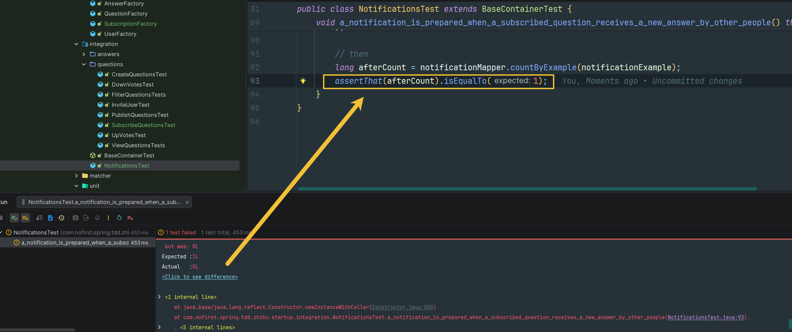

# 关注问题

本节我们来开发问题的「关注」功能：当关注了某一个问题后，如果该问题有新的答案，那么关注者会收到一条通知。

---

## 一、功能说明

### 1.1 关注问题功能

在问答系统中，用户可以关注感兴趣的问题。当关注的问题有新的回答时，关注者会收到通知。

### 1.2 开发目标

| 目标 | 说明 |
|------|------|
| 未登录用户不能关注 | 返回 401 未授权 |
| 登录用户可以关注 | 创建订阅记录 |
| 可以取消关注 | 删除订阅记录 |
| 唯一约束 | 同一用户不能重复关注同一问题 |

---

## 二、创建订阅表

### 2.1 建表语句

我们将关注的数据存储在 `subscription` 表中，我们先来建表：

*src/main/resources/db/migration/V2026030501__create_table_subscription.sql*

```sql
create table subscription
(
    id          int auto_increment comment '主键'
        primary key,
    user_id     int       not null comment '用户编号',
    question_id int       not null comment '问题编号',
    create_time timestamp not null comment '创建时间',
    update_time timestamp not null comment '更新时间',
    constraint unq_user_question
        unique (user_id, question_id)
) comment '问题订阅表';
```

### 2.2 字段说明

| 字段 | 类型 | 说明 |
|------|------|------|
| `id` | int | 主键，自增 |
| `user_id` | int | 用户编号 |
| `question_id` | int | 问题编号 |
| `create_time` | timestamp | 创建时间 |
| `update_time` | timestamp | 更新时间 |

### 2.3 唯一约束

```sql
constraint unq_user_question
    unique (user_id, question_id)
```

唯一约束确保：**同一用户不能重复关注同一问题**。

### 2.4 运行迁移

接下来运行 Maven 的 `flyway` 插件的 `flyway:migrate` 命令生成表：

```bash
mvn flyway:migrate
```

修改 `generatorConfig.xml` 的配置，改为生成 `subscription` 表，运行 `Generator#main()` 方法生成对应的数据库映射文件。

---

## 三、创建测试

### 3.1 新建测试文件

然后我们新建测试：

*src/test/java/com/nofirst/spring/tdd/zhihu/startup/integration/questions/SubscribeQuestionsTest.java*

```java
@TestInstance(TestInstance.Lifecycle.PER_CLASS)
public class SubscribeQuestionsTest extends BaseContainerTest {

    private MockMvc mockMvc;

    @Autowired
    private WebApplicationContext context;

    @Autowired
    private SubscriptionMapper subscriptionMapper;

    @Autowired
    private QuestionMapper questionMapper;


    @BeforeAll
    public void setupMockMvc() {
        mockMvc = MockMvcBuilders
                .webAppContextSetup(context)
                .apply(springSecurity())
                .build();
    }

    @BeforeEach
    public void setupTestData() {
        SubscriptionExample example = new SubscriptionExample();
        // 空条件，匹配所有数据，等价于 delete * from question
        example.createCriteria();
        subscriptionMapper.deleteByExample(example);
    }


    @Test
    void guests_may_not_subscribe_to_or_unsubscribe_from_questions() throws Exception {
        this.mockMvc.perform(post("/questions/subscriptions"))
                .andDo(print())
                .andExpect(status().is(401));

        this.mockMvc.perform(delete("/questions/subscriptions"))
                .andDo(print())
                .andExpect(status().is(401));
    }
}
```

### 3.2 测试说明

| 测试 | 说明 |
|------|------|
| `guests_may_not_subscribe_to_or_unsubscribe_from_questions` | 测试未登录用户不能关注或取消关注 |

### 3.3 运行测试

运行测试，测试会直接通过。

---

## 四、关注问题

### 4.1 添加测试用例

接下来添加测试：

```java
@Test
@WithUserDetails(value = "John", userDetailsServiceBeanName = "customUserDetailsService")
void a_user_can_subscribe_to_questions() throws Exception {
    // given
    Question question = QuestionFactory.createPublishedQuestion();
    questionMapper.insert(question);

    SubscriptionExample example = new SubscriptionExample();
    SubscriptionExample.Criteria criteria = example.createCriteria();
    criteria.andUserIdEqualTo(2);
    criteria.andQuestionIdEqualTo(question.getId());
    long beforeCount = subscriptionMapper.countByExample(example);
    assertThat(beforeCount).isEqualTo(0);
    // when
    this.mockMvc.perform(post("/questions/{questionId}/subscriptions", question.getId()))
            .andDo(print())
            .andExpect(status().isOk())
            .andExpect(jsonPath("$.code").value(ResultCode.SUCCESS.getCode()));

    // then
    long afterCount = subscriptionMapper.countByExample(example);
    assertThat(afterCount).isEqualTo(1);
}
```

### 4.2 测试说明

| 步骤 | 说明 |
|------|------|
| `given` | 创建问题，验证订阅记录为 0 |
| `when` | 发送 POST 请求关注问题 |
| `then` | 验证订阅记录增加到 1 |

### 4.3 运行测试

运行测试：



请求返回了 404，接下来添加逻辑。

---

## 五、实现关注功能

### 5.1 创建 Controller

添加逻辑：

*src/main/java/com/nofirst/spring/tdd/zhihu/startup/controller/SubscribeQuestionController.java*

```java
@RestController
@AllArgsConstructor
public class SubscribeQuestionController {

    private final QuestionSubscribeService questionSubscribeService;

    @PostMapping("/questions/{questionId}/subscriptions")
    public CommonResult<String> store(@PathVariable Integer questionId, @AuthenticationPrincipal AccountUser accountUser) {
        questionSubscribeService.subscribe(questionId, accountUser);
        return CommonResult.success("ok");
    }
}
```

### 5.2 创建 Service 接口

*src/main/java/com/nofirst/spring/tdd/zhihu/startup/service/QuestionSubscribeService.java*

```java
public interface QuestionSubscribeService {

    void subscribe(Integer questionId, AccountUser accountUser);
}
```

### 5.3 实现 Service

*src/main/java/com/nofirst/spring/tdd/zhihu/startup/service/impl/QuestionSubscribeServiceImpl.java*

```java
@Service
@AllArgsConstructor
public class QuestionSubscribeServiceImpl implements QuestionSubscribeService {

    private final SubscriptionMapper subscriptionMapper;

    @Override
    public void subscribe(Integer questionId, AccountUser accountUser) {
        Subscription subscription = new Subscription();
        subscription.setUserId(accountUser.getUserId());
        subscription.setQuestionId(questionId);
        Date now = new Date();
        subscription.setCreateTime(now);
        subscription.setUpdateTime(now);

        subscriptionMapper.insert(subscription);
    }
}
```

### 5.4 运行测试

再次运行测试，测试通过！

---

## 六、取消关注

### 6.1 添加测试用例

类似地，我们来添加取消订阅的功能测试：

```java
@Test
@WithUserDetails(value = "John", userDetailsServiceBeanName = "customUserDetailsService")
void a_user_can_unsubscribe_from_questions() throws Exception {
    // given
    Question question = QuestionFactory.createPublishedQuestion();
    questionMapper.insert(question);

    // when
    // 下面的逻辑在上一个测试中已经验证过了
    this.mockMvc.perform(post("/questions/{questionId}/subscriptions", question.getId()));
    this.mockMvc.perform(delete("/questions/{questionId}/subscriptions", question.getId()))
            .andDo(print())
            .andExpect(status().isOk())
            .andExpect(jsonPath("$.code").value(ResultCode.SUCCESS.getCode()));

    // then
    SubscriptionExample example = new SubscriptionExample();
    SubscriptionExample.Criteria criteria = example.createCriteria();
    criteria.andIdEqualTo(2);
    criteria.andQuestionIdEqualTo(question.getId());
    long count = subscriptionMapper.countByExample(example);
    assertThat(count).isEqualTo(0);
}
```

### 6.2 运行测试

运行测试：

请求返回了 404，因为对应的路由还不存在。

---

## 七、实现取消关注

### 7.1 添加 DELETE 接口

接下来添加逻辑：

*src/main/java/com/nofirst/spring/tdd/zhihu/startup/controller/SubscribeQuestionController.java*

```java
@DeleteMapping("/questions/{questionId}/subscriptions")
public CommonResult<String> destroy(@PathVariable Integer questionId, @AuthenticationPrincipal AccountUser accountUser) {
    questionSubscribeService.unsubscribe(questionId, accountUser);
    return CommonResult.success("ok");
}
```

### 7.2 添加 unsubscribe 方法

*src/main/java/com/nofirst/spring/tdd/zhihu/startup/service/QuestionSubscribeService.java*

```java
public interface QuestionSubscribeService {

    void subscribe(Integer questionId, AccountUser accountUser);

    void unsubscribe(Integer questionId, AccountUser accountUser);
}
```

### 7.3 实现取消关注逻辑

*src/main/java/com/nofirst/spring/tdd/zhihu/startup/service/impl/QuestionSubscribeServiceImpl.java*

```java
@Override
public void unsubscribe(Integer questionId, AccountUser accountUser) {
    SubscriptionExample example = new SubscriptionExample();
    SubscriptionExample.Criteria criteria = example.createCriteria();
    criteria.andUserIdEqualTo(accountUser.getUserId());
    criteria.andQuestionIdEqualTo(questionId);

    subscriptionMapper.deleteByExample(example);
}
```

### 7.4 运行测试

再次运行测试，测试通过。

---

## 八、提交代码

最后，我们提交下代码：

```bash
$ git add .
$ git commit -m 'subscribe questions'
```

---

## 九、总结

### 9.1 本节学习要点

| 要点 | 说明 |
|------|------|
| 订阅表设计 | 使用唯一约束防止重复订阅 |
| 关注功能 | 创建订阅记录 |
| 取消关注 | 删除订阅记录 |
| 权限控制 | 未登录用户返回 401 |

### 9.2 关注功能接口

| 功能 | 接口 | 说明 |
|------|------|------|
| 关注问题 | `POST /questions/{id}/subscriptions` | 创建订阅记录 |
| 取消关注 | `DELETE /questions/{id}/subscriptions` | 删除订阅记录 |

---

## 十、下一步

关注功能已完成，但通知功能还未实现。请继续阅读：

1. [关注问题（二）](./5.关注问题（二）.md) - 实现通知功能
2. [slug 转换](./6.slug 转换.md) - 实现翻译功能

---

## 附录：subscription 表结构

```
┌─────────────────────────────────────────────────────────┐
│                   subscription 表                        │
├──────────┬──────────┬────────────┬────────────┬─────────┤
│ id       │ user_id  │ question_id│ create_time│ update_ │
├──────────┼──────────┼────────────┼────────────┼─────────┤
│ 1        │ 2        │ 1          │ 2026-...   │ 2026-.. │
│ 2        │ 3        │ 1          │ 2026-...   │ 2026-.. │
│ 3        │ 2        │ 2          │ 2026-...   │ 2026-.. │
└──────────┴──────────┴────────────┴────────────┴─────────┘

唯一约束：(user_id, question_id)
说明：同一用户不能重复关注同一问题
```
