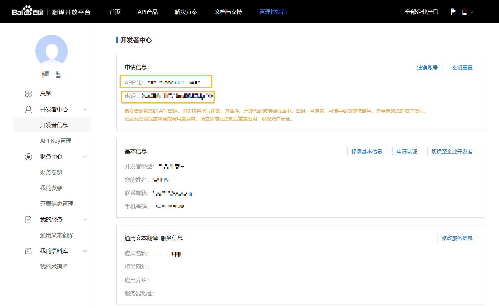
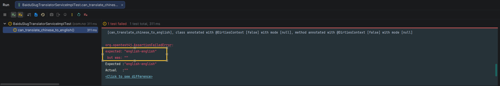
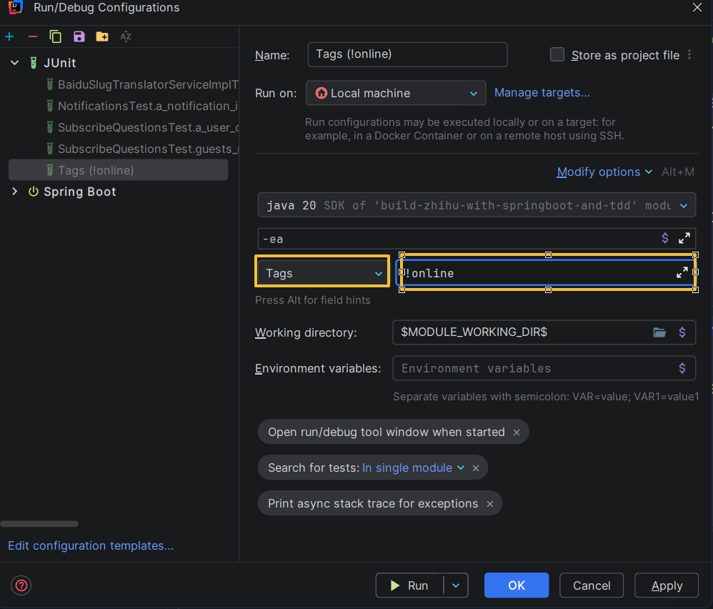
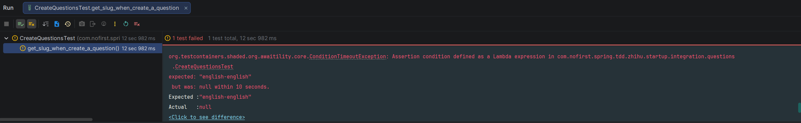
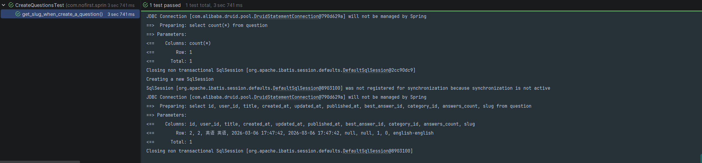

本节我们来开发「slug转换」功能：当用户提交创建问题的表单时，程序将调用 [百度翻译](http://api.fanyi.baidu.com/api/trans/product/apidoc) 接口将话题标题翻译为英文，并储存于字段 `slug` 中。显示详情的时候将 Slug 在 URL 中体现出来，假如问题标题为『Slug 翻译测试』的 URL 是：

```
http://zhihu.test/questions/1
```

加入 Slug 后的链接为：

```
http://zhihu.test/questions/1/slug-translation-test
```

## 新建测试

我们先定义好一个接口：

*src/main/java/com/nofirst/spring/tdd/zhihu/startup/service/TranslatorService.java*

```java
public interface TranslatorService {

    String translate(String text);
}
```

创建一个实现类：

*src/main/java/com/nofirst/spring/tdd/zhihu/startup/service/impl/BaiduTranslatorServiceImpl.java*

```java
package com.nofirst.spring.tdd.zhihu.startup.service.impl;

import com.nofirst.spring.tdd.zhihu.startup.service.TranslatorService;
import lombok.AllArgsConstructor;
import org.springframework.stereotype.Service;

@Service
@AllArgsConstructor
public class BaiduTranslatorServiceImpl implements TranslatorService {

    @Override
    public String translate(String text) {
        return "";
    }
}

```

现在什么逻辑也没有，我们依然是从测试出发。

新建测试：

*src/test/java/com/nofirst/spring/tdd/zhihu/startup/unit/service/BaiduSlugTranslatorServiceImplTest.java*

```java
// 仅加载配置属性，不扫描任何业务Bean
@ExtendWith({SpringExtension.class, MockitoExtension.class})
// 仅初始化配置相关上下文，指定配置类
@ContextConfiguration(
        classes = BaiduTranslatorConfig.class,
        initializers = ConfigDataApplicationContextInitializer.class // 仅加载配置文件
)
// 启用配置属性绑定
@EnableConfigurationProperties
class BaiduSlugTranslatorServiceImplTest {

    @Autowired
    private BaiduTranslatorConfig translatorConfig;

    @Test
    @Tag("online")
    void can_translate_chinese_to_english() {
        // given
        BaiduTranslatorServiceImpl translatorService = new BaiduTranslatorServiceImpl(translatorConfig);
        String text = "英语 英语";
        // when
        String translate = translatorService.translate(text);
        // then
        assertThat(translate).isEqualTo("english-english");
    }
}
```

`BaiduTranslatorConfig`是我们对接百度翻译接口时的配置信息：

*src/main/java/com/nofirst/spring/tdd/zhihu/startup/config/BaiduTranslatorConfig.java*

```java
@Data
@Configuration
@ConfigurationProperties(prefix = "baidu.translate")
public class BaiduTranslatorConfig {

    private String appId;

    private String appKey;
}
```

放置在配置文件中：

*src/main/resources/application.yaml*

```yaml
baidu:
  translate:
    appId: xxxxxxxxxx
    appKey: xxxxxxxxx
```

打开 [百度翻译开放平台](http://api.fanyi.baidu.com/api/trans/product/index)，按照说明进行注册、登录，然后打开[开发者中心](https://fanyi-api.baidu.com/manage/developer)就可以获取到`appId`和`appKey`的信息：



将配置信息注入到Service中：

```java
@Service
@AllArgsConstructor
public class BaiduTranslatorServiceImpl implements TranslatorService {

    private BaiduTranslatorConfig baiduTranslatorConfig;

    @Override
    public String translate(String text) {
        return "";
    }
}
```

接下来运行测试，自然会是失败的：



接下来就按照[**通用文本翻译API-接入文档**](https://fanyi-api.baidu.com/product/113)真正开始对接百度翻译接口：

*src/main/java/com/nofirst/spring/tdd/zhihu/startup/service/impl/BaiduTranslatorServiceImpl.java*

```java
@Service
@AllArgsConstructor
public class BaiduTranslatorServiceImpl implements TranslatorService {

    private static final String TRANS_API_HOST = "https://api.fanyi.baidu.com/api/trans/vip/translate";

    private BaiduTranslatorConfig baiduTranslatorConfig;

    @Override
    public String translate(String text) {
        String transResult = getTransResult(text, "auto", "en");
        Map<String, Object> resultMap = null;
        try {
            ObjectMapper objectMapper = new ObjectMapper();

            resultMap = objectMapper.readValue(transResult, Map.class);
        } catch (JsonProcessingException e) {
            throw new RuntimeException(e);
        }
        List<Map<String, String>> transResultList = (List<Map<String, String>>) resultMap.get("trans_result");

        if (!CollectionUtils.isEmpty(transResultList)) {
            String dst = transResultList.get(0).get("dst");
            if (dst != null) {
                return dst.toLowerCase().replace(" ", "-");
            }
        }

        return "";
    }

    public String getTransResult(String query, String from, String to) {
        Map<String, String> params = this.buildParams(query, from, to);
        return HttpGet.get(TRANS_API_HOST, params);
    }

    private Map<String, String> buildParams(String query, String from, String to) {
        Map<String, String> params = new HashMap<>(8);
        params.put("q", query);
        params.put("from", from);
        params.put("to", to);
        String appId = this.baiduTranslatorConfig.getAppId();
        String appKey = this.baiduTranslatorConfig.getAppKey();
        params.put("appid", appId);
        String salt = String.valueOf(System.currentTimeMillis());
        params.put("salt", salt);
        String src = appId + query + salt + appKey;
        params.put("sign", MD5.md5(src));
        return params;
    }
}
```

以下类是百度翻译提供的Demo中的：

*src/main/java/com/nofirst/spring/tdd/zhihu/startup/util/MD5.java*

```java
package com.nofirst.spring.tdd.zhihu.startup.util;

import java.io.File;
import java.io.FileInputStream;
import java.io.FileNotFoundException;
import java.io.IOException;
import java.io.InputStream;
import java.io.UnsupportedEncodingException;
import java.security.MessageDigest;
import java.security.NoSuchAlgorithmException;

/**
 * MD5编码相关的类
 *
 * @author wangjingtao
 *
 */
public class MD5 {
    // 首先初始化一个字符数组，用来存放每个16进制字符
    private static final char[] hexDigits = {'0', '1', '2', '3', '4', '5', '6', '7', '8', '9', 'a', 'b', 'c', 'd',
            'e', 'f'};

    /**
     * 获得一个字符串的MD5值
     *
     * @param input 输入的字符串
     * @return 输入字符串的MD5值
     *
     */
    public static String md5(String input) {
        if (input == null)
            return null;

        try {
            try {

                // 拿到一个MD5转换器（如果想要SHA1参数换成”SHA1”）
                MessageDigest messageDigest = MessageDigest.getInstance("MD5");
                // 输入的字符串转换成字节数组
                byte[] inputByteArray = input.getBytes("utf-8");
                // inputByteArray是输入字符串转换得到的字节数组
                messageDigest.update(inputByteArray);
                // 转换并返回结果，也是字节数组，包含16个元素
                byte[] resultByteArray = messageDigest.digest();
                // 字符数组转换成字符串返回
                return byteArrayToHex(resultByteArray);
            } catch (UnsupportedEncodingException e) {
                return null;
            }
        } catch (NoSuchAlgorithmException e) {
            return null;
        }
    }

    /**
     * 获取文件的MD5值
     *
     * @param file
     * @return
     */
    public static String md5(File file) {
        try {
            if (!file.isFile()) {
                System.err.println("文件" + file.getAbsolutePath() + "不存在或者不是文件");
                return null;
            }

            FileInputStream in = new FileInputStream(file);

            String result = md5(in);

            in.close();

            return result;

        } catch (FileNotFoundException e) {
            e.printStackTrace();
        } catch (IOException e) {
            e.printStackTrace();
        }

        return null;
    }

    public static String md5(InputStream in) {

        try {
            MessageDigest messagedigest = MessageDigest.getInstance("MD5");

            byte[] buffer = new byte[1024];
            int read = 0;
            while ((read = in.read(buffer)) != -1) {
                messagedigest.update(buffer, 0, read);
            }

            in.close();

            String result = byteArrayToHex(messagedigest.digest());

            return result;
        } catch (NoSuchAlgorithmException e) {
            e.printStackTrace();
        } catch (FileNotFoundException e) {
            e.printStackTrace();
        } catch (IOException e) {
            e.printStackTrace();
        }

        return null;
    }

    private static String byteArrayToHex(byte[] byteArray) {
        // new一个字符数组，这个就是用来组成结果字符串的（解释一下：一个byte是八位二进制，也就是2位十六进制字符（2的8次方等于16的2次方））
        char[] resultCharArray = new char[byteArray.length * 2];
        // 遍历字节数组，通过位运算（位运算效率高），转换成字符放到字符数组中去
        int index = 0;
        for (byte b : byteArray) {
            resultCharArray[index++] = hexDigits[b >>> 4 & 0xf];
            resultCharArray[index++] = hexDigits[b & 0xf];
        }

        // 字符数组组合成字符串返回
        return new String(resultCharArray);

    }

}

```

*src/main/java/com/nofirst/spring/tdd/zhihu/startup/util/HttpGet.java*

```java
package com.nofirst.spring.tdd.zhihu.startup.util;

import javax.net.ssl.HttpsURLConnection;
import javax.net.ssl.SSLContext;
import javax.net.ssl.TrustManager;
import javax.net.ssl.X509TrustManager;
import java.io.BufferedReader;
import java.io.Closeable;
import java.io.IOException;
import java.io.InputStream;
import java.io.InputStreamReader;
import java.io.UnsupportedEncodingException;
import java.net.HttpURLConnection;
import java.net.MalformedURLException;
import java.net.URL;
import java.net.URLEncoder;
import java.security.KeyManagementException;
import java.security.NoSuchAlgorithmException;
import java.security.cert.CertificateException;
import java.security.cert.X509Certificate;
import java.util.Map;

public class HttpGet {
    protected static final int SOCKET_TIMEOUT = 10000; // 10S
    protected static final String GET = "GET";

    public static String get(String host, Map<String, String> params) {
        try {
            // 设置SSLContext
            SSLContext sslcontext = SSLContext.getInstance("TLS");
            sslcontext.init(null, new TrustManager[]{myX509TrustManager}, null);

            String sendUrl = getUrlWithQueryString(host, params);

            // System.out.println("URL:" + sendUrl);

            URL uri = new URL(sendUrl); // 创建URL对象
            HttpURLConnection conn = (HttpURLConnection) uri.openConnection();
            if (conn instanceof HttpsURLConnection) {
                ((HttpsURLConnection) conn).setSSLSocketFactory(sslcontext.getSocketFactory());
            }

            conn.setConnectTimeout(SOCKET_TIMEOUT); // 设置相应超时
            conn.setRequestMethod(GET);
            int statusCode = conn.getResponseCode();
            if (statusCode != HttpURLConnection.HTTP_OK) {
                System.out.println("Http错误码：" + statusCode);
            }

            // 读取服务器的数据
            InputStream is = conn.getInputStream();
            BufferedReader br = new BufferedReader(new InputStreamReader(is));
            StringBuilder builder = new StringBuilder();
            String line = null;
            while ((line = br.readLine()) != null) {
                builder.append(line);
            }

            String text = builder.toString();

            close(br); // 关闭数据流
            close(is); // 关闭数据流
            conn.disconnect(); // 断开连接

            return text;
        } catch (MalformedURLException e) {
            e.printStackTrace();
        } catch (IOException e) {
            e.printStackTrace();
        } catch (KeyManagementException e) {
            e.printStackTrace();
        } catch (NoSuchAlgorithmException e) {
            e.printStackTrace();
        }

        return null;
    }

    public static String getUrlWithQueryString(String url, Map<String, String> params) {
        if (params == null) {
            return url;
        }

        StringBuilder builder = new StringBuilder(url);
        if (url.contains("?")) {
            builder.append("&");
        } else {
            builder.append("?");
        }

        int i = 0;
        for (String key : params.keySet()) {
            String value = params.get(key);
            if (value == null) { // 过滤空的key
                continue;
            }

            if (i != 0) {
                builder.append('&');
            }

            builder.append(key);
            builder.append('=');
            builder.append(encode(value));

            i++;
        }

        return builder.toString();
    }

    protected static void close(Closeable closeable) {
        if (closeable != null) {
            try {
                closeable.close();
            } catch (IOException e) {
                e.printStackTrace();
            }
        }
    }

    /**
     * 对输入的字符串进行URL编码, 即转换为%20这种形式
     *
     * @param input 原文
     * @return URL编码. 如果编码失败, 则返回原文
     */
    public static String encode(String input) {
        if (input == null) {
            return "";
        }

        try {
            return URLEncoder.encode(input, "utf-8");
        } catch (UnsupportedEncodingException e) {
            e.printStackTrace();
        }

        return input;
    }

    private static TrustManager myX509TrustManager = new X509TrustManager() {

        @Override
        public X509Certificate[] getAcceptedIssuers() {
            return null;
        }

        @Override
        public void checkServerTrusted(X509Certificate[] chain, String authType) throws CertificateException {
        }

        @Override
        public void checkClientTrusted(X509Certificate[] chain, String authType) throws CertificateException {
        }
    };

}


```

重新运行测试，测试通过了！但是我们发现，单个测试就耗费了大约 2s 的时间！我们并不需要在开发的时候都测试这个 Http 测试。

我们在新建测试的时候，给该测试用例打了一个tag：

```java
@Tag("online")
```

这是为了在运行测试的时候，可以排除掉类似这种需要网络请求的测试用例。在IDEA中，你可以按照下图的方式进行排除：




接下来我们就可以真正开发功能了，首先我们新建功能测试：

*src/test/java/com/nofirst/spring/tdd/zhihu/startup/integration/questions/CreateQuestionsTest.java*

```java
    .
    .
    .
    @Test
    @Tag("online")
    @WithUserDetails(value = "John", userDetailsServiceBeanName = "customUserDetailsService")
    void get_slug_when_create_a_question() throws Exception {
        // given
        QuestionDto questionDto = QuestionFactory.createQuestionDto();
        questionDto.setTitle("英语 英语");
        QuestionExample questionExample = new QuestionExample();
        questionExample.createCriteria();
        long beforeCount = questionMapper.countByExample(questionExample);
        
        // 百度翻译的接口有频率限制，在an_authenticated_user_can_create_new_questions用例中也会调用翻译接口
        // 所以可以给an_authenticated_user_can_create_new_questions用例打上@Tag("online")标签，测试全部用例时排除掉
        TimeUnit.SECONDS.sleep(3);

        // when
        this.mockMvc.perform(post("/questions")
                        .contentType(MediaType.APPLICATION_JSON)
                        .content(objectMapper.writeValueAsString(questionDto)))
                .andDo(print())
                .andExpect(status().isOk())
                .andExpect(jsonPath("$.code").value(ResultCode.SUCCESS.getCode()));

        await()
                .pollInterval(Duration.ofSeconds(3))
                // 依赖于实际的时间，时间设大一点是为了让kafka消费到消息
                .atMost(10, SECONDS)
                .untilAsserted(() -> {
                    // then
                    long afterCount = questionMapper.countByExample(questionExample);
                    // 调用之后 question 增加了 1 条
                    assertThat(afterCount - beforeCount).isEqualTo(1);
                    List<Question> questions = questionMapper.selectByExample(questionExample);
                    Question result = questions.get(0);
                    assertThat(result.getSlug()).isEqualTo("english-english");
                });
    }
}
```

通过测试用例可以看到，我们给`question`增加了一个新的属性：`slug`。下面通过sql文件创建字段：

*src/main/resources/db/migration/V2026030601__alter_table_question.sql*

```sql
alter table question
    add `slug`        varchar(100)     NULL;
```

接下来运行Maven的`flyway`插件的`flyway:migrate`命令生成表，并修改`generatorConfig.xml`的配置，改为生成`question`表，运行`Generator#main()`方法生成对应的数据库映射文件。

运行测试，自然会失败：



我们知道，创建问题是一个很高频的动作，而调用百度翻译的接口需要发送网络请求，是一个耗时的过程，所以我们引入 Kafka 的队列，将这个耗时的过程变成异步的行为，避免阻塞创建问题。

首先我们引入Kafka相关的依赖：

*pom.xml*

```xml
		<dependency>
            <groupId>org.flywaydb</groupId>
            <artifactId>flyway-mysql</artifactId>
        </dependency>
		<!--   以下为新增依赖 -->
        <dependency>
            <groupId>org.springframework.kafka</groupId>
            <artifactId>spring-kafka</artifactId>
        </dependency>
		.
		.
		.
		<dependency>
            <groupId>org.testcontainers</groupId>
            <artifactId>mysql</artifactId>
            <version>1.20.0</version>
            <scope>test</scope>
        </dependency>
        
        <!--   以下为新增依赖 -->
        <dependency>
            <groupId>org.testcontainers</groupId>
            <artifactId>kafka</artifactId>
            <version>1.19.3</version>
            <scope>test</scope>
        </dependency>
        <dependency>
            <groupId>org.springframework.kafka</groupId>
            <artifactId>spring-kafka-test</artifactId>
            <scope>test</scope>
        </dependency>
```

接下来在测试中引入 Kafka 的 Container：

*src/test/java/com/nofirst/spring/tdd/zhihu/startup/integration/BaseContainerTest.java*

```java
@SpringBootTest(classes = SpringTddZhihuStartupApplication.class)
public abstract class BaseContainerTest {

    public static final MySQLContainer<?> mysqlContainer = new MySQLContainer<>("mysql:8.0")
            .withDatabaseName("zhihu")
            .withUsername("root")
            .withPassword("root")
            .withReuse(true);

    public static final KafkaContainer kafkaContainer = new KafkaContainer(
            DockerImageName.parse("confluentinc/cp-kafka:7.6.1")
    ).withReuse(true);

    static {
        // 复用配置
        TestcontainersConfiguration.getInstance().updateUserConfig("testcontainers.reuse.enable", "true");
        // 启动容器，确保端口提前分配
        mysqlContainer.start();
        kafkaContainer.start();
    }

    @DynamicPropertySource
    static void properties(DynamicPropertyRegistry registry) {
        registry.add("spring.datasource.url", mysqlContainer::getJdbcUrl);
        registry.add("spring.datasource.password", mysqlContainer::getPassword);
        registry.add("spring.datasource.username", mysqlContainer::getUsername);
        // 将 Testcontainers 启动的 Kafka 容器的实际连接地址，动态覆盖到 Spring 上下文的 spring.kafka.bootstrap-servers 配置项中
        registry.add("spring.kafka.bootstrap-servers", kafkaContainer::getBootstrapServers);
    }
}
```

接着我们添加 Kafka 的配置：

*src/main/resources/application.yaml*

```xml
spring:
  kafka:
    bootstrap-servers: localhost:9092
    consumer:
      auto-offset-reset: latest
      group-id: ${translate.group}
      key-deserializer: org.springframework.kafka.support.serializer.JsonDeserializer
      value-deserializer: org.springframework.kafka.support.serializer.JsonDeserializer
      properties:
        spring:
          json:
            trusted:
              packages: "*"
    producer:
      key-serializer: org.springframework.kafka.support.serializer.JsonSerializer
      value-serializer: org.springframework.kafka.support.serializer.JsonSerializer
      properties:
        spring:
          json:
            trusted:
              packages: "*"
translate:
  kafka:
    group: translate
    topic: translate-slug
```

*src/main/java/com/nofirst/spring/tdd/zhihu/startup/config/TranslatorConfig.java*

```java
package com.nofirst.spring.tdd.zhihu.startup.config;

import lombok.Data;
import org.springframework.boot.context.properties.ConfigurationProperties;
import org.springframework.context.annotation.Configuration;

@Data
@Configuration
@ConfigurationProperties(prefix = "translate.kafka")
public class TranslatorConfig {

    private String topic;

    private String group;
}
```


添加生产者和消费者：

*src/main/java/com/nofirst/spring/tdd/zhihu/startup/queue/producer/CustomKafkaProducer.java*

```java
@Component
@Slf4j
@AllArgsConstructor
public class CustomKafkaProducer {

    private KafkaTemplate<String, Object> kafkaTemplate;
    private TranslatorConfig translatorConfig;

    public void sendTranslateEvent(Question question) {
        TranslateSlugEvent translateSlugEvent = new TranslateSlugEvent(question, new Date());
        kafkaTemplate.send(translatorConfig.getTopic(), translateSlugEvent);
        log.info("Sent message: {}", translateSlugEvent);
    }
}
```

*src/main/java/com/nofirst/spring/tdd/zhihu/startup/queue/consumer/TranslateSlugEventConsumer.java*

```java
@Component
@AllArgsConstructor
@Slf4j
public class TranslateSlugEventConsumer {

    private TranslatorService translatorService;
    private QuestionMapper questionMapper;

    @KafkaListener(topics = "${translate.kafka.topic}", groupId = "${translate.kafka.group}")
    public void listen(TranslateSlugEvent translateSlugEvent) {
        log.info("Received: {}", translateSlugEvent);
        Question question = translateSlugEvent.getQuestion();
        String translatedSlug = translatorService.translate(question.getTitle());

        Question updateQuestion = new Question();
        updateQuestion.setId(question.getId());
        updateQuestion.setSlug(translatedSlug);
        updateQuestion.setUpdatedAt(new Date());

        questionMapper.updateByPrimaryKeySelective(updateQuestion);
    }
}
```

*src/main/java/com/nofirst/spring/tdd/zhihu/startup/event/TranslateSlugEvent.java*

```java
package com.nofirst.spring.tdd.zhihu.startup.event;

import com.nofirst.spring.tdd.zhihu.startup.mbg.model.Question;
import lombok.AllArgsConstructor;
import lombok.Data;
import lombok.NoArgsConstructor;

import java.util.Date;

@Data
@NoArgsConstructor
@AllArgsConstructor
public class TranslateSlugEvent {

    private Question question;
    private Date eventTime;
}

```

创建问题的时候调用生产者：

*src/main/java/com/nofirst/spring/tdd/zhihu/startup/service/impl/QuestionServiceImpl.java*

```java
public class QuestionServiceImpl implements QuestionService {

    private final CustomKafkaProducer customKafkaProducer;
    .
    .
    .
    @Override
    public void store(QuestionDto dto, AccountUser accountUser) {
        Date now = new Date();
        Question question = new Question();
        question.setUserId(accountUser.getUserId());
        question.setTitle(dto.getTitle());
        question.setContent(dto.getContent());
        question.setCategoryId(dto.getCategoryId());
        question.setCreatedAt(now);
        question.setUpdatedAt(now);
        question.setAnswersCount(0);

        questionMapper.insert(question);

        customKafkaProducer.sendTranslateEvent(question); // 此处
    }
}
```

再次运行测试`get_slug_when_create_a_question`，测试通过：



现在我们预期访问问题详情页面时，同时支持：

```
http://zhihu.test/questions/1
```

和

```
http://zhihu.test/questions/1/slug-translation-test
```

所以我们在测试用例`user_can_view_a_published_question`后面增加一个测试用例：

*src/test/java/com/nofirst/spring/tdd/zhihu/startup/integration/questions/ViewQuestionsTest.java*

```java
	.
    .
    .
	@Test
    @WithUserDetails(value = "John", userDetailsServiceBeanName = "customUserDetailsService")
    void user_can_view_a_published_question_with_slug() throws Exception {
        // given：准备测试数据
        Question question = QuestionFactory.createPublishedQuestion();
        question.setSlug("english-english");
        questionMapper.insert(question);

        // when：调用接口并获取返回结果
        String jsonResponse = this.mockMvc.perform(
                        get("/questions/{id}/english-english", question.getId())
                                .accept(MediaType.APPLICATION_JSON)
                )
                .andDo(print())
                .andExpect(status().isOk())
                .andReturn()
                .getResponse()
                .getContentAsString(StandardCharsets.UTF_8);

        // then：1. 解析JSON为QuestionVo，用TypeReference解决泛型擦除问题，确保data字段解析为QuestionVo
        TypeReference<CommonResult<QuestionVo>> typeRef = new TypeReference<>() {
        };
        CommonResult<QuestionVo> commonResult = objectMapper.readValue(jsonResponse, typeRef);

        // then：2. 断言QuestionVo的核心字段（覆盖所有关键字段）
        assertThat(commonResult.getCode()).isEqualTo(ResultCode.SUCCESS.getCode());

        QuestionVo questionVo = commonResult.getData();
        assertThat(questionVo.getId()).isEqualTo(question.getId());
        assertThat(questionVo.getUserId()).isEqualTo(question.getUserId());
        assertThat(questionVo.getTitle()).isEqualTo(question.getTitle());
        assertThat(questionVo.getContent()).isEqualTo(question.getContent());
    }
}
```

运行测试，会返回 404 路由不存在。所以我们修改路由定义：

*src/main/java/com/nofirst/spring/tdd/zhihu/startup/controller/QuestionController.java*

```java
	@GetMapping(value = {
            "/questions/{id}",
            "/questions/{id}/{slug:.*}"
    })
    public CommonResult<QuestionVo> show(@PathVariable Integer id,
                                         @PathVariable(required = false) String slug,
                                         @AuthenticationPrincipal AccountUser accountUser) {
        return CommonResult.success(questionService.show(id, accountUser));
    }
}
```

再次运行测试，测试通过。
