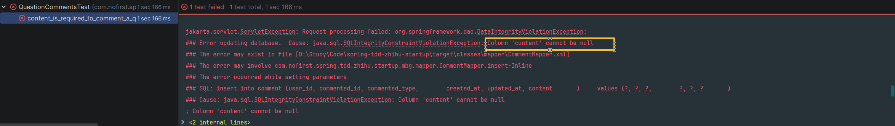

# 评论某个问题

本节我们来开始开发「评论」功能。

---

## 一、功能说明

### 1.1 评论功能

「评论」功能是一个常见的功能，在我们的项目中，评论的对象可以是某个问题或者某个回答。

### 1.2 开发目标

| 目标 | 说明 |
|------|------|
| 未登录用户不能评论 | 返回 401 未授权 |
| 只能评论已发布问题 | 未发布问题不能评论 |
| 登录用户可评论 | 创建评论记录 |
| 评论内容必填 | 使用表单验证 |

### 1.3 数据表设计

评论相关的数据我们存储在 `comment` 表中。

---

## 二、创建评论表

### 2.1 建表语句

我们先准备建表语句：

*src/main/resources/db/migration/V2026030701__create_table_comment.sql*

```sql
CREATE TABLE `comment` (
    `id` int unsigned NOT NULL AUTO_INCREMENT,
    `user_id` int NOT NULL,
    `content` text  NOT NULL,
    `commented_id` int NOT NULL,
    `commented_type` VARCHAR(10) NOT NULL,
    `created_at` timestamp NULL DEFAULT NULL,
    `updated_at` timestamp NULL DEFAULT NULL,
    PRIMARY KEY (`id`)
) ENGINE=InnoDB AUTO_INCREMENT=1;
```

### 2.2 字段说明

| 字段 | 类型 | 说明 |
|------|------|------|
| `id` | int unsigned | 主键，自增 |
| `user_id` | int | 评论者 ID |
| `content` | text | 评论内容 |
| `commented_id` | int | 被评论对象 ID（问题或回答） |
| `commented_type` | VARCHAR(10) | 被评论对象类型（Question/Answer） |
| `created_at` | timestamp | 创建时间 |
| `updated_at` | timestamp | 更新时间 |

### 2.3 多态关联

| 字段 | 说明 | 示例 |
|------|------|------|
| `commented_id` | 被评论对象 ID | 问题 ID 或回答 ID |
| `commented_type` | 被评论对象类型 | `Question` 或 `Answer` |

这种设计允许评论关联到不同类型的对象。

### 2.4 运行迁移

接下来运行 Maven 的 `flyway` 插件的 `flyway:migrate` 命令生成表：

```bash
mvn flyway:migrate
```

修改 `generatorConfig.xml` 的配置，改为生成 `comment` 表，运行 `Generator#main()` 方法生成对应的数据库映射文件。

---

## 三、创建测试

### 3.1 新建测试文件

我们依然是从测试开始：

*src/test/java/com/nofirst/spring/tdd/zhihu/startup/integration/comments/QuestionCommentsTest.java*

```java
@TestInstance(TestInstance.Lifecycle.PER_CLASS)
public class QuestionCommentsTest extends BaseContainerTest {

    private MockMvc mockMvc;

    @Autowired
    private WebApplicationContext context;

    @Autowired
    private QuestionMapper questionMapper;

    @Autowired
    private CommentMapper commentMapper;

    @Autowired
    private ObjectMapper objectMapper;


    @BeforeAll
    public void setupMockMvc() {
        mockMvc = MockMvcBuilders
                .webAppContextSetup(context)
                .apply(springSecurity())
                .build();
    }

    @BeforeEach
    public void setupTestData() {
        QuestionExample questionExample = new QuestionExample();
        // 空条件，匹配所有数据，等价于 delete * from question
        questionExample.createCriteria();
        questionMapper.deleteByExample(questionExample);
        CommentExample commentExample = new CommentExample();
        // 空条件，匹配所有数据，等价于 delete * from comment
        commentExample.createCriteria();
        commentMapper.deleteByExample(commentExample);
    }


    @Test
    void guests_may_not_comment_a_question() throws Exception {
        this.mockMvc.perform(post("/comments/questions/1"))
                .andDo(print())
                .andExpect(status().is(401));
    }
}
```

### 3.2 测试说明

| 步骤 | 说明 |
|------|------|
| `@BeforeAll` | 初始化 MockMvc，启用 Spring Security |
| `@BeforeEach` | 清理 question 和 comment 表数据 |
| `guests_may_not_comment_a_question` | 测试未登录用户不能评论 |

### 3.3 运行测试

运行测试，测试通过。

---

## 四、不可评论未发布的问题

### 4.1 添加测试用例

接下来添加测试：

```java
@Test
@WithUserDetails(value = "John", userDetailsServiceBeanName = "customUserDetailsService")
void can_not_comment_an_unpublished_question() throws Exception {
    // given
    Question question = QuestionFactory.createUnpublishedQuestion();
    questionMapper.insert(question);

    // when
    CommentDto commentDto = new CommentDto();
    commentDto.setContent("this is a comment");
    this.mockMvc.perform(post("/comments/questions/{questionId}", question.getId())
                    .contentType(MediaType.APPLICATION_JSON)
                    .content(objectMapper.writeValueAsString(commentDto))
            ).andDo(print())
            .andExpect(status().isOk())
            .andExpect(jsonPath("$.code").value(ResultCode.FAILED.getCode()))
            .andExpect(jsonPath("$.message").value("question not publish"));
}
```

### 4.2 测试说明

| 步骤 | 说明 |
|------|------|
| `given` | 创建未发布问题 |
| `when` | 尝试评论该问题 |
| `then` | 验证返回失败，提示"question not publish" |

### 4.3 运行测试

运行测试，显示 404 路由不存在。

---

## 五、创建 Controller

### 5.1 添加路由

接下来我们添加 Controller：

*src/main/java/com/nofirst/spring/tdd/zhihu/startup/controller/QuestionCommentsController.java*

```java
@RestController
@Validated
@AllArgsConstructor
public class QuestionCommentsController {

    @PostMapping("/comments/questions/{questionId}")
    public CommonResult<String> store(@PathVariable Integer questionId,
                                      @RequestBody CommentDto commentDto,
                                      @AuthenticationPrincipal AccountUser accountUser) {
        return CommonResult.success("ok");
    }
}
```

### 5.2 创建 CommentDto

*src/main/java/com/nofirst/spring/tdd/zhihu/startup/model/dto/CommentDto.java*

```java
@Data
public class CommentDto {

    private String content;
}
```

### 5.3 运行测试

再次运行测试，返回了 200，测试仍旧未通过。

---

## 六、添加权限策略

### 6.1 添加 canComment 方法

我们在 `QuestionPolicy` 里面添加一个新的方法：

*src/main/java/com/nofirst/spring/tdd/zhihu/startup/policy/QuestionPolicy.java*

```java
public boolean canComment(Integer questionId) {
    Question question = questionMapper.selectByPrimaryKey(questionId);
    if (Objects.isNull(question)) {
        throw new QuestionNotExistedException();
    }
    if (Objects.isNull(question.getPublishedAt())) {
        throw new QuestionNotPublishedException();
    }
    return true;
}
```

### 6.2 方法说明

| 验证 | 说明 |
|------|------|
| 问题存在 | 不存在则抛出 `QuestionNotExistedException` |
| 问题已发布 | 未发布则抛出 `QuestionNotPublishedException` |

### 6.3 应用权限策略

在 Controller 上应用：

```java
public class QuestionCommentsController {

    @PostMapping("/comments/questions/{questionId}")
    @PreAuthorize("@questionPolicy.canComment(#questionId)")
    public CommonResult<String> store(@PathVariable Integer questionId,
                                      @RequestBody CommentDto commentDto,
                                      @AuthenticationPrincipal AccountUser accountUser) {
        return CommonResult.success("ok");
    }
}
```

### 6.4 运行测试

再次运行测试，测试通过。

---

## 七、登录用户可评论

### 7.1 添加测试用例

接下来继续添加测试：

```java
@Test
@WithUserDetails(value = "John", userDetailsServiceBeanName = "customUserDetailsService")
void signed_in_user_can_comment_a_published_question() throws Exception {
    // given
    Question question = QuestionFactory.createPublishedQuestion();
    questionMapper.insert(question);

    long beforeCount = commentMapper.countByExample(null);
    assertThat(beforeCount).isEqualTo(0);

    // when
    CommentDto commentDto = new CommentDto();
    commentDto.setContent("this is a comment");
    this.mockMvc.perform(post("/comments/questions/{questionId}", question.getId())
                    .contentType(MediaType.APPLICATION_JSON)
                    .content(objectMapper.writeValueAsString(commentDto))
            ).andDo(print())
            .andExpect(status().isOk());

    // then
    CommentExample example = new CommentExample();
    CommentExample.Criteria criteria = example.createCriteria();
    criteria.andCommentedIdEqualTo(question.getId());
    criteria.andCommentedTypeEqualTo(Question.class.getSimpleName());
    long afterCount = commentMapper.countByExample(example);
    assertThat(afterCount).isEqualTo(1);
}
```

### 7.2 运行测试

运行测试：


### 7.3 添加 Service

添加逻辑：

*src/main/java/com/nofirst/spring/tdd/zhihu/startup/service/QuestionCommentService.java*

```java
public interface QuestionCommentService {

    void comment(Integer questionId, CommentDto commentDto, AccountUser accountUser);
}
```

*src/main/java/com/nofirst/spring/tdd/zhihu/startup/service/impl/QuestionCommentServiceImpl.java*

```java
@Service
@AllArgsConstructor
public class QuestionCommentServiceImpl implements QuestionCommentService {

    private final QuestionMapper questionMapper;
    private final CommentMapper commentMapper;


    @Override
    public void comment(Integer questionId, CommentDto commentDto, AccountUser accountUser) {
        Comment comment = new Comment();
        comment.setUserId(accountUser.getUserId());
        comment.setContent(commentDto.getContent());
        comment.setCommentedId(questionId);
        comment.setCommentedType(Question.class.getSimpleName());
        Date date = new Date();
        comment.setCreatedAt(date);
        comment.setUpdatedAt(date);
        commentMapper.insert(comment);
    }
}
```

### 7.4 完善 Controller

*src/main/java/com/nofirst/spring/tdd/zhihu/startup/controller/QuestionCommentsController.java*

```java
@RestController
@Validated
@AllArgsConstructor
public class QuestionCommentsController {

    private QuestionCommentService questionCommentService;

    @PostMapping("/comments/questions/{questionId}")
    @PreAuthorize("@questionPolicy.canComment(#questionId)")
    public CommonResult<String> store(@PathVariable Integer questionId,
                                      @RequestBody CommentDto commentDto,
                                      @AuthenticationPrincipal AccountUser accountUser) {
        questionCommentService.comment(questionId, commentDto, accountUser);
        return CommonResult.success("ok");
    }
}
```

### 7.5 运行测试

再次测试，测试通过。

---

## 八、评论内容为必填项

### 8.1 添加测试用例

我们继续添加新的功能测试：

```java
@Test
@WithUserDetails(value = "John", userDetailsServiceBeanName = "customUserDetailsService")
void content_is_required_to_comment_a_question() throws Exception {
    // given
    Question question = QuestionFactory.createPublishedQuestion();
    questionMapper.insert(question);

    // when
    CommentDto commentDto = new CommentDto();
    commentDto.setContent(null);
    this.mockMvc.perform(post("/comments/questions/{questionId}", question.getId())
                    .contentType(MediaType.APPLICATION_JSON)
                    .content(objectMapper.writeValueAsString(commentDto))
            ).andDo(print())
            .andExpect(jsonPath("$.code").value(ResultCode.VALIDATE_FAILED.getCode()))
            .andExpect(jsonPath("$.message").value("评论内容不能为空"));
}
```

### 8.2 运行测试

运行测试：



### 8.3 添加表单验证

添加表单验证：

*src/main/java/com/nofirst/spring/tdd/zhihu/startup/model/dto/CommentDto.java*

```java
@Data
public class CommentDto {

    @NotBlank(message = "评论内容不能为空")
    private String content;
}
```

### 8.4 应用规则

应用规则：

*src/main/java/com/nofirst/spring/tdd/zhihu/startup/controller/QuestionCommentsController.java*

```java
public class QuestionCommentsController {

    private QuestionCommentService questionCommentService;

    @PostMapping("/comments/questions/{questionId}")
    @PreAuthorize("@questionPolicy.canComment(#questionId)")
    public CommonResult<String> store(@PathVariable Integer questionId,
                                      @RequestBody @Validated CommentDto commentDto,
                                      @AuthenticationPrincipal AccountUser accountUser) {
        questionCommentService.comment(questionId, commentDto, accountUser);
        return CommonResult.success("ok");
    }
}
```

### 8.5 运行测试

再次测试，测试通过。

---

## 九、提交代码

最后，我们来提交代码：

```bash
$ git add .
$ git commit -m 'question comment'
```

---

## 十、总结

### 10.1 本节学习要点

| 要点 | 说明 |
|------|------|
| 多态关联 | 使用 `commented_id` + `commented_type` 关联不同对象 |
| 权限控制 | 使用 `@PreAuthorize` 和 Policy 控制评论权限 |
| 表单验证 | 使用 `@Validated` 和 `@NotBlank` 验证必填项 |
| TDD 流程 | 测试 → 实现 → 测试通过 |

### 10.2 评论功能接口

| 功能 | 接口 | 说明 |
|------|------|------|
| 评论问题 | `POST /comments/questions/{id}` | 创建评论记录 |
| 权限验证 | `@questionPolicy.canComment()` | 验证问题已发布 |

---

## 十一、下一步

评论问题功能已完成，请继续阅读：

1. [评论某个回答](./2.评论某个回答.md) - 实现对回答的评论
2. [赞同与反对](./3.赞同与反对.md) - 实现评论投票功能

---

## 附录：comment 表结构

```
┌─────────────────────────────────────────────────────────┐
│                    comment 表                            │
├──────────┬──────────┬────────────┬──────────┬───────────┤
│ id       │ user_id  │ content    │ commented│ commented │
│          │          │            │ _id      │ _type     │
├──────────┼──────────┼────────────┼──────────┼───────────┤
│ 1        │ 2        │ 好问题！   │ 1        │ Question  │
│ 2        │ 3        │ 同意楼上   │ 1        │ Answer    │
│ 3        │ 2        │ 感谢分享   │ 2        │ Answer    │
└──────────┴──────────┴────────────┴──────────┴───────────┘

说明：
- commented_type: Question 或 Answer
- commented_id: 对应的问题 ID 或回答 ID
```
