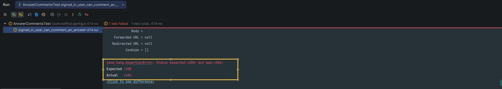

# 评论某个回答

上一节我们完成了问题的「评论」功能，本节我们来完成答案的「评论」功能。

---

## 一、功能说明

### 1.1 评论回答功能

与评论问题类似，用户也可以对回答进行评论。由于我们使用了多态关联设计，评论回答的逻辑与评论问题非常相似。

### 1.2 开发目标

| 目标 | 说明 |
|------|------|
| 未登录用户不能评论 | 返回 401 未授权 |
| 登录用户可评论 | 创建评论记录 |
| 评论内容必填 | 使用表单验证 |

---

## 二、创建测试

### 2.1 新建测试文件

我们从测试开始：

*src/test/java/com/nofirst/spring/tdd/zhihu/startup/integration/comments/AnswerCommentsTest.java*

```java
@TestInstance(TestInstance.Lifecycle.PER_CLASS)
public class AnswerCommentsTest extends BaseContainerTest {

    private MockMvc mockMvc;

    @Autowired
    private WebApplicationContext context;

    @Autowired
    private AnswerMapper answerMapper;

    @Autowired
    private CommentMapper commentMapper;

    @Autowired
    private ObjectMapper objectMapper;


    @BeforeAll
    public void setupMockMvc() {
        mockMvc = MockMvcBuilders
                .webAppContextSetup(context)
                .apply(springSecurity())
                .build();
    }

    @BeforeEach
    public void setupTestData() {
        AnswerExample answerExample = new AnswerExample();
        answerExample.createCriteria();
        answerMapper.deleteByExample(answerExample);
        CommentExample commentExample = new CommentExample();
        commentExample.createCriteria();
        commentMapper.deleteByExample(commentExample);
    }


    @Test
    void guests_may_not_comment_an_answer() throws Exception {
        this.mockMvc.perform(post("/comments/answers/1"))
                .andDo(print())
                .andExpect(status().is(401));
    }
}
```

### 2.2 测试说明

| 步骤 | 说明 |
|------|------|
| `@BeforeAll` | 初始化 MockMvc，启用 Spring Security |
| `@BeforeEach` | 清理 answer 和 comment 表数据 |
| `guests_may_not_comment_an_answer` | 测试未登录用户不能评论回答 |

### 2.3 运行测试

运行测试，测试通过。

---

## 三、登录用户可对答案进行评论

### 3.1 添加测试用例

接下来继续添加测试：

```java
@Test
@WithUserDetails(value = "John", userDetailsServiceBeanName = "customUserDetailsService")
void signed_in_user_can_comment_an_answer() throws Exception {
    // given
    Answer answer = AnswerFactory.createAnswer(1);
    answerMapper.insert(answer);

    CommentExample commentExample = new CommentExample();
    commentExample.createCriteria()
            .andCommentedIdEqualTo(answer.getId())
            .andCommentedTypeEqualTo(Answer.class.getSimpleName());
    long beforeCount = commentMapper.countByExample(commentExample);
    assertThat(beforeCount).isEqualTo(0);

    // when
    CommentDto commentDto = new CommentDto();
    commentDto.setContent("this is a comment");
    this.mockMvc.perform(post("/comments/answers/{answerId}", answer.getId())
                    .contentType(MediaType.APPLICATION_JSON)
                    .content(objectMapper.writeValueAsString(commentDto))
            ).andDo(print())
            .andExpect(status().isOk());


    long afterCount = commentMapper.countByExample(commentExample);
    assertThat(afterCount).isEqualTo(1);
}
```

### 3.2 测试说明

| 步骤 | 说明 |
|------|------|
| `given` | 创建回答，验证评论数为 0 |
| `when` | 发送 POST 请求评论回答 |
| `then` | 验证评论记录增加到 1 |

### 3.3 运行测试

运行测试：



运行测试，显示 404 路由不存在。

---

## 四、创建 Controller

### 4.1 添加路由

接下来我们添加逻辑：

*src/main/java/com/nofirst/spring/tdd/zhihu/startup/controller/AnswerCommentsController.java*

```java
@RestController
@Validated
@AllArgsConstructor
public class AnswerCommentsController {

    private final AnswerCommentService answerCommentService;

    @PostMapping("/comments/answers/{answerId}")
    public CommonResult<String> store(@PathVariable Integer answerId,
                                      @Validated @RequestBody CommentDto commentDto,
                                      @AuthenticationPrincipal AccountUser accountUser) {
        answerCommentService.comment(answerId, commentDto, accountUser);
        return CommonResult.success("ok");
    }
}
```

### 4.2 创建 Service 接口

*src/main/java/com/nofirst/spring/tdd/zhihu/startup/service/AnswerCommentService.java*

```java
public interface AnswerCommentService {

    void comment(Integer answerId, CommentDto commentDto, AccountUser accountUser);
}
```

### 4.3 实现 Service

*src/main/java/com/nofirst/spring/tdd/zhihu/startup/service/impl/AnswerCommentServiceImpl.java*

```java
@Service
@AllArgsConstructor
public class AnswerCommentServiceImpl implements AnswerCommentService {

    private final CommentMapper commentMapper;


    @Override
    public void comment(Integer answerId, CommentDto commentDto, AccountUser accountUser) {
        Comment comment = new Comment();
        comment.setUserId(accountUser.getUserId());
        comment.setContent(commentDto.getContent());
        comment.setCommentedId(answerId);
        comment.setCommentedType(Answer.class.getSimpleName());
        Date date = new Date();
        comment.setCreatedAt(date);
        comment.setUpdatedAt(date);
        commentMapper.insert(comment);
    }
}
```

### 4.4 运行测试

再次测试，测试通过。

---

## 五、评论内容为必填项

### 5.1 添加测试用例

我们继续添加新的功能测试：

```java
@Test
@WithUserDetails(value = "John", userDetailsServiceBeanName = "customUserDetailsService")
void content_is_required_to_comment_an_answer() throws Exception {
    // given
    Answer answer = AnswerFactory.createAnswer(1);
    answerMapper.insert(answer);

    CommentExample commentExample = new CommentExample();
    commentExample.createCriteria();
    long beforeCount = commentMapper.countByExample(commentExample);
    assertThat(beforeCount).isEqualTo(0);

    // when
    CommentDto commentDto = new CommentDto();
    commentDto.setContent(null);
    this.mockMvc.perform(post("/comments/answers/{answerId}", answer.getId())
                    .contentType(MediaType.APPLICATION_JSON)
                    .content(objectMapper.writeValueAsString(commentDto))
            ).andDo(print())
            .andExpect(status().isOk())
            .andExpect(jsonPath("$.code").value(ResultCode.VALIDATE_FAILED.getCode()))
            .andExpect(jsonPath("$.message").value("评论内容不能为空"));
}
```

### 5.2 运行测试

运行测试，测试直接通过了！

因为我们在前面创建 Controller 方法的时候，顺手把 `@Validated` 注解提前打上了，这是个好习惯。

### 5.3 运行全部测试

我们运行一下全部测试，所有测试应该都通过。

---

## 六、提交代码

最后，我们来提交代码：

```bash
$ git add .
$ git commit -m 'answer comment'
```

---

## 七、总结

### 7.1 本节学习要点

| 要点 | 说明 |
|------|------|
| 代码复用 | 与评论问题逻辑相似 |
| 多态关联 | `commented_type` 为 `Answer` |
| 表单验证 | 提前使用 `@Validated` 是好习惯 |

### 7.2 评论功能接口汇总

| 功能 | 问题评论 | 回答评论 |
|------|---------|---------|
| 创建评论 | `POST /comments/questions/{id}` | `POST /comments/answers/{id}` |
| Service | `QuestionCommentService` | `AnswerCommentService` |
| Controller | `QuestionCommentsController` | `AnswerCommentsController` |

---

## 八、下一步

评论回答功能已完成，请继续阅读：

1. [赞同与反对](./3.赞同与反对.md) - 实现评论投票功能
2. [查看评论](./4.查看评论.md) - 实现评论列表功能

---

## 附录：多态关联设计

```
┌─────────────────────────────────────────────────────────┐
│                  评论多态关联设计                        │
│                                                         │
│  comment 表                                             │
│  ├── commented_id (被评论对象 ID)                       │
│  └── commented_type (被评论对象类型)                    │
│                                                         │
│  commented_type = "Question" → 关联 question 表         │
│  commented_type = "Answer"   → 关联 answer 表           │
│                                                         │
│  优势：                                                 │
│  1. 只需一张评论表                                     │
│  2. 易于扩展到更多类型（如评论评论）                   │
│  3. 查询简单高效                                       │
│                                                         │
└─────────────────────────────────────────────────────────┘
```
